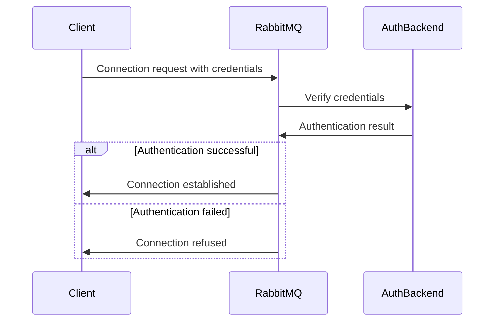

# RabbitMQ Authentication

## Introduction

Authentication is a critical security component in any messaging system. In RabbitMQ, authentication verifies the identity of clients connecting to the broker, ensuring that only authorized users and applications can access your messaging infrastructure. This article explores how RabbitMQ implements authentication, the available mechanisms, and how to configure them effectively for your applications.

## Understanding RabbitMQ Authentication Basics

RabbitMQ authentication is the process of verifying the identity of a client (producer, consumer, or management tool) when it attempts to connect to a RabbitMQ broker. By default, RabbitMQ requires clients to provide credentials (username and password) to establish a connection.

When a client tries to connect to RabbitMQ:

1. The client provides credentials (username and password)
2. RabbitMQ verifies these credentials against its authentication backend
3. If valid, the connection is established; otherwise, it's rejected



## Default Authentication in RabbitMQ

Out of the box, RabbitMQ comes with a built-in authentication mechanism that uses an internal database to store usernames and passwords.

### The Default User

When you first install RabbitMQ, it creates a default user with the following credentials:

- Username: `guest`
- Password: `guest`

For security reasons, the `guest` user can only connect from localhost (the same machine where RabbitMQ is running). For remote connections, you'll need to create additional users.

### Creating and Managing Users

You can manage users using the RabbitMQ command-line tool `rabbitmqctl`:

```bash
# Create a new user
rabbitmqctl add_user myuser mypassword

# Set user permissions
rabbitmqctl set_permissions -p / myuser ".*" ".*" ".*"

# Set user tags (roles)
rabbitmqctl set_user_tags myuser administrator
```

You can also manage users through the RabbitMQ Management UI, which provides a web interface for administrative tasks.

## Authentication Mechanisms

RabbitMQ supports several authentication mechanisms, allowing you to choose the one that best fits your security requirements.

### 1. Internal Authentication Database

The default authentication method uses RabbitMQ's internal database to store user credentials. Passwords are stored as hashes, not as plaintext.

### 2. PLAIN Authentication Mechanism

The PLAIN mechanism is the most common way to authenticate with RabbitMQ. It sends the username and password as plaintext (but over an encrypted connection if TLS is enabled).

Here's an example of connecting to RabbitMQ using the PLAIN mechanism with Python's Pika library:

```python
import pika

credentials = pika.PlainCredentials('myuser', 'mypassword')
connection = pika.BlockingConnection(
    pika.ConnectionParameters(
        host='localhost',
        credentials=credentials
    )
)

channel = connection.channel()
# Use the channel for publishing or consuming messages
```

### 3. AMQP 0-9-1 EXTERNAL Authentication

The EXTERNAL mechanism allows clients to authenticate using SSL/TLS certificates instead of username and password. This provides stronger security as it relies on certificate validation.

To use EXTERNAL authentication:

1. Configure RabbitMQ to use TLS
2. Set up a Certificate Authority (CA)
3. Generate client certificates signed by your CA
4. Configure RabbitMQ to trust your CA

Here's how to connect using EXTERNAL authentication with Java and RabbitMQ client:

```java
import com.rabbitmq.client.*;

ConnectionFactory factory = new ConnectionFactory();
factory.setHost("localhost");
factory.setPort(5671); // TLS port
factory.useSslProtocol(); // Use TLS

// Set up the EXTERNAL authentication mechanism
factory.setSaslConfig(DefaultSaslConfig.EXTERNAL);

Connection connection = factory.newConnection();
Channel channel = connection.createChannel();
// Use the channel for publishing or consuming messages
```

### 4. LDAP Authentication

RabbitMQ can authenticate against an LDAP directory, allowing you to centralize user management across multiple systems.

To enable LDAP authentication, you'll need to:

1. Install the RabbitMQ LDAP plugin
2. Configure the plugin to connect to your LDAP server

Here's an example configuration in the RabbitMQ configuration file:

```erlang
auth_backends.1 = rabbit_auth_backend_ldap

# LDAP server settings
rabbitmq_auth_backend_ldap.servers.1 = ldap.example.com

# LDAP user DN pattern
rabbitmq_auth_backend_ldap.user_dn_pattern = cn=${username},ou=People,dc=example,dc=com

# LDAP connection settings
rabbitmq_auth_backend_ldap.use_ssl = true
rabbitmq_auth_backend_ldap.port = 636
```

### 5. OAuth 2.0 Authentication

For modern applications, RabbitMQ supports OAuth 2.0 authentication through plugins. This allows you to integrate RabbitMQ with identity providers like Auth0, Okta, or Keycloak.

## Implementing Authentication in Different Programming Languages

### Node.js Example

```javascript
const amqp = require('amqplib');

async function connect() {
  try {
    // Connect with authentication
    const connection = await amqp.connect({
      protocol: 'amqp',
      hostname: 'localhost',
      port: 5672,
      username: 'myuser',
      password: 'mypassword',
      vhost: '/'
    });
    
    const channel = await connection.createChannel();
    console.log('Connected to RabbitMQ');
    return channel;
  } catch (error) {
    console.error('Error connecting to RabbitMQ:', error);
  }
}

connect();
```

### Python Example

```python
import pika

# Connection parameters with authentication
credentials = pika.PlainCredentials('myuser', 'mypassword')
parameters = pika.ConnectionParameters(
    host='localhost',
    port=5672,
    virtual_host='/',
    credentials=credentials
)

try:
    connection = pika.BlockingConnection(parameters)
    channel = connection.channel()
    print("Connected to RabbitMQ")
    
    # Example usage: declare a queue
    channel.queue_declare(queue='hello')
    
    # Close the connection when done
    connection.close()
except pika.exceptions.AMQPConnectionError as error:
    print(f"Failed to connect to RabbitMQ: {error}")
```

### Java Example

```java
import com.rabbitmq.client.Connection;
import com.rabbitmq.client.Channel;
import com.rabbitmq.client.ConnectionFactory;

public class RabbitMQAuthentication {
    public static void main(String[] args) {
        ConnectionFactory factory = new ConnectionFactory();
        
        // Set connection parameters with authentication
        factory.setHost("localhost");
        factory.setPort(5672);
        factory.setVirtualHost("/");
        factory.setUsername("myuser");
        factory.setPassword("mypassword");
        
        try {
            Connection connection = factory.newConnection();
            Channel channel = connection.createChannel();
            System.out.println("Connected to RabbitMQ");
            
            // Example usage: declare a queue
            channel.queueDeclare("hello", false, false, false, null);
            
            // Close the connection when done
            channel.close();
            connection.close();
        } catch (Exception e) {
            System.err.println("Failed to connect to RabbitMQ: " + e.getMessage());
        }
    }
}
```

## Best Practices for RabbitMQ Authentication

1. **Never use the default guest user in production**:
   Create application-specific users with appropriate permissions.

2. **Use strong passwords**:
   Enforce password complexity requirements for all RabbitMQ users.

3. **Implement TLS**:
   Always enable TLS for connections to encrypt credentials and data in transit.

4. **Use certificate-based authentication for production systems**:
   When possible, use the EXTERNAL authentication mechanism with client certificates.

5. **Limit user permissions**:
   Apply the principle of least privilege by restricting user access to only the required resources.

6. **Regularly rotate credentials**:
   Change passwords and revoke/reissue certificates periodically.

7. **Monitor failed authentication attempts**:
   Set up alerts for repeated authentication failures, which might indicate brute force attacks.

8. **Use a centralized authentication system**:
   For larger deployments, use LDAP or OAuth 2.0 to centralize identity management.

## Troubleshooting Authentication Issues

### Common Authentication Errors

1. **Access refused: user 'guest' can only connect via localhost**
   - Solution: Create a new user or connect from localhost

2. **ACCESS_REFUSED - Login was refused using authentication mechanism PLAIN**
   - Solution: Check username and password, ensure the user exists and has correct permissions

3. **Failed to connect: auth failure: SERVER_STATUS=10, SERVER_PROBLEM=Authentication failed.**
   - Solution: Verify credentials and ensure the user has permission to access the virtual host

### Debugging Authentication

Enable more verbose logging in RabbitMQ by setting the log level to debug:

```bash
rabbitmqctl set_log_level debug
```

Check the RabbitMQ logs for detailed authentication information:

```bash
tail -f /var/log/rabbitmq/rabbit@hostname.log
```

## Real-World Authentication Scenario

Let's examine a scenario where a microservices architecture uses RabbitMQ for communication. We'll explore how to set up proper authentication:

1. **Create service-specific users**:

```bash
# Create producer service user
rabbitmqctl add_user order_service strong_password_1

# Create consumer service user
rabbitmqctl add_user inventory_service strong_password_2

# Create admin user for management
rabbitmqctl add_user admin_user admin_password
rabbitmqctl set_user_tags admin_user administrator
```

2. **Set appropriate permissions**:

```bash
# Order service can only publish to order-related exchanges
rabbitmqctl set_permissions -p / order_service "^order\." "^order\." "^$"

# Inventory service can only consume from inventory-related queues
rabbitmqctl set_permissions -p / inventory_service "^$" "^$" "^inventory\."

# Admin has full access
rabbitmqctl set_permissions -p / admin_user ".*" ".*" ".*"
```

3. **Configure applications**:

Order Service application.properties:
```properties
spring.rabbitmq.host=rabbitmq.example.com
spring.rabbitmq.port=5672
spring.rabbitmq.username=order_service
spring.rabbitmq.password=strong_password_1
spring.rabbitmq.virtual-host=/
```

Inventory Service application.properties:
```properties
spring.rabbitmq.host=rabbitmq.example.com
spring.rabbitmq.port=5672
spring.rabbitmq.username=inventory_service
spring.rabbitmq.password=strong_password_2
spring.rabbitmq.virtual-host=/
```

This setup ensures that each service has the minimal permissions required to perform its function, following the principle of least privilege.

## Summary

RabbitMQ authentication is a fundamental aspect of securing your messaging infrastructure. In this article, we've covered:

- Basic authentication concepts in RabbitMQ
- Default authentication mechanism and user management
- Various authentication methods including PLAIN, EXTERNAL, LDAP, and OAuth 2.0
- Implementation examples in different programming languages
- Best practices for secure authentication
- Troubleshooting common authentication issues
- A real-world example of authentication in a microservices architecture

By implementing proper authentication mechanisms, you can ensure that only authorized clients can connect to your RabbitMQ broker, protecting your messaging system from unauthorized access.

## Additional Resources

- Official RabbitMQ documentation on [Access Control](https://www.rabbitmq.com/access-control.html)
- Learn more about [TLS Support](https://www.rabbitmq.com/ssl.html) in RabbitMQ
- Explore [LDAP Plugin](https://www.rabbitmq.com/ldap.html) configuration options
- Check out the [Management Plugin](https://www.rabbitmq.com/management.html) for user management through a web UI

## Exercises

1. Set up a RabbitMQ server and create a new user with limited permissions to specific exchanges and queues.
2. Implement TLS connections to RabbitMQ using the EXTERNAL authentication mechanism.
3. Configure RabbitMQ to authenticate against an LDAP server (you can use a simple LDAP server like OpenLDAP for testing).
4. Create a simple producer and consumer application that authenticates with RabbitMQ using username and password.
5. Implement a solution that rotates RabbitMQ credentials periodically while keeping your applications running.