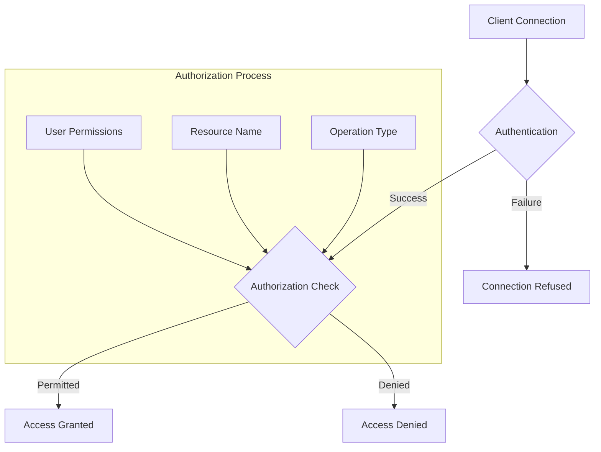

# RabbitMQ Authorization

## Introduction

Authorization in RabbitMQ is a critical security component that determines what operations (like publishing, consuming, or configuring) users are permitted to perform on specific resources (exchanges, queues, etc.). Unlike authentication, which verifies identity, authorization controls what authenticated users can actually do within the system.

In this tutorial, we'll explore how RabbitMQ implements authorization, how to configure permission models, and best practices for securing your message broker with proper access controls.

## Basic Concepts

### Authentication vs. Authorization

Before diving into authorization, let's clarify the difference between authentication and authorization:

- **Authentication**: Verifies the identity of a user ("Who are you?")
- **Authorization**: Determines what an authenticated user can do ("What are you allowed to do?")

RabbitMQ requires both mechanisms to secure your messaging infrastructure properly.

### Authorization Components in RabbitMQ

RabbitMQ's authorization system revolves around three main components:

1. **Users**: Entities that connect to RabbitMQ
2. **Resources**: Entities that users want to access (exchanges, queues, etc.)
3. **Permissions**: Rules that define what operations users can perform on resources

## Permission Model

RabbitMQ uses a permission model based on regular expression patterns that apply to three types of operations:

1. **Configure**: Permission to create or delete resources (generally admin operations)
2. **Write**: Permission to publish messages
3. **Read**: Permission to consume messages

Each permission is defined as a regular expression pattern that is matched against resource names.

## Setting Up User Permissions

### Using the Command Line

The most common way to set permissions is through the `rabbitmqctl` command-line tool:

```bash
rabbitmqctl set_permissions [-p <vhost>] <username> <configure_pattern> <write_pattern> <read_pattern>
```

For example, to give a user `app_user` permissions to read and write to queues that start with "app_" in the default virtual host:

```bash
rabbitmqctl set_permissions app_user "^app_.*" "^app_.*" "^app_.*"
```

### Using the Management UI

You can also set permissions through the RabbitMQ Management UI:

1. Navigate to Admin > Users
2. Click on the username
3. Scroll to the "Permissions" section
4. Add new permissions by specifying the virtual host and permission patterns

### Understanding Permission Patterns

Let's look at some common permission patterns:

| Pattern | Description |
|---------|-------------|
| `.*` or `^.*` | Grants permission to all resources |
| `^app_.*` | Grants permission only to resources starting with "app_" |
| `^$` | Denies permission to all resources |
| `^(queue1|queue2)$` | Grants permission only to specific named resources |

## Practical Examples

### Example 1: Producer-Only User

Let's create a user that can only publish messages to specific exchanges but cannot consume messages or configure resources:

```bash
# Create the user
rabbitmqctl add_user producer_user producer_password

# Set permissions: no configure, write to app exchanges only, no read
rabbitmqctl set_permissions producer_user "^$" "^app\.exchange\.*" "^$"
```

### Example 2: Consumer-Only User

Let's create a user that can only consume messages from specific queues:

```bash
# Create the user
rabbitmqctl add_user consumer_user consumer_password

# Set permissions: no configure, no write, read from specific queues only
rabbitmqctl set_permissions consumer_user "^$" "^$" "^app\.queue\.*"
```

### Example 3: Admin User with Limited Scope

Let's create an admin user that can configure, write to, and read from resources in a specific namespace:

```bash
# Create the user
rabbitmqctl add_user team_admin team_password

# Set permissions: configure, write, and read for team resources only
rabbitmqctl set_permissions team_admin "^team1\.*" "^team1\.*" "^team1\.*"
```

## Topic-Based Authorization

For more granular control, especially when using topic exchanges, RabbitMQ supports topic-based authorization through plugins like the `rabbitmq_auth_backend_topic` plugin.

This allows you to control permissions based on routing keys:

```bash
# Enable the plugin
rabbitmq-plugins enable rabbitmq_auth_backend_topic

# Add a topic permission
rabbitmqctl set_topic_permissions [-p <vhost>] <username> <exchange> <write_pattern> <read_pattern>
```

For example, to allow a user to publish only to Europe-related topics:

```bash
rabbitmqctl set_topic_permissions monitoring_user amq.topic "^europe\.*" "^$"
```

## Working with Virtual Hosts

Virtual hosts (vhosts) in RabbitMQ are logical groupings of resources. Authorization can be configured per vhost:

```bash
# Create a new virtual host
rabbitmqctl add_vhost marketing_vhost

# Set permissions for a user in that virtual host
rabbitmqctl set_permissions -p marketing_vhost marketing_user ".*" ".*" ".*"
```

## Code Example: Setting Up Permissions Programmatically

You can also set up permissions programmatically using the RabbitMQ HTTP API. Here's an example using Python:

```python
import requests
import base64

# Configuration
rabbitmq_api_url = 'http://localhost:15672/api'
username = 'admin'
password = 'admin'
auth = base64.b64encode(f"{username}:{password}".encode()).decode()

# Create a new user
def create_user(username, password, tags=""):
    response = requests.put(
        f"{rabbitmq_api_url}/users/{username}",
        headers={'Authorization': f"Basic {auth}", 'Content-Type': 'application/json'},
        json={"password": password, "tags": tags}
    )
    return response.status_code == 204

# Set user permissions
def set_permissions(username, vhost, configure=".*", write=".*", read=".*"):
    response = requests.put(
        f"{rabbitmq_api_url}/permissions/{vhost}/{username}",
        headers={'Authorization': f"Basic {auth}", 'Content-Type': 'application/json'},
        json={"configure": configure, "write": write, "read": read}
    )
    return response.status_code == 204

# Example usage
if create_user("service_user", "strong_password", "monitoring"):
    print("User created successfully")
    
    if set_permissions("service_user", "%2F", "^$", "^logs\..*", "^$"):
        print("Permissions set successfully")
else:
    print("Failed to create user")
```

This script creates a user and sets permissions that allow publishing only to resources that start with "logs.".

## Visualizing RabbitMQ Authorization Flow

Below is a diagram illustrating the authorization flow in RabbitMQ:



## Best Practices for RabbitMQ Authorization

1. **Follow the Principle of Least Privilege**: Grant users only the permissions they need.
2. **Use Specific Permission Patterns**: Avoid using `.*` for all permission types unless necessary.
3. **Create Separate Users for Different Applications**: Don't share user credentials between different systems.
4. **Regularly Audit Permissions**: Check for unused or excessive permissions.
5. **Use Virtual Hosts to Segregate Resources**: Different teams or applications should use different vhosts when appropriate.
6. **Change Default Credentials**: Always change the default guest/guest credentials in production.
7. **Implement CI/CD for Authorization**: Automate permission setup as part of your deployment process.

## Troubleshooting Authorization Issues

Common authorization errors you might encounter:

1. **ACCESS_REFUSED - Login refused**: Authentication failure (not authorization)
2. **ACCESS_REFUSED - Not authorized to access**:  Authorization failure for a specific operation
3. **ACCESS_REFUSED - permission refused for resource**: User doesn't have the right permissions

When troubleshooting:
- Check the RabbitMQ logs for detailed error messages
- Verify the user has appropriate permissions in the correct vhost
- Check that resource names match the permission patterns
- Ensure the user is attempting the correct type of operation (configure/write/read)

## Summary

RabbitMQ authorization is a powerful mechanism for controlling access to your messaging resources. By understanding the permission model and implementing proper access controls, you can secure your RabbitMQ instances effectively.

Key takeaways:
- RabbitMQ uses a triple-permission model: configure, write, and read
- Permissions are defined using regular expression patterns
- Virtual hosts provide logical separation of resources
- Topic-based authorization offers more granular control

## Additional Resources

- [RabbitMQ Access Control Documentation](https://www.rabbitmq.com/access-control.html)
- [RabbitMQ Management HTTP API](https://www.rabbitmq.com/management.html#http-api)
- [Regular Expression Testing Tool](https://regex101.com/)

## Exercises

1. Set up a RabbitMQ instance with three different users: an admin, a producer, and a consumer with appropriate permissions.
2. Create a virtual host for a specific application and configure users with different levels of access.
3. Write a script that automates the creation of users and permissions for a new application.
4. Implement topic-based authorization for a scenario with hierarchical routing keys.
5. Audit the permissions in an existing RabbitMQ instance and propose improvements based on the principle of least privilege.