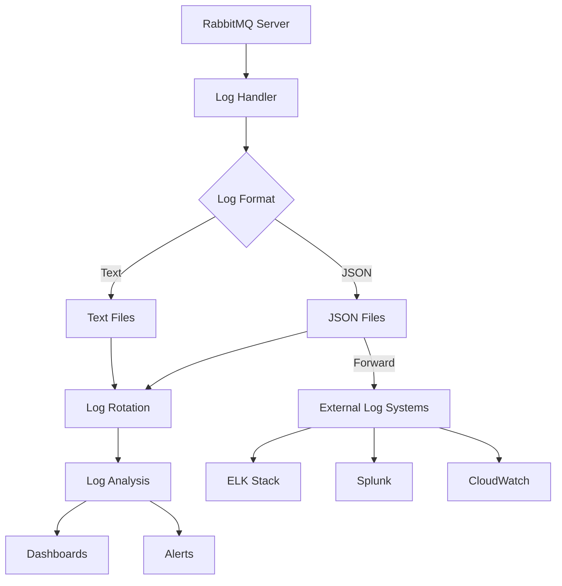

# RabbitMQ Logging

## Introduction

Logging is a critical aspect of any production system, and RabbitMQ is no exception. Effective logging helps developers and system administrators monitor the health of their message broker, troubleshoot issues, and maintain system performance. In this guide, we'll explore how logging works in RabbitMQ, how to configure it for different scenarios, and best practices for managing log data.

RabbitMQ generates logs to record various events, including:
- Connection attempts and closures
- Queue creation and deletion
- Exchange declarations
- Message publishing and delivery
- Authentication and authorization activities
- Error conditions and warnings

By understanding RabbitMQ's logging system, you'll be better equipped to maintain a healthy and reliable messaging infrastructure.

## RabbitMQ Log Types

RabbitMQ categorizes logs into different levels based on their severity:

1. **Debug**: Detailed information useful for debugging
2. **Info**: General information about normal operations
3. **Warning**: Potential issues that don't affect core functionality
4. **Error**: Problems that affect specific operations but don't crash the system
5. **Critical**: Severe issues that may lead to system failure

## Log Locations

### Default Log Locations

The location of RabbitMQ log files depends on your installation method and operating system:

- **Linux (when installed via package manager)**: `/var/log/rabbitmq`
- **Windows**: `%APPDATA%\RabbitMQ\log`
- **macOS (Homebrew)**: `/usr/local/var/log/rabbitmq`
- **Docker containers**: Logs are typically sent to standard output (stdout)

To check the current log location, you can use the following command:

```bash
rabbitmqctl status | grep Log
```

Example output:

```
Log file(s): /var/log/rabbitmq/rabbit@myhost.log
             /var/log/rabbitmq/rabbit@myhost_upgrade.log
```

## Configuring Logging

RabbitMQ allows you to customize logging behavior through configuration files or environment variables.

### Configuration File Approach

Create or modify your `rabbitmq.conf` file with logging-related settings:

```ini
# Set log levels
log.file.level = info

# Specify log file path
log.file = /path/to/rabbitmq.log

# Set log rotation size (in bytes)
log.file.rotation.size = 10485760  # 10MB

# Keep 5 rotated log files
log.file.rotation.count = 5
```

### Log Levels by Category

You can set different log levels for specific categories:

```ini
# General level
log.file.level = info

# More detailed for connections
log.file.connection.level = debug

# Less verbose for channels
log.file.channel.level = warning
```

### Console Logging

For development environments, you might prefer logging to the console:

```ini
# Enable console logging
log.console = true

# Set console log level
log.console.level = info
```

## Accessing and Analyzing Logs

### Command Line Tools

RabbitMQ provides command-line tools to access logs:

```bash
# Display the last 100 lines of log
rabbitmqctl log_tail 100
```

Example output:

```
2023-10-15 14:22:05.123 [info] <0.123.0> connection <0.456.0> (127.0.0.1:50678 -> 127.0.0.1:5672) has a client-provided name: client_app@hostxyz
2023-10-15 14:22:05.234 [info] <0.456.0> accepting AMQP connection <0.456.0> (127.0.0.1:50678 -> 127.0.0.1:5672)
```

### Management UI

The RabbitMQ Management UI also provides access to logs:

1. Navigate to the Management UI (default: http://localhost:15672)
2. Log in with your credentials
3. Go to the "Admin" tab
4. Select "Log" from the dropdown menu

## Structured Logging

Starting with RabbitMQ 3.8, structured logging is supported, which outputs logs in JSON format for easier parsing and analysis:

```ini
# Enable JSON formatter
log.file.formatter = json
```

Example of JSON log output:

```json
{
  "timestamp": "2023-10-15T14:22:05.123Z",
  "level": "info",
  "pid": 1234,
  "module": "rabbit_connection_tracking",
  "msg": "connection accepted",
  "connection_id": "127.0.0.1:50678 -> 127.0.0.1:5672",
  "client_name": "client_app@hostxyz"
}
```

## Common Logging Patterns

### Production Environment Setup

For production environments, consider the following configuration:

```ini
# Basic settings
log.file.level = info
log.file = /var/log/rabbitmq/rabbitmq.log
log.file.formatter = json

# Rotation settings
log.file.rotation.size = 104857600  # 100MB
log.file.rotation.count = 10

# Category-specific settings
log.file.connection.level = warning
log.file.channel.level = warning
```

### Integration with Log Management Systems

For integration with log management systems like ELK (Elasticsearch, Logstash, Kibana) or Splunk:

1. Configure JSON logging
2. Use a log shipper (like Filebeat or Fluentd) to forward logs

```ini
log.file.formatter = json
```

## Practical Example: Monitoring Connection Issues

Let's say you're experiencing intermittent connection problems. Here's how you can use logging to troubleshoot:

1. Increase the log level for connections:

```ini
log.file.connection.level = debug
log.file.authentication.level = debug
```

2. Restart RabbitMQ or apply the configuration:

```bash
rabbitmqctl reload_config
```

3. Monitor the logs for connection-related events:

```bash
grep "connection" /var/log/rabbitmq/rabbitmq.log | tail -50
```

Example output that might reveal the issue:

```
2023-10-15 15:01:23.456 [debug] <0.789.0> Connection <0.789.0> authentication failed for user 'my_app' from 10.0.0.42:12345: invalid credentials
2023-10-15 15:01:24.567 [debug] <0.790.0> Connection <0.790.0> authentication failed for user 'my_app' from 10.0.0.42:12346: invalid credentials
```

This reveals that the connection issue might be due to incorrect credentials.

## Visualizing Log Flow

Here's a diagram showing the flow of logs in a RabbitMQ system:



## Troubleshooting Common Logging Issues

### Issue: Log Files Growing Too Large

**Solution**:
1. Configure log rotation:

```ini
log.file.rotation.size = 10485760  # 10MB
log.file.rotation.count = 5
```

2. Apply the configuration:

```bash
rabbitmqctl reload_config
```

### Issue: Missing Important Events

**Solution**:
1. Adjust log levels for specific categories:

```ini
log.file.level = info
log.file.connection.level = debug
log.file.channel.level = debug
```

### Issue: Log Files Not Created Where Expected

**Solution**:
1. Explicitly set the log file path:

```ini
log.file = /desired/path/to/rabbitmq.log
```

2. Ensure the directory exists and has proper permissions:

```bash
mkdir -p /desired/path/to/
chown rabbitmq:rabbitmq /desired/path/to/
```

## Code Example: Creating a Log Monitoring Client

Here's a simple Node.js script that monitors RabbitMQ logs for specific patterns:

```javascript
const fs = require('fs');
const readline = require('readline');

// Configuration
const logPath = '/var/log/rabbitmq/rabbitmq.log';
const patterns = {
  error: /\[error\]/i,
  connection: /connection/i,
  authentication: /authentication failed/i
};

// Create streams
const logStream = fs.createReadStream(logPath);
const lineReader = readline.createInterface({
  input: logStream,
  crlfDelay: Infinity
});

// Event counters
const stats = {
  errors: 0,
  connections: 0,
  authFailures: 0
};

// Monitor logs
console.log(`Monitoring RabbitMQ log: ${logPath}`);

lineReader.on('line', (line) => {
  // Check for patterns
  if (patterns.error.test(line)) {
    stats.errors++;
    console.log(`ERROR: ${line}`);
  }
  
  if (patterns.connection.test(line)) {
    stats.connections++;
    if (patterns.authentication.test(line)) {
      stats.authFailures++;
      console.log(`AUTH FAILURE: ${line}`);
    }
  }
  
  // Print stats every 100 lines
  if ((stats.errors + stats.connections) % 100 === 0) {
    console.log('
--- Log Statistics ---');
    console.log(`Errors: ${stats.errors}`);
    console.log(`Connections: ${stats.connections}`);
    console.log(`Auth Failures: ${stats.authFailures}`);
    console.log('---------------------
');
  }
});

lineReader.on('close', () => {
  console.log('
Final Statistics:');
  console.log(`Errors: ${stats.errors}`);
  console.log(`Connections: ${stats.connections}`);
  console.log(`Auth Failures: ${stats.authFailures}`);
});
```

To run this script:

```bash
node monitor_rabbitmq_logs.js
```

Example output:

```
Monitoring RabbitMQ log: /var/log/rabbitmq/rabbitmq.log
AUTH FAILURE: 2023-10-15 15:01:23.456 [debug] <0.789.0> Connection <0.789.0> authentication failed for user 'my_app' from 10.0.0.42:12345: invalid credentials
ERROR: 2023-10-15 15:05:12.345 [error] <0.123.0> Error on AMQP connection <0.456.0>: {socket_error,closed}

--- Log Statistics ---
Errors: 1
Connections: 99
Auth Failures: 1
---------------------
```

## Best Practices for RabbitMQ Logging

1. **Right Log Level**: Use `info` for production and `debug` for troubleshooting
2. **Structured Logging**: Enable JSON formatting for easier parsing
3. **Log Rotation**: Configure rotation based on file size and count
4. **Centralized Logging**: Forward logs to a central system for analysis
5. **Monitor Specific Categories**: Increase verbosity only for problem areas
6. **Regular Analysis**: Periodically check logs for warning patterns
7. **Correlation**: Correlate application logs with RabbitMQ logs for end-to-end analysis

## Summary

RabbitMQ logging is a powerful tool for monitoring and troubleshooting your messaging system. In this guide, we've covered:

- Log types and locations
- Configuration options
- Structured logging with JSON
- Log rotation and management
- Integration with external logging systems
- Practical examples and troubleshooting

By implementing proper logging practices, you can ensure your RabbitMQ instances remain healthy, perform optimally, and any issues are quickly identified and resolved.

## Additional Resources

- [RabbitMQ Official Documentation on Logging](https://www.rabbitmq.com/logging.html)
- [ELK Stack for Log Management](https://www.elastic.co/elastic-stack)
- Practice implementing a logging dashboard for your RabbitMQ instances

## Exercises

1. Configure RabbitMQ to use JSON structured logging and verify the output format.
2. Write a script that parses RabbitMQ logs and generates a daily report of connection statistics.
3. Set up log forwarding from RabbitMQ to a centralized logging system (e.g., ELK stack).
4. Create a monitoring dashboard that visualizes key metrics from your RabbitMQ logs.
5. Implement an alert system that notifies administrators when specific error patterns appear in the logs.