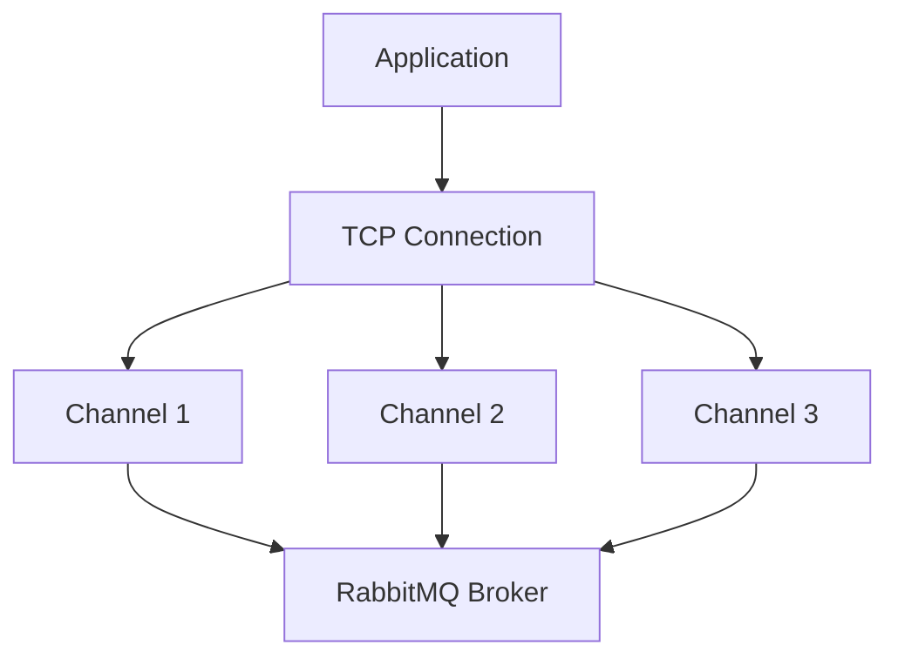

# RabbitMQ Channels

## Introduction

When working with RabbitMQ, one of the fundamental concepts you'll encounter is **Channels**. Channels are virtual connections within a single RabbitMQ connection that enable efficient communication with the message broker. Think of them as "lightweight connections" that allow your application to perform multiple operations concurrently without the overhead of establishing separate TCP connections.

In this guide, we'll explore how channels work, why they're important, and how to use them effectively in your applications.

## What is a RabbitMQ Channel?

A channel in RabbitMQ is a virtual connection inside a real TCP connection. Each application connecting to RabbitMQ will typically create a single TCP connection and then create multiple channels within that connection to perform various operations.



### Why Use Channels?

There are several reasons why channels are a crucial concept in RabbitMQ:

1. **Performance**: Opening and maintaining TCP connections is resource-intensive. Channels allow multiple threads or processes to communicate with RabbitMQ through a single connection.

2. **Concurrency**: Different parts of your application can use separate channels to communicate with RabbitMQ concurrently without interfering with each other.

3. **Isolation**: If an error occurs on one channel, it doesn't affect operations on other channels.

4. **Flow Control**: Each channel can have its own flow control (prefetch count), allowing you to fine-tune message consumption.

## Working with Channels in Practice

Let's look at how to create and use channels in a Node.js application using the `amqplib` library:

```javascript
const amqp = require('amqplib');

async function main() {
  try {
    // Create a single connection
    const connection = await amqp.connect('amqp://localhost');
    
    // Create multiple channels within the connection
    const channel1 = await connection.createChannel();
    const channel2 = await connection.createChannel();
    
    // Use channel1 for publishing
    await channel1.assertExchange('logs', 'fanout', { durable: false });
    channel1.publish('logs', '', Buffer.from('Message from channel 1'));
    
    // Use channel2 for consuming
    await channel2.assertExchange('logs', 'fanout', { durable: false });
    const q = await channel2.assertQueue('', { exclusive: true });
    await channel2.bindQueue(q.queue, 'logs', '');
    
    channel2.consume(q.queue, (msg) => {
      console.log(`Received: ${msg.content.toString()}`);
    }, { noAck: true });
    
    // Close channels and connection after 5 seconds
    setTimeout(() => {
      channel1.close();
      channel2.close();
      connection.close();
    }, 5000);
    
  } catch (error) {
    console.error('Error:', error);
  }
}

main();
```

The output of this program would be:

```
Received: Message from channel 1
```

In this example, we:
1. Create a single TCP connection to RabbitMQ
2. Create two separate channels within that connection
3. Use the first channel to publish messages
4. Use the second channel to consume messages
5. Close both channels and the connection after 5 seconds

## Channel Lifecycle

Channels in RabbitMQ follow a specific lifecycle:

1. **Creation**: A channel is created from a connection using `connection.createChannel()`.
2. **Configuration**: The channel is configured with exchanges, queues, and bindings.
3. **Usage**: The channel is used to publish or consume messages.
4. **Closure**: When no longer needed, the channel is closed with `channel.close()`.

It's important to properly manage your channels to avoid resource leaks:

```javascript
// Good practice: explicit closing
try {
  const connection = await amqp.connect('amqp://localhost');
  const channel = await connection.createChannel();
  
  // Use the channel...
  
  await channel.close();
  await connection.close();
} catch (error) {
  console.error('Error:', error);
}
```

## Channel Errors and Recovery

Channels can encounter errors during operation. When a channel encounters an error, it becomes unusable and must be recreated. Common causes of channel errors include:

- Publishing to a non-existent exchange
- Using an invalid routing key pattern
- Exceeding channel-level flow control limits

Here's an example of handling channel errors:

```javascript
const amqp = require('amqplib');

async function createChannel(connection) {
  const channel = await connection.createChannel();
  
  channel.on('error', (err) => {
    console.error('Channel error:', err.message);
    // Recreate the channel
    createChannel(connection).catch(console.error);
  });
  
  return channel;
}

async function main() {
  try {
    const connection = await amqp.connect('amqp://localhost');
    const channel = await createChannel(connection);
    
    // Use the channel...
    
  } catch (error) {
    console.error('Connection error:', error);
  }
}

main();
```

## Channel Prefetch (Quality of Service)

One of the important settings for a channel is the prefetch count, which controls how many unacknowledged messages a consumer can have at one time. This is crucial for balancing load across multiple consumers:

```javascript
const amqp = require('amqplib');

async function main() {
  const connection = await amqp.connect('amqp://localhost');
  const channel = await connection.createChannel();
  
  // Set prefetch to 1 message at a time
  await channel.prefetch(1);
  
  const q = 'task_queue';
  await channel.assertQueue(q, { durable: true });
  
  console.log('Waiting for messages...');
  
  channel.consume(q, (msg) => {
    const content = msg.content.toString();
    console.log(`Received: ${content}`);
    
    // Simulate processing time
    setTimeout(() => {
      console.log(`Done processing: ${content}`);
      channel.ack(msg);
    }, 1000);
  });
}

main().catch(console.error);
```

In this example, setting `channel.prefetch(1)` ensures that the consumer only receives one message at a time, and doesn't get another until it has acknowledged the current message.

## Real-World Example: Message Processing Pipeline

Let's look at a more complex real-world example that demonstrates how channels can be used in a message processing pipeline:

```javascript
const amqp = require('amqplib');

async function setupProcessingPipeline() {
  // Single connection for the application
  const connection = await amqp.connect('amqp://localhost');
  
  // Channel for receiving incoming orders
  const orderChannel = await connection.createChannel();
  await orderChannel.assertQueue('incoming_orders', { durable: true });
  
  // Channel for processing payments
  const paymentChannel = await connection.createChannel();
  await paymentChannel.assertQueue('payment_processing', { durable: true });
  
  // Channel for shipping notifications
  const shippingChannel = await connection.createChannel();
  await shippingChannel.assertQueue('shipping_notifications', { durable: true });
  
  // Process incoming orders
  orderChannel.consume('incoming_orders', (msg) => {
    if (!msg) return;
    
    const order = JSON.parse(msg.content.toString());
    console.log(`Processing order: ${order.id}`);
    
    // After validating order, send to payment processing
    paymentChannel.sendToQueue('payment_processing', 
      Buffer.from(JSON.stringify({ orderId: order.id, amount: order.total })),
      { persistent: true }
    );
    
    orderChannel.ack(msg);
  }, { noAck: false });
  
  // Process payments
  paymentChannel.consume('payment_processing', (msg) => {
    if (!msg) return;
    
    const payment = JSON.parse(msg.content.toString());
    console.log(`Processing payment for order: ${payment.orderId}`);
    
    // After payment is processed, send to shipping
    shippingChannel.sendToQueue('shipping_notifications',
      Buffer.from(JSON.stringify({ orderId: payment.orderId, status: 'paid' })),
      { persistent: true }
    );
    
    paymentChannel.ack(msg);
  }, { noAck: false });
  
  // Process shipping notifications
  shippingChannel.consume('shipping_notifications', (msg) => {
    if (!msg) return;
    
    const shipping = JSON.parse(msg.content.toString());
    console.log(`Preparing shipment for order: ${shipping.orderId}`);
    
    // Process shipping logic...
    
    shippingChannel.ack(msg);
  }, { noAck: false });
  
  console.log('Processing pipeline set up and waiting for messages');
  
  // Return the connection so it can be closed when needed
  return { connection, channels: [orderChannel, paymentChannel, shippingChannel] };
}

// Start the system
setupProcessingPipeline().catch(console.error);
```

In this example:
1. We create a single connection to RabbitMQ
2. We create three channels within that connection, each dedicated to a specific part of our processing pipeline
3. Each channel handles a different queue and different message type
4. All channels share the same underlying TCP connection, saving resources

## Best Practices for Using Channels

1. **Channel Pooling**: For high-throughput applications, consider implementing a channel pool to reuse channels.

2. **Error Handling**: Always set up error handlers for channels and connections.

3. **Flow Control**: Use the prefetch setting to control the flow of messages to consumers.

4. **Channel per Thread**: In multi-threaded applications, use a separate channel for each thread.

5. **Closing Resources**: Always close channels and connections when they're no longer needed.

```javascript
// Example of a simple channel pool
class ChannelPool {
  constructor(connection, poolSize = 5) {
    this.connection = connection;
    this.channels = [];
    this.availableChannels = [];
    this.initializing = false;
    this.poolSize = poolSize;
  }
  
  async initialize() {
    if (this.initializing) return;
    this.initializing = true;
    
    for (let i = 0; i < this.poolSize; i++) {
      const channel = await this.connection.createChannel();
      this.channels.push(channel);
      this.availableChannels.push(channel);
    }
    
    this.initializing = false;
  }
  
  async getChannel() {
    if (this.availableChannels.length === 0) {
      await this.initialize();
    }
    
    return this.availableChannels.pop();
  }
  
  releaseChannel(channel) {
    this.availableChannels.push(channel);
  }
  
  async closeAll() {
    await Promise.all(this.channels.map(channel => channel.close()));
    this.channels = [];
    this.availableChannels = [];
  }
}
```

## Common Pitfalls and How to Avoid Them

1. **Too Many Channels**: Creating too many channels can lead to high memory usage. Reuse channels when possible.

2. **Not Handling Channel Errors**: If a channel encounters an error, it must be recreated.

3. **Sharing Channels Across Threads**: In multi-threaded applications, sharing channels across threads can lead to race conditions.

4. **Not Closing Channels**: Failing to close channels can cause resource leaks.

5. **Ignoring Flow Control**: Not setting appropriate prefetch values can lead to consumer overload.

## Summary

RabbitMQ channels are a crucial concept that allows for efficient communication with the message broker. By creating multiple channels within a single TCP connection, you can achieve concurrency, isolation, and improved performance in your messaging applications.

Key points to remember:
- A channel is a virtual connection within a real TCP connection
- Channels allow multiple concurrent operations with the broker
- Each channel can have its own configuration (exchanges, queues, bindings)
- Channels can fail independently without affecting other channels
- Proper error handling and resource management are crucial

## Additional Resources

- Try implementing a worker queue with multiple channels
- Experiment with channel prefetch settings to see their impact on message processing
- Build a simple message pipeline using different channels for different stages
- Implement a channel pool for a high-throughput application

## Practice Exercises

1. Create a simple RabbitMQ application that uses separate channels for publishing and consuming messages.

2. Implement error handling for channels in a RabbitMQ consumer.

3. Create a worker queue system with multiple consumers, each using its own channel but sharing a connection.

4. Experiment with different prefetch values and observe their impact on message distribution.

5. Implement a channel pool and use it in a high-throughput application.