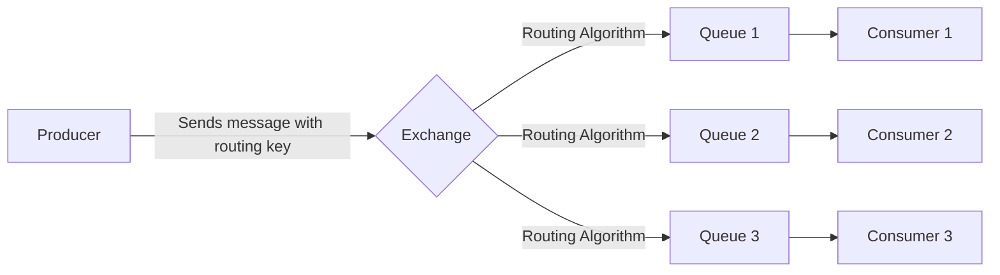
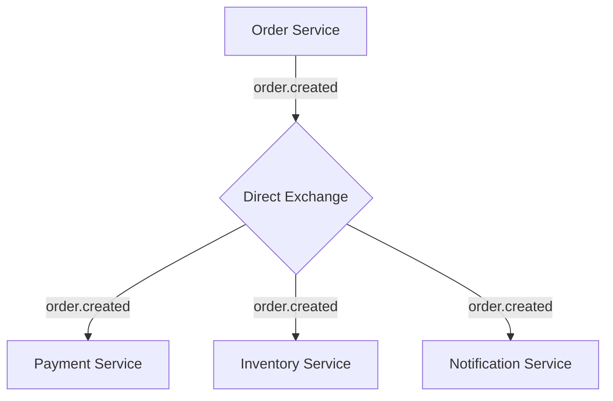

# RabbitMQ Message Routing

## Introduction

Message routing is a fundamental concept in RabbitMQ that determines how messages flow from producers to consumers. In a distributed system, efficient message routing ensures that messages reach their intended destinations without unnecessary overhead or missed deliveries.

When a producer sends a message to RabbitMQ, it doesn't send it directly to a queue. Instead, the message goes to an **exchange**, which is responsible for routing the message to one or more queues based on specific rules. This indirection creates a flexible, decoupled architecture that makes RabbitMQ powerful for various messaging scenarios.

In this guide, we'll explore how message routing works in RabbitMQ, the different types of exchanges available, and how to implement common routing patterns.

## Core Routing Components

### Exchange

An exchange is a message routing agent that receives messages from producers and pushes them to queues based on rules defined by the exchange type and bindings.

### Queue

A queue is a buffer that stores messages until a consumer is ready to process them. Queues are bound to exchanges with binding rules.

### Binding

A binding is a link between an exchange and a queue that includes optional routing rules known as binding keys.

### Routing Key

A routing key is a message attribute that the exchange looks at when deciding how to route the message to queues.

## Exchange Types

RabbitMQ provides several exchange types, each implementing a different routing algorithm:

### 1. Direct Exchange

Routes messages to queues based on an exact match between the routing key and binding key.

### 2. Topic Exchange

Routes messages to queues based on wildcard matches between the routing key and binding pattern.

### 3. Fanout Exchange

Broadcasts all messages to all bound queues, ignoring routing keys.

### 4. Headers Exchange

Routes messages based on header attributes instead of routing keys.

Let's visualize the relationship between these components:



## Direct Exchange Example

Direct exchanges route messages to queues based on an exact match between the routing key and binding key. This is useful for direct point-to-point communication.

Let's implement a direct exchange example using Node.js and the `amqplib` library:

```javascript
const amqp = require('amqplib');

async function directExchangeExample() {
  try {
    // Connect to RabbitMQ server
    const connection = await amqp.connect('amqp://localhost');
    const channel = await connection.createChannel();
    
    // Declare a direct exchange
    const exchangeName = 'logs_direct';
    await channel.assertExchange(exchangeName, 'direct', { durable: false });
    
    // Create a queue (with a generated name)
    const q = await channel.assertQueue('', { exclusive: true });
    console.log(`Queue created: ${q.queue}`);
    
    // Bind the queue to the exchange with specific binding keys
    const severity = 'error'; // You can change this to 'info', 'warning', etc.
    await channel.bindQueue(q.queue, exchangeName, severity);
    
    console.log(`Waiting for ${severity} messages...`);
    
    // Consume messages
    channel.consume(q.queue, (msg) => {
      if (msg) {
        console.log(`Received: ${msg.content.toString()}`);
        console.log(`Routing key: ${msg.fields.routingKey}`);
      }
    }, { noAck: true });
    
    // Send a test message
    const message = 'This is an error message';
    channel.publish(exchangeName, severity, Buffer.from(message));
    console.log(`Sent message: ${message}`);
    
  } catch (error) {
    console.error('Error:', error);
  }
}

directExchangeExample();
```

**Output:**
```
Queue created: amq.gen-JzTY67gRGpHsbo_5uC6GYQ
Waiting for error messages...
Sent message: This is an error message
Received: This is an error message
Routing key: error
```

In this example:
1. We create a direct exchange named 'logs_direct'
2. We bind a queue to this exchange with a binding key 'error'
3. When we publish a message with the routing key 'error', it gets routed to our queue
4. Messages with different routing keys won't be received by our consumer

## Topic Exchange Example

Topic exchanges allow for more flexible routing patterns using wildcards:
- `*` (star) substitutes exactly one word
- `#` (hash) substitutes zero or more words

This is useful for category-based message filtering.

```javascript
const amqp = require('amqplib');

async function topicExchangeExample() {
  try {
    // Connect to RabbitMQ server
    const connection = await amqp.connect('amqp://localhost');
    const channel = await connection.createChannel();
    
    // Declare a topic exchange
    const exchangeName = 'topic_logs';
    await channel.assertExchange(exchangeName, 'topic', { durable: false });
    
    // Create a queue
    const q = await channel.assertQueue('', { exclusive: true });
    
    // Bind with topic pattern
    // Format: <facility>.<severity>
    const bindingKey = '*.error';  // All error messages regardless of facility
    await channel.bindQueue(q.queue, exchangeName, bindingKey);
    
    console.log(`Waiting for messages with routing key: ${bindingKey}`);
    
    // Consume messages
    channel.consume(q.queue, (msg) => {
      if (msg) {
        console.log(`Received: ${msg.content.toString()}`);
        console.log(`Routing key: ${msg.fields.routingKey}`);
      }
    }, { noAck: true });
    
    // Send test messages
    const messages = [
      { key: 'kern.error', content: 'Kernel error detected' },
      { key: 'auth.warning', content: 'Authentication warning' },
      { key: 'kern.info', content: 'Kernel information' },
      { key: 'auth.error', content: 'Authentication error' }
    ];
    
    messages.forEach(msg => {
      channel.publish(exchangeName, msg.key, Buffer.from(msg.content));
      console.log(`Sent: ${msg.content} with key ${msg.key}`);
    });
    
  } catch (error) {
    console.error('Error:', error);
  }
}

topicExchangeExample();
```

**Output:**
```
Waiting for messages with routing key: *.error
Sent: Kernel error detected with key kern.error
Sent: Authentication warning with key auth.warning
Sent: Kernel information with key kern.info
Sent: Authentication error with key auth.error
Received: Kernel error detected
Routing key: kern.error
Received: Authentication error
Routing key: auth.error
```

In this example:
1. We bind to all messages with `.error` in the second position
2. We only receive messages with routing keys 'kern.error' and 'auth.error'
3. Messages with 'auth.warning' and 'kern.info' are filtered out

## Fanout Exchange Example

Fanout exchanges broadcast all messages to all bound queues, completely ignoring routing keys. This is perfect for broadcasting identical messages to multiple consumers.

```javascript
const amqp = require('amqplib');

async function fanoutExchangeExample() {
  try {
    // Connect to RabbitMQ server
    const connection = await amqp.connect('amqp://localhost');
    const channel = await connection.createChannel();
    
    // Declare a fanout exchange
    const exchangeName = 'logs_fanout';
    await channel.assertExchange(exchangeName, 'fanout', { durable: false });
    
    // Create multiple queues
    const q1 = await channel.assertQueue('', { exclusive: true });
    const q2 = await channel.assertQueue('', { exclusive: true });
    
    // Bind both queues to the exchange (no binding key needed)
    await channel.bindQueue(q1.queue, exchangeName, '');
    await channel.bindQueue(q2.queue, exchangeName, '');
    
    console.log(`Queue 1: ${q1.queue}`);
    console.log(`Queue 2: ${q2.queue}`);
    
    // Set up consumers for both queues
    channel.consume(q1.queue, (msg) => {
      if (msg) {
        console.log(`Queue 1 received: ${msg.content.toString()}`);
      }
    }, { noAck: true });
    
    channel.consume(q2.queue, (msg) => {
      if (msg) {
        console.log(`Queue 2 received: ${msg.content.toString()}`);
      }
    }, { noAck: true });
    
    // Send a broadcast message
    const message = 'Broadcast to all queues';
    channel.publish(exchangeName, '', Buffer.from(message));
    console.log(`Sent: ${message}`);
    
  } catch (error) {
    console.error('Error:', error);
  }
}

fanoutExchangeExample();
```

**Output:**
```
Queue 1: amq.gen-X9Y8Z7W6V5U4T3S2R1Q0P9O8
Queue 2: amq.gen-A1B2C3D4E5F6G7H8I9J0K1L2
Sent: Broadcast to all queues
Queue 1 received: Broadcast to all queues
Queue 2 received: Broadcast to all queues
```

In this example:
1. We create a fanout exchange and two queues
2. Both queues receive identical copies of the same message
3. The routing key is completely ignored

## Headers Exchange Example

Headers exchanges route messages based on header attributes instead of routing keys. This is useful when you need to route based on multiple attributes.

```javascript
const amqp = require('amqplib');

async function headersExchangeExample() {
  try {
    // Connect to RabbitMQ server
    const connection = await amqp.connect('amqp://localhost');
    const channel = await connection.createChannel();
    
    // Declare a headers exchange
    const exchangeName = 'headers_exchange';
    await channel.assertExchange(exchangeName, 'headers', { durable: false });
    
    // Create a queue
    const q = await channel.assertQueue('', { exclusive: true });
    
    // Bind the queue with specific headers
    await channel.bindQueue(q.queue, exchangeName, '', {
      'format': 'pdf',
      'type': 'report',
      'x-match': 'all' // 'all' means all headers must match, 'any' means at least one must match
    });
    
    console.log(`Queue created: ${q.queue}`);
    console.log('Waiting for messages with matching headers...');
    
    // Consume messages
    channel.consume(q.queue, (msg) => {
      if (msg) {
        console.log(`Received: ${msg.content.toString()}`);
        console.log('Headers:', msg.properties.headers);
      }
    }, { noAck: true });
    
    // Send test messages with different headers
    const messages = [
      {
        content: 'Annual financial report',
        headers: { format: 'pdf', type: 'report' }
      },
      {
        content: 'Monthly newsletter',
        headers: { format: 'pdf', type: 'newsletter' }
      },
      {
        content: 'Product specifications',
        headers: { format: 'docx', type: 'report' }
      }
    ];
    
    messages.forEach(msg => {
      channel.publish(
        exchangeName, 
        '', 
        Buffer.from(msg.content),
        { headers: msg.headers }
      );
      console.log(`Sent: ${msg.content} with headers:`, msg.headers);
    });
    
  } catch (error) {
    console.error('Error:', error);
  }
}

headersExchangeExample();
```

**Output:**
```
Queue created: amq.gen-Z1Y2X3W4V5U6T7S8R9Q0
Waiting for messages with matching headers...
Sent: Annual financial report with headers: { format: 'pdf', type: 'report' }
Sent: Monthly newsletter with headers: { format: 'pdf', type: 'newsletter' }
Sent: Product specifications with headers: { format: 'docx', type: 'report' }
Received: Annual financial report
Headers: { format: 'pdf', type: 'report' }
```

In this example:
1. We bind our queue with headers `format=pdf` and `type=report` using the `all` matching strategy
2. Only the message with both matching headers is received
3. The other messages are filtered out due to partial or non-matching headers

## Real-World Applications

### 1. Microservice Communication

RabbitMQ's routing capabilities make it excellent for microservice architectures:



### 2. Log Aggregation System

Using a topic exchange for log routing:

```javascript
// Producer code in different services
function logMessage(facility, severity, message) {
  // facility: auth, app, db, etc.
  // severity: info, warning, error, debug
  channel.publish(
    'logs_topic',
    `${facility}.${severity}`,
    Buffer.from(message)
  );
}

// Consumer code in logging service
// Different consumers might bind to different patterns
// - "*.error" - All error messages
// - "db.*" - All database messages
// - "auth.warning" - Auth warnings specifically
```

### 3. Work Queue with Priority

Using direct exchanges for task distribution with priority:

```javascript
// Producer
function addTask(taskData, priority) {
  // priority: high, medium, low
  channel.publish(
    'tasks_direct',
    priority,
    Buffer.from(JSON.stringify(taskData))
  );
}

// Consumers can subscribe to specific priorities
// Some workers might handle only high-priority tasks
// Others might handle all priorities
```

## Advanced Routing Patterns

### 1. Content-Based Routing

Using headers exchanges for routing based on message content:

```javascript
// Route customer data to different systems based on customer attributes
channel.publish(
  'customer_headers',
  '',
  Buffer.from(JSON.stringify(customerData)),
  {
    headers: {
      'region': 'europe',
      'segment': 'premium',
      'status': 'active'
    }
  }
);
```

### 2. Competing Consumers Pattern

Multiple consumers bound to the same queue for load balancing:

```javascript
// Multiple instances of the same service can consume from one queue
// RabbitMQ will distribute messages among these consumers in round-robin fashion
```

### 3. Routing Slip Pattern

Implementing a message workflow by modifying headers:

```javascript
// Initial message
const routingSlip = ['service1', 'service2', 'service3'];
channel.publish(
  'workflow_exchange',
  'start',
  Buffer.from(data),
  { headers: { 'routing-slip': routingSlip, 'current-step': 0 } }
);

// In each service
function processAndForward(msg) {
  // Process the message
  const headers = msg.properties.headers;
  const currentStep = headers['current-step'];
  const routingSlip = headers['routing-slip'];
  
  // If there are more steps
  if (currentStep < routingSlip.length - 1) {
    // Forward to the next service
    channel.publish(
      'workflow_exchange',
      routingSlip[currentStep + 1],
      msg.content,
      { 
        headers: { 
          'routing-slip': routingSlip, 
          'current-step': currentStep + 1 
        } 
      }
    );
  }
}
```

## Best Practices for Message Routing

1. **Choose the right exchange type** for your use case:
   - Direct: for exact routing
   - Topic: for pattern-based routing
   - Fanout: for broadcasts
   - Headers: for multi-attribute routing

2. **Use meaningful routing keys** that reflect your domain.

3. **Consider message persistence** for critical data:
   ```javascript
   channel.assertQueue('important_queue', { durable: true });
   channel.publish(exchange, routingKey, Buffer.from(message), { persistent: true });
   ```

4. **Implement dead letter exchanges** for handling failed messages:
   ```javascript
   channel.assertQueue('main_queue', {
     arguments: {
       'x-dead-letter-exchange': 'dlx',
       'x-dead-letter-routing-key': 'failed'
     }
   });
   ```

5. **Set appropriate TTL (Time-To-Live)** for messages that shouldn't live forever:
   ```javascript
   channel.publish(exchange, routingKey, Buffer.from(message), {
     expiration: '60000' // 60 seconds in milliseconds
   });
   ```

## Summary

RabbitMQ's message routing is a powerful feature that provides flexibility and control over message flow in distributed systems. By understanding the different exchange types and binding patterns, you can implement complex routing scenarios tailored to your specific needs.

Key points to remember:
- Direct exchanges use exact matching between routing keys and binding keys
- Topic exchanges allow pattern matching with wildcards
- Fanout exchanges broadcast messages to all bound queues
- Headers exchanges route based on message attributes rather than routing keys

With these routing mechanisms, RabbitMQ can handle a wide variety of messaging patterns, from simple point-to-point communication to complex publish/subscribe systems with content-based routing.

## Exercises

1. Implement a logging system that routes different log levels (info, warning, error) to different consumers using a direct exchange.

2. Create a notification system that routes messages based on user preferences (email, SMS, push) using a topic exchange.

3. Build a work queue system with priority levels using direct exchanges.

4. Implement a content-based routing system using headers exchanges that routes customer data to different processing systems based on customer attributes.

## Additional Resources

- [RabbitMQ Tutorials](https://www.rabbitmq.com/getstarted.html)
- [RabbitMQ Exchange Types Explained](https://www.rabbitmq.com/tutorials/amqp-concepts.html#exchanges)
- [Advanced Message Routing with RabbitMQ](https://www.cloudamqp.com/blog/part4-rabbitmq-for-beginners-exchanges-routing-keys-bindings.html)
- [Node.js and RabbitMQ](https://www.rabbitmq.com/tutorials/tutorial-one-javascript.html)