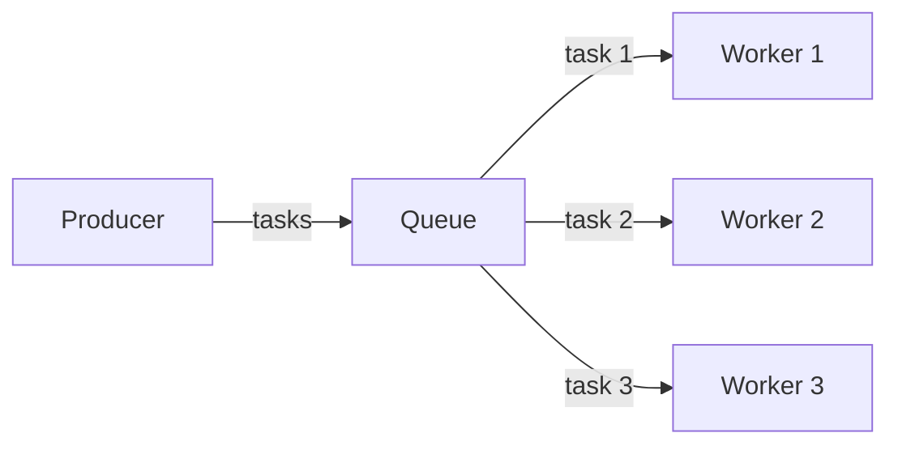
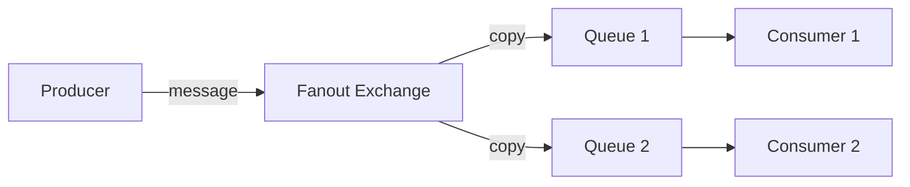
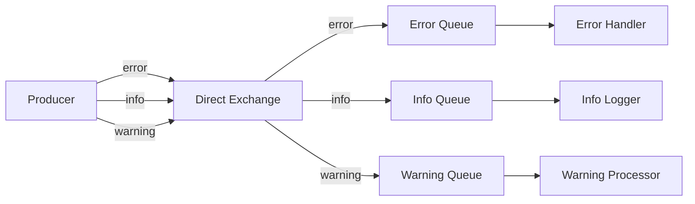
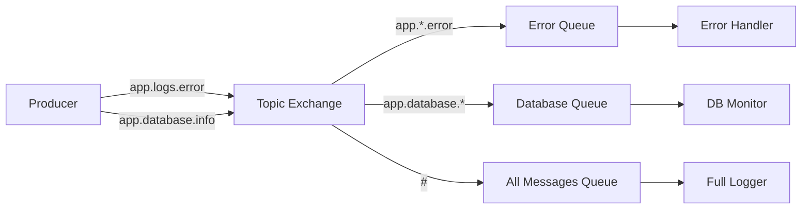
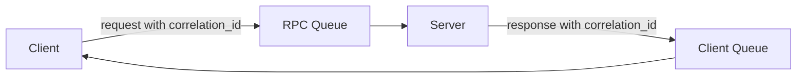
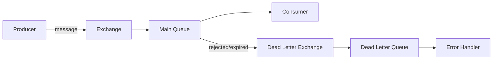
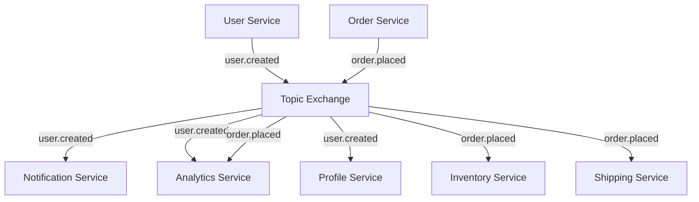
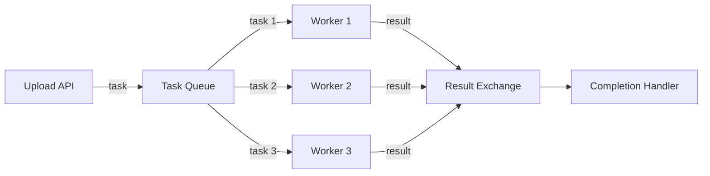
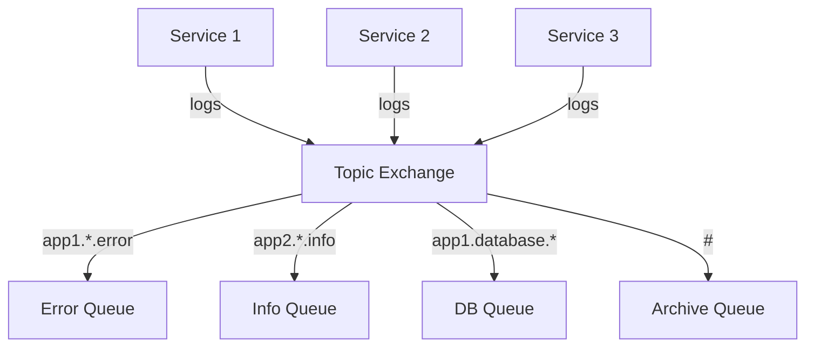

# RabbitMQ Message Patterns

## Introduction

Message patterns are standardized solutions to common messaging scenarios. When working with RabbitMQ, understanding these patterns allows you to design efficient, scalable, and reliable messaging systems. Rather than reinventing solutions to common problems, you can leverage these established patterns to build robust applications.

In this guide, we'll explore several key message patterns in RabbitMQ, including how and when to use them, complete with practical code examples.

## Prerequisites

Before diving into message patterns, you should have:
- Basic understanding of RabbitMQ concepts (exchanges, queues, bindings)
- RabbitMQ server installed
- A programming environment set up with a RabbitMQ client library

## Common Message Patterns

### 1. Work Queues (Task Distribution)

The Work Queue pattern distributes time-consuming tasks among multiple workers, preventing resource-intensive tasks from being performed immediately.

#### How it works:

1. Producer sends messages to a queue
2. Multiple consumers (workers) connect to the queue
3. Each message is delivered to only one worker (round-robin by default)



#### Example Implementation:

Producer:

```javascript
const amqp = require('amqplib');

async function sendTask() {
  try {
    const connection = await amqp.connect('amqp://localhost');
    const channel = await connection.createChannel();
    
    const queue = 'task_queue';
    const msg = 'Task to process...';
    
    await channel.assertQueue(queue, { durable: true });
    channel.sendToQueue(queue, Buffer.from(msg), { persistent: true });
    
    console.log(" [x] Sent '%s'", msg);
    
    setTimeout(() => {
      connection.close();
      process.exit(0);
    }, 500);
  } catch (error) {
    console.error(error);
  }
}

sendTask();
```

Consumer (Worker):

```javascript
const amqp = require('amqplib');

async function worker() {
  try {
    const connection = await amqp.connect('amqp://localhost');
    const channel = await connection.createChannel();
    
    const queue = 'task_queue';
    
    await channel.assertQueue(queue, { durable: true });
    await channel.prefetch(1);
    
    console.log(" [*] Waiting for messages in %s. To exit press CTRL+C", queue);
    
    channel.consume(queue, (msg) => {
      const secs = msg.content.toString().split('.').length - 1;
      
      console.log(" [x] Received %s", msg.content.toString());
      
      setTimeout(() => {
        console.log(" [x] Done");
        channel.ack(msg);
      }, secs * 1000);
    }, { noAck: false });
  } catch (error) {
    console.error(error);
  }
}

worker();
```

#### Key Considerations:
- Set `durable: true` to ensure queues survive broker restarts
- Mark messages as `persistent` to save them to disk
- Use `prefetch` to control how many messages a worker receives at once
- Implement proper acknowledgments to ensure task completion

### 2. Publish/Subscribe (Fanout)

The Publish/Subscribe pattern broadcasts messages to multiple consumers, allowing different parts of your system to be notified about the same event.

#### How it works:
1. Producer publishes messages to an exchange (typically a fanout exchange)
2. Multiple queues are bound to this exchange
3. Each queue receives a copy of every message
4. Each consumer processes messages from its own queue



#### Example Implementation:

Publisher:

```javascript
const amqp = require('amqplib');

async function publish() {
  try {
    const connection = await amqp.connect('amqp://localhost');
    const channel = await connection.createChannel();
    
    const exchange = 'logs';
    const msg = 'Hello World!';
    
    await channel.assertExchange(exchange, 'fanout', { durable: false });
    channel.publish(exchange, '', Buffer.from(msg));
    
    console.log(" [x] Sent %s", msg);
    
    setTimeout(() => {
      connection.close();
      process.exit(0);
    }, 500);
  } catch (error) {
    console.error(error);
  }
}

publish();
```

Subscriber:

```javascript
const amqp = require('amqplib');

async function subscribe() {
  try {
    const connection = await amqp.connect('amqp://localhost');
    const channel = await connection.createChannel();
    
    const exchange = 'logs';
    
    await channel.assertExchange(exchange, 'fanout', { durable: false });
    const q = await channel.assertQueue('', { exclusive: true });
    
    console.log(" [*] Waiting for messages in %s. To exit press CTRL+C", q.queue);
    await channel.bindQueue(q.queue, exchange, '');
    
    channel.consume(q.queue, (msg) => {
      if (msg.content) {
        console.log(" [x] %s", msg.content.toString());
      }
    }, { noAck: true });
  } catch (error) {
    console.error(error);
  }
}

subscribe();
```

#### Key Considerations:
- Fanout exchanges disregard routing keys
- Temporary queues can be created with `exclusive: true` to automatically delete them when consumer disconnects
- Great for event broadcasting, logs, and notifications

### 3. Routing (Direct Exchange)

The Routing pattern selectively receives messages based on specific criteria, allowing consumers to process only the messages they're interested in.

#### How it works:
1. Producer sends messages to a direct exchange with a specific routing key
2. Queues are bound to the exchange with one or more binding keys
3. Messages are routed to queues where the routing key matches the binding key



#### Example Implementation:

Producer:

```javascript
const amqp = require('amqplib');

async function emitLog() {
  try {
    const connection = await amqp.connect('amqp://localhost');
    const channel = await connection.createChannel();
    
    const exchange = 'direct_logs';
    const args = process.argv.slice(2);
    const severity = args.length > 0 ? args[0] : 'info';
    const msg = args.slice(1).join(' ') || 'Hello World!';
    
    await channel.assertExchange(exchange, 'direct', { durable: false });
    channel.publish(exchange, severity, Buffer.from(msg));
    
    console.log(" [x] Sent %s: '%s'", severity, msg);
    
    setTimeout(() => {
      connection.close();
      process.exit(0);
    }, 500);
  } catch (error) {
    console.error(error);
  }
}

emitLog();
```

Consumer:

```javascript
const amqp = require('amqplib');

async function receiveLog() {
  try {
    const connection = await amqp.connect('amqp://localhost');
    const channel = await connection.createChannel();
    
    const exchange = 'direct_logs';
    const args = process.argv.slice(2);
    
    if (args.length === 0) {
      console.log("Usage: node receive_logs_direct.js [info] [warning] [error]");
      process.exit(1);
    }
    
    await channel.assertExchange(exchange, 'direct', { durable: false });
    const q = await channel.assertQueue('', { exclusive: true });
    
    console.log(' [*] Waiting for logs. To exit press CTRL+C');
    
    args.forEach((severity) => {
      channel.bindQueue(q.queue, exchange, severity);
    });
    
    channel.consume(q.queue, (msg) => {
      console.log(" [x] %s: '%s'", msg.fields.routingKey, msg.content.toString());
    }, { noAck: true });
  } catch (error) {
    console.error(error);
  }
}

receiveLog();
```

#### Key Considerations:
- Ideal for categorizing messages (e.g., log levels, priorities)
- A queue can bind to multiple routing keys
- Messages with unmatched routing keys are discarded

### 4. Topics

The Topic pattern extends the routing concept with more flexible pattern matching, allowing for complex routing scenarios.

#### How it works:
1. Producer sends messages to a topic exchange with a routing key containing dot-separated words
2. Queues bind with pattern matching keys using wildcards:
   - `*` matches exactly one word
   - `#` matches zero or more words
3. Messages are routed based on pattern matching



#### Example Implementation:

Producer:

```javascript
const amqp = require('amqplib');

async function emitTopicLog() {
  try {
    const connection = await amqp.connect('amqp://localhost');
    const channel = await connection.createChannel();
    
    const exchange = 'topic_logs';
    const args = process.argv.slice(2);
    const key = args.length > 0 ? args[0] : 'anonymous.info';
    const msg = args.slice(1).join(' ') || 'Hello World!';
    
    await channel.assertExchange(exchange, 'topic', { durable: false });
    channel.publish(exchange, key, Buffer.from(msg));
    
    console.log(" [x] Sent %s: '%s'", key, msg);
    
    setTimeout(() => {
      connection.close();
      process.exit(0);
    }, 500);
  } catch (error) {
    console.error(error);
  }
}

emitTopicLog();
```

Consumer:

```javascript
const amqp = require('amqplib');

async function receiveTopicLog() {
  try {
    const connection = await amqp.connect('amqp://localhost');
    const channel = await connection.createChannel();
    
    const exchange = 'topic_logs';
    const args = process.argv.slice(2);
    
    if (args.length === 0) {
      console.log("Usage: node receive_logs_topic.js <facility>.<severity>");
      process.exit(1);
    }
    
    await channel.assertExchange(exchange, 'topic', { durable: false });
    const q = await channel.assertQueue('', { exclusive: true });
    
    console.log(' [*] Waiting for logs. To exit press CTRL+C');
    
    args.forEach((key) => {
      channel.bindQueue(q.queue, exchange, key);
    });
    
    channel.consume(q.queue, (msg) => {
      console.log(" [x] %s: '%s'", msg.fields.routingKey, msg.content.toString());
    }, { noAck: true });
  } catch (error) {
    console.error(error);
  }
}

receiveTopicLog();
```

#### Key Considerations:
- More flexible than direct routing
- Great for multi-dimensional routing (e.g., `region.service.severity`)
- Use `#` to catch all messages
- Use `*` to filter by position

### 5. Request/Reply (RPC)

The Request/Reply pattern (Remote Procedure Call) allows a client to request something and wait for a response, simulating synchronous communication over an asynchronous messaging system.

#### How it works:
1. Client sends a message with a `reply_to` property indicating which queue to send the response to
2. Client creates a correlation ID to track which response belongs to which request
3. Server processes the request and sends the result to the queue specified in `reply_to`
4. Client correlates responses using the correlation ID



#### Example Implementation:

Server (RPC Server):

```javascript
const amqp = require('amqplib');

// Simulated function we want to expose via RPC
function fibonacci(n) {
  if (n === 0 || n === 1) return n;
  return fibonacci(n - 1) + fibonacci(n - 2);
}

async function rpcServer() {
  try {
    const connection = await amqp.connect('amqp://localhost');
    const channel = await connection.createChannel();
    
    const queue = 'rpc_queue';
    
    await channel.assertQueue(queue, { durable: false });
    await channel.prefetch(1);
    
    console.log(' [x] Awaiting RPC requests');
    
    channel.consume(queue, (msg) => {
      const n = parseInt(msg.content.toString());
      console.log(" [.] fib(%d)", n);
      
      const result = fibonacci(n);
      
      channel.sendToQueue(
        msg.properties.replyTo,
        Buffer.from(result.toString()),
        { correlationId: msg.properties.correlationId }
      );
      
      channel.ack(msg);
    });
  } catch (error) {
    console.error(error);
  }
}

rpcServer();
```

Client (RPC Client):

```javascript
const amqp = require('amqplib');
const { v4: uuidv4 } = require('uuid');

class FibonacciRpcClient {
  constructor() {
    this.connection = null;
    this.channel = null;
    this.callbackQueue = null;
    this.responses = {};
  }
  
  async connect() {
    this.connection = await amqp.connect('amqp://localhost');
    this.channel = await this.connection.createChannel();
    
    this.callbackQueue = await this.channel.assertQueue('', { exclusive: true });
    
    this.channel.consume(
      this.callbackQueue.queue,
      (msg) => {
        const correlationId = msg.properties.correlationId;
        if (correlationId in this.responses) {
          const response = msg.content.toString();
          this.responses[correlationId].resolve(response);
          delete this.responses[correlationId];
        }
      },
      { noAck: true }
    );
  }
  
  async call(n) {
    const correlationId = uuidv4();
    
    return new Promise((resolve, reject) => {
      this.responses[correlationId] = { resolve, reject };
      
      this.channel.sendToQueue(
        'rpc_queue',
        Buffer.from(n.toString()),
        {
          correlationId: correlationId,
          replyTo: this.callbackQueue.queue
        }
      );
    });
  }
  
  async close() {
    await this.connection.close();
  }
}

async function main() {
  const fibonacciRpc = new FibonacciRpcClient();
  await fibonacciRpc.connect();
  
  const n = parseInt(process.argv[2] || '30');
  console.log(` [x] Requesting fib(${n})`);
  
  const result = await fibonacciRpc.call(n);
  console.log(` [.] Got ${result}`);
  
  await fibonacciRpc.close();
}

main().catch(console.error);
```

#### Key Considerations:
- Use correlation IDs to track request-response pairs
- Temporary response queues provide isolation
- Implement timeouts to handle missing responses
- RPC should not be overused - consider if asynchronous patterns might be more appropriate

### 6. Dead Letter Exchange (DLX)

The Dead Letter Exchange pattern handles messages that can't be processed normally, preventing message loss and enabling error recovery.

#### How it works:
1. Configure a queue with a dead-letter exchange
2. Messages are sent to the DLX when:
   - They are rejected with `requeue=false`
   - They expire due to TTL
   - The queue reaches maximum length
3. The DLX routes these "dead" messages to specific handling queues



#### Example Implementation:

Setup and Configuration:

```javascript
const amqp = require('amqplib');

async function setupDLX() {
  try {
    const connection = await amqp.connect('amqp://localhost');
    const channel = await connection.createChannel();
    
    // Define exchanges
    const mainExchange = 'main_exchange';
    const dlExchange = 'dl_exchange';
    
    // Define queues
    const mainQueue = 'main_queue';
    const dlQueue = 'dl_queue';
    
    // Assert exchanges
    await channel.assertExchange(mainExchange, 'direct', { durable: true });
    await channel.assertExchange(dlExchange, 'fanout', { durable: true });
    
    // Assert queues
    await channel.assertQueue(dlQueue, { durable: true });
    await channel.assertQueue(mainQueue, {
      durable: true,
      arguments: {
        'x-dead-letter-exchange': dlExchange,
        'x-message-ttl': 10000 // 10 seconds TTL
      }
    });
    
    // Bind queues to exchanges
    await channel.bindQueue(mainQueue, mainExchange, 'task');
    await channel.bindQueue(dlQueue, dlExchange, '');
    
    console.log('Dead letter setup complete');
    
    await channel.close();
    await connection.close();
  } catch (error) {
    console.error(error);
  }
}

setupDLX();
```

Producer:

```javascript
const amqp = require('amqplib');

async function sendMessage() {
  try {
    const connection = await amqp.connect('amqp://localhost');
    const channel = await connection.createChannel();
    
    const exchange = 'main_exchange';
    const routingKey = 'task';
    const msg = process.argv.slice(2).join(' ') || 'Hello World!';
    
    await channel.assertExchange(exchange, 'direct', { durable: true });
    channel.publish(exchange, routingKey, Buffer.from(msg), { persistent: true });
    
    console.log(" [x] Sent '%s'", msg);
    
    setTimeout(() => {
      connection.close();
      process.exit(0);
    }, 500);
  } catch (error) {
    console.error(error);
  }
}

sendMessage();
```

Consumer (Main Queue):

```javascript
const amqp = require('amqplib');

async function processMessages() {
  try {
    const connection = await amqp.connect('amqp://localhost');
    const channel = await connection.createChannel();
    
    const queue = 'main_queue';
    
    await channel.assertQueue(queue, { durable: true });
    await channel.prefetch(1);
    
    console.log(" [*] Waiting for messages in %s. To exit press CTRL+C", queue);
    
    channel.consume(queue, (msg) => {
      const content = msg.content.toString();
      
      console.log(" [x] Received '%s'", content);
      
      // Simulate error condition - reject messages containing "error"
      if (content.includes('error')) {
        console.log(" [x] Rejecting message");
        channel.reject(msg, false); // false means don't requeue
      } else {
        // Process message
        console.log(" [x] Processing message");
        setTimeout(() => {
          channel.ack(msg);
        }, 1000);
      }
    });
  } catch (error) {
    console.error(error);
  }
}

processMessages();
```

Dead Letter Consumer:

```javascript
const amqp = require('amqplib');

async function processDLQ() {
  try {
    const connection = await amqp.connect('amqp://localhost');
    const channel = await connection.createChannel();
    
    const queue = 'dl_queue';
    
    await channel.assertQueue(queue, { durable: true });
    
    console.log(" [*] Monitoring dead letter queue %s. To exit press CTRL+C", queue);
    
    channel.consume(queue, (msg) => {
      const content = msg.content.toString();
      const xDeath = msg.properties.headers['x-death'];
      
      console.log(" [x] Dead letter received: '%s'", content);
      if (xDeath) {
        console.log(" [x] Originally from queue: %s", xDeath[0].queue);
        console.log(" [x] Reason: %s", xDeath[0].reason);
        console.log(" [x] Time: %s", new Date(xDeath[0].time).toISOString());
      }
      
      channel.ack(msg);
    });
  } catch (error) {
    console.error(error);
  }
}

processDLQ();
```

#### Key Considerations:
- DLX provides a safety net for message processing failures
- Useful for error handling, retry mechanisms, and monitoring
- Can be used to implement TTL-based delayed queues
- `x-death` header provides valuable diagnostic information

## Real-World Applications

### Event-driven Microservices

RabbitMQ message patterns power event-driven microservices architectures:



- **Publish/Subscribe**: Services publish domain events when state changes
- **Topic Exchange**: Route events to interested services
- **Work Queues**: Distribute heavy processing tasks
- **Dead Letter Exchange**: Handle failed message processing

### Distributed Task Processing

For CPU-intensive operations like image processing:



- **Work Queues**: Distribute processing tasks
- **RPC**: Get processing results
- **Fanout Exchange**: Notify when processing completes

### Log Aggregation System

Centralized logging across distributed systems:



- **Topic Exchange**: Route logs based on source and severity
- **Multiple Consumers**: Different teams monitor different aspects
- **Fanout Exchange**: Archive all logs

## Best Practices

1. **Message Durability**
   - Mark important queues as durable
   - Set `persistent: true` for critical messages
   - Use publisher confirms for guaranteed delivery

2. **Acknowledgment Strategies**
   - Use manual acknowledgments for critical tasks
   - Consider batch acknowledgments for high-throughput scenarios
   - Only acknowledge after successful processing

3. **Error Handling**
   - Implement Dead Letter Exchanges for failed messages
   - Set up retry mechanisms with exponential backoff
   - Monitor dead letter queues

4. **Performance Optimization**
   - Set appropriate prefetch counts
   - Use consumer priorities for important messages
   - Consider message batching for high-volume scenarios

5. **Security Considerations**
   - Use virtual hosts to isolate different applications
   - Implement user permissions
   - Consider message encryption for sensitive data

## Summary

We've explored essential RabbitMQ message patterns that help solve common distributed system challenges:

- **Work Queues**: Distribute tasks among workers
- **Publish/Subscribe**: Broadcast messages to multiple consumers
- **Routing**: Selectively receive messages based on routing keys
- **Topics**: Route messages based on wildcard pattern matching
- **Request/Reply (RPC)**: Implement synchronous-like communication over async messaging
- **Dead Letter Exchange**: Handle failed message processing

Each pattern has specific use cases and implementation considerations. By understanding these patterns, you can design more efficient, scalable, and reliable messaging systems.

## Further Learning

To deepen your understanding of RabbitMQ message patterns:

1. Experiment with combining multiple patterns
2. Implement error handling and retry mechanisms
3. Explore additional RabbitMQ features like:
   - Message priorities
   - Lazy queues
   - Federation and shovel plugins
   - Publisher confirms

## Exercises

1. Implement a work queue system that processes images with automatic retries for failed jobs
2. Create a notification system using publish/subscribe that handles different notification types
3. Build a logging system with topic exchanges that filters logs by severity and source
4. Implement an RPC system with timeouts and error handling
5. Design a message scheduling system using dead letter exchanges and TTL