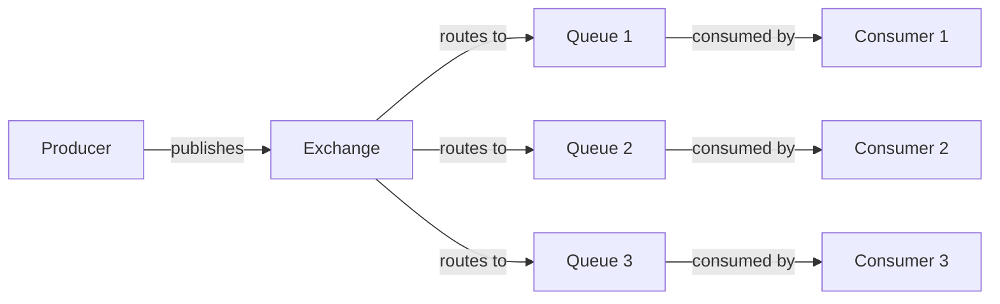
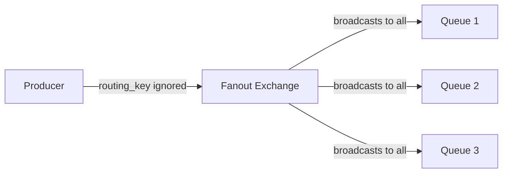

# RabbitMQ Exchanges

## Introduction

In the world of messaging systems, RabbitMQ stands out as a powerful and flexible message broker. At the heart of RabbitMQ's routing capabilities are **exchanges**. If you're familiar with postal services, you can think of exchanges as the sorting offices that determine where your messages should go.

An exchange receives messages from producers and routes them to queues based on specific rules. Understanding exchanges is crucial for effectively implementing message routing patterns in your applications.

## What Are Exchanges?

In RabbitMQ, producers never send messages directly to queues. Instead, they send messages to exchanges. An exchange is responsible for routing the messages to different queues with the help of bindings and routing keys.



### Key Components

1. **Exchange**: Receives messages and routes them to queues
2. **Binding**: Rules that tell the exchange which queue to route messages to
3. **Routing Key**: A message attribute the exchange looks at when deciding how to route the message
4. **Queue**: Stores messages until they are consumed

## Exchange Types

RabbitMQ provides four types of exchanges, each with different routing behavior:

### 1. Direct Exchange

A direct exchange routes messages to queues based on an exact match between the routing key and the binding key.

```mermaid
graph LR
    A[Producer] -->|routing_key="error"| B[Direct Exchange]
    B -->|binding_key="error"| C[Error Queue]
    B -->|binding_key="info"| D[Info Queue]
    B -->|binding_key="warning"| E[Warning Queue]
```

#### Example: Creating a Direct Exchange

```javascript
// Connect to RabbitMQ
const amqp = require('amqplib');

async function setupDirectExchange() {
  try {
    // Create a connection
    const connection = await amqp.connect('amqp://localhost');
    
    // Create a channel
    const channel = await connection.createChannel();
    
    // Declare an exchange of type 'direct'
    const exchangeName = 'logs_direct';
    await channel.assertExchange(exchangeName, 'direct', { durable: false });
    
    // Create a queue (we'll let RabbitMQ generate a random queue name)
    const q = await channel.assertQueue('', { exclusive: true });
    
    // Bind the queue to the exchange with a specific routing key
    const routingKey = 'error';
    await channel.bindQueue(q.queue, exchangeName, routingKey);
    
    console.log(`Waiting for error messages on queue: ${q.queue}`);
    
    // Consume messages from the queue
    channel.consume(q.queue, (msg) => {
      if (msg.content) {
        console.log(`Received error: ${msg.content.toString()}`);
      }
    }, { noAck: true });
    
  } catch (error) {
    console.error('Error:', error);
  }
}

setupDirectExchange();
```

### 2. Fanout Exchange

A fanout exchange routes messages to all the queues bound to it, regardless of routing keys. This is ideal for broadcast-type messaging.



#### Example: Creating a Fanout Exchange

```javascript
// Connect to RabbitMQ
const amqp = require('amqplib');

async function setupFanoutExchange() {
  try {
    // Create a connection
    const connection = await amqp.connect('amqp://localhost');
    
    // Create a channel
    const channel = await connection.createChannel();
    
    // Declare an exchange of type 'fanout'
    const exchangeName = 'logs_fanout';
    await channel.assertExchange(exchangeName, 'fanout', { durable: false });
    
    // Create a queue (we'll let RabbitMQ generate a random queue name)
    const q = await channel.assertQueue('', { exclusive: true });
    
    // Bind the queue to the exchange (no routing key needed for fanout)
    await channel.bindQueue(q.queue, exchangeName, '');
    
    console.log(`Waiting for messages on queue: ${q.queue}`);
    
    // Consume messages from the queue
    channel.consume(q.queue, (msg) => {
      if (msg.content) {
        console.log(`Received broadcast: ${msg.content.toString()}`);
      }
    }, { noAck: true });
    
  } catch (error) {
    console.error('Error:', error);
  }
}

setupFanoutExchange();
```

### 3. Topic Exchange

A topic exchange routes messages to queues based on wildcard matches between the routing key and the binding pattern. This provides flexible routing capabilities.

The routing key must be a list of words, delimited by dots. For example: `"stock.usd.nyse"`, `"stock.euro.paris"`, etc.

Special characters in the binding pattern:
- `*` (star) can substitute for exactly one word
- `#` (hash) can substitute for zero or more words

```mermaid
graph LR
    A[Producer] -->|routing_key="stock.usd.nyse"| B[Topic Exchange]
    B -->|binding_key="stock.#"| C[All Stocks Queue]
    B -->|binding_key="stock.usd.*"| D[USD Stocks Queue]
    B -->|binding_key="*.*.nyse"| E[NYSE Queue]
```

#### Example: Creating a Topic Exchange

```javascript
// Connect to RabbitMQ
const amqp = require('amqplib');

async function setupTopicExchange() {
  try {
    // Create a connection
    const connection = await amqp.connect('amqp://localhost');
    
    // Create a channel
    const channel = await connection.createChannel();
    
    // Declare an exchange of type 'topic'
    const exchangeName = 'topic_logs';
    await channel.assertExchange(exchangeName, 'topic', { durable: false });
    
    // Create a queue (we'll let RabbitMQ generate a random queue name)
    const q = await channel.assertQueue('', { exclusive: true });
    
    // Bind the queue to the exchange with wildcard patterns
    const bindingKey = '*.error.*'; // Will receive all error messages from any service and any component
    await channel.bindQueue(q.queue, exchangeName, bindingKey);
    
    console.log(`Waiting for error messages on queue: ${q.queue}`);
    
    // Consume messages from the queue
    channel.consume(q.queue, (msg) => {
      if (msg.content) {
        console.log(`Received message with routing key [${msg.fields.routingKey}]: ${msg.content.toString()}`);
      }
    }, { noAck: true });
    
  } catch (error) {
    console.error('Error:', error);
  }
}

setupTopicExchange();
```

### 4. Headers Exchange

A headers exchange uses the message header attributes for routing instead of the routing key. This exchange type is rarely used but can be useful in specific scenarios.

```mermaid
graph LR
    A[Producer] -->|headers={format:pdf,type:report}| B[Headers Exchange]
    B -->|match all headers| C[PDF Reports Queue]
    B -->|match any header| D[General Reports Queue]
```

#### Example: Creating a Headers Exchange

```javascript
// Connect to RabbitMQ
const amqp = require('amqplib');

async function setupHeadersExchange() {
  try {
    // Create a connection
    const connection = await amqp.connect('amqp://localhost');
    
    // Create a channel
    const channel = await connection.createChannel();
    
    // Declare an exchange of type 'headers'
    const exchangeName = 'headers_exchange';
    await channel.assertExchange(exchangeName, 'headers', { durable: false });
    
    // Create a queue (we'll let RabbitMQ generate a random queue name)
    const q = await channel.assertQueue('', { exclusive: true });
    
    // Bind the queue to the exchange with header matching rules
    // x-match: all means all headers must match
    await channel.bindQueue(q.queue, exchangeName, '', {
      'x-match': 'all',
      'format': 'pdf',
      'type': 'report'
    });
    
    console.log(`Waiting for PDF reports on queue: ${q.queue}`);
    
    // Consume messages from the queue
    channel.consume(q.queue, (msg) => {
      if (msg.content) {
        console.log(`Received PDF report: ${msg.content.toString()}`);
        console.log('Message headers:', msg.properties.headers);
      }
    }, { noAck: true });
    
  } catch (error) {
    console.error('Error:', error);
  }
}

setupHeadersExchange();
```

## Default Exchange

RabbitMQ provides a default exchange (an unnamed direct exchange) that is pre-declared by the broker. When you publish a message with a routing key that matches a queue name, the message will be routed to that queue.

```javascript
// Using the default exchange
channel.sendToQueue('my_queue', Buffer.from('Hello World!'));

// Equivalent to:
channel.publish('', 'my_queue', Buffer.from('Hello World!'));
```

## Real-World Applications

### Application #1: Logging System

Consider a logging system that needs to distribute logs of different severities to different services:

```javascript
// Logger code (Producer)
const amqp = require('amqplib');

async function setupLoggingSystem() {
  const connection = await amqp.connect('amqp://localhost');
  const channel = await connection.createChannel();
  
  const exchange = 'logs_direct';
  await channel.assertExchange(exchange, 'direct', { durable: true });
  
  // Function to log messages with different severities
  function log(severity, message) {
    channel.publish(exchange, severity, Buffer.from(message));
    console.log(`Sent ${severity}: ${message}`);
  }
  
  // Example usage
  log('info', 'User login successful');
  log('warning', 'High memory usage detected');
  log('error', 'Database connection failed');
  
  // Close the connection after sending logs
  setTimeout(() => {
    connection.close();
  }, 500);
}

setupLoggingSystem();
```

### Application #2: Work Distribution System

A task distribution system that efficiently allocates different types of tasks to specialized workers:

```javascript
// Task publisher
const amqp = require('amqplib');

async function setupWorkDistribution() {
  const connection = await amqp.connect('amqp://localhost');
  const channel = await connection.createChannel();
  
  const exchange = 'tasks_topic';
  await channel.assertExchange(exchange, 'topic', { durable: true });
  
  // Function to publish tasks
  function publishTask(taskType, task) {
    channel.publish(exchange, taskType, Buffer.from(JSON.stringify(task)));
    console.log(`Task published: ${taskType}`);
  }
  
  // Example tasks
  publishTask('image.resize', { id: 1, url: 'http://example.com/image1.jpg', size: '800x600' });
  publishTask('video.encode', { id: 2, url: 'http://example.com/video1.mp4', format: 'mp4' });
  publishTask('document.convert', { id: 3, url: 'http://example.com/doc1.docx', toFormat: 'pdf' });
  
  // Close the connection after sending tasks
  setTimeout(() => {
    connection.close();
  }, 500);
}

setupWorkDistribution();
```

## Exchange Declaration Parameters

When declaring an exchange, you can specify several parameters:

```javascript
channel.assertExchange(exchangeName, exchangeType, {
  durable: true,         // Exchange survives broker restart
  internal: false,       // If true, can't publish directly to this exchange
  autoDelete: false,     // Delete when no longer used
  arguments: {}          // Additional arguments for plugins or broker-specific features
});
```

## Summary

RabbitMQ exchanges are powerful routing mechanisms that direct messages from producers to queues based on different criteria. Understanding the four exchange types—direct, fanout, topic, and headers—allows you to implement various messaging patterns in your applications.

Here's a quick recap:

| Exchange Type | When to Use |
|---------------|-------------|
| Direct | When you need point-to-point messaging with exact routing keys |
| Fanout | For broadcast messaging where all consumers need all messages |
| Topic | For flexible, pattern-based message routing |
| Headers | When routing based on message headers is more convenient than routing keys |

By leveraging the appropriate exchange type for your use case, you can create efficient and scalable message-driven architectures.

## Exercises

1. Create a direct exchange that routes error messages to an error handling service and info messages to a logging service.

2. Implement a fanout exchange to broadcast system status updates to multiple monitoring services.

3. Set up a topic exchange that routes messages based on service name, environment, and message type using patterns like `service.environment.type`.

4. Challenge: Create a headers exchange that routes messages based on content type and processing priority.

## Additional Resources

- [RabbitMQ Official Documentation on Exchanges](https://www.rabbitmq.com/tutorials/amqp-concepts.html#exchanges)
- [RabbitMQ Exchange to Exchange Bindings](https://www.rabbitmq.com/e2e.html)
- [RabbitMQ Tutorials](https://www.rabbitmq.com/getstarted.html)
- [RabbitMQ Best Practices](https://www.cloudamqp.com/blog/part1-rabbitmq-best-practice.html)