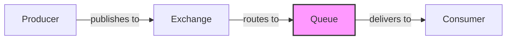
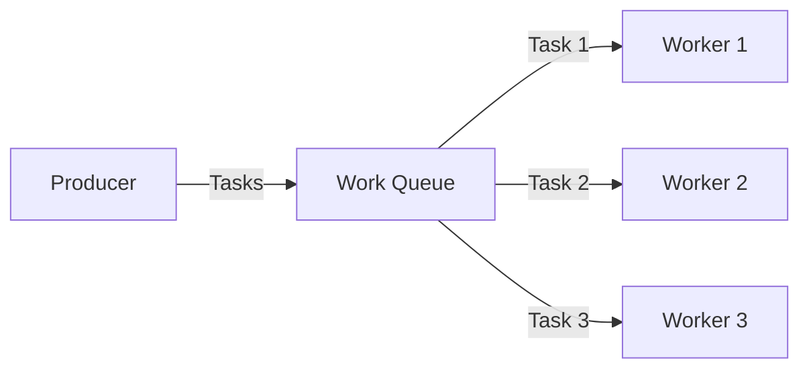

# RabbitMQ Queues

## Introduction

Queues are one of the most fundamental components in RabbitMQ's messaging architecture. They serve as buffers that store messages until consumer applications are ready to process them. Think of a queue as a post office box where messages are delivered and wait until the recipient picks them up.

In this guide, we'll explore how queues work in RabbitMQ, their key properties, and how to effectively implement them in your applications.

## What are RabbitMQ Queues?

A queue in RabbitMQ is a named entity that receives and stores messages. Queues have several important characteristics:

- They exist within a RabbitMQ broker instance
- They have names that identify them within the broker
- They can be configured with various properties that affect how messages are handled
- They act as the interface between message producers and consumers



## Basic Queue Operations

Let's look at the fundamental operations you can perform with queues:

### Creating a Queue

The most basic way to create a queue is using the `channel.queueDeclare()` method:

```java
// Java example
Channel channel = connection.createChannel();
channel.queueDeclare("my-queue", false, false, false, null);
```

```python
# Python example
channel = connection.channel()
channel.queue_declare(queue='my-queue')
```

```javascript
// JavaScript (using amqplib) example
const channel = await connection.createChannel();
await channel.assertQueue('my-queue', {
  durable: false
});
```

The parameters for queue declaration typically include:

1. Queue name
2. Durability flag (should the queue survive broker restart?)
3. Exclusive flag (is the queue used by only one connection?)
4. Auto-delete flag (should the queue be deleted when no longer used?)
5. Other arguments (as a map/dictionary)

### Publishing Messages to a Queue

Though you typically publish messages to exchanges, which then route to queues, you can publish directly to a queue using the default exchange:

```java
// Java example
String message = "Hello, RabbitMQ!";
channel.basicPublish("", "my-queue", null, message.getBytes());
```

```python
# Python example
message = "Hello, RabbitMQ!"
channel.basic_publish(exchange='',
                     routing_key='my-queue',
                     body=message)
```

```javascript
// JavaScript example
const message = "Hello, RabbitMQ!";
channel.sendToQueue('my-queue', Buffer.from(message));
```

### Consuming Messages from a Queue

To consume messages, you register a callback function that will be invoked whenever a message is available:

```java
// Java example
DeliverCallback deliverCallback = (consumerTag, delivery) -> {
    String message = new String(delivery.getBody(), "UTF-8");
    System.out.println("Received: " + message);
};
channel.basicConsume("my-queue", true, deliverCallback, consumerTag -> { });
```

```python
# Python example
def callback(ch, method, properties, body):
    print(f"Received: {body.decode()}")

channel.basic_consume(queue='my-queue',
                     on_message_callback=callback,
                     auto_ack=True)
channel.start_consuming()
```

```javascript
// JavaScript example
channel.consume('my-queue', (msg) => {
  if (msg !== null) {
    console.log(`Received: ${msg.content.toString()}`);
    channel.ack(msg);
  }
});
```

## Queue Properties and Configuration

Queues can be configured with various properties that affect their behavior:

### Durability

Durable queues survive broker restarts:

```java
// Java - create a durable queue
channel.queueDeclare("durable-queue", true, false, false, null);
```

```python
# Python - create a durable queue
channel.queue_declare(queue='durable-queue', durable=True)
```

```javascript
// JavaScript - create a durable queue
channel.assertQueue('durable-queue', {
  durable: true
});
```

### Exclusive Queues

Exclusive queues can only be used by the connection that created them and are automatically deleted when the connection closes:

```java
// Java - create an exclusive queue
channel.queueDeclare("exclusive-queue", false, true, false, null);
```

```python
# Python - create an exclusive queue
channel.queue_declare(queue='exclusive-queue', exclusive=True)
```

```javascript
// JavaScript - create an exclusive queue
channel.assertQueue('exclusive-queue', {
  exclusive: true
});
```

### Auto-delete Queues

Auto-delete queues are removed when the last consumer unsubscribes:

```java
// Java - create an auto-delete queue
channel.queueDeclare("auto-delete-queue", false, false, true, null);
```

```python
# Python - create an auto-delete queue
channel.queue_declare(queue='auto-delete-queue', auto_delete=True)
```

```javascript
// JavaScript - create an auto-delete queue
channel.assertQueue('auto-delete-queue', {
  autoDelete: true
});
```

### TTL (Time-to-Live)

You can set a TTL for messages in a queue:

```java
// Java - create a queue with message TTL of 60000 ms (1 minute)
Map<String, Object> args = new HashMap<>();
args.put("x-message-ttl", 60000);
channel.queueDeclare("ttl-queue", true, false, false, args);
```

```python
# Python - create a queue with message TTL of 60000 ms (1 minute)
channel.queue_declare(queue='ttl-queue',
                     arguments={'x-message-ttl': 60000})
```

```javascript
// JavaScript - create a queue with message TTL of 60000 ms (1 minute)
channel.assertQueue('ttl-queue', {
  arguments: {
    'x-message-ttl': 60000
  }
});
```

## Queue Patterns and Best Practices

### Dead Letter Exchange (DLX)

A dead letter exchange allows you to capture messages that are rejected or expire:

```java
// Java - create a queue with DLX
Map<String, Object> args = new HashMap<>();
args.put("x-dead-letter-exchange", "dlx-exchange");
channel.queueDeclare("dlx-queue", true, false, false, args);
```

```python
# Python - create a queue with DLX
channel.queue_declare(queue='dlx-queue',
                     arguments={'x-dead-letter-exchange': 'dlx-exchange'})
```

```javascript
// JavaScript - create a queue with DLX
channel.assertQueue('dlx-queue', {
  arguments: {
    'x-dead-letter-exchange': 'dlx-exchange'
  }
});
```

### Lazy Queues

Lazy queues prioritize disk storage over memory usage, which can be beneficial for large queues:

```java
// Java - create a lazy queue
Map<String, Object> args = new HashMap<>();
args.put("x-queue-mode", "lazy");
channel.queueDeclare("lazy-queue", true, false, false, args);
```

```python
# Python - create a lazy queue
channel.queue_declare(queue='lazy-queue',
                     arguments={'x-queue-mode': 'lazy'})
```

```javascript
// JavaScript - create a lazy queue
channel.assertQueue('lazy-queue', {
  arguments: {
    'x-queue-mode': 'lazy'
  }
});
```

## Real-world Examples

### Example 1: Task Queue for Processing Orders

This example demonstrates a durable queue for processing orders:

```java
// Java Producer
// Create a durable queue for order processing
channel.queueDeclare("order-processing", true, false, false, null);

// Create an order message
String order = "{\"id\":12345, \"items\":[\"product1\", \"product2\"], \"total\":59.99}";

// Set persistent delivery mode
AMQP.BasicProperties properties = new AMQP.BasicProperties.Builder()
    .deliveryMode(2) // persistent
    .build();

// Publish the order
channel.basicPublish("", "order-processing", properties, order.getBytes());
System.out.println("Order sent for processing");
```

```java
// Java Consumer
// Set prefetch count to 1 (process one message at a time)
channel.basicQos(1);

// Create consumer
DeliverCallback deliverCallback = (consumerTag, delivery) -> {
    String orderJson = new String(delivery.getBody(), "UTF-8");
    System.out.println("Processing order: " + orderJson);
    
    try {
        // Simulate order processing
        Thread.sleep(1000);
        
        // Acknowledge successful processing
        channel.basicAck(delivery.getEnvelope().getDeliveryTag(), false);
        System.out.println("Order processed successfully");
    } catch (Exception e) {
        // Reject the message in case of an error
        channel.basicNack(delivery.getEnvelope().getDeliveryTag(), false, true);
        System.out.println("Failed to process order, requeued");
    }
};

// Start consuming (false = manual acknowledgment)
channel.basicConsume("order-processing", false, deliverCallback, consumerTag -> { });
```

### Example 2: Priority Queue for Support Tickets

```java
// Java - create a priority queue with max priority 10
Map<String, Object> args = new HashMap<>();
args.put("x-max-priority", 10);
channel.queueDeclare("support-tickets", true, false, false, args);

// Send high priority message (priority 8)
String highPriorityTicket = "{\"id\":789, \"customer\":\"VIP Client\", \"issue\":\"Service down\"}";
AMQP.BasicProperties highPriority = new AMQP.BasicProperties.Builder()
    .priority(8)
    .build();
channel.basicPublish("", "support-tickets", highPriority, highPriorityTicket.getBytes());

// Send normal priority message (priority 3)
String normalPriorityTicket = "{\"id\":456, \"customer\":\"Regular Client\", \"issue\":\"Feature request\"}";
AMQP.BasicProperties normalPriority = new AMQP.BasicProperties.Builder()
    .priority(3)
    .build();
channel.basicPublish("", "support-tickets", normalPriority, normalPriorityTicket.getBytes());
```

## Advanced Queue Management

### Queue Monitoring

You can monitor your queues using the RabbitMQ Management UI or the HTTP API:

```bash
# Get information about a specific queue using the HTTP API
curl -u guest:guest http://localhost:15672/api/queues/%2F/my-queue
```

Response (simplified):
```json
{
  "name": "my-queue",
  "vhost": "/",
  "durable": true,
  "auto_delete": false,
  "exclusive": false,
  "consumers": 1,
  "messages": 45,
  "messages_ready": 45,
  "messages_unacknowledged": 0
}
```

### Queue Deletion

```java
// Java - delete a queue
channel.queueDelete("my-queue");
```

```python
# Python - delete a queue
channel.queue_delete(queue='my-queue')
```

```javascript
// JavaScript - delete a queue
channel.deleteQueue('my-queue');
```

### Queue Purging

```java
// Java - purge all messages from a queue
channel.queuePurge("my-queue");
```

```python
# Python - purge all messages from a queue
channel.queue_purge(queue='my-queue')
```

```javascript
// JavaScript - purge all messages from a queue
channel.purgeQueue('my-queue');
```

## Common Queue Patterns

### Work Queues (Task Distribution)



Work queues distribute tasks among multiple workers, making them ideal for resource-intensive tasks:

1. Producers send tasks to a queue
2. Multiple consumers (workers) connect to the queue
3. RabbitMQ distributes tasks among available workers
4. Workers process tasks concurrently

### Request-Reply Pattern

In this pattern, a client sends a request message and expects a reply:

```java
// Java - Request-Reply Pattern
// Client code
String replyQueueName = channel.queueDeclare().getQueue(); // Create temporary reply queue
String correlationId = UUID.randomUUID().toString();

// Set reply properties
AMQP.BasicProperties props = new AMQP.BasicProperties.Builder()
    .correlationId(correlationId)
    .replyTo(replyQueueName)
    .build();

// Send request
channel.basicPublish("", "request-queue", props, "Request data".getBytes());

// Wait for response on the reply queue
final String[] response = {null};
channel.basicConsume(replyQueueName, true, (consumerTag, delivery) -> {
    if (delivery.getProperties().getCorrelationId().equals(correlationId)) {
        response[0] = new String(delivery.getBody(), "UTF-8");
    }
}, consumerTag -> { });

// Server code
DeliverCallback requestCallback = (consumerTag, delivery) -> {
    String replyTo = delivery.getProperties().getReplyTo();
    String correlationId = delivery.getProperties().getCorrelationId();
    
    // Process the request
    String requestData = new String(delivery.getBody(), "UTF-8");
    String responseData = processRequest(requestData);
    
    // Build response properties
    AMQP.BasicProperties replyProps = new AMQP.BasicProperties.Builder()
        .correlationId(correlationId)
        .build();
    
    // Send the response
    channel.basicPublish("", replyTo, replyProps, responseData.getBytes());
    channel.basicAck(delivery.getEnvelope().getDeliveryTag(), false);
};

channel.basicConsume("request-queue", false, requestCallback, consumerTag -> { });
```

## Summary

RabbitMQ queues are versatile components that form the backbone of message-oriented architectures. They provide reliable message storage, flexible delivery options, and support various messaging patterns.

Key points to remember:

- Queues store messages until they are consumed
- They can be configured with various properties (durability, exclusivity, TTL, etc.)
- Queue patterns like work queues and request-reply enable common messaging scenarios
- Proper queue configuration is essential for reliability and performance

## Exercises

1. Create a durable queue and publish persistent messages to it
2. Implement a work queue that distributes tasks to multiple workers
3. Set up a queue with a dead letter exchange and observe what happens to rejected messages
4. Create a priority queue and test different message priorities
5. Implement the request-reply pattern using temporary reply queues

## Additional Resources

- [RabbitMQ Queues Documentation](https://www.rabbitmq.com/queues.html)
- [RabbitMQ Tutorials](https://www.rabbitmq.com/getstarted.html)
- [RabbitMQ Client Libraries](https://www.rabbitmq.com/devtools.html)
- [AMQP 0-9-1 Protocol Specification](https://www.rabbitmq.com/resources/specs/amqp0-9-1.pdf)