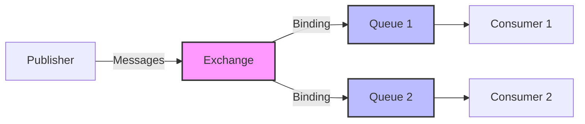

# RabbitMQ Bindings

## Introduction

When working with messaging systems like RabbitMQ, understanding how messages flow between different components is essential. **Bindings** are a fundamental concept that connects the dots in the RabbitMQ messaging architecture.

A binding is a relationship between an exchange and a queue that tells RabbitMQ how messages should be routed. Think of bindings as the rules that determine which messages from an exchange should be delivered to which queues.

## The Role of Bindings in RabbitMQ

To understand bindings, we first need to review the basic messaging flow in RabbitMQ:

1. Publishers send messages to exchanges
2. Exchanges receive messages and route them
3. **Bindings** determine how exchanges route messages to queues
4. Queues hold messages until consumers are ready to process them
5. Consumers retrieve messages from queues



Without bindings, exchanges wouldn't know where to send messages, and your messaging system wouldn't function properly.

## Creating Bindings

Let's look at how to create bindings in RabbitMQ using different programming languages.

### Creating Bindings in JavaScript (Node.js)

Here's an example using the `amqplib` library:

```javascript
const amqp = require('amqplib');

async function setupChannel() {
  try {
    // Connect to RabbitMQ server
    const connection = await amqp.connect('amqp://localhost');
    const channel = await connection.createChannel();
    
    // Declare an exchange
    const exchangeName = 'orders_exchange';
    await channel.assertExchange(exchangeName, 'direct', { durable: true });
    
    // Declare a queue
    const queueName = 'new_orders_queue';
    await channel.assertQueue(queueName, { durable: true });
    
    // Create a binding between the exchange and queue with a routing key
    const routingKey = 'new_order';
    await channel.bindQueue(queueName, exchangeName, routingKey);
    
    console.log('Binding created successfully!');
    
    // Close the connection
    setTimeout(function() {
      connection.close();
    }, 500);
  } catch (error) {
    console.error('Error:', error);
  }
}

setupChannel();
```

### Creating Bindings in Python

Here's how to create bindings using the `pika` library:

```python
import pika

# Connect to RabbitMQ
connection = pika.BlockingConnection(pika.ConnectionParameters('localhost'))
channel = connection.create_channel()

# Declare exchange
exchange_name = 'orders_exchange'
channel.exchange_declare(exchange=exchange_name, exchange_type='direct', durable=True)

# Declare queue
queue_name = 'new_orders_queue'
channel.queue_declare(queue=queue_name, durable=True)

# Create binding with routing key
routing_key = 'new_order'
channel.queue_bind(exchange=exchange_name, queue=queue_name, routing_key=routing_key)

print("Binding created successfully!")

# Close the connection
connection.close()
```

## Binding Parameters

When creating a binding, you typically need to specify:

1. **Exchange name**: The source of messages
2. **Queue name**: The destination for messages
3. **Routing key**: A filter that determines which messages should be routed (depends on the exchange type)
4. **Arguments**: Optional additional parameters (used with header exchanges)

## Binding Behavior with Different Exchange Types

The way bindings work changes based on the exchange type you're using. Let's explore how bindings behave with each exchange type:

### Direct Exchange Bindings

With direct exchanges, the routing key must match exactly.

```javascript
// The binding
channel.bindQueue('payment_queue', 'transactions_exchange', 'payment');

// This message will be routed to payment_queue
channel.publish('transactions_exchange', 'payment', Buffer.from('Process payment'));

// This message will NOT be routed to payment_queue
channel.publish('transactions_exchange', 'refund', Buffer.from('Process refund'));
```

### Topic Exchange Bindings

Topic exchanges use wildcard matching with routing keys:
- `*` matches exactly one word
- `#` matches zero or more words

```javascript
// Bindings
channel.bindQueue('all_logs_queue', 'logs_exchange', '#'); // Matches all routing keys
channel.bindQueue('error_logs_queue', 'logs_exchange', '*.error'); // Matches any service's error logs
channel.bindQueue('auth_logs_queue', 'logs_exchange', 'auth.*'); // Matches all auth logs

// Message routing
channel.publish('logs_exchange', 'auth.error', Buffer.from('Authentication failed')); 
// This message goes to: all_logs_queue, error_logs_queue, and auth_logs_queue

channel.publish('logs_exchange', 'payment.info', Buffer.from('Payment processed')); 
// This message goes to: all_logs_queue only
```

### Fanout Exchange Bindings

Fanout exchanges ignore routing keys and send messages to all bound queues.

```javascript
// Bindings (routing key is ignored but is still required parameter)
channel.bindQueue('notifications_email', 'alerts_exchange', '');
channel.bindQueue('notifications_sms', 'alerts_exchange', '');
channel.bindQueue('notifications_push', 'alerts_exchange', '');

// This message will be sent to ALL three queues, regardless of routing key
channel.publish('alerts_exchange', 'any_key_works', Buffer.from('System alert!'));
```

### Headers Exchange Bindings

Headers exchanges use message header attributes instead of routing keys. You use binding arguments to define matching criteria:

```javascript
// Binding with arguments
channel.bindQueue('european_orders', 'orders_exchange', '', {
  'x-match': 'all', // 'all' means all headers must match, 'any' means at least one must match
  'region': 'europe',
  'type': 'urgent'
});

// Publishing with headers
channel.publish('orders_exchange', '', Buffer.from('Order #12345'), {
  headers: {
    'region': 'europe',
    'type': 'urgent',
    'value': '500'
  }
});
```

## Managing Bindings

### Listing Bindings

You can view existing bindings through the RabbitMQ Management UI or by using the HTTP API:

```bash
# Using rabbitmqctl
rabbitmqctl list_bindings

# Using HTTP API
curl -u guest:guest http://localhost:15672/api/bindings
```

### Removing Bindings

To remove a binding when it's no longer needed:

```javascript
// JavaScript
await channel.unbindQueue(queueName, exchangeName, routingKey);
```

```python
# Python
channel.queue_unbind(
    queue=queue_name,
    exchange=exchange_name,
    routing_key=routing_key
)
```

## Practical Examples

### Example 1: Log Routing System

Let's create a log routing system that distributes logs based on severity:

```javascript
const amqp = require('amqplib');

async function setupLogSystem() {
  const connection = await amqp.connect('amqp://localhost');
  const channel = await connection.createChannel();
  
  // Create a topic exchange for logs
  const exchangeName = 'logs';
  await channel.assertExchange(exchangeName, 'topic', { durable: true });
  
  // Create queues for different log handling
  const queues = {
    allLogs: 'all_logs',
    errorLogs: 'error_logs',
    warningLogs: 'warning_logs',
    dbLogs: 'database_logs'
  };
  
  // Create queues
  for (const key in queues) {
    await channel.assertQueue(queues[key], { durable: true });
  }
  
  // Create bindings with appropriate routing patterns
  await channel.bindQueue(queues.allLogs, exchangeName, '#'); // All logs
  await channel.bindQueue(queues.errorLogs, exchangeName, '*.error'); // All error logs
  await channel.bindQueue(queues.warningLogs, exchangeName, '*.warning'); // All warning logs
  await channel.bindQueue(queues.dbLogs, exchangeName, 'database.*'); // All database logs
  
  console.log('Log routing system set up successfully!');
  
  // Example log messages
  const logs = [
    { routing: 'app.error', message: 'Application crashed' },
    { routing: 'database.warning', message: 'Database connection slow' },
    { routing: 'auth.info', message: 'User logged in' }
  ];
  
  // Send sample logs
  logs.forEach(log => {
    channel.publish(exchangeName, log.routing, Buffer.from(log.message));
    console.log(`Sent: ${log.message} with routing key: ${log.routing}`);
  });
}

setupLogSystem();
```

**Output:**
```
Log routing system set up successfully!
Sent: Application crashed with routing key: app.error
Sent: Database connection slow with routing key: database.warning
Sent: User logged in with routing key: auth.info
```

In this example:
- `app.error` will be routed to `all_logs` and `error_logs` queues
- `database.warning` will be routed to `all_logs`, `warning_logs`, and `database_logs` queues
- `auth.info` will only be routed to `all_logs` queue

### Example 2: E-commerce Order Processing

Here's an example showing how bindings can be used in an e-commerce system:

```python
import pika
import json

connection = pika.BlockingConnection(pika.ConnectionParameters('localhost'))
channel = connection.create_channel()

# Declare exchange
exchange_name = 'orders'
channel.exchange_declare(exchange=exchange_name, exchange_type='direct', durable=True)

# Create queues for different departments
queues = {
    'new_orders': 'process_new_orders',
    'payments': 'process_payments',
    'shipping': 'process_shipping',
    'notifications': 'send_notifications'
}

# Create queues and bindings
for key, queue in queues.items():
    channel.queue_declare(queue=queue, durable=True)
    channel.queue_bind(exchange=exchange_name, queue=queue, routing_key=key)

# Simulate an order
order = {
    'order_id': '12345',
    'customer': 'John Doe',
    'items': ['Product A', 'Product B'],
    'total': 99.99
}

# Process order through different stages
print("Processing order #12345")

# 1. New order received
channel.basic_publish(
    exchange=exchange_name,
    routing_key='new_orders',
    body=json.dumps(order),
    properties=pika.BasicProperties(delivery_mode=2)  # Make message persistent
)
print("Order sent to new_orders queue")

# 2. Payment processing
channel.basic_publish(
    exchange=exchange_name,
    routing_key='payments',
    body=json.dumps(order),
    properties=pika.BasicProperties(delivery_mode=2)
)
print("Order sent to payments queue")

# 3. Shipping department
channel.basic_publish(
    exchange=exchange_name,
    routing_key='shipping',
    body=json.dumps(order),
    properties=pika.BasicProperties(delivery_mode=2)
)
print("Order sent to shipping queue")

# 4. Customer notification
channel.basic_publish(
    exchange=exchange_name,
    routing_key='notifications',
    body=json.dumps(order),
    properties=pika.BasicProperties(delivery_mode=2)
)
print("Order sent to notifications queue")

connection.close()
```

**Output:**
```
Processing order #12345
Order sent to new_orders queue
Order sent to payments queue
Order sent to shipping queue
Order sent to notifications queue
```

## Best Practices for Working with Bindings

1. **Use Meaningful Routing Keys**: Create a consistent naming convention for routing keys that reflects your application's architecture.

2. **Keep Exchange Types in Mind**: Choose the right exchange type based on your routing needs:
   - Direct: For exact routing key matching
   - Topic: For pattern-based routing with wildcards
   - Fanout: When all bound queues need the same messages
   - Headers: For routing based on message attributes

3. **Document Your Bindings**: As systems grow complex, maintain documentation of exchanges, queues, and binding relationships.

4. **Temporary Queues and Auto-delete**: For temporary consumers (like dashboards or monitoring), use auto-delete queues that will remove themselves and their bindings when the consumer disconnects.

5. **Don't Over-bind**: Excessive bindings can impact performance. Design your routing topology carefully.

## Common Issues and Troubleshooting

### Messages Not Being Routed

If messages aren't arriving at the expected queues, check:

1. **Exchange Existence**: Verify the exchange exists
2. **Binding Correctness**: Ensure the binding is correctly established
3. **Routing Key Matching**: Confirm the routing key matches your binding pattern
4. **Exchange Type**: Make sure you're using the appropriate exchange type

### Debugging Bindings

Use the RabbitMQ Management UI or CLI tools to inspect bindings:

```bash
# List all bindings
rabbitmqctl list_bindings

# List bindings for a specific vhost
rabbitmqctl list_bindings -p my_vhost
```

## Summary

Bindings are a critical component in the RabbitMQ messaging system that create relationships between exchanges and queues. They determine how messages flow through your application and provide powerful routing capabilities.

Key points to remember:

- Bindings connect exchanges to queues
- The routing behavior depends on the exchange type (direct, topic, fanout, headers)
- Routing keys filter messages in direct and topic exchanges
- Headers exchanges use message attributes instead of routing keys
- Well-designed bindings help create scalable, decoupled systems

## Exercises

1. Create a topic exchange with bindings that route messages based on service name and message severity.
2. Implement a fanout exchange that broadcasts notifications to multiple consumer services.
3. Build a headers exchange that routes messages based on content type and priority.
4. Create a system with multiple exchanges and bindings that represent a complex workflow.

## Additional Resources

- [RabbitMQ Official Documentation on Bindings](https://www.rabbitmq.com/tutorials/amqp-concepts.html#bindings)
- [RabbitMQ Exchange Types Tutorial](https://www.rabbitmq.com/tutorials/tutorial-four-python.html)
- [RabbitMQ Management HTTP API](https://rawcdn.githack.com/rabbitmq/rabbitmq-server/v3.8.19/deps/rabbitmq_management/priv/www/api/index.html)