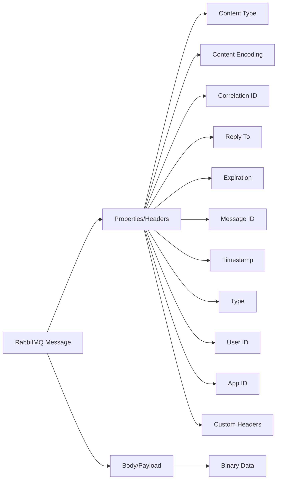
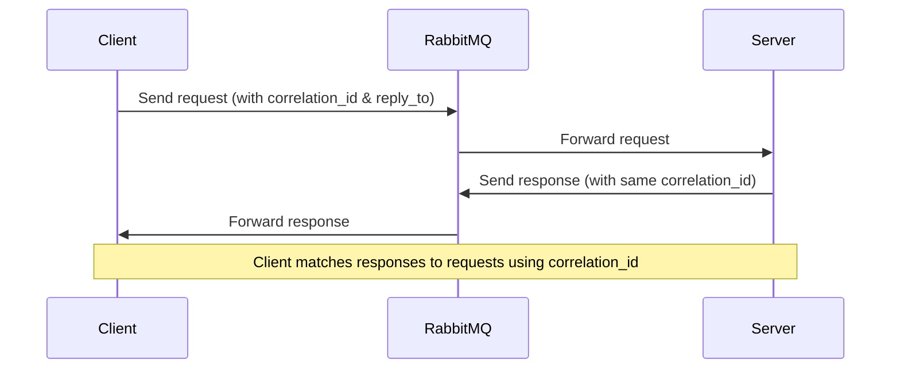

# RabbitMQ Messages

## Introduction

Messages are the core elements of any messaging system, including RabbitMQ. When applications communicate through RabbitMQ, they do so by sending and receiving messages. Understanding how messages work, their structure, and how to effectively handle them is fundamental to building robust messaging-based applications.

In this article, we'll explore RabbitMQ messages in depth, including their structure, properties, and how to work with them in your applications. By the end, you'll have a solid understanding of message fundamentals that will help you design and implement effective messaging solutions.

## What is a RabbitMQ Message?

A message in RabbitMQ is a piece of data that is sent from a producer application to a consumer application through the RabbitMQ broker. The message consists of two main parts:

1. **Message Properties** - Metadata that describes the message
2. **Message Body** - The actual content or payload of the message

Let's visualize the structure of a RabbitMQ message:



## Message Properties

Message properties provide metadata about the message content and handling instructions. RabbitMQ inherits these properties from the AMQP protocol. Here are the most important ones:

### Basic Message Properties

| Property | Description | Use Case |
|----------|-------------|----------|
| `content_type` | MIME type of the message body | Specify if your content is `application/json`, `text/plain`, etc. |
| `content_encoding` | Encoding of the message (e.g., `gzip`, `compress`) | Indicate if message is compressed |
| `delivery_mode` | Persistence flag (1 = non-persistent, 2 = persistent) | Control message durability |
| `priority` | Message priority (0-9) | Prioritize certain messages |
| `correlation_id` | ID linking related messages | Used in request-reply patterns |
| `reply_to` | Queue name for reply messages | Specify where responses should be sent |
| `expiration` | Message expiration time (TTL) in milliseconds | Set message lifespan |
| `message_id` | Application-defined message identifier | Track specific messages |
| `timestamp` | Message creation timestamp | Record when message was created |
| `type` | Application-defined message type | Categorize messages |
| `user_id` | User who created the message | Authenticate message senders |
| `app_id` | Creating application identifier | Identify source applications |
| `headers` | Custom key-value pairs | Add application-specific metadata |

## Message Body

The message body contains the actual data being transmitted. RabbitMQ treats the body as an opaque byte array and doesn't interpret it. The message body can contain:

- JSON data
- XML
- Plain text
- Binary data
- Serialized objects
- Any other format your application requires

The `content_type` property helps recipients understand how to interpret the body content.

## Working with Messages in Code

Let's look at examples of creating, sending, and receiving messages with RabbitMQ using different programming languages.

### Python Example

First, let's see how to publish a message with properties:

```python
import pika
import json

# Establish connection
connection = pika.BlockingConnection(pika.ConnectionParameters('localhost'))
channel = connection.channel()

# Declare a queue
channel.queue_declare(queue='task_queue', durable=True)

# Message content
message = {
    "task_id": 12345,
    "action": "process_image",
    "data": {
        "image_path": "/uploads/image.jpg",
        "filters": ["grayscale", "blur"]
    }
}

# Publish message with properties
channel.basic_publish(
    exchange='',
    routing_key='task_queue',
    body=json.dumps(message),
    properties=pika.BasicProperties(
        content_type='application/json',
        delivery_mode=2,  # Persistent message
        correlation_id=str(12345),
        reply_to='response_queue',
        headers={'source': 'image_processor', 'priority': 'high'}
    ))

print(" [x] Sent task message")
connection.close()
```

Now, let's see how to receive and process the message:

```python
import pika
import json
import time

def callback(ch, method, properties, body):
    print(f" [x] Received message with:")
    print(f" - Correlation ID: {properties.correlation_id}")
    print(f" - Reply To: {properties.reply_to}")
    print(f" - Content Type: {properties.content_type}")
    
    if properties.headers:
        print(f" - Headers: {properties.headers}")
    
    # Parse the message body based on content_type
    if properties.content_type == 'application/json':
        data = json.loads(body)
        print(f" - Message body: {data}")
        
        # Process the task
        print(f" [x] Processing task {data['task_id']}: {data['action']}")
        time.sleep(3)  # Simulate processing time
        
        # Send a response if reply_to is specified
        if properties.reply_to:
            response = {
                "task_id": data["task_id"],
                "status": "completed"
            }
            
            ch.basic_publish(
                exchange='',
                routing_key=properties.reply_to,
                body=json.dumps(response),
                properties=pika.BasicProperties(
                    content_type='application/json',
                    correlation_id=properties.correlation_id
                ))
            print(f" [x] Sent response to {properties.reply_to}")
    
    # Acknowledge the message
    ch.basic_ack(delivery_tag=method.delivery_tag)
    print(" [x] Done")

# Establish connection
connection = pika.BlockingConnection(pika.ConnectionParameters('localhost'))
channel = connection.channel()

# Declare the queue
channel.queue_declare(queue='task_queue', durable=True)

# Set prefetch count to limit unacknowledged messages
channel.basic_qos(prefetch_count=1)

# Start consuming messages
channel.basic_consume(queue='task_queue', on_message_callback=callback)

print(' [*] Waiting for messages. To exit press CTRL+C')
channel.start_consuming()
```

### Node.js Example

Here's how to publish and consume messages in Node.js using the `amqplib` library:

```javascript
const amqp = require('amqplib');

async function publishMessage() {
  try {
    // Connect to RabbitMQ
    const connection = await amqp.connect('amqp://localhost');
    const channel = await connection.createChannel();
    
    // Declare queue
    const queue = 'notification_queue';
    await channel.assertQueue(queue, { durable: true });
    
    // Message content
    const message = {
      userId: "user123",
      notificationType: "email",
      subject: "Welcome to our platform",
      body: "Thank you for registering with us!"
    };
    
    // Send message with properties
    channel.sendToQueue(
      queue, 
      Buffer.from(JSON.stringify(message)),
      {
        contentType: 'application/json',
        persistent: true,
        messageId: `notify-${Date.now()}`,
        timestamp: Date.now(),
        headers: {
          priority: 'high',
          source: 'registration_service'
        }
      }
    );
    
    console.log(" [x] Sent notification message");
    
    // Close the connection after 1 second
    setTimeout(() => {
      connection.close();
    }, 1000);
  } catch (error) {
    console.error("Error:", error);
  }
}

async function consumeMessages() {
  try {
    // Connect to RabbitMQ
    const connection = await amqp.connect('amqp://localhost');
    const channel = await connection.createChannel();
    
    // Declare queue
    const queue = 'notification_queue';
    await channel.assertQueue(queue, { durable: true });
    
    // Limit prefetch to one message at a time
    channel.prefetch(1);
    
    console.log(" [*] Waiting for messages. To exit press CTRL+C");
    
    // Consume messages
    channel.consume(queue, (msg) => {
      if (msg !== null) {
        console.log(" [x] Received message with:");
        console.log(` - Message ID: ${msg.properties.messageId}`);
        console.log(` - Timestamp: ${new Date(msg.properties.timestamp).toISOString()}`);
        console.log(` - Headers: ${JSON.stringify(msg.properties.headers)}`);
        
        // Parse the message content
        if (msg.properties.contentType === 'application/json') {
          const content = JSON.parse(msg.content.toString());
          console.log(` - Content: ${JSON.stringify(content)}`);
          
          // Process notification
          console.log(` [x] Processing ${content.notificationType} notification for user ${content.userId}`);
          
          // Simulate processing time
          setTimeout(() => {
            // Acknowledge the message
            channel.ack(msg);
            console.log(" [x] Done");
          }, 2000);
        }
      }
    });
  } catch (error) {
    console.error("Error:", error);
  }
}

// Run the functions
// publishMessage();
// consumeMessages();
```

## Message Content Serialization

When sending messages, you need to serialize your data structures into a format that can be transmitted. Common serialization formats include:

1. **JSON** - Human-readable, widely supported, but limited data types
2. **Protocol Buffers** - Compact binary format, efficient but requires schema definition
3. **MessagePack** - Binary JSON alternative, more compact
4. **XML** - Verbose but very flexible

Example of serializing with MessagePack in Python:

```python
import pika
import msgpack

connection = pika.BlockingConnection(pika.ConnectionParameters('localhost'))
channel = connection.channel()

# Declare queue
channel.queue_declare(queue='msgpack_queue')

# Data to send
data = {
    "id": 1001,
    "name": "Product XYZ",
    "price": 29.99,
    "tags": ["electronics", "gadget"]
}

# Serialize with MessagePack
binary_data = msgpack.packb(data)

# Send with appropriate content_type
channel.basic_publish(
    exchange='',
    routing_key='msgpack_queue',
    body=binary_data,
    properties=pika.BasicProperties(
        content_type='application/msgpack',
        delivery_mode=2
    ))

print(" [x] Sent MessagePack data")
connection.close()
```

## Advanced Message Patterns

### Dead Letter Messages

When a message cannot be processed by a consumer, RabbitMQ can redirect it to a "dead letter exchange" (DLX) instead of discarding it. This happens when:

1. The message is rejected with `basic.reject` or `basic.nack` with `requeue=false`
2. The message TTL expires
3. The queue length limit is exceeded

Setting up a dead letter exchange:

```python
# Declare the dead letter exchange and queue
channel.exchange_declare(exchange='dlx', exchange_type='direct')
channel.queue_declare(queue='dead_letter_queue')
channel.queue_bind(queue='dead_letter_queue', exchange='dlx', routing_key='dead_letter')

# Declare the main queue with dead letter configuration
channel.queue_declare(
    queue='task_queue',
    arguments={
        'x-dead-letter-exchange': 'dlx',
        'x-dead-letter-routing-key': 'dead_letter'
    }
)
```

### Priority Messages

RabbitMQ supports prioritizing messages so that higher priority messages are delivered first:

```python
# Declare queue with priority support
channel.queue_declare(
    queue='priority_queue',
    arguments={'x-max-priority': 10}  # Support priorities 0-10
)

# Publish high priority message
channel.basic_publish(
    exchange='',
    routing_key='priority_queue',
    body='High priority task',
    properties=pika.BasicProperties(
        priority=8  # Higher priority
    )
)

# Publish low priority message
channel.basic_publish(
    exchange='',
    routing_key='priority_queue',
    body='Low priority task',
    properties=pika.BasicProperties(
        priority=1  # Lower priority
    )
)
```

### Request-Reply Pattern

The request-reply pattern is implemented using the `correlation_id` and `reply_to` properties:



## Message Handling Best Practices

### Idempotent Consumers

Design consumers to handle the same message multiple times without side effects. This is important because messages might be redelivered in certain failure scenarios.

### Acknowledgment Strategies

1. **Auto acknowledgment**: Messages are acknowledged automatically when delivered
   - Fast but risky if the consumer crashes
2. **Explicit acknowledgment**: Consumer acknowledges after successful processing
   - Safer but requires careful implementation
3. **Negative acknowledgment**: Consumer rejects messages it cannot process
   - Useful for routing to dead-letter queues

### Message Validation

Always validate incoming messages, especially:
- Check that required properties are present
- Validate the message structure matches your expectations
- Verify the content type is one you can handle

Example validation:

```python
def validate_message(properties, body):
    # Validate content type
    if properties.content_type != 'application/json':
        return False, "Invalid content type"
    
    try:
        # Parse JSON
        data = json.loads(body)
        
        # Check required fields
        required_fields = ['task_id', 'action', 'data']
        for field in required_fields:
            if field not in data:
                return False, f"Missing required field: {field}"
        
        return True, data
    except json.JSONDecodeError:
        return False, "Invalid JSON format"
```

## Summary

RabbitMQ messages are much more than simple data containers. They include powerful metadata in their properties that enable complex messaging patterns and behaviors. Key takeaways:

- Messages consist of properties (metadata) and a body (payload)
- Message properties enable features like persistence, TTL, and routing
- Content types help consumers correctly interpret message bodies
- Serialization formats like JSON, MessagePack, and Protocol Buffers convert application data to bytes
- Advanced patterns like dead-lettering, priority queues, and request-reply enhance messaging capabilities
- Proper message handling requires idempotent consumers and careful acknowledgment strategies

## Exercises

1. Create a publisher and consumer that exchange JSON messages with custom headers.
2. Implement the request-reply pattern using temporary response queues.
3. Set up a dead letter queue and test what happens when messages are rejected.
4. Create a priority queue system where high-priority messages are processed first.
5. Build a system that uses message TTL to implement a delayed processing mechanism.

## Additional Resources

- [RabbitMQ AMQP 0-9-1 Reference](https://www.rabbitmq.com/resources/specs/amqp0-9-1.pdf)
- [RabbitMQ Documentation on Publishers](https://www.rabbitmq.com/publishers.html)
- [RabbitMQ Documentation on Consumers](https://www.rabbitmq.com/consumers.html)
- [RabbitMQ Best Practices](https://www.cloudamqp.com/blog/part1-rabbitmq-best-practice.html)