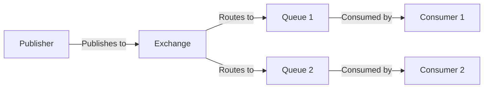

# RabbitMQ Publishing

## Introduction

Publishing messages is a fundamental part of working with RabbitMQ. As a publisher (also called a producer), your application sends messages to RabbitMQ, which then routes these messages to one or more queues based on rules you define. This article explains how to publish messages to RabbitMQ, covering basic concepts, code examples, and best practices.

## What is Publishing in RabbitMQ?

In the RabbitMQ messaging model, a publisher is an application that sends messages to an exchange. The exchange then routes these messages to queues based on binding rules. Consumers retrieve messages from these queues for processing.



Key elements in the publishing process include:

- **Publisher**: The application sending messages
- **Message**: The data being sent (payload plus metadata)
- **Exchange**: The routing mechanism that receives messages and sends them to queues
- **Routing Key**: A parameter that helps the exchange decide how to route the message
- **Queue**: The buffer that stores messages until they're consumed

## Basic Publishing Example

Let's start with a simple example using Node.js and the `amqplib` library. First, install the library:

```bash
npm install amqplib
```

Here's a basic publisher that sends a message to the default exchange:

```javascript
const amqp = require('amqplib');

async function publishMessage() {
  try {
    // Connect to RabbitMQ server
    const connection = await amqp.connect('amqp://localhost');
    const channel = await connection.createChannel();
    
    // Queue declaration
    const queue = 'hello';
    await channel.assertQueue(queue, { durable: false });
    
    // Message content
    const message = 'Hello World!';
    
    // Publish the message
    channel.sendToQueue(queue, Buffer.from(message));
    console.log(`[x] Sent: ${message}`);
    
    // Close the connection after 500ms
    setTimeout(() => {
      connection.close();
      process.exit(0);
    }, 500);
  } catch (error) {
    console.error('Error:', error);
  }
}

publishMessage();
```

When you run this code, you should see:

```
[x] Sent: Hello World!
```

And the message will be available in the "hello" queue for consumption.

## Publishing to Exchanges

In most real-world scenarios, you'll publish messages to exchanges rather than directly to queues. This gives you more flexibility in message routing.

Here's an example using the "fanout" exchange type, which broadcasts messages to all bound queues:

```javascript
const amqp = require('amqplib');

async function publishToExchange() {
  try {
    const connection = await amqp.connect('amqp://localhost');
    const channel = await connection.createChannel();
    
    // Declare an exchange
    const exchange = 'logs';
    await channel.assertExchange(exchange, 'fanout', { durable: false });
    
    // Message content
    const message = 'Info: This is a log message';
    
    // Publish to the exchange
    channel.publish(exchange, '', Buffer.from(message));
    console.log(`[x] Sent: ${message}`);
    
    setTimeout(() => {
      connection.close();
      process.exit(0);
    }, 500);
  } catch (error) {
    console.error('Error:', error);
  }
}

publishToExchange();
```

## Message Properties

When publishing messages, you can set various properties to control how the message is handled:

```javascript
channel.sendToQueue(queue, Buffer.from(message), {
  persistent: true,             // Message persists if RabbitMQ restarts
  contentType: 'application/json', // MIME type of the message content
  contentEncoding: 'utf-8',     // Encoding of the message content
  headers: {                    // Application-specific headers
    'x-message-type': 'alert',
    'x-priority': 'high'
  },
  expiration: '60000',          // Message TTL in milliseconds
  messageId: '1234',            // Application-specific message ID
  timestamp: Date.now(),        // Message timestamp
  correlationId: '5678',        // Useful for RPC patterns
  replyTo: 'callback_queue'     // Queue to reply to (used in RPC)
});
```

## Publishing Strategies and Patterns

### 1. Publish/Subscribe

The Publish/Subscribe pattern allows you to broadcast messages to multiple consumers:

```javascript
async function publishSubscribe() {
  const connection = await amqp.connect('amqp://localhost');
  const channel = await connection.createChannel();
  
  const exchange = 'news';
  await channel.assertExchange(exchange, 'fanout', { durable: false });
  
  const message = JSON.stringify({
    category: 'technology',
    title: 'New Programming Language Released',
    content: 'A new programming language focusing on AI has been released today.'
  });
  
  channel.publish(exchange, '', Buffer.from(message));
  console.log(`[x] Published news bulletin`);
}
```

### 2. Work Queues (Task Distribution)

For distributing time-consuming tasks among multiple workers:

```javascript
async function publishTask() {
  const connection = await amqp.connect('amqp://localhost');
  const channel = await connection.createChannel();
  
  const queue = 'tasks';
  await channel.assertQueue(queue, { durable: true });
  
  const task = JSON.stringify({
    id: '12345',
    type: 'image_processing',
    data: {
      fileUrl: 'https://example.com/images/profile.jpg',
      filters: ['grayscale', 'resize']
    }
  });
  
  channel.sendToQueue(queue, Buffer.from(task), { persistent: true });
  console.log(`[x] Task sent for processing`);
}
```

### 3. Routing

For selectively receiving messages based on criteria:

```javascript
async function publishWithRouting() {
  const connection = await amqp.connect('amqp://localhost');
  const channel = await connection.createChannel();
  
  const exchange = 'logs_direct';
  await channel.assertExchange(exchange, 'direct', { durable: false });
  
  const severity = 'error';  // Could be 'info', 'warning', 'error'
  const message = 'Database connection failed';
  
  channel.publish(exchange, severity, Buffer.from(message));
  console.log(`[x] Sent ${severity}: ${message}`);
}
```

## Message Confirmation

For critical applications, you might want to ensure that your messages have been safely received by RabbitMQ:

```javascript
async function publishWithConfirmation() {
  const connection = await amqp.connect('amqp://localhost');
  const channel = await connection.createConfirmChannel();
  
  const queue = 'confirmed_tasks';
  await channel.assertQueue(queue, { durable: true });
  
  const message = 'Critical task that must be processed';
  
  channel.sendToQueue(queue, Buffer.from(message), { persistent: true });
  
  // Wait for confirmation
  await new Promise((resolve) => channel.waitForConfirms())
    .then(() => {
      console.log('[x] Message confirmed by server');
    })
    .catch((err) => {
      console.error('[x] Message was rejected', err);
    });
  
  await connection.close();
}
```

## Best Practices for Publishing

### 1. Use Connection Pooling

Instead of creating a new connection for each message, reuse connections:

```javascript
// Create a connection pool
const connectionPool = {
  connection: null,
  channel: null,
  
  async getChannel() {
    if (!this.connection) {
      this.connection = await amqp.connect('amqp://localhost');
      this.channel = await this.connection.createChannel();
    }
    return this.channel;
  },
  
  async close() {
    if (this.connection) {
      await this.connection.close();
      this.connection = null;
      this.channel = null;
    }
  }
};

// Use the pool
async function publishMultipleMessages() {
  const channel = await connectionPool.getChannel();
  const queue = 'task_queue';
  
  await channel.assertQueue(queue, { durable: true });
  
  for (let i = 0; i < 10; i++) {
    const message = `Task ${i}`;
    channel.sendToQueue(queue, Buffer.from(message), { persistent: true });
    console.log(`[x] Sent ${message}`);
  }
  
  // Only close the connection when you're completely done
  // await connectionPool.close();
}
```

### 2. Handle Connection Failures

Implement reconnection logic for production applications:

```javascript
async function robustPublisher() {
  let connection;
  let retries = 0;
  const maxRetries = 5;
  
  while (retries < maxRetries) {
    try {
      connection = await amqp.connect('amqp://localhost');
      
      // Handle connection close events
      connection.on('error', (err) => {
        console.error('Connection error', err);
        retryConnection();
      });
      
      connection.on('close', () => {
        console.log('Connection closed, retrying...');
        retryConnection();
      });
      
      // If we got here, connection succeeded
      const channel = await connection.createChannel();
      // Use the channel for publishing
      break;
    } catch (error) {
      console.error('Failed to connect, retrying...', error);
      retries++;
      await new Promise(resolve => setTimeout(resolve, 2000));
    }
  }
  
  function retryConnection() {
    setTimeout(() => {
      robustPublisher();
    }, 5000);
  }
}
```

### 3. Use Publisher Confirms for Critical Messages

```javascript
async function reliablePublisher() {
  const connection = await amqp.connect('amqp://localhost');
  const channel = await connection.createConfirmChannel();
  
  // Set the maximum number of unconfirmed messages
  await channel.prefetch(10);
  
  const queue = 'reliable_queue';
  await channel.assertQueue(queue, { durable: true });
  
  function publishWithRetry(message, retries = 3) {
    return new Promise((resolve, reject) => {
      try {
        channel.sendToQueue(queue, Buffer.from(message), {
          persistent: true
        }, (err, ok) => {
          if (err !== null) {
            console.error('Message rejected', err);
            if (retries > 0) {
              console.log(`Retrying, ${retries} attempts left`);
              return publishWithRetry(message, retries - 1);
            }
            return reject(err);
          }
          resolve();
        });
      } catch (error) {
        if (retries > 0) {
          return publishWithRetry(message, retries - 1);
        }
        reject(error);
      }
    });
  }
  
  // Usage
  await publishWithRetry('Important message');
  console.log('Message published reliably');
}
```

### 4. Batch Processing for High Throughput

```javascript
async function batchPublisher() {
  const connection = await amqp.connect('amqp://localhost');
  const channel = await connection.createConfirmChannel();
  
  const queue = 'batch_queue';
  await channel.assertQueue(queue, { durable: true });
  
  const batchSize = 100;
  const messages = [];
  
  for (let i = 0; i < batchSize; i++) {
    messages.push(`Message ${i}`);
  }
  
  // Publish all messages
  for (const msg of messages) {
    channel.sendToQueue(queue, Buffer.from(msg), { persistent: true });
  }
  
  // Wait for all messages to be confirmed
  await channel.waitForConfirms();
  console.log(`[x] Batch of ${batchSize} messages sent and confirmed`);
  
  await connection.close();
}
```

## Error Handling and Recovery

When publishing messages, it's important to handle various error scenarios:

```javascript
async function publishWithErrorHandling() {
  let connection;
  
  try {
    connection = await amqp.connect('amqp://localhost');
    
    // Set up error event handler
    connection.on('error', (err) => {
      console.error('Connection error:', err);
      // Implement your recovery strategy here
    });
    
    const channel = await connection.createChannel();
    
    channel.on('error', (err) => {
      console.error('Channel error:', err);
      // Handle channel-specific errors
    });
    
    channel.on('return', (msg) => {
      console.warn('Message returned:', msg.fields.routingKey);
      // Handle unroutable messages 
    });
    
    // Enable mandatory flag to get notifications of unroutable messages
    channel.publish('logs', 'info', Buffer.from('Test message'), { mandatory: true });
    
  } catch (error) {
    console.error('Failed to publish message:', error);
  } finally {
    // Close connection only if the process is ending
    if (connection) {
      setTimeout(() => {
        connection.close();
      }, 500);
    }
  }
}
```

## Real-World Example: Order Processing System

Here's a more complete example for an e-commerce order processing system:

```javascript
const amqp = require('amqplib');

class OrderService {
  constructor() {
    this.connection = null;
    this.channel = null;
    this.exchangeName = 'orders';
  }
  
  async initialize() {
    this.connection = await amqp.connect('amqp://localhost');
    this.channel = await this.connection.createChannel();
    
    // Set up the exchange
    await this.channel.assertExchange(this.exchangeName, 'topic', { durable: true });
    
    // Set up dead letter exchange for failed orders
    await this.channel.assertExchange('orders.dlx', 'fanout', { durable: true });
    
    console.log('Order service initialized');
  }
  
  async publishOrder(order) {
    if (!this.channel) {
      await this.initialize();
    }
    
    const routingKey = `order.${order.type}`;
    const orderJson = JSON.stringify(order);
    
    const properties = {
      contentType: 'application/json',
      contentEncoding: 'utf-8',
      deliveryMode: 2, // persistent
      headers: {
        'x-order-id': order.id,
        'x-customer-id': order.customerId
      },
      timestamp: Date.now(),
      messageId: `order-${order.id}-${Date.now()}`
    };
    
    const published = this.channel.publish(
      this.exchangeName, 
      routingKey, 
      Buffer.from(orderJson), 
      properties
    );
    
    if (published) {
      console.log(`Order ${order.id} published successfully with routing key ${routingKey}`);
      return true;
    } else {
      console.error(`Channel write buffer is full - order ${order.id} not published`);
      // Implement backpressure handling here
      return false;
    }
  }
  
  async close() {
    if (this.connection) {
      await this.connection.close();
      this.connection = null;
      this.channel = null;
      console.log('Order service connection closed');
    }
  }
}

// Usage example
async function processNewOrder() {
  const orderService = new OrderService();
  await orderService.initialize();
  
  const order = {
    id: '12345',
    customerId: 'cust-789',
    type: 'standard',
    items: [
      { productId: 'prod-101', quantity: 2, price: 25.99 },
      { productId: 'prod-205', quantity: 1, price: 19.99 }
    ],
    totalAmount: 71.97,
    status: 'new',
    createdAt: new Date().toISOString()
  };
  
  await orderService.publishOrder(order);
  
  // In a real application, you'd close the connection when the app shuts down
  // await orderService.close();
}

processNewOrder().catch(console.error);
```

## Summary

In this guide, we've covered the essential aspects of publishing messages to RabbitMQ:

1. Basic publishing to queues and exchanges
2. Setting message properties
3. Different exchange types and routing strategies
4. Message confirmation for reliability
5. Best practices for connection handling
6. Error handling and recovery mechanisms
7. Real-world implementation patterns

Publishing is just one part of the RabbitMQ messaging model. To build a complete messaging system, you'll also need to understand consumers, exchanges, queues, and bindings. These topics are covered in other articles in this series.

## Practice Exercises

1. Build a simple application that publishes different types of notifications (email, SMS, push) using a topic exchange.
2. Implement a robust publisher with connection recovery and publisher confirms.
3. Create a batch publishing system that processes messages from a file.
4. Design a priority-based publishing system where certain messages are processed before others.

## Additional Resources

- [RabbitMQ Documentation](https://www.rabbitmq.com/documentation.html)
- [amqplib Documentation](https://www.squaremobius.net/amqp.node/)
- [RabbitMQ Patterns: Understanding Exchange Types](https://www.rabbitmq.com/tutorials/tutorial-three-javascript.html)
- [Reliable Message Delivery](https://www.rabbitmq.com/reliability.html)