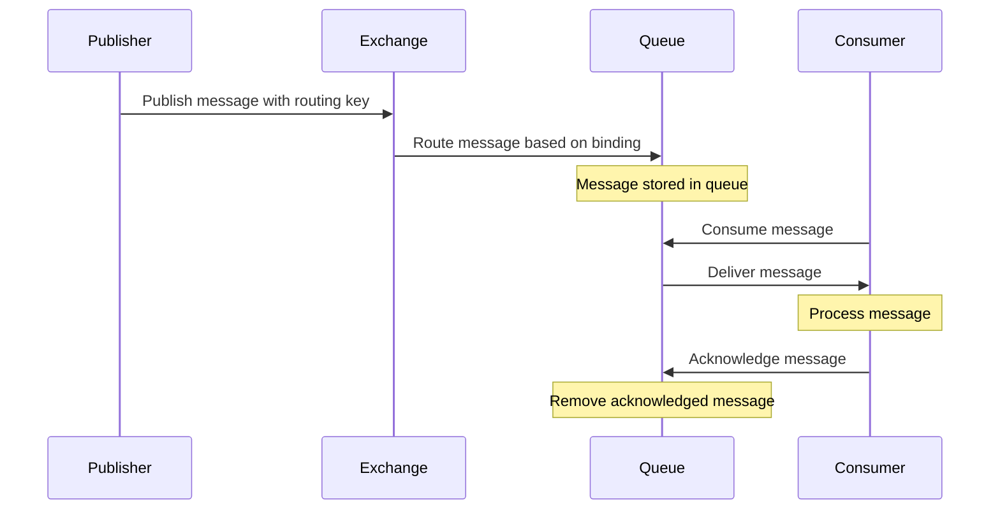
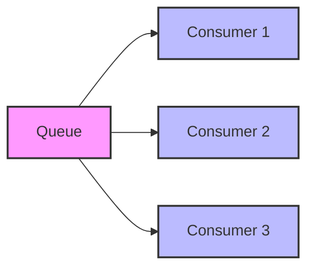

# RabbitMQ Consuming

## Introduction

In messaging systems like RabbitMQ, consuming is the process of receiving and processing messages from a queue. After publishers have sent messages to exchanges and these messages have been routed to queues, consumers pick up these messages for processing. This tutorial focuses on how to implement consumers in RabbitMQ, which is a crucial part of any message-driven architecture.

Consuming messages in RabbitMQ involves:
- Connecting to the RabbitMQ server
- Creating a channel
- Declaring a queue (or using an existing one)
- Setting up a consumer that listens for messages
- Processing received messages
- Acknowledging message receipt (when appropriate)

Let's explore these concepts in detail and learn how to implement consumers in different programming languages.

## Basic Message Consumption

### Setting Up a Basic Consumer

To consume messages, you first need to establish a connection to the RabbitMQ server, create a channel, and declare the queue you want to consume from. Here's how to set up a basic consumer in JavaScript (using the `amqplib` package):

```javascript
const amqp = require('amqplib');

async function consumeMessages() {
  try {
    // Connect to RabbitMQ server
    const connection = await amqp.connect('amqp://localhost');
    
    // Create a channel
    const channel = await connection.createChannel();
    
    // Declare the queue to consume from
    const queueName = 'my_queue';
    await channel.assertQueue(queueName, {
      durable: true
    });
    
    console.log(`Waiting for messages from ${queueName}. To exit press CTRL+C`);
    
    // Set up the consumer
    channel.consume(queueName, (message) => {
      if (message !== null) {
        console.log(`Received message: ${message.content.toString()}`);
        
        // Acknowledge the message
        channel.ack(message);
      }
    });
  } catch (error) {
    console.error('Error:', error);
  }
}

consumeMessages();
```

### Understanding the Code

1. We first establish a connection to RabbitMQ server (in this case, running on localhost).
2. We create a channel, which is the primary interface for interacting with RabbitMQ.
3. We declare the queue we want to consume from. It's a good practice to declare the queue in the consumer as well, in case the consumer starts before the publisher.
4. We set up the consumer using `channel.consume()`, which takes a queue name and a callback function that will be executed whenever a message is received.
5. Inside the callback, we process the message and acknowledge it using `channel.ack()`.

### Message Acknowledgment

Message acknowledgment is a critical concept in RabbitMQ. When a consumer receives a message, RabbitMQ marks it as "delivered" but keeps the message in the queue until the consumer acknowledges it. This prevents messages from being lost if a consumer crashes while processing a message.

There are three acknowledgment modes:

1. **Automatic acknowledgment** (`{ noAck: true }`): Messages are automatically acknowledged when they are delivered.
2. **Manual acknowledgment** (`channel.ack(message)`): The consumer explicitly acknowledges a message after processing it.
3. **Negative acknowledgment** (`channel.nack(message)`): The consumer rejects a message, telling RabbitMQ to either discard it or requeue it.

Here's how to set up a consumer with automatic acknowledgment:

```javascript
channel.consume(queueName, (message) => {
  console.log(`Received message: ${message.content.toString()}`);
  // No need to acknowledge manually
}, { noAck: true });
```

And here's how to use negative acknowledgment to requeue a message:

```javascript
channel.consume(queueName, (message) => {
  try {
    // Process message
    console.log(`Received message: ${message.content.toString()}`);
    
    // Acknowledge successful processing
    channel.ack(message);
  } catch (error) {
    // Requeue the message if processing fails
    console.error('Error processing message:', error);
    channel.nack(message, false, true); // The third parameter 'true' means requeue
  }
});
```

## Message Consumption Patterns

### Consumer Prefetch (Quality of Service)

By default, RabbitMQ will send messages to consumers as quickly as possible. This can lead to uneven distribution if some consumers process messages faster than others. To ensure fair distribution, you can set a prefetch limit:

```javascript
// Only send one message at a time to this consumer
channel.prefetch(1);

channel.consume(queueName, (message) => {
  console.log(`Received message: ${message.content.toString()}`);
  
  // Simulate some processing time
  setTimeout(() => {
    channel.ack(message);
    console.log('Processed and acknowledged message');
  }, 1000);
});
```

This ensures that a consumer won't receive a new message until it has finished processing and acknowledged the previous one.

### Consumer Priority

In RabbitMQ 3.8.0 and later, you can assign priorities to consumers:

```javascript
channel.consume(queueName, (message) => {
  console.log('High-priority consumer received message');
  channel.ack(message);
}, {
  consumerTag: 'high-priority-consumer',
  priority: 10
});
```

Higher priority consumers receive messages before lower priority ones when messages are available.

## Advanced Consumption Techniques

### Dead Letter Exchanges

If a message can't be processed after several attempts, it can be sent to a "dead letter exchange" rather than being lost:

```javascript
// Declare the main queue with dead-letter configuration
await channel.assertQueue(queueName, {
  durable: true,
  arguments: {
    'x-dead-letter-exchange': 'dead.letter.exchange',
    'x-dead-letter-routing-key': 'dead.letter.key'
  }
});

// Set up the consumer
channel.consume(queueName, (message) => {
  try {
    // Attempt to process message
    if (someCondition) {
      throw new Error('Processing failed');
    }
    
    console.log(`Successfully processed: ${message.content.toString()}`);
    channel.ack(message);
  } catch (error) {
    // Reject the message without requeuing - will send to dead letter exchange
    console.error('Failed to process message:', error);
    channel.nack(message, false, false);
  }
});
```

### Message TTL and Expiration

You can set a Time-To-Live (TTL) for messages or queues to automatically remove old messages:

```javascript
// Declare a queue with message TTL of 60 seconds
await channel.assertQueue(queueName, {
  durable: true,
  arguments: {
    'x-message-ttl': 60000 // 60 seconds in milliseconds
  }
});
```

### Consumer Cancellation

Sometimes you need to stop consuming messages temporarily or permanently:

```javascript
const consumerTag = 'my-consumer';

// Start consuming with a specific consumer tag
channel.consume(queueName, (message) => {
  console.log(`Received message: ${message.content.toString()}`);
  channel.ack(message);
}, { consumerTag });

// Later, cancel the consumer
setTimeout(() => {
  channel.cancel(consumerTag).then(() => {
    console.log('Consumer cancelled');
  });
}, 10000);
```

## Visualizing the Consumption Process

Let's use a diagram to visualize the entire message consumption process:



## Practical Example: Building a Task Processor

Let's build a practical example of a task processing system where tasks are published to a queue and processed by workers. This is a common pattern in web applications for handling background jobs.

First, let's set up our task publisher:

```javascript
// task_publisher.js
const amqp = require('amqplib');

async function publishTask(task) {
  const connection = await amqp.connect('amqp://localhost');
  const channel = await connection.createChannel();
  
  const queueName = 'task_queue';
  await channel.assertQueue(queueName, { durable: true });
  
  const message = JSON.stringify(task);
  channel.sendToQueue(queueName, Buffer.from(message), {
    persistent: true,
    headers: {
      'task_type': task.type
    }
  });
  
  console.log(`Task sent: ${message}`);
  
  setTimeout(() => {
    connection.close();
  }, 500);
}

// Example usage
publishTask({
  type: 'image_resize',
  data: {
    imageId: 123,
    width: 800,
    height: 600
  }
});
```

Now, let's implement our task consumer:

```javascript
// task_worker.js
const amqp = require('amqplib');

async function startWorker() {
  const connection = await amqp.connect('amqp://localhost');
  const channel = await connection.createChannel();
  
  const queueName = 'task_queue';
  await channel.assertQueue(queueName, { durable: true });
  
  // Only process one task at a time
  channel.prefetch(1);
  
  console.log('Worker started, waiting for tasks...');
  
  channel.consume(queueName, async (message) => {
    if (message !== null) {
      try {
        const task = JSON.parse(message.content.toString());
        console.log(`Received task: ${JSON.stringify(task)}`);
        
        // Get task type from headers
        const taskType = message.properties.headers.task_type;
        
        // Process based on task type
        switch (taskType) {
          case 'image_resize':
            await processImageResize(task.data);
            break;
          case 'report_generation':
            await generateReport(task.data);
            break;
          default:
            console.log(`Unknown task type: ${taskType}`);
        }
        
        console.log('Task completed successfully');
        channel.ack(message);
      } catch (error) {
        console.error('Error processing task:', error);
        // Nack and requeue the message if it's a temporary failure
        channel.nack(message, false, true);
      }
    }
  });
}

async function processImageResize(data) {
  console.log(`Resizing image ${data.imageId} to ${data.width}x${data.height}`);
  // Simulate image processing time
  await new Promise(resolve => setTimeout(resolve, 2000));
  console.log('Image resized successfully');
}

async function generateReport(data) {
  console.log(`Generating report for ${data.reportType}`);
  // Simulate report generation time
  await new Promise(resolve => setTimeout(resolve, 3000));
  console.log('Report generated successfully');
}

startWorker();
```

To run this example:

1. Start RabbitMQ server
2. Run the worker in one terminal: `node task_worker.js`
3. Run the publisher in another terminal: `node task_publisher.js`

The worker will receive the task, process it based on its type, and acknowledge it when done.

## Consumer in Different Languages

RabbitMQ supports multiple programming languages. Here's how to set up a consumer in Python using the `pika` library:

```python
import pika
import json
import time

def callback(ch, method, properties, body):
    print(f" [x] Received {body.decode()}")
    # Simulate processing time
    time.sleep(1)
    print(" [x] Done")
    # Acknowledge the message
    ch.basic_ack(delivery_tag=method.delivery_tag)

def main():
    # Connect to RabbitMQ
    connection = pika.BlockingConnection(pika.ConnectionParameters('localhost'))
    channel = connection.channel()
    
    # Declare the queue
    queue_name = 'task_queue'
    channel.queue_declare(queue=queue_name, durable=True)
    
    # Set prefetch count
    channel.basic_qos(prefetch_count=1)
    
    # Set up the consumer
    channel.basic_consume(queue=queue_name, on_message_callback=callback)
    
    print(' [*] Waiting for messages. To exit press CTRL+C')
    channel.start_consuming()

if __name__ == '__main__':
    try:
        main()
    except KeyboardInterrupt:
        print('Interrupted')
```

And here's a consumer in Java using the RabbitMQ Java client:

```java
import com.rabbitmq.client.*;

public class Worker {
    private final static String QUEUE_NAME = "task_queue";

    public static void main(String[] argv) throws Exception {
        ConnectionFactory factory = new ConnectionFactory();
        factory.setHost("localhost");
        Connection connection = factory.newConnection();
        Channel channel = connection.createChannel();

        channel.queueDeclare(QUEUE_NAME, true, false, false, null);
        System.out.println(" [*] Waiting for messages. To exit press CTRL+C");

        // Accept only one unacknowledged message at a time
        channel.basicQos(1);

        DeliverCallback deliverCallback = (consumerTag, delivery) -> {
            String message = new String(delivery.getBody(), "UTF-8");

            System.out.println(" [x] Received '" + message + "'");
            try {
                doWork(message);
            } finally {
                System.out.println(" [x] Done");
                channel.basicAck(delivery.getEnvelope().getDeliveryTag(), false);
            }
        };
        
        channel.basicConsume(QUEUE_NAME, false, deliverCallback, consumerTag -> { });
    }

    private static void doWork(String task) {
        try {
            Thread.sleep(1000); // Simulate work
        } catch (InterruptedException e) {
            Thread.currentThread().interrupt();
        }
    }
}
```

## Common Consumer Patterns

### Competing Consumers Pattern

The competing consumers pattern involves multiple consumers reading from the same queue. This pattern helps distribute workload and improves throughput:



To implement this pattern, simply start multiple instances of your consumer application.

### Content-Based Routing

Content-based routing involves consuming messages based on their content or properties:

```javascript
channel.consume(queueName, (message) => {
  if (message !== null) {
    const content = JSON.parse(message.content.toString());
    const priority = message.properties.headers.priority || 'normal';
    
    if (priority === 'high') {
      console.log('Processing high priority message immediately');
      // Process high priority message
    } else {
      console.log('Queuing normal priority message for batch processing');
      // Queue for batch processing
    }
    
    channel.ack(message);
  }
});
```

## Error Handling and Resilience

### Connection Recovery

In production environments, you need to handle connection failures:

```javascript
const amqp = require('amqplib');

async function startConsumer() {
  let connection;
  let channel;
  
  try {
    connection = await amqp.connect('amqp://localhost');
    
    connection.on('error', (err) => {
      console.error('Connection error:', err);
      retryConnection();
    });
    
    connection.on('close', () => {
      console.warn('Connection closed, trying to reconnect...');
      retryConnection();
    });
    
    channel = await connection.createChannel();
    // ... rest of consumer setup
  } catch (error) {
    console.error('Initial connection error:', error);
    retryConnection();
  }
  
  function retryConnection() {
    console.log('Trying to reconnect in 5 seconds...');
    setTimeout(startConsumer, 5000);
  }
}

startConsumer();
```

### Message Processing Retries

When processing a message fails, you might want to retry a few times before giving up:

```javascript
channel.consume(queueName, async (message) => {
  if (message !== null) {
    const retryCount = (message.properties.headers.retryCount || 0);
    
    try {
      await processMessage(message.content);
      channel.ack(message);
    } catch (error) {
      if (retryCount < 3) {
        console.log(`Processing failed, retrying (${retryCount + 1}/3)`);
        // Nack and requeue with updated retry count
        channel.nack(message, false, false); // Don't requeue
        
        // Republish with incremented retry count
        channel.sendToQueue(queueName, message.content, {
          persistent: true,
          headers: {
            ...message.properties.headers,
            retryCount: retryCount + 1
          }
        });
      } else {
        console.error('Processing failed after 3 attempts, sending to dead letter queue');
        channel.nack(message, false, false); // Don't requeue
      }
    }
  }
});
```

## Performance Considerations

### Batch Processing

For performance, you can process messages in batches:

```javascript
let messageBuffer = [];
const MAX_BATCH_SIZE = 10;
const MAX_WAIT_TIME = 5000; // 5 seconds

let batchTimer = null;

channel.consume(queueName, (message) => {
  if (message !== null) {
    messageBuffer.push({
      content: message.content,
      message: message
    });
    
    // Process immediately if we've reached max batch size
    if (messageBuffer.length >= MAX_BATCH_SIZE) {
      processBatch();
    } else if (!batchTimer) {
      // Start timer for processing if not already running
      batchTimer = setTimeout(processBatch, MAX_WAIT_TIME);
    }
  }
});

async function processBatch() {
  if (batchTimer) {
    clearTimeout(batchTimer);
    batchTimer = null;
  }
  
  if (messageBuffer.length === 0) return;
  
  const currentBatch = [...messageBuffer];
  messageBuffer = [];
  
  console.log(`Processing batch of ${currentBatch.length} messages`);
  
  try {
    // Process the batch
    await processBatchItems(currentBatch.map(item => item.content));
    
    // Acknowledge all messages in the batch
    currentBatch.forEach(item => {
      channel.ack(item.message);
    });
    
    console.log('Batch processing complete');
  } catch (error) {
    console.error('Batch processing failed:', error);
    // Nack all messages in the batch, requeue them
    currentBatch.forEach(item => {
      channel.nack(item.message, false, true);
    });
  }
}
```

### Consumer Thread Pools

In languages like Java, you can use thread pools to process messages concurrently:

```java
import java.util.concurrent.ExecutorService;
import java.util.concurrent.Executors;

// ...

// Create a thread pool with 5 worker threads
ExecutorService executorService = Executors.newFixedThreadPool(5);

DeliverCallback deliverCallback = (consumerTag, delivery) -> {
    String message = new String(delivery.getBody(), "UTF-8");
    
    // Submit task to thread pool
    executorService.submit(() -> {
        try {
            System.out.println(" [x] Received '" + message + "'");
            // Process message
            doWork(message);
            
            // Acknowledge after processing is complete
            channel.basicAck(delivery.getEnvelope().getDeliveryTag(), false);
        } catch (Exception e) {
            System.err.println(" [x] Error processing message: " + e.getMessage());
            try {
                // Negative acknowledgment, requeue the message
                channel.basicNack(delivery.getEnvelope().getDeliveryTag(), false, true);
            } catch (IOException ioException) {
                ioException.printStackTrace();
            }
        }
    });
};

channel.basicConsume(QUEUE_NAME, false, deliverCallback, consumerTag -> { });
```

## Monitoring and Logging

Proper monitoring is essential for production RabbitMQ consumers:

```javascript
// Track message processing times
channel.consume(queueName, (message) => {
  if (message !== null) {
    const startTime = Date.now();
    const messageId = message.properties.messageId || 'unknown';
    
    console.log(`[${new Date().toISOString()}] Starting to process message ${messageId}`);
    
    try {
      // Process message
      processMessage(message.content);
      
      const processingTime = Date.now() - startTime;
      console.log(`[${new Date().toISOString()}] Message ${messageId} processed in ${processingTime}ms`);
      
      channel.ack(message);
    } catch (error) {
      const processingTime = Date.now() - startTime;
      console.error(`[${new Date().toISOString()}] Message ${messageId} failed after ${processingTime}ms:`, error);
      channel.nack(message, false, true);
    }
  }
});

function processMessage(content) {
  // Actual message processing logic
}
```

## Summary

In this tutorial, we've covered the essential aspects of consuming messages from RabbitMQ:

1. **Basic Message Consumption**: How to set up a connection, channel, and consumer.
2. **Message Acknowledgment**: Different ways to acknowledge messages (auto, manual, negative).
3. **Consumption Patterns**: Prefetch settings, consumer priority, and batch processing.
4. **Advanced Techniques**: Dead letter exchanges, TTL, and consumer cancellation.
5. **Error Handling**: Implementing retries and connection recovery.
6. **Performance Optimization**: Batching and thread pools for efficient processing.
7. **Monitoring**: Tracking message processing for better observability.

Understanding these concepts will help you build robust, scalable, and efficient message-processing systems with RabbitMQ.

## Additional Resources

- [RabbitMQ Official Documentation](https://www.rabbitmq.com/documentation.html)
- [RabbitMQ Consumer Prefetch](https://www.rabbitmq.com/consumer-prefetch.html)
- [RabbitMQ Dead Letter Exchanges](https://www.rabbitmq.com/dlx.html)
- [RabbitMQ Consumer Priorities](https://www.rabbitmq.com/consumer-priority.html)

## Exercises

1. **Basic Consumer**: Create a simple consumer that listens to a queue and logs received messages.
2. **Retry Logic**: Implement a consumer with retry logic that attempts to process a message three times before sending it to a dead letter queue.
3. **Work Queue**: Create a work queue system with multiple consumers that fairly distributes tasks.
4. **Priority Processing**: Implement a system that processes messages with different priorities.
5. **Batch Processor**: Build a consumer that collects messages into batches for more efficient processing.