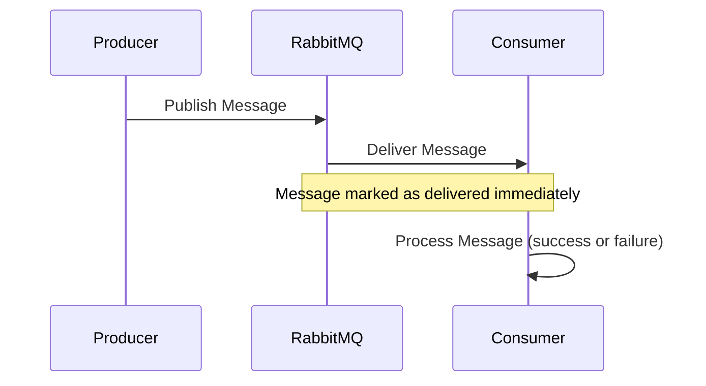
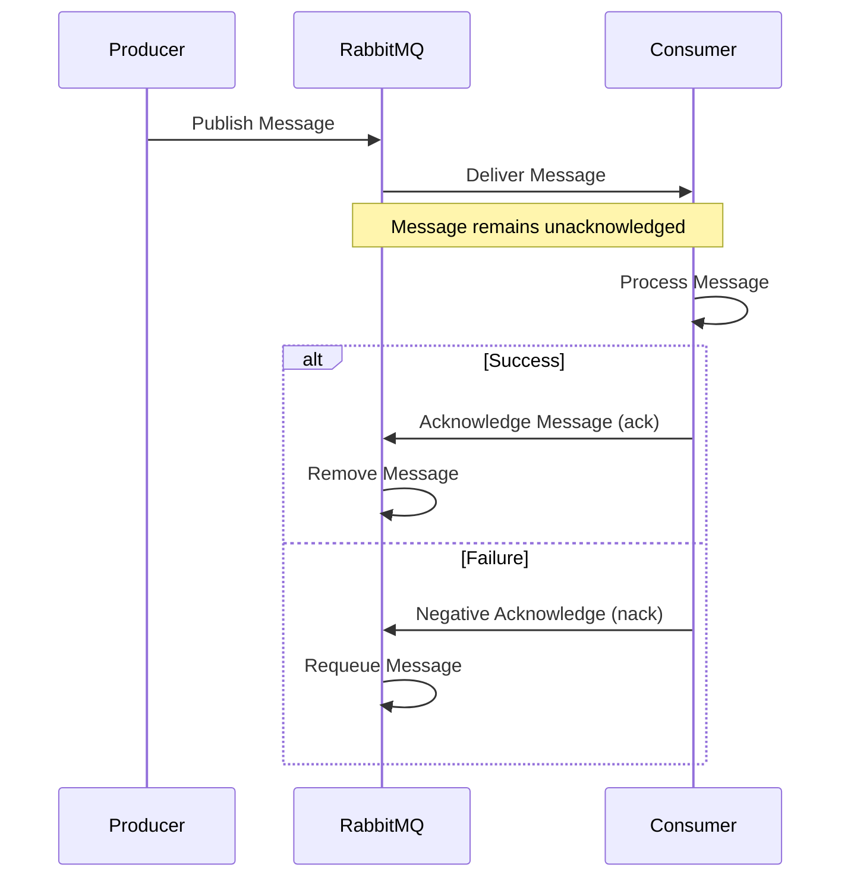
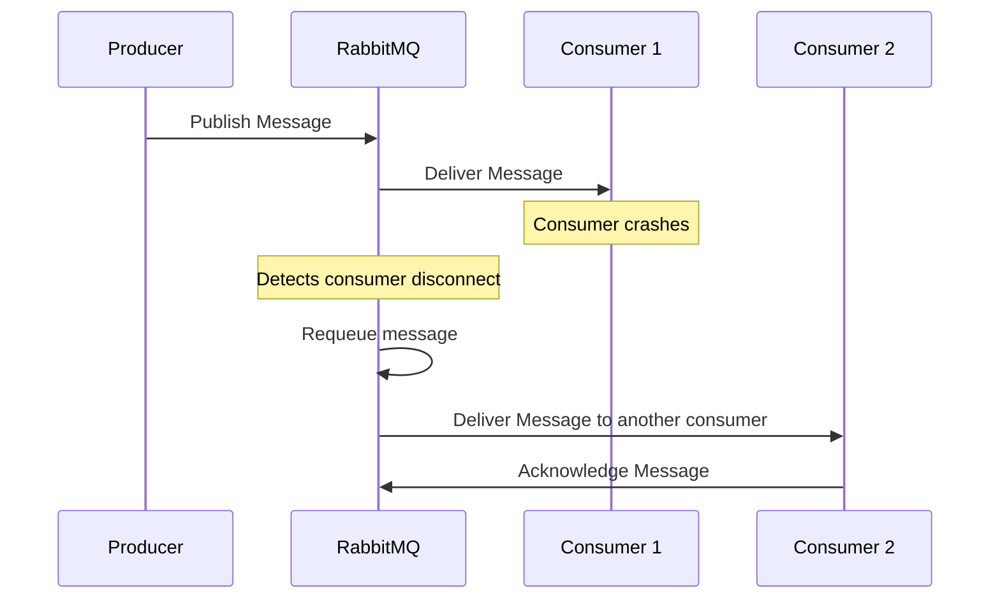

# RabbitMQ Acknowledgements

## Introduction

Message acknowledgement is a critical concept in RabbitMQ that ensures reliable message delivery in distributed systems. When a consumer receives a message from RabbitMQ, the broker needs to know whether the message was processed successfully or not. This is where acknowledgements come in - they provide a feedback mechanism from consumers to the broker, enabling RabbitMQ to make informed decisions about message handling.

In this guide, we'll explore how RabbitMQ acknowledgements work, why they're essential for building reliable messaging systems, and how to implement different acknowledgement strategies in your applications.

## Why Acknowledgements Matter

Imagine sending important messages without knowing if they've been received and processed correctly. In distributed systems, this uncertainty can lead to data loss or duplicate processing. Here's why acknowledgements are critical:

1. **Message Delivery Guarantee**: Without acknowledgements, RabbitMQ has no way of knowing if a message was successfully processed.
2. **Failure Handling**: If a consumer crashes during message processing, acknowledgements help RabbitMQ decide whether to requeue the message.
3. **Load Management**: Acknowledgements prevent overwhelming consumers by controlling how many unacknowledged messages are in flight.

## Basic Acknowledgement Concepts

### Message Acknowledgement Modes

RabbitMQ offers three main acknowledgement modes:

1. **Auto Acknowledgement** (Fire and Forget)
2. **Manual Acknowledgement** (Explicit Ack/Nack)
3. **Transaction-Based Acknowledgement** (For advanced use cases)

Let's understand each mode with examples.

## Auto Acknowledgement Mode

In auto acknowledgement mode, RabbitMQ assumes that a message is successfully processed as soon as it's delivered to the consumer. This is the simplest but least reliable method.



### Example: Auto Acknowledgement in JavaScript with amqplib

```javascript
const amqp = require('amqplib');

async function consumeMessages() {
  try {
    // Connect to RabbitMQ
    const connection = await amqp.connect('amqp://localhost');
    const channel = await connection.createChannel();
    
    const queue = 'task_queue';
    await channel.assertQueue(queue, { durable: true });
    
    console.log(' [*] Waiting for messages. To exit press CTRL+C');
    
    // Set auto acknowledgement to true (second parameter)
    channel.consume(queue, (msg) => {
      console.log(` [x] Received ${msg.content.toString()}`);
      
      // Process the message (no explicit acknowledgement needed)
      console.log(' [x] Done');
    }, { noAck: true }); // true means auto acknowledgement
  } catch (error) {
    console.error('Error:', error);
  }
}

consumeMessages();
```

**When to use auto acknowledgement:**
- For non-critical messages where occasional loss is acceptable
- When processing is guaranteed to be quick and unlikely to fail
- For high-throughput scenarios where performance is more important than reliability

**Caution:** If your consumer crashes while processing a message, that message will be lost forever since RabbitMQ already marked it as acknowledged!

## Manual Acknowledgement Mode

In manual acknowledgement mode, the consumer must explicitly tell RabbitMQ when it has successfully processed a message. This gives you more control and reliability.



### Example: Manual Acknowledgement in Python with pika

```python
import pika
import time

connection = pika.BlockingConnection(pika.ConnectionParameters('localhost'))
channel = connection.channel()

channel.queue_declare(queue='task_queue', durable=True)
print(' [*] Waiting for messages. To exit press CTRL+C')

def callback(ch, method, properties, body):
    print(f" [x] Received {body.decode()}")
    
    # Simulate processing time
    time.sleep(body.count(b'.'))
    
    print(" [x] Done")
    
    # Manual acknowledgement
    ch.basic_ack(delivery_tag=method.delivery_tag)

# Set auto acknowledgement to False (noAck=False is the default)
channel.basic_consume(queue='task_queue', on_message_callback=callback)

channel.start_consuming()
```

### Key Methods for Manual Acknowledgement

In manual acknowledgement mode, you have several options to control message handling:

#### 1. Basic Acknowledge (ack)

Use this when message processing is successful:

```javascript
// JavaScript example
channel.ack(msg);

// Python example
channel.basic_ack(delivery_tag=method.delivery_tag)
```

#### 2. Basic Negative Acknowledge (nack)

Use this when message processing fails:

```javascript
// JavaScript example
// Parameters: message, allUpTo, requeue
channel.nack(msg, false, true);  // Requeue the message

// Python example
channel.basic_nack(delivery_tag=method.delivery_tag, multiple=False, requeue=True)
```

#### 3. Basic Reject

Similar to nack but with fewer options:

```javascript
// JavaScript example
// Parameters: message, requeue
channel.reject(msg, true);  // Requeue the message

// Python example
channel.basic_reject(delivery_tag=method.delivery_tag, requeue=True)
```

## Multiple Acknowledgements

For efficiency, RabbitMQ allows acknowledging multiple messages at once:

```javascript
// JavaScript example
// Acknowledge all messages up to and including this one
channel.ack(msg, true);

// Python example
channel.basic_ack(delivery_tag=method.delivery_tag, multiple=True)
```

This is useful when processing messages in batches.

## Prefetch Count and Acknowledgements

The prefetch count controls how many unacknowledged messages a consumer can have at once. This is critical for load balancing and preventing consumer overload.

```javascript
// JavaScript example
channel.prefetch(1);

// Python example
channel.basic_qos(prefetch_count=1)
```

Setting prefetch to 1 ensures that RabbitMQ only sends one message at a time to a consumer and waits for an acknowledgement before sending the next one. This creates a fair dispatch system where busy consumers won't get overloaded.

### Example: Complete Consumer with Prefetch and Manual Ack in Java

```java
import com.rabbitmq.client.*;

public class Worker {
    private final static String QUEUE_NAME = "task_queue";

    public static void main(String[] argv) throws Exception {
        ConnectionFactory factory = new ConnectionFactory();
        factory.setHost("localhost");
        Connection connection = factory.newConnection();
        Channel channel = connection.createChannel();

        channel.queueDeclare(QUEUE_NAME, true, false, false, null);
        System.out.println(" [*] Waiting for messages. To exit press CTRL+C");

        // Set prefetch count to 1
        channel.basicQos(1);

        DeliverCallback deliverCallback = (consumerTag, delivery) -> {
            String message = new String(delivery.getBody(), "UTF-8");
            System.out.println(" [x] Received '" + message + "'");
            
            try {
                doWork(message);
            } finally {
                System.out.println(" [x] Done");
                // Manual acknowledgement
                channel.basicAck(delivery.getEnvelope().getDeliveryTag(), false);
            }
        };
        
        // Auto-ack is set to false
        channel.basicConsume(QUEUE_NAME, false, deliverCallback, consumerTag -> { });
    }

    private static void doWork(String task) {
        for (char ch : task.toCharArray()) {
            if (ch == '.') {
                try {
                    Thread.sleep(1000);
                } catch (InterruptedException e) {
                    Thread.currentThread().interrupt();
                }
            }
        }
    }
}
```

## Handling Consumer Failures

When a consumer crashes, RabbitMQ needs to know what to do with unacknowledged messages. There are several strategies:

### 1. Requeue on Consumer Disconnect

By default, when a consumer disconnects without acknowledging a message, RabbitMQ will requeue that message:



### 2. Dead Letter Exchanges (DLX)

For messages that can't be processed after multiple attempts, you can use a Dead Letter Exchange:

```javascript
// JavaScript example setting up a queue with DLX
channel.assertQueue('task_queue', {
  durable: true,
  deadLetterExchange: 'dlx',
  deadLetterRoutingKey: 'failed-tasks'
});
```

### 3. Negative Acknowledgement with No Requeue

If you determine a message can't be processed, you can reject it without requeuing:

```javascript
// JavaScript example - do not requeue
channel.nack(msg, false, false);

// Python example
channel.basic_nack(delivery_tag=method.delivery_tag, multiple=False, requeue=False)
```

## Best Practices for Acknowledgements

1. **Always use manual acknowledgements for critical messages**
2. **Acknowledge as soon as processing is complete**
3. **Set appropriate prefetch values** to balance throughput and reliability
4. **Implement proper error handling** before acknowledging
5. **Use DLX for messages that can't be processed** after several attempts
6. **Keep track of message state** within your consumer applications
7. **Consider message idempotency** for messages that might be delivered multiple times

## Real-World Example: Order Processing System

Let's build a complete example of an order processing system using manual acknowledgements:

### Producer (Order Submission)

```javascript
// order_producer.js
const amqp = require('amqplib');

async function submitOrder(orderData) {
  try {
    const connection = await amqp.connect('amqp://localhost');
    const channel = await connection.createChannel();
    
    const exchange = 'orders';
    const routingKey = 'new.order';
    
    await channel.assertExchange(exchange, 'topic', { durable: true });
    
    const order = {
      id: orderData.id,
      customer: orderData.customer,
      items: orderData.items,
      total: orderData.total,
      timestamp: new Date().toISOString()
    };
    
    channel.publish(
      exchange, 
      routingKey, 
      Buffer.from(JSON.stringify(order)), 
      { persistent: true }
    );
    
    console.log(`[x] Sent order ${order.id}`);
    
    setTimeout(() => {
      connection.close();
    }, 500);
  } catch (error) {
    console.error('Error in order submission:', error);
  }
}

// Example usage
submitOrder({
  id: '12345',
  customer: 'John Doe',
  items: [
    { name: 'Widget A', quantity: 2, price: 19.99 },
    { name: 'Widget B', quantity: 1, price: 29.99 }
  ],
  total: 69.97
});
```

### Consumer (Order Processor)

```javascript
// order_processor.js
const amqp = require('amqplib');

async function processOrders() {
  try {
    const connection = await amqp.connect('amqp://localhost');
    const channel = await connection.createChannel();
    
    // Setup exchanges and queues
    const exchange = 'orders';
    const queue = 'order_processing';
    const routingKey = 'new.order';
    const deadLetterExchange = 'orders.dlx';
    
    // Setup dead-letter exchange for failed orders
    await channel.assertExchange(deadLetterExchange, 'fanout', { durable: true });
    await channel.assertQueue('failed_orders', { durable: true });
    await channel.bindQueue('failed_orders', deadLetterExchange, '');
    
    // Setup main queue with dead-letter configuration
    await channel.assertExchange(exchange, 'topic', { durable: true });
    await channel.assertQueue(queue, { 
      durable: true,
      deadLetterExchange: deadLetterExchange
    });
    
    await channel.bindQueue(queue, exchange, routingKey);
    
    // Set prefetch to limit unacknowledged messages
    channel.prefetch(1);
    
    console.log(' [*] Waiting for orders. To exit press CTRL+C');
    
    channel.consume(queue, async (msg) => {
      if (!msg) return;
      
      const order = JSON.parse(msg.content.toString());
      console.log(`[x] Received order: ${order.id}`);
      
      try {
        // Process the order (could be async)
        await processOrder(order);
        
        // If successful, acknowledge the message
        channel.ack(msg);
        console.log(`[✓] Order ${order.id} processed successfully`);
      } catch (error) {
        console.error(`[×] Error processing order ${order.id}:`, error.message);
        
        // Check if this is a redelivered message
        if (msg.fields.redelivered) {
          console.log(`[!] Order ${order.id} failed multiple times, sending to dead-letter queue`);
          // Reject without requeue - will go to the DLX
          channel.reject(msg, false);
        } else {
          console.log(`[!] Requeuing order ${order.id} for retry`);
          // Negative ack with requeue
          channel.nack(msg, false, true);
        }
      }
    }, { noAck: false }); // Manual acknowledgement mode
  } catch (error) {
    console.error('Connection error:', error);
  }
}

async function processOrder(order) {
  // Simulate processing time
  await new Promise(resolve => setTimeout(resolve, 2000));
  
  // Simulate occasional failures for demonstration
  if (Math.random() < 0.3) {
    throw new Error('Processing failed - payment gateway unavailable');
  }
  
  // Order processing logic would go here
  return true;
}

processOrders();
```

## Summary

Acknowledgements are a fundamental part of RabbitMQ's reliability system. They provide a way for consumers to communicate with the broker about message processing status, ensuring that messages are properly handled even in the face of failures.

To recap the key points:

1. **Auto acknowledgement** is simple but can lead to message loss if consumers crash
2. **Manual acknowledgement** gives you fine-grained control over message processing
3. **Prefetch count** helps balance load across multiple consumers
4. **Negative acknowledgements** (nack) and **reject** allow handling failed processing
5. **Dead Letter Exchanges** provide a way to handle messages that can't be processed

By implementing proper acknowledgement strategies, you can build robust, reliable messaging systems that can recover from failures and ensure that important messages are never lost.

## Exercises

1. Modify the order processing example to implement a retry counter, allowing a specific number of retries before sending to the dead-letter queue.
2. Implement a monitoring system that tracks unacknowledged messages and alerts when they exceed a threshold.
3. Create a recovery system that processes messages from the dead-letter queue, perhaps after a delay.
4. Implement different acknowledgement strategies for different types of messages based on their importance.

## Additional Resources

- [RabbitMQ Official Documentation on Consumer Acknowledgements](https://www.rabbitmq.com/confirms.html)
- [RabbitMQ Dead Letter Exchanges](https://www.rabbitmq.com/dlx.html)
- [Prefetch Settings and Their Impact on Performance](https://www.rabbitmq.com/consumer-prefetch.html)