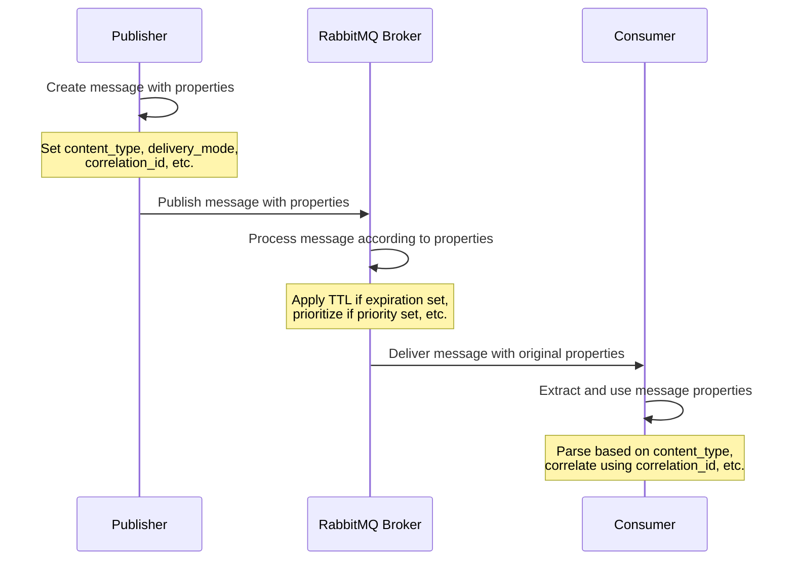

# RabbitMQ Message Properties

## Introduction

When sending messages through RabbitMQ, you're not just limited to the message payload itself. RabbitMQ, through the AMQP protocol, provides a rich set of message properties that allow you to add metadata to your messages. These properties enable you to control message routing, handling, expiration, and much more.

In this tutorial, we'll explore the various message properties available in RabbitMQ, understand their purpose, and learn how to use them effectively in your applications.

## Understanding Message Properties

Message properties in RabbitMQ are essentially metadata attached to each message. They provide additional information about the message that can be used by both the broker and the consuming applications.

When you publish a message to RabbitMQ, you can set various properties that:

1. Influence how the message is handled by the broker
2. Provide context for the consuming application
3. Enable message tracking and correlation
4. Control message expiration and priority

Let's explore the most important message properties and how to use them.

## Core Message Properties

### Content-Type and Content-Encoding

These properties describe the format of the message payload:

- **content_type**: Specifies the MIME type of the message (e.g., `application/json`, `text/plain`)
- **content_encoding**: Specifies the encoding of the message (e.g., `utf-8`, `gzip`)

```javascript
// JavaScript example using amqplib
channel.publish('exchange_name', 'routing_key', Buffer.from(JSON.stringify(data)), {
  contentType: 'application/json',
  contentEncoding: 'utf-8'
});
```

```python
# Python example using pika
properties = pika.BasicProperties(
    content_type='application/json',
    content_encoding='utf-8'
)
channel.basic_publish(
    exchange='exchange_name',
    routing_key='routing_key',
    body=json.dumps(data),
    properties=properties
)
```

Using these properties helps consumers understand how to correctly parse and decode the message payload.

### Message Identification

These properties help identify and track messages:

- **message_id**: A unique identifier for the message
- **correlation_id**: An identifier that correlates requests with responses (crucial for RPC patterns)
- **app_id**: Identifies the application that generated the message

```python
# Python example
properties = pika.BasicProperties(
    message_id=str(uuid.uuid4()),
    correlation_id=request_id,
    app_id='order-service'
)
```

### Routing Properties

These properties can influence how messages are routed:

- **reply_to**: Specifies a queue or address where replies should be sent
- **expiration**: Sets a TTL (Time-To-Live) for the message in milliseconds
- **priority**: Assigns a priority level to the message (0-9, with 9 being highest)

```javascript
// JavaScript example
channel.publish('exchange_name', 'routing_key', Buffer.from(message), {
  replyTo: 'response_queue',
  expiration: '60000',  // 60 seconds
  priority: 5
});
```

## Custom Headers

In addition to the standard properties, AMQP allows you to define custom headers for your messages. This is extremely useful for adding application-specific metadata:

```python
# Python example
properties = pika.BasicProperties(
    headers={
        'source': 'inventory_system',
        'operation': 'stock_update',
        'region': 'us-east'
    }
)
```

Headers are particularly useful when using header exchanges, where messages are routed based on header values.

## Persistence and Delivery Mode

The **delivery_mode** property determines whether messages should be persisted to disk:

- **delivery_mode=1**: Non-persistent (faster but may be lost if broker restarts)
- **delivery_mode=2**: Persistent (slower but survives broker restarts)

```javascript
// JavaScript example
channel.publish('exchange_name', 'routing_key', Buffer.from(message), {
  persistent: true  // Same as delivery_mode=2
});
```

```python
# Python example
properties = pika.BasicProperties(
    delivery_mode=2  # Make message persistent
)
```

## Timestamp and Expiration

These properties manage the temporal aspects of messages:

- **timestamp**: When the message was sent (Unix timestamp)
- **expiration**: How long the message is valid for (in milliseconds)

```python
# Python example
properties = pika.BasicProperties(
    timestamp=int(time.time()),
    expiration='30000'  # Message expires after 30 seconds
)
```

## Message Properties in Action

Let's see a complete example of publishing a message with various properties and then consuming it:

```javascript
// Publisher (JavaScript)
const amqp = require('amqplib');

async function publishMessage() {
  const connection = await amqp.connect('amqp://localhost');
  const channel = await connection.createChannel();
  
  const exchange = 'order_exchange';
  const routingKey = 'new_order';
  const orderData = {
    orderId: '12345',
    items: [
      { productId: 'ABC', quantity: 2 },
      { productId: 'XYZ', quantity: 1 }
    ],
    customerInfo: {
      id: 'CUST-001',
      name: 'John Doe'
    }
  };
  
  await channel.assertExchange(exchange, 'topic', { durable: true });
  
  channel.publish(
    exchange,
    routingKey,
    Buffer.from(JSON.stringify(orderData)),
    {
      contentType: 'application/json',
      contentEncoding: 'utf-8',
      messageId: `order-${Date.now()}`,
      correlationId: 'session-3456',
      appId: 'order-service',
      timestamp: Math.floor(Date.now() / 1000),
      headers: {
        'x-order-source': 'web',
        'x-priority-customer': 'true'
      },
      persistent: true,
      expiration: '86400000'  // 24 hours
    }
  );
  
  console.log('Order message sent!');
  
  setTimeout(() => {
    connection.close();
  }, 500);
}

publishMessage().catch(console.error);
```

```python
# Consumer (Python)
import pika
import json

def callback(ch, method, properties, body):
    print(f"Received message with:")
    print(f"  Content type: {properties.content_type}")
    print(f"  Message ID: {properties.message_id}")
    print(f"  Correlation ID: {properties.correlation_id}")
    print(f"  App ID: {properties.app_id}")
    print(f"  Headers: {properties.headers}")
    print(f"  Timestamp: {properties.timestamp}")
    
    order_data = json.loads(body)
    print(f"Order data: {order_data}")
    
    # Process the order...
    ch.basic_ack(delivery_tag=method.delivery_tag)

connection = pika.BlockingConnection(pika.ConnectionParameters('localhost'))
channel = connection.channel()

exchange = 'order_exchange'
queue = 'order_processing'
routing_key = 'new_order'

channel.exchange_declare(exchange=exchange, exchange_type='topic', durable=True)
channel.queue_declare(queue=queue, durable=True)
channel.queue_bind(exchange=exchange, queue=queue, routing_key=routing_key)

channel.basic_consume(queue=queue, on_message_callback=callback)

print('Waiting for order messages. To exit press CTRL+C')
channel.start_consuming()
```

Output when a message is received:
```
Received message with:
  Content type: application/json
  Message ID: order-1637324567890
  Correlation ID: session-3456
  App ID: order-service
  Headers: {'x-order-source': 'web', 'x-priority-customer': 'true'}
  Timestamp: 1637324567
Order data: {'orderId': '12345', 'items': [{'productId': 'ABC', 'quantity': 2}, {'productId': 'XYZ', 'quantity': 1}], 'customerInfo': {'id': 'CUST-001', 'name': 'John Doe'}}
```

## Real-world Use Cases for Message Properties

### 1. Request-Reply Pattern

Using `correlation_id` and `reply_to` properties for implementing RPC-style communication:

```python
# Client code
def on_response(ch, method, props, body):
    if props.correlation_id == self.corr_id:
        self.response = body

# Generate a unique correlation ID
self.corr_id = str(uuid.uuid4())

# Set up the reply-to queue
result = channel.queue_declare(queue='', exclusive=True)
callback_queue = result.method.queue

# Publish request with correlation_id and reply_to
properties = pika.BasicProperties(
    reply_to=callback_queue,
    correlation_id=self.corr_id,
)
channel.basic_publish(
    exchange='',
    routing_key='rpc_queue',
    properties=properties,
    body=request
)
```

### 2. Message Expiration for Time-Sensitive Data

Using the `expiration` property to automatically discard outdated messages:

```javascript
// Sending a price quote that's only valid for 5 minutes
channel.publish('quotes', 'stock.prices', Buffer.from(JSON.stringify(priceData)), {
  contentType: 'application/json',
  expiration: '300000'  // 5 minutes in milliseconds
});
```

### 3. Message Priority for Critical Messages

Using the `priority` property to process important messages first:

```python
# High priority order from VIP customer
properties = pika.BasicProperties(
    priority=9,
    headers={'customer_type': 'vip'}
)
channel.basic_publish(
    exchange='orders',
    routing_key='new',
    properties=properties,
    body=json.dumps(order_data)
)
```

Note: To use priorities, you must declare the queue with the `x-max-priority` argument:

```python
channel.queue_declare(
    queue='priority_orders',
    arguments={'x-max-priority': 10}
)
```

## Message Properties Flow Diagram



## Best Practices for Message Properties

1. **Always set content_type**: This helps consumers correctly parse the message.
2. **Use correlation_id for request-reply patterns**: Makes it easy to match requests with responses.
3. **Set meaningful message_id values**: Helps with tracing and debugging.
4. **Consider persistence carefully**: Persistent messages (delivery_mode=2) survive broker restarts but impact performance.
5. **Use expiration for time-sensitive data**: Prevents processing of outdated information.
6. **Leverage custom headers for application-specific metadata**: Keeps your message routing flexible.
7. **Use app_id to identify the producer**: Helps with debugging and tracking message sources.

## Common Pitfalls

1. **Over-relying on priorities**: Message priorities can cause unpredictable behavior under high load.
2. **Setting too short expiration times**: If your consumers cannot keep up, messages might expire before processing.
3. **Not handling missing properties**: Always check if properties exist before using them in consumers.
4. **Putting too much data in headers**: Headers are meant for metadata, not bulk data.

## Summary

Message properties are a powerful feature of RabbitMQ that allow you to add metadata and control how messages are handled. They enable patterns like request-reply, message expiration, prioritization, and content type negotiation.

Key properties include:
- **content_type** and **content_encoding** for payload format
- **message_id** and **correlation_id** for message identification and tracking
- **reply_to** for request-reply patterns
- **expiration** for time-limited messages
- **delivery_mode** for persistence control
- Custom **headers** for application-specific metadata

By effectively using message properties, you can build more robust and sophisticated messaging systems that go beyond simple publish-subscribe patterns.

## Additional Resources

- [Official RabbitMQ Message Properties Documentation](https://www.rabbitmq.com/publishers.html#message-properties)
- [AMQP 0-9-1 Protocol Specification](https://www.rabbitmq.com/resources/specs/amqp0-9-1.pdf)
- [Pika Documentation (Python)](https://pika.readthedocs.io/en/stable/modules/spec.html#pika.spec.BasicProperties)
- [amqplib Documentation (JavaScript)](https://www.squaremobius.net/amqp.node/channel_api.html#channel_publish)

## Exercises

1. Create a publisher that sends messages with different priorities and a consumer that processes them in priority order.
2. Implement a request-reply pattern using correlation_id and reply_to properties.
3. Create a message publisher that sets expiration times on messages and observe what happens when they expire.
4. Use custom headers to implement a simple routing mechanism where consumers can filter messages based on header values.