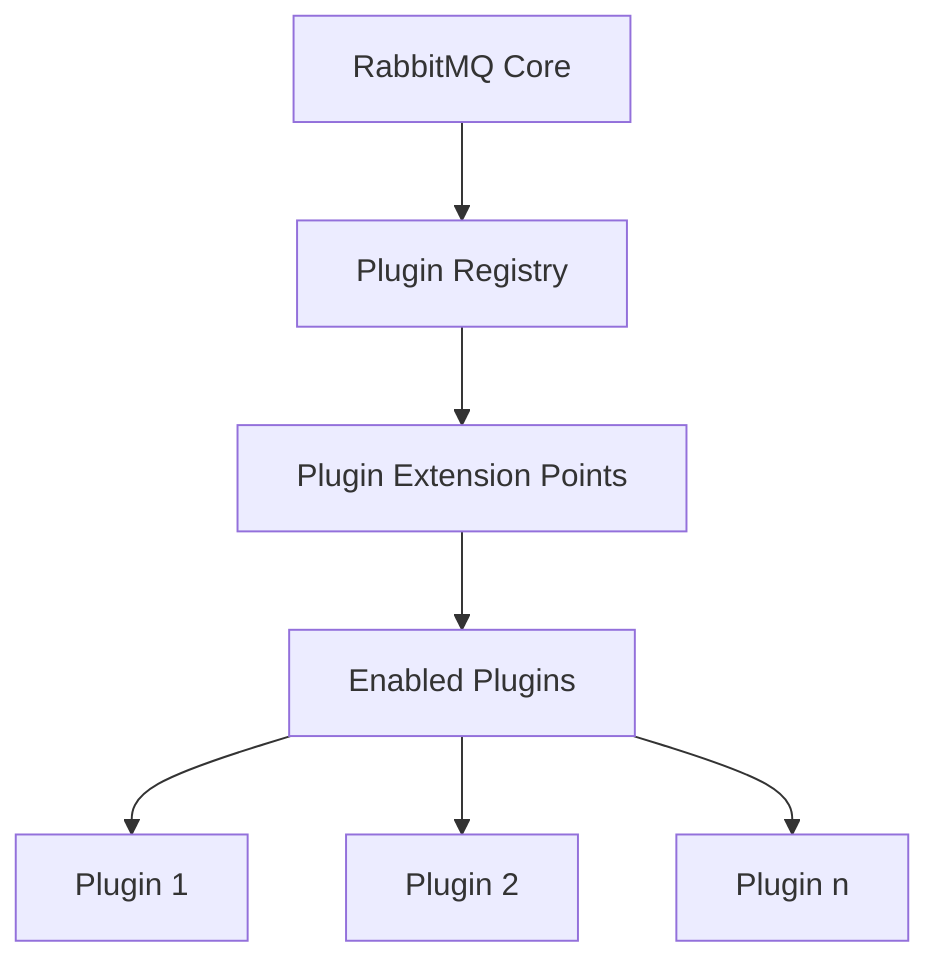

# RabbitMQ Plugin System

## Introduction

RabbitMQ is a powerful open-source message broker that implements the Advanced Message Queuing Protocol (AMQP). One of its greatest strengths is its extensibility through its robust plugin system. This plugin architecture allows you to enhance RabbitMQ's core functionality with additional features without modifying the broker's source code.

In this guide, we'll explore how the RabbitMQ plugin system works, how to manage built-in and community plugins, and even how to create your own custom plugins. By the end, you'll have a solid understanding of how to leverage plugins to tailor RabbitMQ to your specific needs.

## Understanding the Plugin System

RabbitMQ's plugin system is designed around the Erlang application concept, where plugins are essentially Erlang applications that can be loaded into the RabbitMQ broker runtime. This architecture provides several advantages:

- **Modularity**: Functionality can be added or removed without affecting the core system
- **Flexibility**: You can customize your RabbitMQ installation based on your specific requirements
- **Community contribution**: Developers can create and share plugins that benefit the entire community

### How Plugins Work

At its core, a RabbitMQ plugin is an Erlang application that:

1. Registers with the RabbitMQ broker
2. Extends or modifies the broker's behavior through specific extension points
3. Can be enabled or disabled through the RabbitMQ management tools



## Common Built-in Plugins

RabbitMQ comes with several built-in plugins that provide essential functionality. Here are some of the most commonly used ones:

### Management Plugin

The management plugin provides a web-based UI for managing and monitoring your RabbitMQ server.

```bash
# Enable the management plugin
rabbitmq-plugins enable rabbitmq_management

# Output:
# Enabling plugins on node rabbit@localhost:
# rabbitmq_management
# The following plugins have been configured:
#   rabbitmq_management
#   rabbitmq_management_agent
#   rabbitmq_web_dispatch
# Applying plugin configuration to rabbit@localhost...
# Plugin configuration unchanged.
```

After enabling this plugin, you can access the management interface at `http://localhost:15672/` with the default credentials (guest/guest).

### Shovel Plugin

The shovel plugin allows you to reliably move messages from one broker to another.

```bash
# Enable the shovel and shovel management plugins
rabbitmq-plugins enable rabbitmq_shovel rabbitmq_shovel_management

# Output:
# Enabling plugins on node rabbit@localhost:
# rabbitmq_shovel
# rabbitmq_shovel_management
# The following plugins have been configured:
#   rabbitmq_shovel
#   rabbitmq_shovel_management
# Applying plugin configuration to rabbit@localhost...
# Plugin configuration unchanged.
```

### Federation Plugin

The federation plugin enables the forwarding of messages between brokers in a more loosely coupled way than clustering.

```bash
# Enable the federation and federation management plugins
rabbitmq-plugins enable rabbitmq_federation rabbitmq_federation_management

# Output:
# Enabling plugins on node rabbit@localhost:
# rabbitmq_federation
# rabbitmq_federation_management
# The following plugins have been configured:
#   rabbitmq_federation
#   rabbitmq_federation_management
# Applying plugin configuration to rabbit@localhost...
# Plugin configuration unchanged.
```

## Managing Plugins

RabbitMQ provides command-line tools to manage plugins easily. Here are the essential commands:

### Listing Available Plugins

To see all available plugins:

```bash
rabbitmq-plugins list

# Output:
# Listing plugins with pattern ".*" ...
# Configured: E = explicitly enabled; e = implicitly enabled
# | Status: * = running on rabbit@localhost
# |/
# [  ] rabbitmq_amqp1_0                  3.9.13
# [  ] rabbitmq_auth_backend_cache       3.9.13
# [  ] rabbitmq_auth_backend_http        3.9.13
# ...
# [E*] rabbitmq_management              3.9.13
# [e*] rabbitmq_management_agent        3.9.13
# [  ] rabbitmq_mqtt                     3.9.13
# ...
```

### Enabling Plugins

To enable a plugin:

```bash
rabbitmq-plugins enable plugin_name

# Example:
rabbitmq-plugins enable rabbitmq_mqtt
```

You can enable multiple plugins at once:

```bash
rabbitmq-plugins enable rabbitmq_mqtt rabbitmq_stomp
```

### Disabling Plugins

To disable a plugin:

```bash
rabbitmq-plugins disable plugin_name

# Example:
rabbitmq-plugins disable rabbitmq_mqtt
```

### Set Plugin Configuration

To set a specific configuration for all enabled plugins:

```bash
rabbitmq-plugins set plugin1 plugin2 plugin3
```

This command will enable only the specified plugins and disable all others.

## Plugin Locations and Structure

RabbitMQ looks for plugins in specific directories:

1. The `plugins` directory within the RabbitMQ installation
2. Additional directories specified in the `RABBITMQ_PLUGINS_DIR` environment variable

A typical RabbitMQ plugin has the following structure:

```
plugin_name-x.y.z/
├── ebin/
│   ├── plugin_name.app
│   ├── module1.beam
│   ├── module2.beam
│   └── ...
├── priv/
│   └── (static resources)
└── include/
    └── (header files)
```

The `.app` file is particularly important as it contains metadata about the plugin, including its dependencies.

## Creating a Simple Custom Plugin

Let's create a simple custom plugin that logs a message whenever a queue is created. This will help you understand the basics of RabbitMQ plugin development.

### Prerequisites

To develop RabbitMQ plugins, you'll need:

1. Erlang/OTP installed (the same version used by your RabbitMQ installation)
2. RabbitMQ source code (for reference)
3. Basic knowledge of Erlang programming

### Step 1: Set Up Your Project Structure

Create the following directory structure:

```
rabbitmq_queue_logger/
├── src/
│   ├── rabbitmq_queue_logger.erl
│   └── rabbitmq_queue_logger.app.src
└── Makefile
```

### Step 2: Create the Plugin Code

First, let's create the main module file `rabbitmq_queue_logger.erl`:

```erlang
-module(rabbitmq_queue_logger).
-behaviour(rabbit_event_handler).

-export([init/1, handle_event/2, handle_call/2, handle_info/2, terminate/2, code_change/3]).
-export([register/0, unregister/0]).

register() ->
    rabbit_event:add_handler(?MODULE, []).

unregister() ->
    rabbit_event:delete_handler(?MODULE, []).

init([]) ->
    {ok, []}.

handle_event({queue_created, Info}, State) ->
    QueueName = proplists:get_value(name, Info),
    io:format("Queue created: ~p~n", [QueueName]),
    {ok, State};
handle_event(_Event, State) ->
    {ok, State}.

handle_call(_Request, State) ->
    {ok, undefined, State}.

handle_info(_Info, State) ->
    {ok, State}.

terminate(_Reason, _State) ->
    ok.

code_change(_OldVsn, State, _Extra) ->
    {ok, State}.
```

Next, create the application resource file `rabbitmq_queue_logger.app.src`:

```erlang
{application, rabbitmq_queue_logger,
 [{description, "RabbitMQ Queue Logger Plugin"},
  {vsn, "0.1.0"},
  {modules, [rabbitmq_queue_logger]},
  {registered, []},
  {applications, [kernel, stdlib, rabbit]},
  {mod, {rabbit_queue_logger_app, []}},
  {env, []},
  {broker_version_requirements, ["3.8.0", "3.9.0"]}
 ]}.
```

Finally, create the application module `rabbitmq_queue_logger_app.erl`:

```erlang
-module(rabbitmq_queue_logger_app).
-behaviour(application).

-export([start/2, stop/1]).

start(_Type, _Args) ->
    rabbitmq_queue_logger:register(),
    {ok, self()}.

stop(_State) ->
    rabbitmq_queue_logger:unregister(),
    ok.
```

### Step 3: Create a Makefile

Create a simple Makefile to build your plugin:

```makefile
RABBITMQ_HOME=/path/to/rabbitmq

.PHONY: all clean

all: dist

clean:
	rm -rf ebin dist

ebin:
	mkdir -p ebin

dist: ebin
	erlc -o ebin src/*.erl
	cp src/rabbitmq_queue_logger.app.src ebin/rabbitmq_queue_logger.app
	mkdir -p dist/rabbitmq_queue_logger-0.1.0
	cp -r ebin dist/rabbitmq_queue_logger-0.1.0/
	cd dist && zip -r rabbitmq_queue_logger-0.1.0.ez rabbitmq_queue_logger-0.1.0

deploy: dist
	cp dist/rabbitmq_queue_logger-0.1.0.ez $(RABBITMQ_HOME)/plugins/
```

### Step 4: Build and Deploy Your Plugin

Run the following commands:

```bash
# Build the plugin
make

# Deploy to RabbitMQ plugins directory
make deploy
```

### Step 5: Enable Your Plugin

Enable your custom plugin:

```bash
rabbitmq-plugins enable rabbitmq_queue_logger

# Output:
# Enabling plugins on node rabbit@localhost:
# rabbitmq_queue_logger
# The following plugins have been configured:
#   rabbitmq_queue_logger
# Applying plugin configuration to rabbit@localhost...
# Plugin configuration unchanged.
```

Now, whenever a queue is created in your RabbitMQ broker, your plugin will log a message about it.

## Advanced Plugin Development

For more advanced plugin development, you can:

1. **Implement Management Extensions**: Add new pages or features to the Management UI
2. **Create Authentication Mechanisms**: Develop custom authentication and authorization plugins
3. **Develop Exchange Types**: Create custom exchange types with unique routing logic
4. **Implement Protocol Extensions**: Add support for additional messaging protocols

These advanced topics require a deeper understanding of RabbitMQ's internal architecture and Erlang programming, but they allow you to extensively customize your messaging infrastructure.

## Practical Example: Rate Limiting Plugin

Let's look at how you might implement a simple rate-limiting plugin for RabbitMQ. This example demonstrates a practical use case for custom plugins.

First, you would create a module that implements the `rabbit_channel_interceptor` behavior:

```erlang
-module(rabbitmq_rate_limiter).
-behaviour(rabbit_channel_interceptor).

-export([init/1, description/0, intercept/3, applies_to/0]).
-export([start/0, stop/0]).

-define(RATE_LIMIT, 100). % 100 messages per second

start() ->
    rabbit_registry:register(channel_interceptor,
                             <<"rate-limiter">>,
                             ?MODULE).

stop() ->
    rabbit_registry:unregister(channel_interceptor,
                               <<"rate-limiter">>).

init(_Ch) ->
    {ok, #state{last_check = erlang:system_time(milli_seconds),
                message_count = 0}}.

description() ->
    <<"Rate limiting interceptor">>.

applies_to() ->
    ['basic.publish'].

intercept(#'basic.publish'{} = Method, Content, {State = #state{
                                                 last_check = LastCheck,
                                                 message_count = Count},
                                                 VHost}) ->
    Now = erlang:system_time(milli_seconds),
    TimeWindow = 1000, % 1 second in milliseconds
    
    % Reset counter if we're in a new time window
    {NewCount, NewLastCheck} = 
        if Now - LastCheck >= TimeWindow ->
               {1, Now};
           true ->
               {Count + 1, LastCheck}
        end,
    
    % Check if we exceed the rate limit
    if NewCount > ?RATE_LIMIT ->
           Sleep = TimeWindow - (Now - LastCheck),
           timer:sleep(max(1, Sleep)),
           {Method, Content, {State#state{
                                last_check = erlang:system_time(milli_seconds),
                                message_count = 1}, VHost}};
       true ->
           {Method, Content, {State#state{
                                message_count = NewCount,
                                last_check = NewLastCheck}, VHost}}
    end.
```

This is a simplified example, but it demonstrates how a custom plugin can intercept and modify RabbitMQ's core functionality.

## Troubleshooting Plugins

When working with RabbitMQ plugins, you might encounter issues. Here are some common problems and their solutions:

### Plugin Won't Enable

If a plugin won't enable, check:

1. **Dependencies**: Make sure all required plugins are available
2. **Compatibility**: Verify the plugin is compatible with your RabbitMQ version
3. **Permissions**: Ensure you have the right permissions to access the plugins directory

You can get more detailed error information by running:

```bash
rabbitmq-plugins enable plugin_name --verbose
```

### Plugin Crashes

If a plugin is causing the broker to crash:

1. Disable the plugin:
   ```bash
   rabbitmq-plugins disable problematic_plugin
   ```

2. Check the RabbitMQ logs for error messages:
   ```bash
   tail -f /var/log/rabbitmq/rabbit@hostname.log
   ```

### Plugin Performance Issues

If a plugin is causing performance problems:

1. Check if the issue disappears when the plugin is disabled
2. Monitor resource usage with the management plugin
3. Consider using more lightweight alternatives if available

## Summary

The RabbitMQ plugin system is a powerful feature that allows you to extend and customize your message broker to meet your specific requirements. In this guide, we've covered:

- How the RabbitMQ plugin system works
- Managing built-in plugins
- Creating your own custom plugins
- Troubleshooting common plugin issues

By leveraging plugins, you can transform RabbitMQ from a simple message broker into a comprehensive messaging platform tailored to your application's needs.

## Additional Resources

To learn more about RabbitMQ plugins, check out these resources:

- [RabbitMQ Official Plugin Documentation](https://www.rabbitmq.com/plugins.html)
- [RabbitMQ GitHub Repository](https://github.com/rabbitmq/rabbitmq-server)
- [Community Plugins](https://github.com/rabbitmq/rabbitmq-community-plugins)

## Exercises

1. **Basic**: Enable the management and shovel plugins, then use the management UI to set up a simple shovel between two queues.

2. **Intermediate**: Modify the queue logger plugin example to also log when a queue is deleted.

3. **Advanced**: Create a custom plugin that adds a new tab to the management UI showing statistics about message rates per virtual host.

By completing these exercises, you'll gain practical experience with RabbitMQ's plugin system and deepen your understanding of how to extend its functionality.