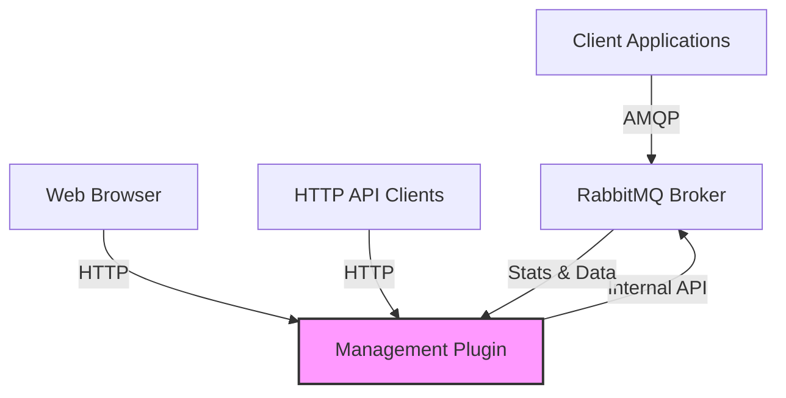

# RabbitMQ Management Plugin

## Introduction

The RabbitMQ Management Plugin is an essential tool that provides a web-based user interface and HTTP API for managing and monitoring your RabbitMQ server. This plugin is particularly valuable for developers and system administrators who need to visualize their message broker's state, perform administrative tasks, and troubleshoot issues without relying solely on command-line tools.

In this guide, we'll explore how to enable and use the Management Plugin, understand its key features, and learn how it can simplify your RabbitMQ administration tasks.

## Enabling the Management Plugin

The Management Plugin comes bundled with RabbitMQ but is not enabled by default. To enable it, you need to run the following command:

```bash
rabbitmq-plugins enable rabbitmq_management
```

After enabling the plugin, you'll need to restart your RabbitMQ server for the changes to take effect:

```bash
# On Linux/macOS
service rabbitmq-server restart

# On Windows
rabbitmq-service.bat stop
rabbitmq-service.bat start
```

Once enabled, you can access the Management UI by opening your browser and navigating to:

```
http://localhost:15672/
```

The default login credentials are:
- Username: `guest`
- Password: `guest`

Note that the `guest` user can only connect from localhost by default for security reasons.

## Key Features of the Management Plugin

### 1. Web-based User Interface

The Management Plugin provides an intuitive web interface that allows you to:

- Monitor queue lengths, message rates, and resource usage
- Manage exchanges, queues, bindings, users, and permissions
- Publish and receive messages for testing purposes
- View and analyze connections and channels
- Access server logs and statistics

Here's a diagram of how the Management Plugin fits into the RabbitMQ architecture:



### 2. HTTP API

Besides the web UI, the Management Plugin also exposes a comprehensive HTTP API that allows you to:

- Programmatically manage your RabbitMQ instance
- Create monitoring and automation scripts
- Integrate RabbitMQ management into your existing tools

Let's look at a simple example of using the HTTP API with curl:

```bash
# List all queues
curl -u guest:guest http://localhost:15672/api/queues

# Create a new queue
curl -u guest:guest -X PUT http://localhost:15672/api/queues/%2F/my-new-queue \
     -H "Content-Type: application/json" \
     -d '{"auto_delete": false, "durable": true}'
```

### 3. User Management

The Management Plugin allows you to create and manage users with different permissions:

```bash
# Using rabbitmqctl to create a new admin user
rabbitmqctl add_user admin strong_password
rabbitmqctl set_user_tags admin administrator
rabbitmqctl set_permissions -p / admin ".*" ".*" ".*"
```

You can also manage users directly from the web UI by navigating to the "Admin" tab.

## Practical Examples

### Example 1: Monitoring Queue Health

One of the most useful aspects of the Management Plugin is the ability to monitor queue health. Let's say you have a system that processes orders, and you want to ensure your order queue isn't backing up.

1. Log in to the Management UI
2. Navigate to the "Queues" tab
3. Look for your queue (e.g., "order_processing")
4. Check the following metrics:
   - Ready: Number of messages ready to be delivered
   - Unacked: Number of messages delivered but not yet acknowledged
   - Total: Total number of messages in the queue
   - Message rates (publish, deliver, acknowledge)

If you notice the queue length growing over time, it might indicate that your consumers aren't keeping up with the producers.

### Example 2: Publishing Test Messages

When developing applications that use RabbitMQ, it's often useful to test your consumers by publishing test messages:

1. In the Management UI, go to the "Exchanges" tab
2. Select the exchange you want to publish to
3. Scroll down to "Publish message"
4. Fill in the routing key and message payload
5. Click "Publish message"

Here's an example of a test message you might publish:

```json
{
  "order_id": "test-123",
  "customer": "Test Customer",
  "items": [
    {"product": "Widget A", "quantity": 2},
    {"product": "Widget B", "quantity": 1}
  ],
  "total": 59.97
}
```

### Example 3: Setting Up Shovel Plugin via Management UI

The Management Plugin makes it easy to configure other plugins like the Shovel Plugin, which moves messages from one queue to another:

1. Go to the "Admin" tab
2. Click on "Shovel Management"
3. Click "Add a new shovel"
4. Configure source and destination parameters:

```
Name: my-shovel
Source:
  URI: amqp://localhost
  Exchange: source_exchange
  Routing Key: #
Destination:
  URI: amqp://remote-host
  Exchange: destination_exchange
```

## Advanced Usage

### Customizing the Management Plugin

You can customize the Management Plugin by modifying its configuration in the RabbitMQ configuration file:

```erlang
# Example: Configure the Management Plugin to listen on a different port
management.listener.port = 12345

# Example: Increase HTTP API request timeout
management.request_timeout = 60000
```

### Setting Up HTTPS for the Management UI

For production environments, it's recommended to set up HTTPS:

```erlang
management.listener.port = 15672
management.listener.ssl = true
management.listener.ssl_opts.cacertfile = /path/to/ca_certificate.pem
management.listener.ssl_opts.certfile = /path/to/server_certificate.pem
management.listener.ssl_opts.keyfile = /path/to/server_key.pem
```

### Monitoring with the Management API

Here's a simple Node.js script that checks queue lengths and alerts if they exceed a threshold:

```javascript
const axios = require('axios');

async function checkQueueLength(queueName, threshold) {
  try {
    // Base64 encode the credentials
    const auth = Buffer.from('guest:guest').toString('base64');
    
    const response = await axios.get(`http://localhost:15672/api/queues/%2F/${queueName}`, {
      headers: { 'Authorization': `Basic ${auth}` }
    });
    
    const messageCount = response.data.messages;
    
    if (messageCount > threshold) {
      console.log(`ALERT: Queue ${queueName} has ${messageCount} messages (threshold: ${threshold})`);
      // Here you could send an actual alert via email, Slack, etc.
    } else {
      console.log(`Queue ${queueName} is healthy: ${messageCount} messages`);
    }
  } catch (error) {
    console.error(`Error checking queue ${queueName}:`, error.message);
  }
}

// Check our critical queues every minute
setInterval(() => {
  checkQueueLength('orders', 1000);
  checkQueueLength('payments', 500);
  checkQueueLength('notifications', 2000);
}, 60000);

// Initial check
checkQueueLength('orders', 1000);
checkQueueLength('payments', 500);
checkQueueLength('notifications', 2000);
```

## Summary

The RabbitMQ Management Plugin is an invaluable tool for anyone working with RabbitMQ. It provides:

- A user-friendly web interface for monitoring and administration
- A comprehensive HTTP API for programmatic access
- Detailed insights into queues, exchanges, and message flows
- Tools for testing and troubleshooting your messaging system

By mastering the Management Plugin, you can significantly improve your ability to manage, monitor, and maintain your RabbitMQ deployment.

## Additional Resources

To further enhance your understanding of the RabbitMQ Management Plugin:

- **Official Documentation**: Visit the [official RabbitMQ Management Plugin documentation](https://www.rabbitmq.com/management.html) for detailed information.
- **HTTP API Documentation**: Explore the [HTTP API reference](https://www.rabbitmq.com/management.html#http-api) for all available endpoints.
- **CLI Tools**: Learn about the [`rabbitmqadmin` command-line tool](https://www.rabbitmq.com/management-cli.html) that comes with the Management Plugin.

## Exercises

To practice your RabbitMQ Management Plugin skills:

1. Enable the plugin and explore each tab in the management UI
2. Create a new virtual host, user, and set appropriate permissions using only the management UI
3. Write a script using the HTTP API to report the message rates for all queues
4. Set up alerts based on queue length thresholds using the data from the HTTP API
5. Publish test messages to an exchange and observe them moving through the system