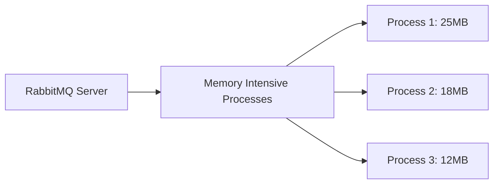

# RabbitMQ Top Plugin

## Introduction

The RabbitMQ Top Plugin is a monitoring tool that provides real-time information about resource usage in your RabbitMQ server, similar to how the Unix/Linux `top` command works for system processes. This plugin helps you identify performance bottlenecks, monitor resource consumption, and troubleshoot issues in your RabbitMQ deployment.

As a messaging broker system, RabbitMQ's performance is critical for many applications. The Top plugin allows you to monitor key metrics without installing additional monitoring tools, making it an essential utility for developers and system administrators.

## Installing the Top Plugin

The RabbitMQ Top plugin comes bundled with the standard RabbitMQ installation but needs to be enabled before use.

### Enable the Plugin

To enable the Top plugin, run the following command:

```bash
rabbitmq-plugins enable rabbitmq_top
```

You should see output similar to:

```
Enabling plugins on node rabbit@hostname:
rabbitmq_top
The following plugins have been configured:
  rabbitmq_management
  rabbitmq_management_agent
  rabbitmq_top
  rabbitmq_web_dispatch
Applying plugin configuration to rabbit@hostname...
Plugin configuration unchanged.
```

### Verify Installation

After enabling the plugin, verify that it appears in the list of enabled plugins:

```bash
rabbitmq-plugins list | grep top
```

Output should include:

```
[E*] rabbitmq_top                     3.12.0
```

The `[E*]` prefix indicates that the plugin is enabled.

## Accessing the Top Plugin

The Top plugin integrates with the RabbitMQ Management UI, adding new tabs for monitoring.

1. Access the RabbitMQ Management interface at `http://your-server:15672/`
2. Log in with your credentials
3. Navigate to the "Admin" tab
4. You'll find a new "Top" option in the menu

## Understanding Top Plugin Metrics

The Top plugin provides several different views for monitoring resource usage.

### Memory Usage

The Memory tab shows processes sorted by memory consumption:

- **Process ID**: The Erlang process identifier
- **Memory**: Memory used by the process in bytes
- **Reductions**: Number of function calls and operations performed
- **Message Queue Length**: Number of messages waiting to be processed
- **Known Name**: Human-readable name of the process if available



### Reductions

The Reductions tab shows processes sorted by CPU usage (in Erlang, CPU usage is measured in "reductions"):

- Higher reduction counts indicate processes that are consuming more CPU resources
- Processes are sorted from highest to lowest reduction count
- The count shown is the reduction delta since the last refresh

### ETS Tables

ETS (Erlang Term Storage) tables store data in memory:

- The ETS tab shows tables sorted by memory usage
- Includes information about table owner, size, and type
- Helps identify which data structures are consuming the most memory

### Example Output

Here's what you might see in the Top plugin interface:

| Pid          | Memory | Reductions | MsgQ | Name                      |
|--------------|--------|------------|------|---------------------------|
| `<0.1234.0>` | 15.5MB | 123456     | 0    | rabbit_channel_process    |
| `<0.2345.0>` | 10.2MB | 98765      | 2    | rabbit_queue_process      |
| `<0.3456.0>` | 8.7MB  | 87654      | 0    | rabbit_connection_process |

## Practical Examples

Let's explore some common scenarios where the Top plugin is useful.

### Example 1: Identifying Memory Leaks

If your RabbitMQ server's memory usage is continuously increasing, you can use the Top plugin to identify which processes are consuming the most memory:

1. Open the Top plugin's Memory tab
2. Sort processes by memory usage (default)
3. Take note of processes with unusually high memory consumption
4. Monitor these processes over time to see if their memory usage grows continuously

For instance, if you see a queue process consuming excessive memory, you might have messages accumulating without being consumed:

```javascript
// Example code to fix a queue with accumulated messages
// First, get the queue name from the process information
// Then, purge the queue if needed
channel.queuePurge('problem_queue');

// Or set up a consumer to process the backlog
channel.consume('problem_queue', function(msg) {
  // Process message
  console.log(" [x] Received %s", msg.content.toString());
  channel.ack(msg);
});
```

### Example 2: Investigating High CPU Usage

If your RabbitMQ server has high CPU utilization:

1. Open the Top plugin's Reductions tab
2. Identify processes with high reduction counts
3. Check what these processes are doing

For example, if you see a channel process with high CPU usage during message publishing:

```javascript
// Original high-volume publishing code
for (let i = 0; i < 10000; i++) {
  channel.publish('exchange', 'routing_key', Buffer.from('message'));
}

// Improved batch publishing with confirm mode
channel.confirm(function(err) {
  const batch = 100;
  for (let i = 0; i < 10000; i += batch) {
    for (let j = 0; j < batch; j++) {
      channel.publish('exchange', 'routing_key', Buffer.from('message'));
    }
    channel.waitForConfirms(function(err) {
      if (err) console.error('Failed to publish messages');
    });
  }
});
```

### Example 3: Monitoring Queue Processes

To monitor specific queue processes:

1. Identify the queue name from your application
2. Find its associated process in the Top plugin
3. Monitor its resource usage

For example, if you have a queue named "orders_queue" that processes orders:

```javascript
// Creating a durable queue for important messages
channel.assertQueue('orders_queue', {
  durable: true
});

// Publishing persistent messages
channel.sendToQueue('orders_queue', Buffer.from(JSON.stringify({
  orderId: '12345',
  items: ['item1', 'item2'],
  total: 29.99
})), {
  persistent: true
});
```

Then monitor this queue's process in the Top plugin to ensure it's processing messages efficiently.

## Interpreting Results and Taking Action

When using the Top plugin, look for these common patterns:

1. **High Memory Usage**:
   - Check if queues are accumulating messages
   - Verify that consumers are processing messages efficiently
   - Consider implementing [flow control](https://www.rabbitmq.com/flow-control.html) or backpressure mechanisms

2. **High CPU Usage (Reductions)**:
   - Check publisher patterns (batch publishing may be more efficient)
   - Review consumer acknowledgment strategies
   - Consider adding more nodes to your RabbitMQ cluster

3. **Large ETS Tables**:
   - Check exchange and queue bindings (excessive bindings can cause performance issues)
   - Review queue policies and TTLs

## Advanced Usage: Command Line Interface

For automation and scripting, you can access Top plugin data via the management HTTP API:

```bash
# Get top memory consuming processes
curl -s -u guest:guest http://localhost:15672/api/top/memory | jq .

# Get top processes by reduction (CPU usage)
curl -s -u guest:guest http://localhost:15672/api/top/reductions | jq .

# Get ETS tables by memory usage
curl -s -u guest:guest http://localhost:15672/api/top/ets_tables | jq .
```

Example output (abbreviated):

```json
[
  {
    "pid": "<0.1234.0>",
    "memory": 15482328,
    "reductions": 123456,
    "message_queue_len": 0,
    "name": "rabbit_channel_process"
  },
  {
    "pid": "<0.2345.0>",
    "memory": 10223472,
    "reductions": 98765,
    "message_queue_len": 2,
    "name": "rabbit_queue_process"
  }
]
```

This data can be integrated into monitoring dashboards or automated alerting systems.

## Summary

The RabbitMQ Top plugin is a powerful tool for monitoring and troubleshooting your RabbitMQ server:

- It provides real-time visibility into memory usage, CPU consumption, and resource utilization
- Helps identify performance bottlenecks and potential issues before they become critical
- Integrates seamlessly with the RabbitMQ Management UI
- Can be accessed programmatically for automation and monitoring

By regularly checking the Top plugin metrics, you can ensure your RabbitMQ server operates efficiently and identify potential problems early. This proactive monitoring approach is essential for maintaining reliable messaging infrastructure in production environments.

## Additional Resources

- [Official RabbitMQ Top Plugin Documentation](https://www.rabbitmq.com/plugins.html)
- [RabbitMQ Management HTTP API](https://www.rabbitmq.com/management.html#http-api)
- [Monitoring RabbitMQ](https://www.rabbitmq.com/monitoring.html)

## Exercises

1. Enable the Top plugin on your RabbitMQ server and explore the different tabs in the Management UI.
2. Create a simple publisher that sends a large number of messages to a queue, then use the Top plugin to monitor its impact on server resources.
3. Write a script that retrieves Top plugin data via the HTTP API and alerts you when a process consumes more than a defined threshold of memory.
4. Set up a high-throughput scenario and use the Top plugin to identify and resolve performance bottlenecks.
5. Compare the resource usage between different exchange types (direct, topic, fanout) under similar message loads using the Top plugin.