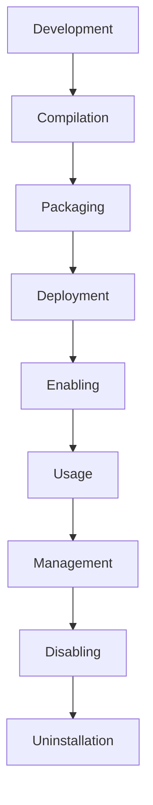

# RabbitMQ Custom Plugins

## Introduction

RabbitMQ is a powerful and flexible message broker that implements the Advanced Message Queuing Protocol (AMQP). One of RabbitMQ's greatest strengths is its extensibility through plugins. While RabbitMQ comes with a variety of built-in plugins, creating custom plugins allows you to extend its functionality to meet your specific requirements.

In this guide, we'll explore how to create, deploy, and manage custom plugins for RabbitMQ. We'll cover the fundamentals of the RabbitMQ plugin architecture, write a simple plugin from scratch, and look at some real-world applications.

## Prerequisites

Before diving into custom plugin development, make sure you have:

- RabbitMQ installed and running
- Erlang installed (as RabbitMQ plugins are written in Erlang)
- Basic understanding of message brokers and RabbitMQ concepts
- Familiarity with command-line operations

## Understanding RabbitMQ Plugin Architecture

RabbitMQ plugins are essentially Erlang applications that extend the core functionality of the broker. They can add new exchange types, authentication mechanisms, management capabilities, or integrate with external systems.

### Plugin Lifecycle



### Plugin Types

RabbitMQ plugins typically fall into one of these categories:

1. **Exchange Types**: Create new ways to route messages
2. **Authentication Mechanisms**: Implement custom authentication/authorization
3. **Management Extensions**: Extend the management UI/API
4. **Protocol Extensions**: Add support for additional messaging protocols
5. **Integrations**: Connect RabbitMQ with external systems

## Setting Up Your Development Environment

Let's set up a development environment for creating RabbitMQ plugins:

```bash
# Create a plugin directory
mkdir my_rabbitmq_plugin
cd my_rabbitmq_plugin

# Create standard Erlang/OTP application structure
mkdir -p src
mkdir -p include
```

### Project Structure

A typical RabbitMQ plugin project has this structure:

```
my_rabbitmq_plugin/
├── Makefile
├── README.md
├── include/
│   └── my_plugin.hrl
├── rabbitmq-components.mk
├── src/
│   ├── my_plugin_app.erl
│   ├── my_plugin_sup.erl
│   └── my_plugin.erl
└── BUILD.bazel
```

## Creating a Simple Custom Plugin

Let's create a simple plugin that logs all published messages to a file. First, we'll create our plugin application module:

### 1. Create the Application Module

Create a file `src/message_logger_plugin_app.erl`:

```erlang
-module(message_logger_plugin_app).
-behaviour(application).
-export([start/2, stop/1]).

start(_Type, _Args) ->
    rabbit_log:info("Starting message logger plugin"),
    ok = rabbit_event:add_handler(message_logger, []),
    message_logger_sup:start_link().

stop(_State) ->
    rabbit_event:remove_handler(message_logger),
    rabbit_log:info("Stopped message logger plugin"),
    ok.
```

### 2. Create the Supervisor Module

Create a file `src/message_logger_sup.erl`:

```erlang
-module(message_logger_sup).
-behaviour(supervisor).
-export([start_link/0, init/1]).

start_link() ->
    supervisor:start_link({local, ?MODULE}, ?MODULE, []).

init([]) ->
    {ok, {{one_for_one, 3, 10}, []}}.
```

### 3. Create the Event Handler

Create a file `src/message_logger.erl`:

```erlang
-module(message_logger).
-behaviour(gen_event).
-export([init/1, handle_event/2, handle_call/2, handle_info/2, terminate/2, code_change/3]).

init([]) ->
    {ok, LogFile} = file:open("message_log.txt", [append]),
    {ok, LogFile}.

handle_event({#'basic.publish'{routing_key = RoutingKey}, #content{payload_fragments_rev = PayloadRev}}, LogFile) ->
    Payload = list_to_binary(lists:reverse(PayloadRev)),
    io:format(LogFile, "~s: ~s~n", [RoutingKey, Payload]),
    {ok, LogFile};
handle_event(_Event, State) ->
    {ok, State}.

handle_call(_Request, State) ->
    {ok, ok, State}.

handle_info(_Info, State) ->
    {ok, State}.

terminate(_Reason, LogFile) ->
    file:close(LogFile),
    ok.

code_change(_OldVsn, State, _Extra) ->
    {ok, State}.
```

### 4. Create the App File

Create a file `src/message_logger_plugin.app.src`:

```erlang
{application, message_logger_plugin,
 [{description, "RabbitMQ plugin to log all published messages"},
  {vsn, "0.1.0"},
  {modules, [message_logger_plugin_app, message_logger_sup, message_logger]},
  {registered, [message_logger_sup]},
  {applications, [kernel, stdlib, rabbit]},
  {mod, {message_logger_plugin_app, []}},
  {env, []},
  {broker_version_requirements, ["3.8.0", "3.9.0", "3.10.0"]}
 ]}.
```

### 5. Create a Makefile

Create a file `Makefile`:

```makefile
PROJECT = message_logger_plugin
PROJECT_DESCRIPTION = RabbitMQ Message Logger Plugin
PROJECT_VERSION = 0.1.0

DEPS = rabbit
DEP_PLUGINS = rabbit_common/mk/rabbitmq-plugin.mk

include rabbitmq-components.mk
include erlang.mk
```

You'll also need to download `rabbitmq-components.mk` from the RabbitMQ GitHub repository.

## Building the Plugin

Now let's build our plugin:

```bash
# Download dependencies
make fetch-deps

# Build the plugin
make dist
```

This will create an `.ez` file in the `dist` directory:

```
dist/message_logger_plugin-0.1.0.ez
```

## Deploying the Plugin

To deploy your plugin:

1. Copy the `.ez` file to the RabbitMQ plugins directory:

```bash
cp dist/message_logger_plugin-0.1.0.ez /usr/lib/rabbitmq/plugins/
```

2. Register and enable the plugin:

```bash
rabbitmq-plugins enable message_logger_plugin
```

3. Restart RabbitMQ if necessary:

```bash
systemctl restart rabbitmq-server
```

## Testing the Plugin

Let's test our plugin by publishing a message:

```bash
# Using rabbitmqadmin
rabbitmqadmin publish exchange=amq.default routing_key=test payload="Hello from custom plugin!"
```

Now check the log file:

```bash
cat message_log.txt
```

Expected output:
```
test: Hello from custom plugin!
```

## Real-World Examples

Here are some practical examples of custom RabbitMQ plugins:

### 1. Custom Exchange Type

```erlang
-module(priority_topic_exchange).
-behaviour(rabbit_exchange_type).

-export([description/0, serialise_events/0, route/2]).
-export([validate/1, validate_binding/2, create/2, delete/3, policy_changed/2, add_binding/3, remove_bindings/3, assert_args_equivalence/2]).

description() ->
    [{name, <<"x-priority-topic">>},
     {description, <<"Priority-based topic exchange">>}].

serialise_events() -> false.

validate(_X) -> ok.
validate_binding(_X, _B) -> ok.
create(_Tx, _X) -> ok.
delete(_Tx, _X, _Bs) -> ok.
policy_changed(_X1, _X2) -> ok.
add_binding(_Tx, _X, _B) -> ok.
remove_bindings(_Tx, _X, _Bs) -> ok.
assert_args_equivalence(X, Args) ->
    rabbit_exchange:assert_args_equivalence(X, Args).

route(#exchange{name = Name},
      #delivery{message = #basic_message{routing_keys = Routes,
                                         content = Content}}) ->
    Headers = rabbit_basic:extract_headers(Content),
    Priority = case rabbit_misc:table_lookup(Headers, <<"priority">>) of
                   {_, P} when is_number(P) -> P;
                   _ -> 0
               end,
    
    % Get all bindings for this exchange
    Bindings = rabbit_router:match_routing_key(Name, Routes),
    
    % Add priority to bindings
    [{binding_with_priority(B, Priority)} || B <- Bindings].

binding_with_priority(#binding{destination = Dest} = B, Priority) ->
    B#binding{destination = {Priority, Dest}}.
```

This example creates a custom exchange type that routes messages based on both topic patterns and message priority.

### 2. Authentication Plugin

```erlang
-module(oauth2_auth_mechanism).
-behaviour(rabbit_auth_mechanism).

-export([description/0, should_offer/1, init/1, handle_response/2]).

description() -> 
    [{name, <<"OAUTH2">>},
     {description, <<"OAuth 2.0 Authentication">>}].

should_offer(_) -> true.

init(_) -> 
    {ok, []}.

handle_response(<<"Bearer ", Token/binary>>, _State) ->
    case validate_oauth_token(Token) of
        {ok, Username} -> 
            {ok, #auth_user{username = Username}};
        {error, Reason} -> 
            {error, {invalid_token, Reason}}
    end;
handle_response(_, _) ->
    {error, "Invalid authentication format"}.

validate_oauth_token(Token) ->
    % In a real implementation, you would validate with your OAuth provider
    % This is a simplified example
    case http_client:get("https://oauth.example.com/validate", [
        {headers, [{"Authorization", "Bearer " ++ binary_to_list(Token)}]}
    ]) of
        {ok, 200, _, Response} ->
            {ok, maps:get(<<"username">>, jiffy:decode(Response))};
        {ok, 401, _, _} ->
            {error, invalid_token};
        _ ->
            {error, server_error}
    end.
```

This plugin implements OAuth 2.0 authentication for RabbitMQ.

## Advanced Plugin Development

### Integrating with RabbitMQ Management UI

To extend the RabbitMQ management UI, your plugin needs to provide web dispatchers:

```erlang
-module(my_management_extension).
-behaviour(rabbit_mgmt_extension).

-export([dispatcher/0, web_ui/0]).

dispatcher() ->
    [{"/api/my-extension", my_extension_handler, []}].

web_ui() ->
    [{javascript, <<"my-extension.js">>},
     {css, <<"my-extension.css">>}].
```

### Handling Plugin Configuration

You can make your plugin configurable by using the RabbitMQ configuration system:

```erlang
% In your application start function
start(_Type, _Args) ->
    {ok, Cfg} = application:get_env(my_plugin, config),
    LogLevel = proplists:get_value(log_level, Cfg, info),
    % Use the configuration...
```

Then in your RabbitMQ configuration file:

```erlang
{my_plugin, [
    {log_level, debug}
]}
```

## Best Practices

1. **Minimize Dependencies**: Keep your plugins lightweight with minimal dependencies.
2. **Handle Errors Gracefully**: Make sure your plugin doesn't crash the broker.
3. **Documentation**: Document your plugin thoroughly.
4. **Versioning**: Use semantic versioning for your plugins.
5. **Testing**: Write comprehensive tests for your plugins.
6. **Performance**: Optimize for performance, especially for plugins that handle high message volumes.

## Debugging Custom Plugins

When your plugin doesn't work as expected, here are some debugging strategies:

1. **Check RabbitMQ Logs**:
```bash
tail -f /var/log/rabbitmq/rabbit@hostname.log
```

2. **Use Erlang Debugger**:
```erlang
% In the Erlang shell
debugger:start().
```

3. **Add Debug Outputs**:
```erlang
rabbit_log:debug("Debug info: ~p", [SomeVariable]).
```

## Common Issues and Solutions

| Issue | Solution |
|-------|----------|
| Plugin won't compile | Check Erlang version compatibility |
| Plugin not loading | Verify plugin path and permissions |
| Function crashes | Add exception handling with try/catch |
| Performance issues | Profile code with Erlang profiler tools |
| Version conflicts | Check broker_version_requirements in .app file |

## Summary

Creating custom plugins for RabbitMQ allows you to extend its functionality to meet your specific needs. By following the steps and examples in this guide, you can develop, deploy, and manage custom plugins that enhance RabbitMQ's capabilities.

Remember that plugin development requires good understanding of Erlang and RabbitMQ internals, but the flexibility it offers is well worth the investment for advanced messaging scenarios.

## Additional Resources

- [RabbitMQ Plugin Development Guide](https://www.rabbitmq.com/plugin-development.html)
- [Erlang Documentation](https://www.erlang.org/docs)
- [RabbitMQ Community Plugins](https://github.com/rabbitmq/rabbitmq-community-plugins)

## Exercises

1. Create a simple plugin that counts the number of messages published and exposes the count via the management API.
2. Implement a plugin that adds a new exchange type with custom routing logic.
3. Develop a plugin that integrates RabbitMQ with an external monitoring system.
4. Extend the management UI to display custom metrics from your plugin.
5. Create a plugin that implements a custom queue policy that prioritizes messages based on a header.