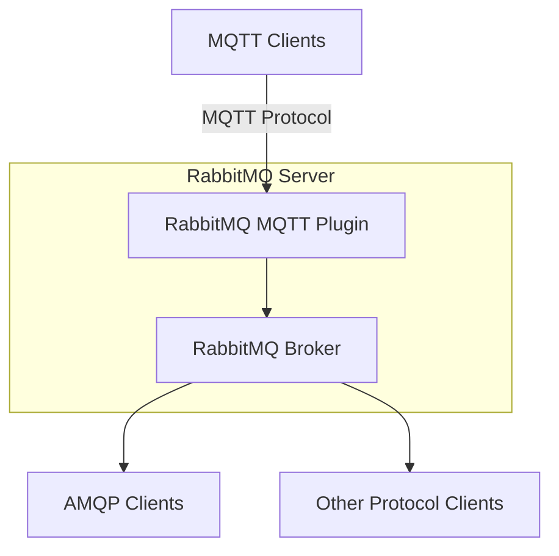

# RabbitMQ MQTT Plugin

## Introduction

The MQTT plugin for RabbitMQ enables the broker to support the MQTT protocol (versions 3.1 and 3.1.1), a lightweight messaging protocol designed for Internet of Things (IoT) devices, mobile applications, and other scenarios where network bandwidth is limited. By integrating MQTT with RabbitMQ, you get the best of both worlds: the lightweight, publish/subscribe model of MQTT and the robust message queuing capabilities of RabbitMQ.

This guide will walk you through understanding, enabling, configuring, and using the RabbitMQ MQTT plugin for your applications.

## What is MQTT?

MQTT (Message Queuing Telemetry Transport) is a lightweight, publish-subscribe network protocol designed for constrained devices and low-bandwidth, high-latency, or unreliable networks. Key characteristics include:

- **Lightweight**: Minimal packet overhead (as small as 2 bytes)
- **Pub/Sub Pattern**: Decouples publishers from subscribers
- **QoS Levels**: Three quality of service levels (0, 1, 2)
- **Last Will and Testament**: Messages sent when clients disconnect unexpectedly
- **Retained Messages**: Latest message saved for new subscribers

## How MQTT and RabbitMQ Work Together

RabbitMQ's MQTT plugin creates a bridge between MQTT clients and RabbitMQ's powerful message broker infrastructure:



The MQTT plugin translates between MQTT concepts and RabbitMQ concepts:

| MQTT Concept | RabbitMQ Implementation |
|--------------|-------------------------|
| Topic | Exchange + Routing Key |
| QoS | Message Properties + Acknowledgements |
| Retained Messages | Stored in a special exchange |
| Last Will | Special message published on disconnect |

## Enabling the MQTT Plugin

The MQTT plugin is included in the RabbitMQ distribution but needs to be enabled before use:

```bash
rabbitmq-plugins enable rabbitmq_mqtt
```

This command enables the plugin and automatically starts the MQTT listener on port 1883 (the default MQTT port).

## Configuration Options

You can configure the MQTT plugin through the RabbitMQ configuration file. Here's an example of common configuration options:

```ini
mqtt.listeners.tcp.default = 1883
mqtt.listeners.ssl.default = 8883

mqtt.allow_anonymous = true
mqtt.vhost = /
mqtt.exchange = amq.topic
mqtt.subscription_ttl = 86400000
mqtt.prefetch = 10
```

Let's break down these configuration options:

- **mqtt.listeners.tcp.default**: The port for unencrypted MQTT connections
- **mqtt.listeners.ssl.default**: The port for SSL/TLS-encrypted MQTT connections
- **mqtt.allow_anonymous**: Whether to allow connections without credentials
- **mqtt.vhost**: The virtual host to use for MQTT connections
- **mqtt.exchange**: The exchange to which all MQTT messages are published
- **mqtt.subscription_ttl**: How long subscriptions last when clients disconnect (in milliseconds)
- **mqtt.prefetch**: Maximum number of unacknowledged messages delivered to clients

## Authentication and Authorization

By default, the MQTT plugin uses RabbitMQ's authentication mechanism. You can configure client authentication in several ways:

### Username/Password Authentication

MQTT clients can connect using a username and password that's validated against RabbitMQ's user database:

```javascript
// JavaScript MQTT client example (using MQTT.js)
const mqtt = require('mqtt');

const client = mqtt.connect('mqtt://localhost:1883', {
  username: 'guest',
  password: 'guest'
});

client.on('connect', () => {
  console.log('Connected to RabbitMQ MQTT broker');
});
```

### SSL/TLS Client Certificates

For more secure authentication, you can use SSL client certificates:

```ini
# In RabbitMQ configuration
mqtt.listeners.ssl.default = 8883
ssl_options.cacertfile = /path/to/ca_certificate.pem
ssl_options.certfile = /path/to/server_certificate.pem
ssl_options.keyfile = /path/to/server_key.pem
ssl_options.verify = verify_peer
ssl_options.fail_if_no_peer_cert = true
```

## Publishing and Subscribing with MQTT

Let's look at basic MQTT operations with RabbitMQ:

### Publishing Messages

Here's a Python example using the Paho MQTT client to publish a message:

```python
import paho.mqtt.client as mqtt
import json
import time

# Callback when client connects
def on_connect(client, userdata, flags, rc):
    if rc == 0:
        print("Connected to RabbitMQ MQTT broker")
    else:
        print(f"Failed to connect, return code {rc}")

# Create client instance
client = mqtt.Client()
client.username_pw_set("guest", "guest")  # Set username and password
client.on_connect = on_connect

# Connect to broker
client.connect("localhost", 1883, 60)
client.loop_start()

# Wait for connection to establish
time.sleep(1)

# Publish message
topic = "sensors/temperature"
payload = json.dumps({
    "device_id": "thermostat-living-room",
    "temperature": 22.5,
    "humidity": 45,
    "timestamp": time.time()
})

client.publish(topic, payload, qos=1)
print(f"Published message to {topic}")

# Disconnect
client.loop_stop()
client.disconnect()
```

### Subscribing to Messages

Here's how to subscribe to messages:

```python
import paho.mqtt.client as mqtt
import time
import json

# Callback when client connects
def on_connect(client, userdata, flags, rc):
    if rc == 0:
        print("Connected to RabbitMQ MQTT broker")
        # Subscribe to topic
        client.subscribe("sensors/#", qos=1)
        print("Subscribed to sensors/#")
    else:
        print(f"Failed to connect, return code {rc}")

# Callback when message is received
def on_message(client, userdata, msg):
    print(f"Received message on topic {msg.topic}:")
    try:
        payload = json.loads(msg.payload.decode())
        print(f"Device: {payload['device_id']}")
        print(f"Temperature: {payload['temperature']}°C")
        print(f"Humidity: {payload['humidity']}%")
        print(f"Timestamp: {payload['timestamp']}")
    except:
        print(f"Raw payload: {msg.payload.decode()}")

# Create client instance
client = mqtt.Client()
client.username_pw_set("guest", "guest")
client.on_connect = on_connect
client.on_message = on_message

# Connect to broker
client.connect("localhost", 1883, 60)

# Start loop to process callbacks
client.loop_forever()
```

## Topic Structures and Wildcards

MQTT uses a hierarchical topic structure with support for wildcards:

- **Single-level wildcard** (`+`): Matches exactly one topic level
- **Multi-level wildcard** (`#`): Matches any number of topic levels

Examples:
- `sensors/+/temperature` would match:
  - `sensors/living-room/temperature`
  - `sensors/kitchen/temperature`
  - But not `sensors/kitchen/upstairs/temperature`

- `sensors/#` would match:
  - `sensors/living-room/temperature`
  - `sensors/kitchen/humidity`
  - `sensors/kitchen/upstairs/temperature`

## Quality of Service (QoS) Levels

MQTT supports three QoS levels:

1. **QoS 0 (At most once)**: Message is delivered at most once, with no confirmation
2. **QoS 1 (At least once)**: Message is delivered at least once, with confirmation
3. **QoS 2 (Exactly once)**: Message is delivered exactly once, using a 4-part handshake

```python
# Publishing with different QoS levels
client.publish("sensors/temperature", payload, qos=0)  # Fire and forget
client.publish("sensors/temperature", payload, qos=1)  # At least once delivery
client.publish("sensors/temperature", payload, qos=2)  # Exactly once delivery
```

## Retained Messages

MQTT allows publishers to mark messages as "retained." A retained message is stored by the broker and sent to any new subscriber to that topic:

```python
# Publishing a retained message
client.publish("sensors/living-room/config", 
              json.dumps({"sample_rate": 60, "alert_threshold": 30}), 
              qos=1, 
              retain=True)
```

## Last Will and Testament

MQTT clients can specify a "last will" message that the broker will publish if the client disconnects unexpectedly:

```python
# Setting up Last Will and Testament
client = mqtt.Client()
client.username_pw_set("guest", "guest")
client.will_set(
    topic="devices/thermostat/status",
    payload=json.dumps({"status": "offline", "device_id": "thermostat-living-room"}),
    qos=1,
    retain=True
)
```

## Practical Example: IoT Monitoring System

Let's create a simple IoT monitoring system using RabbitMQ's MQTT plugin:

### Device Simulator (Publisher)

```python
import paho.mqtt.client as mqtt
import json
import time
import random

def on_connect(client, userdata, flags, rc):
    if rc == 0:
        print("Connected to RabbitMQ MQTT broker")
        # Publish an online status message as retained
        client.publish(
            f"devices/{DEVICE_ID}/status",
            json.dumps({"status": "online"}),
            qos=1,
            retain=True
        )
    else:
        print(f"Failed to connect, return code {rc}")

# Configure device
DEVICE_ID = f"sensor-{random.randint(1000, 9999)}"
LOCATION = "living-room"

# Create client
client = mqtt.Client(client_id=DEVICE_ID)
client.username_pw_set("guest", "guest")
client.on_connect = on_connect

# Set Last Will
client.will_set(
    topic=f"devices/{DEVICE_ID}/status",
    payload=json.dumps({"status": "offline"}),
    qos=1,
    retain=True
)

# Connect to broker
client.connect("localhost", 1883, 60)
client.loop_start()

# Wait for connection
time.sleep(1)

try:
    # Send data regularly
    while True:
        # Generate simulated sensor data
        temperature = 20 + 5 * random.random()
        humidity = 30 + 20 * random.random()
        battery = 100 - (time.time() % 10000) / 100
        
        # Publish to different topics
        client.publish(
            f"sensors/{LOCATION}/temperature",
            json.dumps({
                "device_id": DEVICE_ID,
                "value": round(temperature, 1),
                "unit": "C",
                "timestamp": time.time()
            }),
            qos=1
        )
        
        client.publish(
            f"sensors/{LOCATION}/humidity",
            json.dumps({
                "device_id": DEVICE_ID,
                "value": round(humidity, 1),
                "unit": "%",
                "timestamp": time.time()
            }),
            qos=1
        )
        
        client.publish(
            f"devices/{DEVICE_ID}/battery",
            json.dumps({
                "level": round(battery, 1),
                "unit": "%"
            }),
            qos=1
        )
        
        print(f"Published data: Temp={round(temperature, 1)}°C, Humidity={round(humidity, 1)}%")
        time.sleep(5)
        
except KeyboardInterrupt:
    # Clean disconnect
    client.publish(
        f"devices/{DEVICE_ID}/status",
        json.dumps({"status": "offline"}),
        qos=1,
        retain=True
    )
    client.loop_stop()
    client.disconnect()
    print("Disconnected from broker")
```

### Monitoring Application (Subscriber)

```python
import paho.mqtt.client as mqtt
import json
from datetime import datetime

# Dictionary to store device states
devices = {}
sensor_data = {}

def on_connect(client, userdata, flags, rc):
    if rc == 0:
        print("Connected to RabbitMQ MQTT broker")
        # Subscribe to all device and sensor topics
        client.subscribe("devices/#", qos=1)
        client.subscribe("sensors/#", qos=1)
        print("Monitoring system online")
    else:
        print(f"Failed to connect, return code {rc}")

def on_message(client, userdata, msg):
    try:
        payload = json.loads(msg.payload.decode())
        topic = msg.topic
        parts = topic.split('/')
        
        # Format timestamp
        timestamp = datetime.now().strftime("%H:%M:%S")
        
        if parts[0] == "devices" and parts[2] == "status":
            device_id = parts[1]
            status = payload.get("status")
            devices[device_id] = status
            print(f"[{timestamp}] Device {device_id}: {status}")
            
            # Show currently connected devices
            online_count = list(devices.values()).count("online")
            print(f"Active devices: {online_count}/{len(devices)}")
        
        elif parts[0] == "devices" and parts[2] == "battery":
            device_id = parts[1]
            battery = payload.get("level")
            print(f"[{timestamp}] Device {device_id} battery: {battery}%")
            
            # Alert on low battery
            if battery < 20:
                print(f"⚠️  WARNING: Low battery on {device_id}!")
        
        elif parts[0] == "sensors":
            location = parts[1]
            metric = parts[2]
            value = payload.get("value")
            unit = payload.get("unit")
            device_id = payload.get("device_id")
            
            # Store sensor data
            if location not in sensor_data:
                sensor_data[location] = {}
            if metric not in sensor_data[location]:
                sensor_data[location][metric] = {}
            
            sensor_data[location][metric] = {
                "value": value,
                "unit": unit,
                "device_id": device_id,
                "updated": timestamp
            }
            
            print(f"[{timestamp}] {location} {metric}: {value}{unit}")
            
            # Display current readings periodically
            if len(sensor_data) > 0 and len(list(sensor_data.values())[0]) > 1:
                print("
--- Current Readings ---")
                for loc, metrics in sensor_data.items():
                    print(f"Location: {loc}")
                    for met, data in metrics.items():
                        print(f"  {met}: {data['value']}{data['unit']} (from {data['device_id']})")
                print("----------------------
")
    
    except json.JSONDecodeError:
        print(f"Received non-JSON message on {msg.topic}: {msg.payload.decode()}")
    except Exception as e:
        print(f"Error processing message: {e}")

# Create client
client = mqtt.Client(client_id="monitoring-system")
client.username_pw_set("guest", "guest")
client.on_connect = on_connect
client.on_message = on_message

# Connect to broker
client.connect("localhost", 1883, 60)

# Start loop
client.loop_forever()
```

## Common Issues and Troubleshooting

Here are some common issues you might encounter when working with the RabbitMQ MQTT plugin:

### Connection Problems

If your MQTT clients can't connect to RabbitMQ:

1. **Check if the plugin is enabled**:
   ```bash
   rabbitmqctl list_plugins
   ```

2. **Verify MQTT listener is running**:
   ```bash
   rabbitmqctl list_listeners
   ```

3. **Check authentication credentials** - ensure the user exists and has permissions:
   ```bash
   rabbitmqctl list_users
   rabbitmqctl list_user_permissions guest
   ```

### Message Delivery Issues

If messages aren't being delivered correctly:

1. **Check subscriber topic patterns** - ensure wildcards are used correctly
2. **Verify QoS settings** - higher QoS levels add reliability but more overhead
3. **Inspect RabbitMQ management UI** - look for queues, exchanges, and bindings

### Debugging MQTT Traffic

To debug MQTT traffic:

1. **Enable verbose logging** in your MQTT client
2. **Use a packet sniffer** like Wireshark with the MQTT protocol filter
3. **Monitor RabbitMQ logs**:
   ```bash
   tail -f /var/log/rabbitmq/rabbit@hostname.log
   ```

## Performance Considerations

To optimize performance when using the MQTT plugin:

1. **QoS Level Selection**: Use QoS 0 for non-critical, high-volume messages
2. **Topic Design**: Keep topic hierarchy reasonably flat to improve routing performance
3. **Client Connection Management**: Use persistent connections rather than frequent reconnects
4. **Message Size**: Keep payloads small (use compression if necessary)
5. **Subscription Patterns**: Avoid overly broad wildcards that match many topics

## Summary

The RabbitMQ MQTT plugin provides a powerful integration between the lightweight MQTT protocol and RabbitMQ's robust message broker. This combination is particularly valuable for IoT applications, mobile clients, and scenarios where network bandwidth is at a premium.

Key takeaways:
- MQTT is a lightweight publish/subscribe protocol ideal for constrained devices
- The RabbitMQ MQTT plugin allows MQTT clients to interact with the RabbitMQ broker
- The plugin supports core MQTT features including QoS levels, retained messages, and Last Will
- Proper configuration ensures security, reliability, and performance

## Exercises

1. Set up RabbitMQ with the MQTT plugin and connect a simple MQTT client.
2. Create a publish/subscribe system with different QoS levels and observe the differences.
3. Experiment with retained messages to provide configuration settings to new subscribers.
4. Implement a simple IoT monitoring system similar to the example provided.
5. Explore how to bridge MQTT with AMQP by having an AMQP consumer receive messages published by MQTT clients.

## Additional Resources

- [RabbitMQ MQTT Plugin Documentation](https://www.rabbitmq.com/mqtt.html)
- [MQTT Specification](https://mqtt.org/mqtt-specification/)
- [Eclipse Mosquitto](https://mosquitto.org/) - Popular MQTT broker for testing
- [MQTT.js](https://github.com/mqttjs/MQTT.js) - JavaScript MQTT client
- [Eclipse Paho](https://www.eclipse.org/paho/) - MQTT clients in various languages
- [HiveMQ MQTT Client Tool](https://www.hivemq.com/mqtt-client-tool/) - Browser-based MQTT client

For further reading on messaging patterns and distributed systems that combine MQTT with other protocols, explore the broader RabbitMQ documentation or books on message-oriented middleware.