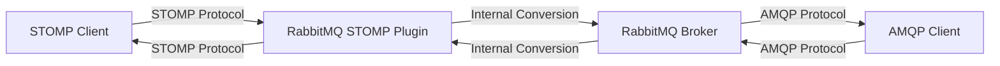

# RabbitMQ STOMP Plugin

## Introduction

The STOMP (Simple Text Oriented Messaging Protocol) plugin for RabbitMQ enables communication between STOMP clients and the RabbitMQ message broker. STOMP is a simple, text-based protocol that makes it possible for STOMP clients written in various languages and platforms to communicate with any message broker that supports the protocol, including RabbitMQ.

This plugin acts as a bridge between the STOMP protocol and RabbitMQ's AMQP implementation, allowing developers to leverage RabbitMQ's powerful features while using the simpler STOMP protocol for client applications.

## Why Use the STOMP Plugin?

The STOMP plugin is particularly useful when:

- You have clients that already support STOMP
- You need to integrate with platforms where STOMP clients are more readily available
- You prefer a simpler, text-based protocol for certain use cases
- You're building web applications that need to communicate with message brokers (using STOMP over WebSockets)

## Plugin Installation and Setup

The STOMP plugin is included in the standard RabbitMQ distribution, but it's not enabled by default. Here's how to enable it:

### Step 1: Enable the Plugin

```bash
rabbitmq-plugins enable rabbitmq_stomp
```

This command enables the STOMP plugin, allowing RabbitMQ to accept STOMP connections.

### Step 2: Verify the Plugin Status

```bash
rabbitmq-plugins list
```

Look for `rabbitmq_stomp` in the enabled plugins list, marked with `[E*]`.

### Step 3: Configure the Plugin (Optional)

You can configure the STOMP plugin by adding settings to your RabbitMQ configuration file. Here's an example configuration:

```erlang
[
  {rabbitmq_stomp, [
    {tcp_listeners, [61613]},
    {num_acceptors, 10},
    {max_connections, 1000}
  ]}
].
```

This configuration:
- Sets the STOMP port to the default 61613
- Configures 10 acceptor processes
- Sets a maximum of 1000 STOMP connections

## STOMP Protocol Basics

Before diving into examples, let's understand the basic STOMP frame structure:

```
COMMAND
header1:value1
header2:value2

Body of the message^@
```

A STOMP frame consists of:
- A command (like CONNECT, SEND, SUBSCRIBE)
- Optional headers (key-value pairs)
- An optional body
- A null character (`^@`) to mark the end of the frame

## Basic Usage Examples

Let's explore how to use STOMP with RabbitMQ through some practical examples.

### Example 1: Connecting to RabbitMQ with STOMP

First, let's establish a STOMP connection to RabbitMQ:

```java
// Java example using STOMP client library
import org.projectodd.stilts.stomp.StompClient;
import org.projectodd.stilts.stomp.StompConnection;

public class StompExample {
    public static void main(String[] args) throws Exception {
        // Create and start a STOMP client
        StompClient client = new StompClient("localhost", 61613);
        client.connect();
        
        // Establish a connection
        StompConnection connection = client.connect();
        System.out.println("Connected to RabbitMQ via STOMP");
        
        // Use the connection...
        
        // Close connection when done
        connection.disconnect();
        client.disconnect();
    }
}
```

The connection frame sent over the wire would look like:

```
CONNECT
accept-version:1.2
host:localhost
login:guest
passcode:guest

^@
```

And the response from the server:

```
CONNECTED
server:RabbitMQ/3.9.13
session:session-id-here
version:1.2

^@
```

### Example 2: Sending Messages

Let's send a message to a queue:

```javascript
// JavaScript example using stompit library
const stompit = require('stompit');

const connectOptions = {
    host: 'localhost',
    port: 61613,
    connectHeaders: {
        host: '/',
        login: 'guest',
        passcode: 'guest'
    }
};

stompit.connect(connectOptions, (error, client) => {
    if (error) {
        console.error('Connection error: ' + error.message);
        return;
    }
    
    const sendHeaders = {
        destination: '/queue/my-queue',
        'content-type': 'text/plain'
    };
    
    const frame = client.send(sendHeaders);
    frame.write('Hello, RabbitMQ via STOMP!');
    frame.end();
    
    console.log('Message sent');
    client.disconnect();
});
```

The STOMP frame sent would be:

```
SEND
destination:/queue/my-queue
content-type:text/plain
content-length:27

Hello, RabbitMQ via STOMP!^@
```

### Example 3: Subscribing to Queues

Now, let's subscribe to receive messages:

```python
# Python example using stomp.py
import stomp
import time

class MyListener(stomp.ConnectionListener):
    def on_message(self, frame):
        print(f"Received: {frame.body}")
    
    def on_error(self, frame):
        print(f"Error: {frame.body}")

conn = stomp.Connection([('localhost', 61613)])
conn.set_listener('my_listener', MyListener())
conn.connect('guest', 'guest', wait=True)

# Subscribe to a queue
conn.subscribe(destination='/queue/my-queue', id='1', ack='auto')

print("Waiting for messages...")
time.sleep(60)  # Keep the connection alive for 60 seconds

conn.disconnect()
```

The subscription frame would look like:

```
SUBSCRIBE
id:1
destination:/queue/my-queue
ack:auto

^@
```

## STOMP Destinations in RabbitMQ

The STOMP plugin maps STOMP destinations to RabbitMQ exchanges and queues following these conventions:

1. `/queue/name` - Maps to a queue named "name"
2. `/topic/name` - Maps to a topic exchange named "amq.topic" with routing key "name"
3. `/exchange/name/routing-key` - Maps to an exchange named "name" with the specified routing key
4. `/amq/queue/name` - Maps to a queue named "name" (for existing queues only)

## Real-World Application: Chat System

Let's build a simple chat system using RabbitMQ's STOMP plugin and STOMP over WebSockets.

### Server Setup

First, enable the STOMP over WebSockets plugin:

```bash
rabbitmq-plugins enable rabbitmq_web_stomp
```

This enables STOMP over WebSockets on port 15674 by default.

### Web Client Implementation

```html
<!DOCTYPE html>
<html>
<head>
    <title>RabbitMQ STOMP Chat</title>
    <script src="https://cdn.jsdelivr.net/npm/stompjs@2.3.3/lib/stomp.min.js"></script>
</head>
<body>
    <div>
        <h1>RabbitMQ STOMP Chat</h1>
        <div>
            <label for="username">Your Name:</label>
            <input type="text" id="username" />
        </div>
        <div>
            <label for="message">Message:</label>
            <input type="text" id="message" />
            <button onclick="sendMessage()">Send</button>
        </div>
        <div id="messages"></div>
    </div>

    <script>
        // Connect to RabbitMQ STOMP over WebSockets
        const client = Stomp.client('ws://localhost:15674/ws');
        
        // Connection callback
        client.connect('guest', 'guest', function() {
            console.log('Connected to RabbitMQ');
            
            // Subscribe to the chat topic
            client.subscribe('/topic/chat', function(message) {
                const chatMessage = JSON.parse(message.body);
                displayMessage(chatMessage.username, chatMessage.text);
            });
        }, function(error) {
            console.error('STOMP error:', error);
        });
        
        // Send a message to the chat topic
        function sendMessage() {
            const username = document.getElementById('username').value || 'Anonymous';
            const text = document.getElementById('message').value;
            
            if (text) {
                const chatMessage = {
                    username: username,
                    text: text,
                    time: new Date().toISOString()
                };
                
                client.send('/topic/chat', {}, JSON.stringify(chatMessage));
                document.getElementById('message').value = '';
            }
        }
        
        // Display a received message
        function displayMessage(username, text) {
            const messagesDiv = document.getElementById('messages');
            const messageElement = document.createElement('div');
            messageElement.textContent = `${username}: ${text}`;
            messagesDiv.appendChild(messageElement);
            messagesDiv.scrollTop = messagesDiv.scrollHeight;
        }
    </script>
</body>
</html>
```

This example creates a simple web-based chat application where:
1. Users connect to RabbitMQ via STOMP over WebSockets
2. Messages are published to a topic exchange
3. All connected clients receive the messages

## Handling Acknowledgments and Transactions

STOMP provides support for message acknowledgments and transactions, which are essential for reliable messaging.

### Message Acknowledgments

When subscribing, you can specify different acknowledgment modes:

```javascript
// JavaScript example
client.subscribe('/queue/my-queue', function(message) {
    console.log('Received message:', message.body);
    
    // Acknowledge the message
    message.ack();
}, {
    ack: 'client',  // Options: 'auto', 'client', 'client-individual'
    id: 'subscription-1'
});
```

Ack modes:
- `auto`: Messages are considered acknowledged as soon as they are sent (default)
- `client`: Client must acknowledge messages, and acknowledgment applies to all messages received before it
- `client-individual`: Client must acknowledge each message individually

### Transactions

For sending multiple messages in a single transaction:

```javascript
// Begin a transaction
const txId = 'tx-1';
client.begin(txId);

// Send messages within the transaction
client.send('/queue/important-data', { transaction: txId }, 'Message 1');
client.send('/queue/important-data', { transaction: txId }, 'Message 2');

// Commit the transaction
client.commit(txId);

// Or abort it
// client.abort(txId);
```

## Advanced Configuration

### SSL/TLS Support

To enable secure STOMP connections:

```erlang
[
  {rabbitmq_stomp, [
    {tcp_listeners, []},  % Disable plain TCP
    {ssl_listeners, [61614]},  % Enable SSL on port 61614
    {ssl_options, [
      {cacertfile, "/path/to/ca.crt"},
      {certfile, "/path/to/server.crt"},
      {keyfile, "/path/to/server.key"},
      {verify, verify_peer},
      {fail_if_no_peer_cert, false}
    ]}
  ]}
].
```

### Protocol Interoperability

The beauty of using the STOMP plugin is that messages published via STOMP can be consumed by AMQP clients and vice versa. Let's visualize this interoperability:



This means you can have:
- STOMP clients publishing messages consumed by AMQP clients
- AMQP clients publishing messages consumed by STOMP clients
- A mix of protocols in your application ecosystem

## Performance Considerations

While STOMP offers simplicity, there are some performance trade-offs:

1. **Text-based protocol**: STOMP's text format is less efficient than AMQP's binary format
2. **Protocol conversion**: Converting between STOMP and AMQP internally adds some overhead
3. **Feature limitations**: Some advanced RabbitMQ features are not available through STOMP

For high-throughput applications, native AMQP might be preferable, but for many use cases, STOMP provides sufficient performance with easier client implementation.

## Troubleshooting Common Issues

### Connection Refused

If you get a "Connection refused" error:
- Verify the STOMP plugin is enabled
- Check that you're using the correct port (61613 by default)
- Ensure the RabbitMQ server is running

### Authentication Failures

For "Access refused" errors:
- Check your credentials (default is guest/guest)
- Verify the user has appropriate permissions
- Remember that the default guest user can only connect from localhost

### Protocol Errors

If you see "Unknown STOMP command" or similar errors:
- Ensure you're using the correct STOMP version
- Check your frame format for errors
- Verify headers are correctly formatted with no trailing spaces

## Summary

The RabbitMQ STOMP Plugin provides a bridge between the simple, text-based STOMP protocol and RabbitMQ's powerful messaging capabilities. It's particularly useful for web applications and scenarios where clients in various languages need to communicate with the message broker using a straightforward protocol.

Key takeaways:
- STOMP offers a simpler alternative to AMQP for many messaging needs
- The plugin is included with RabbitMQ but needs to be explicitly enabled
- Messages can flow between STOMP and AMQP clients seamlessly
- STOMP over WebSockets enables real-time web applications
- The plugin supports important messaging features like acknowledgments and transactions

## Additional Resources

- [RabbitMQ STOMP Plugin Documentation](https://www.rabbitmq.com/stomp.html)
- [STOMP Protocol Specification](https://stomp.github.io/stomp-specification-1.2.html)
- [RabbitMQ Management Plugin](https://www.rabbitmq.com/management.html) - Useful for monitoring STOMP connections

## Exercises

1. **Basic STOMP Client**: Create a simple command-line STOMP client that can send and receive messages.
2. **Multi-room Chat Application**: Extend the chat example to support multiple chat rooms using different topic exchanges.
3. **Message Persistence**: Implement a solution that ensures messages aren't lost even if subscribers are temporarily offline.
4. **Load Testing**: Compare the performance of STOMP vs. AMQP for your specific use case.
5. **Security Implementation**: Configure your RabbitMQ STOMP plugin with proper authentication and authorization.

By mastering the RabbitMQ STOMP plugin, you can integrate messaging capabilities into a wide variety of applications and platforms, leveraging RabbitMQ's robustness with STOMP's simplicity.