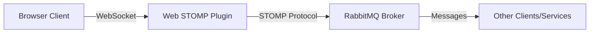

# RabbitMQ Web STOMP

## Introduction

RabbitMQ Web STOMP is a plugin that enables STOMP messaging over WebSockets for web applications. This powerful combination allows JavaScript clients running in browsers to connect directly to RabbitMQ and use messaging capabilities without requiring additional proxies or bridges.

In this tutorial, we'll explore how to set up the Web STOMP plugin, understand its core concepts, and implement real-world examples to demonstrate its capabilities.

## What is STOMP?

STOMP (Simple Text Oriented Messaging Protocol) is a simple, text-based protocol designed for messaging between clients via message brokers. It provides an interoperable wire format that allows STOMP clients to communicate with any STOMP message broker.

When combined with WebSockets (which provide full-duplex communication channels over a single TCP connection), STOMP becomes accessible directly from web browsers, enabling real-time messaging capabilities for web applications.

## Why Use RabbitMQ Web STOMP?

- **Direct browser-to-broker communication**: Eliminate the need for intermediary servers
- **Real-time web applications**: Build chat applications, live notifications, and collaborative tools
- **Simplified architecture**: Reduce complexity by leveraging existing RabbitMQ infrastructure
- **Cross-platform compatibility**: Works across various browsers and devices

## Prerequisites

Before getting started, ensure you have:

1. RabbitMQ server installed and running
2. Administrator access to enable plugins
3. Basic knowledge of RabbitMQ concepts
4. Familiarity with JavaScript for client-side code

## Enabling the Web STOMP Plugin

The Web STOMP plugin comes pre-bundled with RabbitMQ but needs to be enabled. Use the following command:

```bash
rabbitmq-plugins enable rabbitmq_web_stomp
```

By default, the plugin listens on port 15674. You can verify it's working by navigating to:
`http://localhost:15674/stomp` in your browser.

The plugin configuration can be customized in the RabbitMQ configuration file. Here's an example configuration:

```bash
web_stomp.tcp.port = 15674
web_stomp.tcp.backlog = 1024
web_stomp.tcp.ip = 127.0.0.1
```

## Understanding the Architecture

RabbitMQ Web STOMP creates a bridge between WebSockets and STOMP, which in turn connects to the RabbitMQ broker.



This architecture enables:
1. **Browser clients** to establish persistent connections via WebSockets
2. **STOMP protocol** to handle message formatting and commands
3. **RabbitMQ broker** to manage message routing and delivery
4. **Bidirectional communication** between browsers and any connected service

## Client-Side Integration

To connect to RabbitMQ via Web STOMP from a browser, you'll need a STOMP over WebSocket client library. The most popular option is [stomp.js](https://github.com/stomp-js/stompjs).

First, include the library in your HTML:

```html
<script src="https://cdn.jsdelivr.net/npm/@stomp/stompjs@7.0.0/bundles/stomp.umd.min.js"></script>
```

Then, establish a connection:

```javascript
// Create a client instance
const client = new StompJs.Client({
  brokerURL: 'ws://localhost:15674/ws',
  connectHeaders: {
    login: 'guest',
    passcode: 'guest'
  },
  debug: function (str) {
    console.log(str);
  },
  reconnectDelay: 5000,
  heartbeatIncoming: 4000,
  heartbeatOutgoing: 4000
});

// Callback when connected
client.onConnect = function (frame) {
  console.log('Connected: ' + frame);
  
  // Subscribe to a queue/topic
  client.subscribe('/queue/test', function (message) {
    // Called when the client receives a message
    console.log('Received: ' + message.body);
  });
};

// Callback for errors
client.onStompError = function (frame) {
  console.error('Broker reported error: ' + frame.headers['message']);
  console.error('Additional details: ' + frame.body);
};

// Start the connection
client.activate();
```

### Publishing Messages

To publish a message to a queue or exchange:

```javascript
// Ensure the client is connected first
if (client.connected) {
  client.publish({
    destination: '/exchange/amq.topic/test',
    body: JSON.stringify({ message: 'Hello, WebSTOMP!' }),
    headers: { 'content-type': 'application/json' }
  });
  console.log('Message sent');
}
```

### Subscribing to Messages

To receive messages from a queue:

```javascript
const subscription = client.subscribe('/queue/test', function(message) {
  // Process the message
  const receivedMsg = JSON.parse(message.body);
  console.log('Received message:', receivedMsg);
  
  // Acknowledge the message
  message.ack();
});

// Later, to unsubscribe
subscription.unsubscribe();
```

## Destination Format

STOMP destinations in RabbitMQ Web STOMP follow a specific format:

1. **Queues**: `/queue/{name}`
2. **Topic exchanges**: `/topic/{routing-key}`
3. **Exchanges**: `/exchange/{name}/{routing-key}`
4. **AMQP queue**: `/amq/queue/{name}`

Examples:
- `/queue/my_queue` - Sends to or subscribes to the queue named "my_queue"
- `/topic/news.sports` - Publishes to the amq.topic exchange with routing key "news.sports"
- `/exchange/custom_exchange/routing_key` - Publishes to a custom exchange with the specified routing key

## Security Considerations

When deploying RabbitMQ Web STOMP in production, consider these security measures:

1. **Enable SSL/TLS**: Use secure WebSockets (wss://) instead of plain WebSockets
2. **Authentication**: Configure proper authentication for STOMP connections
3. **Authorization**: Set up appropriate vhost permissions for your users
4. **Cross-Origin Resource Sharing (CORS)**: Configure CORS headers if needed

Example SSL configuration in RabbitMQ config:

```bash
web_stomp.ssl.port = 15673
web_stomp.ssl.backlog = 1024
web_stomp.ssl.certfile = /path/to/certificate.pem
web_stomp.ssl.keyfile = /path/to/key.pem
```

## Practical Example: Real-time Chat Application

Let's build a simple chat application using RabbitMQ Web STOMP. This example demonstrates how to create a multi-user chat where messages are broadcasted to all connected clients.

### HTML Structure

```html
<!DOCTYPE html>
<html lang="en">
<head>
  <meta charset="UTF-8" />
  <meta name="viewport" content="width=device-width, initial-scale=1.0" />
  <title>RabbitMQ Chat Example</title>
  <style>
    #messages {
      height: 300px;
      border: 1px solid #ccc;
      margin-bottom: 10px;
      padding: 10px;
      overflow-y: auto;
    }
  </style>
  <script src="https://cdn.jsdelivr.net/npm/@stomp/stompjs@7.0.0/bundles/stomp.umd.min.js"></script>
</head>
<body>
  <h1>RabbitMQ Web STOMP Chat</h1>
  
  <div>
    <label for="username">Username:</label>
    <input type="text" id="username" placeholder="Enter your name" />
    <button id="connect">Connect</button>
    <button id="disconnect" disabled>Disconnect</button>
  </div>
  
  <div id="chat-container" style="display: none;">
    <div id="messages"></div>
    <div>
      <input type="text" id="message" placeholder="Type your message..." />
      <button id="send">Send</button>
    </div>
  </div>

  <script>
    // Chat application code will go here
  </script>
</body>
</html>
```

### JavaScript Implementation

```javascript
document.addEventListener('DOMContentLoaded', function() {
  let stompClient = null;
  const connectButton = document.getElementById('connect');
  const disconnectButton = document.getElementById('disconnect');
  const sendButton = document.getElementById('send');
  const usernameInput = document.getElementById('username');
  const messageInput = document.getElementById('message');
  const messagesContainer = document.getElementById('messages');
  const chatContainer = document.getElementById('chat-container');

  // Connect to RabbitMQ Web STOMP
  connectButton.addEventListener('click', function() {
    const username = usernameInput.value.trim();
    if (!username) {
      alert('Please enter a username');
      return;
    }

    // Create STOMP client
    stompClient = new StompJs.Client({
      brokerURL: 'ws://localhost:15674/ws',
      connectHeaders: {
        login: 'guest',
        passcode: 'guest'
      },
      debug: function(str) {
        console.log(str);
      },
      reconnectDelay: 5000
    });

    // Connect handlers
    stompClient.onConnect = function(frame) {
      // Subscribe to the chat topic
      stompClient.subscribe('/topic/chat', function(message) {
        const chatMessage = JSON.parse(message.body);
        displayMessage(chatMessage.username, chatMessage.content);
      });

      // Enable chat UI
      connectButton.disabled = true;
      disconnectButton.disabled = false;
      usernameInput.disabled = true;
      chatContainer.style.display = 'block';
      
      // Send system message about user joining
      stompClient.publish({
        destination: '/topic/chat',
        body: JSON.stringify({
          username: 'System',
          content: `${username} has joined the chat`
        })
      });
    };

    stompClient.onStompError = function(frame) {
      console.error('Broker reported error: ' + frame.headers['message']);
      alert('Error connecting to the chat server');
    };

    stompClient.activate();
  });

  // Disconnect from RabbitMQ
  disconnectButton.addEventListener('click', function() {
    if (stompClient) {
      const username = usernameInput.value;
      
      // Send leave message before disconnecting
      stompClient.publish({
        destination: '/topic/chat',
        body: JSON.stringify({
          username: 'System',
          content: `${username} has left the chat`
        })
      });
      
      stompClient.deactivate();
      stompClient = null;
    }
    
    // Reset UI
    connectButton.disabled = false;
    disconnectButton.disabled = true;
    usernameInput.disabled = false;
    chatContainer.style.display = 'none';
  });

  // Send message
  sendButton.addEventListener('click', sendMessage);
  messageInput.addEventListener('keypress', function(e) {
    if (e.key === 'Enter') {
      sendMessage();
    }
  });

  function sendMessage() {
    const username = usernameInput.value;
    const content = messageInput.value.trim();
    
    if (content && stompClient) {
      const chatMessage = {
        username: username,
        content: content
      };
      
      stompClient.publish({
        destination: '/topic/chat',
        body: JSON.stringify(chatMessage)
      });
      
      messageInput.value = '';
    }
  }

  function displayMessage(username, content) {
    const messageElement = document.createElement('div');
    messageElement.innerHTML = `<strong>${username}:</strong> ${content}`;
    messagesContainer.appendChild(messageElement);
    messagesContainer.scrollTop = messagesContainer.scrollHeight;
  }
});
```

### How This Chat Example Works:

1. Users connect to the chat by entering a username
2. Upon connection, they subscribe to the `/topic/chat` destination (which uses the amq.topic exchange)
3. When sending a message, it's published to the same destination
4. The message is broadcasted to all subscribers
5. System messages notify when users join or leave the chat

This example demonstrates key Web STOMP concepts:
- Establishing a persistent connection
- Publishing messages to topics
- Subscribing to receive messages
- Handling connection states

## Advanced Features

### Message Persistence

For applications requiring message persistence:

```javascript
// Send persistent message
client.publish({
  destination: '/exchange/amq.direct/routing_key',
  body: 'Important message',
  headers: {
    'persistent': 'true'
  }
});
```

### Headers Exchange

Using RabbitMQ's headers exchange with STOMP:

```javascript
// Publish with headers
client.publish({
  destination: '/exchange/amq.headers/ignored',
  body: 'Message with headers',
  headers: {
    'x-match': 'all',
    'department': 'IT',
    'priority': 'high'
  }
});

// Subscribe with header matching
client.subscribe('/exchange/amq.headers/ignored', callback, {
  'x-match': 'any',
  'department': 'IT'
});
```

### Using STOMP Acknowledgements

STOMP allows for message acknowledgments:

```javascript
// Subscribe with client acknowledgment
const subscription = client.subscribe(
  '/queue/my_queue',
  function(message) {
    console.log('Processing message:', message.body);
    
    // Process the message...
    
    // Then acknowledge it
    message.ack();
  },
  { ack: 'client' }
);
```

## Performance Considerations

When implementing Web STOMP in production environments:

1. **Message size**: Large messages can impact performance; keep messages small
2. **Connection pooling**: Reuse connections instead of creating new ones
3. **Heartbeats**: Configure appropriate heartbeat intervals
4. **Subscription management**: Properly unsubscribe when subscriptions are no longer needed
5. **Error handling**: Implement robust error handling and reconnection strategies

## Troubleshooting

Common issues and solutions when working with RabbitMQ Web STOMP:

| Issue | Possible Solution |
|-------|-------------------|
| Connection refused | Ensure RabbitMQ and the Web STOMP plugin are running |
| Authentication failures | Verify username/password credentials |
| Subscription errors | Check that queues and exchanges exist with proper permissions |
| No messages received | Verify routing keys and bindings |
| WebSocket errors | Check for network issues or proxy configurations |

## Summary

RabbitMQ Web STOMP is a powerful plugin that brings messaging capabilities directly to web applications. By combining WebSockets with the STOMP protocol, it enables real-time communication between browsers and the RabbitMQ broker.

Key takeaways from this tutorial:

1. The Web STOMP plugin enables browser-to-RabbitMQ communication without intermediaries
2. It uses a combination of WebSockets for transport and STOMP for messaging semantics
3. Client-side integration is straightforward with libraries like stomp.js
4. The destination format follows specific patterns for queues and exchanges
5. Security considerations are important for production deployments
6. Real-world applications like chat systems can be easily implemented

## Additional Resources

To further your understanding of RabbitMQ Web STOMP:

- [RabbitMQ Web STOMP Official Documentation](https://www.rabbitmq.com/web-stomp.html)
- [STOMP Protocol Specification](https://stomp.github.io/stomp-specification-1.2.html)
- [stomp.js GitHub Repository](https://github.com/stomp-js/stompjs)

## Exercises

1. **Basic Connection**: Modify the chat example to include connection status indicators.

2. **Private Messaging**: Extend the chat application to support private messages between users using dedicated queues.

3. **Presence Detection**: Implement a feature to show which users are currently online using temporary queues.

4. **Message History**: Add support for retrieving chat history when a user connects.

5. **Rooms/Channels**: Extend the application to support multiple chat rooms or channels using different exchange bindings.