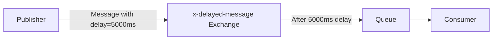

# RabbitMQ Delayed Message Plugin

## Introduction

In message queue systems, there are often situations where you need to delay the delivery of a message. For example, you might want to:

- Send a reminder email 24 hours after a user signs up
- Retry a failed operation after a cooldown period
- Schedule tasks to run at specific times
- Implement a backoff strategy for retrying operations

RabbitMQ, by default, delivers messages as soon as they are published. However, with the **Delayed Message Plugin**, you can schedule messages to be delivered at a later time. This plugin adds a new exchange type called `x-delayed-message` that allows publishers to specify a delay time for each message.

## How It Works

When a message is published to a delayed message exchange, the exchange holds the message for the specified delay period before routing it to the bound queues. The message is not immediately visible to consumers until the delay time has passed.



## Installation

Before using the delayed message plugin, you need to install it on your RabbitMQ server.

### Step 1: Download the Plugin

The plugin is available on GitHub: [rabbitmq-delayed-message-exchange](https://github.com/rabbitmq/rabbitmq-delayed-message-exchange/releases)

### Step 2: Copy the Plugin to RabbitMQ Plugins Directory

```bash
cp rabbitmq_delayed_message_exchange-*.ez $RABBITMQ_HOME/plugins/
```

### Step 3: Enable the Plugin

```bash
rabbitmq-plugins enable rabbitmq_delayed_message_exchange
```

### Step 4: Restart RabbitMQ (if necessary)

```bash
rabbitmq-server restart
```

## Using the Delayed Message Plugin

### Creating a Delayed Message Exchange

To use delayed messaging, you need to create an exchange with the type `x-delayed-message`:

```javascript
// JavaScript with amqplib
async function setupDelayedExchange() {
  const connection = await amqp.connect('amqp://localhost');
  const channel = await connection.createChannel();
  
  await channel.assertExchange('my-delayed-exchange', 'x-delayed-message', {
    arguments: {
      'x-delayed-type': 'direct' // The underlying exchange type
    }
  });
  
  await channel.assertQueue('my-queue');
  await channel.bindQueue('my-queue', 'my-delayed-exchange', 'my-routing-key');
  
  return { connection, channel };
}
```

In this example, we create a delayed message exchange with an underlying type of `direct`. The `x-delayed-type` argument specifies how the exchange should route messages after the delay has passed.

### Publishing Delayed Messages

To publish a message with a delay, you need to include the `x-delay` header with the delay time in milliseconds:

```javascript
// JavaScript with amqplib
async function publishDelayedMessage(channel, message, delayMs) {
  await channel.publish(
    'my-delayed-exchange',
    'my-routing-key',
    Buffer.from(JSON.stringify(message)),
    {
      headers: {
        'x-delay': delayMs // Delay in milliseconds
      }
    }
  );
  
  console.log(`Message scheduled for delivery in ${delayMs}ms`);
}

// Example usage
const message = { id: 123, content: 'This is a delayed message' };
await publishDelayedMessage(channel, message, 10000); // 10-second delay
```

### Consuming Delayed Messages

Consuming delayed messages is the same as consuming regular messages:

```javascript
// JavaScript with amqplib
async function consumeMessages(channel) {
  await channel.consume('my-queue', (msg) => {
    if (msg) {
      const content = JSON.parse(msg.content.toString());
      console.log('Received delayed message:', content);
      channel.ack(msg);
    }
  });
  
  console.log('Consumer started, waiting for messages...');
}
```

## Complete Example

Let's put it all together with a complete example:

```javascript
// delayed-message-example.js
const amqp = require('amqplib');

async function main() {
  // Connect to RabbitMQ
  const connection = await amqp.connect('amqp://localhost');
  const channel = await connection.createChannel();
  
  // Set up exchange and queue
  await channel.assertExchange('delay-exchange', 'x-delayed-message', {
    arguments: {
      'x-delayed-type': 'direct'
    }
  });
  
  await channel.assertQueue('delayed-queue');
  await channel.bindQueue('delayed-queue', 'delay-exchange', 'delayed');
  
  // Start consumer
  channel.consume('delayed-queue', (msg) => {
    const content = JSON.parse(msg.content.toString());
    const now = new Date().toISOString();
    console.log(`[${now}] Received: ${content.text}`);
    channel.ack(msg);
  });
  
  // Publish messages with different delays
  const publishWithDelay = (text, delay) => {
    const message = { text };
    const now = new Date().toISOString();
    
    channel.publish(
      'delay-exchange',
      'delayed',
      Buffer.from(JSON.stringify(message)),
      {
        headers: {
          'x-delay': delay
        }
      }
    );
    
    console.log(`[${now}] Sent message: "${text}" with ${delay}ms delay`);
  };
  
  // Publish several messages with different delays
  publishWithDelay('This should arrive after 5 seconds', 5000);
  publishWithDelay('This should arrive after 10 seconds', 10000);
  publishWithDelay('This should arrive after 2 seconds', 2000);
  
  // Keep the program running
  console.log('Waiting for messages to be delivered. Press Ctrl+C to exit.');
}

main().catch(console.error);
```

### Output

When you run this example, you should see output similar to:

```
[2023-05-15T14:30:00.123Z] Sent message: "This should arrive after 5 seconds" with 5000ms delay
[2023-05-15T14:30:00.125Z] Sent message: "This should arrive after 10 seconds" with 10000ms delay
[2023-05-15T14:30:00.126Z] Sent message: "This should arrive after 2 seconds" with 2000ms delay
Waiting for messages to be delivered. Press Ctrl+C to exit.
[2023-05-15T14:30:02.127Z] Received: This should arrive after 2 seconds
[2023-05-15T14:30:05.124Z] Received: This should arrive after 5 seconds
[2023-05-15T14:30:10.126Z] Received: This should arrive after 10 seconds
```

Notice how the messages are received in the order of their delay times, not in the order they were published.

## Real-World Use Cases

### 1. Implementing Retry Logic with Exponential Backoff

When processing fails, you can reschedule the message with an increasing delay:

```javascript
channel.consume('task-queue', async (msg) => {
  try {
    await processTask(JSON.parse(msg.content.toString()));
    channel.ack(msg);
  } catch (error) {
    // Get retry count from message (or default to 0)
    const retryCount = (msg.properties.headers['x-retry-count'] || 0) + 1;
    
    if (retryCount <= 5) {
      // Calculate delay using exponential backoff: 1s, 2s, 4s, 8s, 16s
      const delay = Math.pow(2, retryCount - 1) * 1000;
      
      // Republish with delay and updated retry count
      channel.publish(
        'delay-exchange',
        'delayed',
        msg.content,
        {
          headers: {
            'x-delay': delay,
            'x-retry-count': retryCount
          }
        }
      );
      
      console.log(`Task failed, retry ${retryCount}/5 scheduled in ${delay}ms`);
      channel.ack(msg);
    } else {
      // Move to dead letter queue after max retries
      channel.reject(msg, false);
      console.log(`Task failed after 5 retries, moved to DLQ`);
    }
  }
});
```

### 2. Scheduling Notifications or Reminders

```javascript
function scheduleReminder(userId, message, delayInMinutes) {
  channel.publish(
    'notifications-exchange',
    'delayed-notifications',
    Buffer.from(JSON.stringify({
      userId,
      message,
      type: 'reminder'
    })),
    {
      headers: {
        'x-delay': delayInMinutes * 60 * 1000 // Convert minutes to milliseconds
      }
    }
  );
  
  console.log(`Reminder scheduled for user ${userId} in ${delayInMinutes} minutes`);
}

// Example: Schedule a reminder for user 42 in 30 minutes
scheduleReminder(42, 'Don't forget to complete your profile!', 30);
```

### 3. Implementing a Time-Based Workflow

```javascript
// When a user signs up
function onUserSignup(userId) {
  // Schedule welcome email immediately
  sendEmail(userId, 'welcome');
  
  // Schedule a follow-up email after 24 hours
  scheduleEmail(userId, 'tips', 24 * 60);
  
  // Schedule an engagement check after 3 days
  scheduleEngagementCheck(userId, 3 * 24 * 60);
}

function scheduleEmail(userId, templateName, delayInMinutes) {
  channel.publish(
    'email-exchange',
    'delayed-emails',
    Buffer.from(JSON.stringify({
      userId,
      templateName
    })),
    {
      headers: {
        'x-delay': delayInMinutes * 60 * 1000
      }
    }
  );
}

function scheduleEngagementCheck(userId, delayInMinutes) {
  channel.publish(
    'workflow-exchange',
    'delayed-workflows',
    Buffer.from(JSON.stringify({
      userId,
      action: 'check-engagement'
    })),
    {
      headers: {
        'x-delay': delayInMinutes * 60 * 1000
      }
    }
  );
}
```

## Considerations and Limitations

While the Delayed Message Plugin is powerful, there are some important considerations:

1. **Message Persistence**: Delayed messages are stored in memory by default. For reliability, configure the exchange with `durable: true`.

2. **Performance Impact**: The plugin adds overhead to RabbitMQ, especially with many delayed messages. Consider the impact on your system.

3. **Maximum Delay**: There's no specified maximum delay, but extremely long delays (days or weeks) might not be ideal for this plugin.

4. **Cluster Behavior**: In a RabbitMQ cluster, delayed messages are not automatically synchronized between nodes. If the node holding delayed messages goes down, those messages might be lost.

5. **Precision**: The timing precision is not guaranteed to be exact. Messages might be delivered slightly earlier or later than the specified delay.

## Summary

The RabbitMQ Delayed Message Plugin provides a powerful way to schedule messages for future delivery. It's useful for implementing:

- Retry mechanisms with backoff strategies
- Scheduled notifications and reminders
- Time-based workflows
- Throttling and rate limiting
- Task scheduling

By creating an exchange of type `x-delayed-message` and setting the `x-delay` header on your messages, you can easily implement these patterns in your applications.

## Additional Resources

- [RabbitMQ Delayed Message Plugin GitHub Repository](https://github.com/rabbitmq/rabbitmq-delayed-message-exchange)
- [RabbitMQ Official Documentation](https://www.rabbitmq.com/documentation.html)
- [AMQP 0-9-1 Protocol Specification](https://www.rabbitmq.com/resources/specs/amqp0-9-1.pdf)

## Exercises

1. Implement a task scheduler that allows users to schedule tasks at specific times using the Delayed Message Plugin.

2. Create a rate limiter that processes no more than N messages per minute by requeuing messages with a delay.

3. Implement a notification system that sends reminders at increasing intervals (1 day, 3 days, 7 days) until the user completes an action.

4. Build a service that implements the Circuit Breaker pattern using delayed messages to automatically reset the circuit after a cooling period.