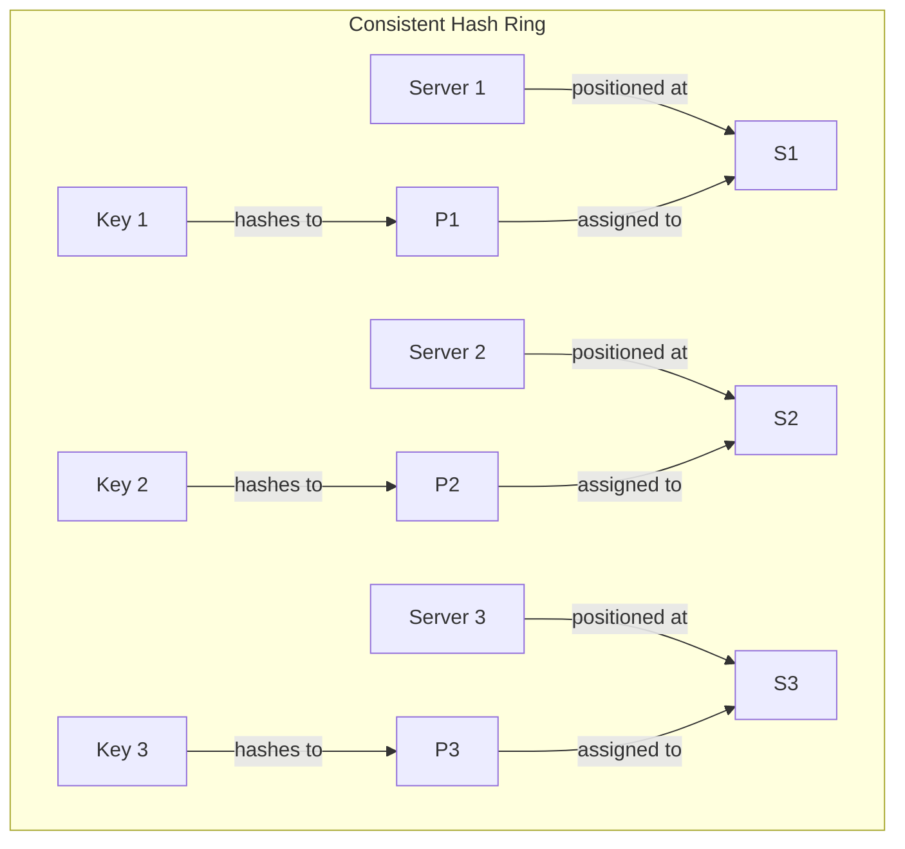

# RabbitMQ Consistent Hash Exchange

## Introduction

RabbitMQ is a powerful message broker that helps you manage asynchronous communication between different parts of your application. While RabbitMQ comes with several built-in exchange types (direct, topic, fanout, and headers), sometimes you need additional functionality. This is where plugins come in.

The **Consistent Hash Exchange** is a popular RabbitMQ plugin that provides a special type of exchange that distributes messages to queues based on the consistent hashing algorithm. This plugin is particularly useful when you need to:

- Distribute work evenly across multiple consumers
- Ensure that messages with the same routing key always go to the same queue
- Maintain message distribution when adding or removing queues

In this guide, we'll explore what consistent hashing is, how it works in RabbitMQ, and how to use it in your applications.

## What is Consistent Hashing?

Before diving into the RabbitMQ plugin, let's understand what consistent hashing is and why it's useful.

### Traditional Hashing vs. Consistent Hashing

With traditional hashing, if you have `n` servers and you're distributing messages using `hash(key) % n`, adding or removing a server would cause a significant redistribution of keys. Almost all keys would need to be remapped.

Consistent hashing solves this problem by arranging the hash range in a circle (or "ring"). Both servers and keys are mapped to positions on this ring. Each key is assigned to the nearest server going clockwise around the ring.

When a server is added or removed, only a small fraction of keys need to be remapped, making the system more stable during scaling events.



## The Consistent Hash Exchange Plugin

The Consistent Hash Exchange plugin implements this algorithm in RabbitMQ. It allows you to distribute messages across multiple queues based on a consistent hash of the routing key or a message header.

### How It Works in RabbitMQ

1. You create a consistent hash exchange (`x-consistent-hash` type)
2. You bind queues to this exchange with a binding key that represents a "weight" (a numeric value)
3. The exchange computes a hash of the routing key or a specified header value
4. Based on this hash, the exchange routes the message to one of the bound queues
5. Queues with higher weight values receive proportionally more messages

## Setting Up the Consistent Hash Exchange

### 1. Enable the Plugin

First, you need to enable the plugin on your RabbitMQ server:

```bash
rabbitmq-plugins enable rabbitmq_consistent_hash_exchange
```

### 2. Create a Consistent Hash Exchange

Now you can create a consistent hash exchange in your application:

```javascript
// Using amqplib for Node.js
const amqp = require('amqplib');

async function setup() {
  const connection = await amqp.connect('amqp://localhost');
  const channel = await connection.createChannel();
  
  // Declare the consistent hash exchange
  await channel.assertExchange('orders_distribution', 'x-consistent-hash', {
    durable: true
  });
  
  // Rest of the setup...
}
```

### 3. Bind Queues with Weights

Next, bind queues to the exchange with numeric weights:

```javascript
// Create and bind the queues
await channel.assertQueue('orders_queue_1', { durable: true });
await channel.assertQueue('orders_queue_2', { durable: true });
await channel.assertQueue('orders_queue_3', { durable: true });

// Bind queues with weights
// The weights (1, 2, and 3) determine the proportion of messages each queue receives
await channel.bindQueue('orders_queue_1', 'orders_distribution', '1');
await channel.bindQueue('orders_queue_2', 'orders_distribution', '2');
await channel.bindQueue('orders_queue_3', 'orders_distribution', '3');
```

In this example:
- `orders_queue_1` has a weight of 1
- `orders_queue_2` has a weight of 2
- `orders_queue_3` has a weight of 3

This means `orders_queue_3` will receive approximately 3 times as many messages as `orders_queue_1` and 1.5 times as many as `orders_queue_2`.

### 4. Publish Messages

Now you can publish messages to the exchange:

```javascript
// Publish a message with a routing key
function publishOrder(orderId) {
  channel.publish(
    'orders_distribution',
    orderId.toString(), // This is the routing key that will be hashed
    Buffer.from(JSON.stringify({ id: orderId, /* other order data */ }))
  );
  console.log(`Order ${orderId} published`);
}

// Publish some sample orders
for (let i = 1; i <= 10; i++) {
  publishOrder(i);
}
```

The exchange will hash the routing key (the order ID in this case) and consistently route messages with the same ID to the same queue.

## Using Header-Based Hashing

By default, the consistent hash exchange uses the routing key for hashing. However, you can configure it to use a specific message header instead:

```javascript
// Create an exchange that hashes based on a header
await channel.assertExchange('user_events', 'x-consistent-hash', {
  durable: true,
  arguments: {
    'hash-header': 'user-id'
  }
});

// When publishing, include the header
channel.publish(
  'user_events',
  '', // Routing key can be empty when using header-based hashing
  Buffer.from(JSON.stringify({ action: 'login' })),
  {
    headers: {
      'user-id': '12345'
    }
  }
);
```

In this example, messages will be routed based on the `user-id` header value rather than the routing key.

## Real-World Applications

### 1. User Session Management

Imagine you're building a chat application where users can send messages. You want to ensure that all messages from a specific user are processed by the same server to maintain session state.

```javascript
// Producer code
function sendChatMessage(userId, message) {
  channel.publish(
    'chat_messages',
    userId.toString(), // User ID as the routing key
    Buffer.from(JSON.stringify({ 
      userId, 
      message, 
      timestamp: Date.now() 
    }))
  );
}

// Consumer setup
async function setupConsumers(numConsumers) {
  for (let i = 1; i <= numConsumers; i++) {
    const queueName = `chat_processor_${i}`;
    await channel.assertQueue(queueName, { durable: true });
    await channel.bindQueue(queueName, 'chat_messages', '1');
    
    channel.consume(queueName, async (msg) => {
      if (msg) {
        const chatMessage = JSON.parse(msg.content.toString());
        console.log(`Consumer ${i} processing message from user ${chatMessage.userId}`);
        
        // Process the message...
        
        channel.ack(msg);
      }
    });
  }
}
```

With this setup, all messages from the same user will be consistently routed to the same consumer, allowing that consumer to maintain user-specific state.

### 2. Sharded Database Operations

If you have a sharded database, you can use consistent hashing to ensure operations on the same entity are always sent to the same shard:

```javascript
// Setting up the exchange
await channel.assertExchange('db_operations', 'x-consistent-hash', { durable: true });

// Setting up queues for each database shard
const shardCount = 4;
for (let i = 1; i <= shardCount; i++) {
  const queueName = `db_shard_${i}`;
  await channel.assertQueue(queueName, { durable: true });
  await channel.bindQueue(queueName, 'db_operations', '1');
}

// Publishing an operation
function scheduleDbOperation(entityId, operation) {
  channel.publish(
    'db_operations',
    entityId.toString(), // Entity ID as the routing key
    Buffer.from(JSON.stringify({ 
      entityId, 
      operation, 
      timestamp: Date.now() 
    }))
  );
}

// Example usage
scheduleDbOperation('customer-1234', { type: 'UPDATE', fields: { name: 'New Name' }});
```

This ensures that all operations for a specific entity are sent to the same shard, maintaining data consistency.

## Performance Considerations

When using the Consistent Hash Exchange plugin, keep these factors in mind:

1. **Binding Weights**: Choose appropriate weights based on the capacity of your consumers. Consumers with more processing power should have higher weights.

2. **Number of Bindings**: The hashing algorithm's distribution improves with more points on the hash ring. For better distribution, you can bind a queue multiple times:

```javascript
// Bind the same queue multiple times for better distribution
for (let i = 0; i < 10; i++) {
  await channel.bindQueue('high_capacity_queue', 'work_distribution', '1');
}
```

3. **Message Batching**: Consider batching related messages with the same routing key to ensure they're processed by the same consumer.

## Handling Queue Failures

One challenge with consistent hashing is handling situations when a queue or consumer fails. Since RabbitMQ doesn't automatically redistribute messages, you'll need to implement your own failover mechanism:

```javascript
// Monitor queue health
function monitorQueues() {
  // Check queue status periodically
  setInterval(async () => {
    try {
      const queues = ['queue_1', 'queue_2', 'queue_3'];
      for (const queue of queues) {
        const response = await channel.checkQueue(queue);
        console.log(`Queue ${queue}: ${response.messageCount} messages`);
      }
    } catch (error) {
      console.error('Queue check failed:', error.message);
      // Implement recovery logic here
    }
  }, 30000); // Check every 30 seconds
}
```

For more robust failover:
1. Use RabbitMQ's clustering capabilities
2. Implement queue mirroring policies
3. Consider using the Shovel or Federation plugins for cross-cluster replication

## Summary

The RabbitMQ Consistent Hash Exchange plugin provides a powerful way to distribute messages predictably across multiple queues. By using consistent hashing, it minimizes redistribution when the number of consumers changes, making it ideal for:

- Stateful processing where related messages need to be handled by the same consumer
- Load balancing with weighted distribution
- Sharding operations across multiple workers

When implementing this pattern, remember:
- Choose appropriate weights based on consumer capacity
- Consider using multiple bindings for better distribution
- Implement proper monitoring and failover mechanisms

## Additional Resources

- [RabbitMQ Consistent Hash Exchange Plugin Documentation](https://github.com/rabbitmq/rabbitmq-consistent-hash-exchange)
- [Consistent Hashing Algorithm Explained](https://www.toptal.com/big-data/consistent-hashing)
- [Advanced Message Queuing Protocol (AMQP) Specification](https://www.amqp.org/)

## Exercises

1. Set up a RabbitMQ server with the Consistent Hash Exchange plugin and create a simple producer/consumer application that distributes work based on a customer ID.

2. Experiment with different binding weights and measure how they affect message distribution.

3. Implement a failover mechanism that redirects messages when a queue goes offline.

4. Create a visualization of how messages are distributed across queues when using the consistent hash exchange compared to a round-robin approach.