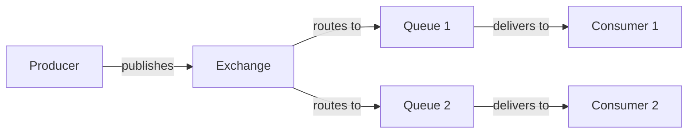
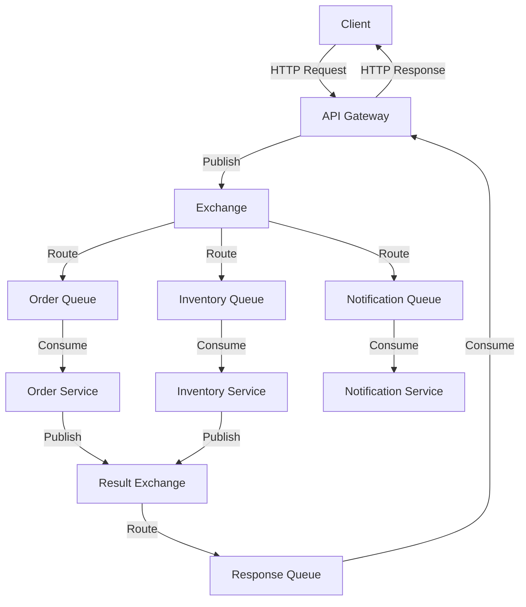

# RabbitMQ Node.js Integration

## Introduction

RabbitMQ is a powerful open-source message broker that enables applications to communicate asynchronously through a common messaging protocol. In this guide, we'll explore how to integrate RabbitMQ with Node.js applications to implement reliable messaging patterns, improving the scalability and resilience of your software systems.

By the end of this tutorial, you'll understand how to:
- Set up RabbitMQ with Node.js
- Implement basic messaging patterns
- Handle message persistence and acknowledgment
- Scale your application with work queues
- Implement advanced routing strategies

## Prerequisites

Before we begin, ensure you have:
- Node.js installed (version 14.x or higher)
- RabbitMQ server installed and running
- Basic understanding of JavaScript and Node.js
- npm or yarn package manager

## Setting Up Your Node.js Project

Let's start by creating a new Node.js project and installing the required dependencies:

```bash
mkdir rabbitmq-nodejs-demo
cd rabbitmq-nodejs-demo
npm init -y
npm install amqplib
```

The `amqplib` package is the most popular RabbitMQ client for Node.js that implements the AMQP 0-9-1 protocol.

## Understanding the Architecture

Before diving into the code, let's understand the basic architecture of RabbitMQ integration:



In this model:
- **Producers** send messages to an **Exchange**
- **Exchanges** route messages to **Queues** based on rules
- **Consumers** receive messages from **Queues**

## Basic RabbitMQ-Node.js Integration

### Connecting to RabbitMQ

The first step is establishing a connection to your RabbitMQ server:

```javascript
const amqp = require('amqplib');

async function connectToRabbitMQ() {
  try {
    // Create a connection
    const connection = await amqp.connect('amqp://localhost');
    
    // Create a channel
    const channel = await connection.createChannel();
    
    console.log('Connected to RabbitMQ successfully');
    return { connection, channel };
  } catch (error) {
    console.error('Error connecting to RabbitMQ:', error);
    throw error;
  }
}
```

### Creating a Simple Producer

Let's create a basic producer that sends messages to a queue:

```javascript
async function sendMessage(channel, queueName, message) {
  try {
    // Make sure the queue exists
    await channel.assertQueue(queueName, {
      durable: false  // Queue will be lost if RabbitMQ restarts
    });
    
    // Send the message
    channel.sendToQueue(queueName, Buffer.from(message));
    console.log(`Sent: ${message}`);
  } catch (error) {
    console.error('Error sending message:', error);
    throw error;
  }
}

// Usage example
async function runProducer() {
  const { connection, channel } = await connectToRabbitMQ();
  
  // Send a few messages
  await sendMessage(channel, 'hello', 'Hello World!');
  await sendMessage(channel, 'hello', 'Another message');
  
  // Close the connection after a delay
  setTimeout(() => {
    connection.close();
    console.log('Connection closed');
  }, 500);
}

runProducer().catch(console.error);
```

### Creating a Simple Consumer

Now, let's create a consumer that receives messages from the queue:

```javascript
async function receiveMessages(channel, queueName) {
  try {
    // Make sure the queue exists
    await channel.assertQueue(queueName, {
      durable: false
    });
    
    console.log(`Waiting for messages from ${queueName}. To exit press CTRL+C`);
    
    // Consume messages
    channel.consume(queueName, (message) => {
      if (message !== null) {
        console.log(`Received: ${message.content.toString()}`);
        channel.ack(message); // Acknowledge the message
      }
    });
  } catch (error) {
    console.error('Error receiving messages:', error);
    throw error;
  }
}

// Usage example
async function runConsumer() {
  const { connection, channel } = await connectToRabbitMQ();
  await receiveMessages(channel, 'hello');
  
  // Keep the connection open
  // Close with process.exit() or CTRL+C
}

runConsumer().catch(console.error);
```

## Running Your First Example

Save the producer code in a file called `producer.js` and the consumer code in `consumer.js`. Run the consumer in one terminal:

```bash
node consumer.js
```

Then run the producer in another terminal:

```bash
node producer.js
```

You should see the messages being sent by the producer and received by the consumer.

## Work Queues - Distributing Tasks

For CPU-intensive tasks, you can distribute work among multiple workers using a Work Queue pattern:

```javascript
// producer.js
async function sendTask(channel, queueName, task) {
  try {
    await channel.assertQueue(queueName, {
      durable: true  // Queue will survive RabbitMQ restarts
    });
    
    // Mark message as persistent
    channel.sendToQueue(queueName, Buffer.from(task), {
      persistent: true
    });
    console.log(`Task sent: ${task}`);
  } catch (error) {
    console.error('Error sending task:', error);
    throw error;
  }
}

// Example: Send multiple tasks with artificial delays
async function runTaskProducer() {
  const { connection, channel } = await connectToRabbitMQ();
  const queue = 'task_queue';
  
  const tasks = [
    'Task 1 - Simple task',
    'Task 2 - Medium task..',
    'Task 3 - Complex task......',
    'Task 4 - Very complex task............'
  ];
  
  for (const task of tasks) {
    await sendTask(channel, queue, task);
  }
  
  setTimeout(() => {
    connection.close();
    console.log('Producer connection closed');
  }, 500);
}

runTaskProducer().catch(console.error);
```

```javascript
// worker.js
async function processTask(channel, queueName) {
  try {
    await channel.assertQueue(queueName, {
      durable: true
    });
    
    // Only process one message at a time
    channel.prefetch(1);
    console.log(`Worker waiting for tasks from ${queueName}. To exit press CTRL+C`);
    
    channel.consume(queueName, (message) => {
      if (message !== null) {
        const task = message.content.toString();
        console.log(`Received task: ${task}`);
        
        // Simulate processing time based on the number of dots
        const dots = task.split('.').length - 1;
        const processingTime = dots * 1000;
        
        setTimeout(() => {
          console.log(`Task completed: ${task}`);
          channel.ack(message); // Acknowledge only after processing
        }, processingTime);
      }
    });
  } catch (error) {
    console.error('Error processing tasks:', error);
    throw error;
  }
}

async function runWorker() {
  const { connection, channel } = await connectToRabbitMQ();
  await processTask(channel, 'task_queue');
  
  // Keep the connection open
}

runWorker().catch(console.error);
```

Run multiple worker instances to distribute the load. Each task will be processed by a single worker:

```bash
# Terminal 1
node worker.js

# Terminal 2
node worker.js

# Terminal 3
node producer.js
```

## Publish/Subscribe - Sending Messages to Multiple Consumers

Let's implement a pub/sub pattern where all consumers receive all messages:

```javascript
// publisher.js
async function publishMessage(channel, exchange, message) {
  try {
    // Create a fanout exchange
    await channel.assertExchange(exchange, 'fanout', {
      durable: false
    });
    
    // Publish message to the exchange
    channel.publish(exchange, '', Buffer.from(message));
    console.log(`Published: ${message}`);
  } catch (error) {
    console.error('Error publishing message:', error);
    throw error;
  }
}

async function runPublisher() {
  const { connection, channel } = await connectToRabbitMQ();
  const exchange = 'logs';
  
  const messages = [
    'Info: System starting up',
    'Warning: High CPU usage',
    'Error: Database connection failed',
    'Info: User logged in'
  ];
  
  for (const message of messages) {
    await publishMessage(channel, exchange, message);
  }
  
  setTimeout(() => {
    connection.close();
    console.log('Publisher connection closed');
  }, 500);
}

runPublisher().catch(console.error);
```

```javascript
// subscriber.js
async function subscribeToLogs(channel, exchange) {
  try {
    // Create a fanout exchange
    await channel.assertExchange(exchange, 'fanout', {
      durable: false
    });
    
    // Create an exclusive queue with a generated name
    const { queue } = await channel.assertQueue('', {
      exclusive: true
    });
    
    // Bind the queue to the exchange
    await channel.bindQueue(queue, exchange, '');
    
    console.log(`Waiting for logs. Subscriber queue: ${queue}`);
    
    channel.consume(queue, (message) => {
      if (message !== null) {
        console.log(`Received: ${message.content.toString()}`);
        channel.ack(message);
      }
    });
  } catch (error) {
    console.error('Error subscribing to logs:', error);
    throw error;
  }
}

async function runSubscriber() {
  const { connection, channel } = await connectToRabbitMQ();
  await subscribeToLogs(channel, 'logs');
  
  // Keep the connection open
}

runSubscriber().catch(console.error);
```

Run multiple subscribers to receive the same messages:

```bash
# Terminal 1
node subscriber.js

# Terminal 2
node subscriber.js

# Terminal 3
node publisher.js
```

## Routing - Receiving Selective Messages

To filter messages based on a routing key, we can use the Direct exchange type:

```javascript
// log_emitter.js
async function emitLog(channel, exchange, severity, message) {
  try {
    await channel.assertExchange(exchange, 'direct', {
      durable: false
    });
    
    channel.publish(exchange, severity, Buffer.from(message));
    console.log(`Emitted ${severity}: ${message}`);
  } catch (error) {
    console.error('Error emitting log:', error);
    throw error;
  }
}

async function runLogEmitter() {
  const { connection, channel } = await connectToRabbitMQ();
  const exchange = 'direct_logs';
  
  const logs = [
    { severity: 'info', message: 'Application started successfully' },
    { severity: 'warning', message: 'Config file not found, using defaults' },
    { severity: 'error', message: 'Could not connect to database' },
    { severity: 'info', message: 'User authentication successful' },
    { severity: 'error', message: 'Invalid API key provided' }
  ];
  
  for (const log of logs) {
    await emitLog(channel, exchange, log.severity, log.message);
  }
  
  setTimeout(() => {
    connection.close();
    console.log('Emitter connection closed');
  }, 500);
}

runLogEmitter().catch(console.error);
```

```javascript
// log_receiver.js
async function receiveLogsBySeverity(channel, exchange, severities) {
  try {
    await channel.assertExchange(exchange, 'direct', {
      durable: false
    });
    
    const { queue } = await channel.assertQueue('', {
      exclusive: true
    });
    
    for (const severity of severities) {
      await channel.bindQueue(queue, exchange, severity);
    }
    
    console.log(`Waiting for ${severities.join(', ')} logs`);
    
    channel.consume(queue, (message) => {
      if (message !== null) {
        const severity = message.fields.routingKey;
        const content = message.content.toString();
        console.log(`[${severity}] ${content}`);
        channel.ack(message);
      }
    });
  } catch (error) {
    console.error('Error receiving logs by severity:', error);
    throw error;
  }
}

async function runLogReceiver() {
  const { connection, channel } = await connectToRabbitMQ();
  const exchange = 'direct_logs';
  
  // Get severities from command line arguments or use defaults
  const severities = process.argv.slice(2);
  if (severities.length === 0) {
    console.log('Usage: node log_receiver.js [info] [warning] [error]');
    process.exit(1);
  }
  
  await receiveLogsBySeverity(channel, exchange, severities);
  
  // Keep the connection open
}

runLogReceiver().catch(console.error);
```

Run different receivers for different severities:

```bash
# Terminal 1 - Error logs only
node log_receiver.js error

# Terminal 2 - Info and warning logs
node log_receiver.js info warning

# Terminal 3 - All logs
node log_receiver.js info warning error

# Terminal 4 - Emit logs
node log_emitter.js
```

## Topics - Pattern-Based Routing

For more flexible routing based on patterns, we can use the Topic exchange:

```javascript
// topic_publisher.js
async function publishTopicMessage(channel, exchange, routingKey, message) {
  try {
    await channel.assertExchange(exchange, 'topic', {
      durable: false
    });
    
    channel.publish(exchange, routingKey, Buffer.from(message));
    console.log(`Published [${routingKey}]: ${message}`);
  } catch (error) {
    console.error('Error publishing topic message:', error);
    throw error;
  }
}

async function runTopicPublisher() {
  const { connection, channel } = await connectToRabbitMQ();
  const exchange = 'topic_logs';
  
  const messages = [
    { key: 'auth.info', message: 'User logged in successfully' },
    { key: 'auth.error', message: 'Invalid credentials' },
    { key: 'api.warning', message: 'API rate limit approaching' },
    { key: 'db.error', message: 'Query timeout' },
    { key: 'system.critical', message: 'Out of memory' }
  ];
  
  for (const msg of messages) {
    await publishTopicMessage(channel, exchange, msg.key, msg.message);
  }
  
  setTimeout(() => {
    connection.close();
    console.log('Publisher connection closed');
  }, 500);
}

runTopicPublisher().catch(console.error);
```

```javascript
// topic_subscriber.js
async function subscribeToTopics(channel, exchange, topics) {
  try {
    await channel.assertExchange(exchange, 'topic', {
      durable: false
    });
    
    const { queue } = await channel.assertQueue('', {
      exclusive: true
    });
    
    for (const topic of topics) {
      await channel.bindQueue(queue, exchange, topic);
    }
    
    console.log(`Waiting for messages matching: ${topics.join(', ')}`);
    
    channel.consume(queue, (message) => {
      if (message !== null) {
        const routingKey = message.fields.routingKey;
        const content = message.content.toString();
        console.log(`[${routingKey}] ${content}`);
        channel.ack(message);
      }
    });
  } catch (error) {
    console.error('Error subscribing to topics:', error);
    throw error;
  }
}

async function runTopicSubscriber() {
  const { connection, channel } = await connectToRabbitMQ();
  const exchange = 'topic_logs';
  
  // Get topics from command line arguments or use defaults
  const topics = process.argv.slice(2);
  if (topics.length === 0) {
    console.log('Usage: node topic_subscriber.js [topic pattern] ...');
    console.log('Example: node topic_subscriber.js "*.error" "auth.*"');
    process.exit(1);
  }
  
  await subscribeToTopics(channel, exchange, topics);
  
  // Keep the connection open
}

runTopicSubscriber().catch(console.error);
```

Run subscribers with different pattern matches:

```bash
# Terminal 1 - All error messages
node topic_subscriber.js "*.error"

# Terminal 2 - All auth-related messages
node topic_subscriber.js "auth.*"

# Terminal 3 - All messages
node topic_subscriber.js "#"

# Terminal 4 - Publish messages
node topic_publisher.js
```

## RPC (Remote Procedure Call) Pattern

Let's implement a simple RPC system with RabbitMQ:

```javascript
// rpc_server.js
async function setupRpcServer(channel, queue, processFunction) {
  try {
    await channel.assertQueue(queue, {
      durable: false
    });
    
    channel.prefetch(1);
    console.log(`RPC Server waiting for requests on ${queue}`);
    
    channel.consume(queue, async (message) => {
      if (message !== null) {
        const content = message.content.toString();
        console.log(`Received request: ${content}`);
        
        // Process the request
        const result = await processFunction(content);
        
        // Send back the response
        channel.sendToQueue(
          message.properties.replyTo,
          Buffer.from(result.toString()),
          {
            correlationId: message.properties.correlationId
          }
        );
        
        channel.ack(message);
        console.log(`Sent response: ${result}`);
      }
    });
  } catch (error) {
    console.error('Error setting up RPC server:', error);
    throw error;
  }
}

// Example: Fibonacci calculator
function fibonacci(n) {
  if (n <= 0) return 0;
  if (n == 1) return 1;
  return fibonacci(n - 1) + fibonacci(n - 2);
}

async function runRpcServer() {
  const { connection, channel } = await connectToRabbitMQ();
  
  await setupRpcServer(channel, 'rpc_queue', (request) => {
    const n = parseInt(request);
    console.log(`Computing fibonacci(${n})`);
    
    // Simulate processing time
    const start = Date.now();
    const result = fibonacci(n);
    const duration = Date.now() - start;
    console.log(`Computed fibonacci(${n}) = ${result} in ${duration}ms`);
    
    return result;
  });
  
  // Keep the connection open
  console.log('RPC server started. Press Ctrl+C to exit.');
}

runRpcServer().catch(console.error);
```

```javascript
// rpc_client.js
class FibonacciRpcClient {
  constructor() {
    this.connection = null;
    this.channel = null;
    this.responseQueue = null;
    this.pendingRequests = new Map();
  }
  
  async connect() {
    try {
      this.connection = await amqp.connect('amqp://localhost');
      this.channel = await this.connection.createChannel();
      
      // Create an exclusive callback queue
      const { queue } = await this.channel.assertQueue('', {
        exclusive: true
      });
      this.responseQueue = queue;
      
      // Set up the consumer for responses
      this.channel.consume(
        this.responseQueue,
        (message) => {
          if (message !== null) {
            const correlationId = message.properties.correlationId;
            if (this.pendingRequests.has(correlationId)) {
              const { resolve } = this.pendingRequests.get(correlationId);
              const response = message.content.toString();
              resolve(response);
              this.pendingRequests.delete(correlationId);
            }
            this.channel.ack(message);
          }
        },
        {
          noAck: false
        }
      );
      
      console.log('RPC client connected');
    } catch (error) {
      console.error('Error connecting RPC client:', error);
      throw error;
    }
  }
  
  async call(n) {
    return new Promise((resolve, reject) => {
      try {
        const correlationId = generateUuid();
        
        // Store the Promise callbacks for later resolution
        this.pendingRequests.set(correlationId, { resolve, reject });
        
        // Send the RPC request
        this.channel.sendToQueue(
          'rpc_queue',
          Buffer.from(n.toString()),
          {
            correlationId,
            replyTo: this.responseQueue
          }
        );
        
        console.log(`Sent RPC request for fibonacci(${n})`);
      } catch (error) {
        reject(error);
      }
    });
  }
  
  async close() {
    if (this.connection) {
      await this.connection.close();
      console.log('RPC client connection closed');
    }
  }
}

// Helper function to generate a UUID
function generateUuid() {
  return Math.random().toString() +
         Math.random().toString() +
         Math.random().toString();
}

async function runRpcClient() {
  const client = new FibonacciRpcClient();
  await client.connect();
  
  try {
    // Make RPC calls
    const numbers = [10, 20, 30, 5, 40];
    
    for (const n of numbers) {
      console.log(`Requesting fibonacci(${n})`);
      const start = Date.now();
      const result = await client.call(n);
      const duration = Date.now() - start;
      console.log(`Got response for fibonacci(${n}) = ${result} in ${duration}ms`);
    }
  } finally {
    await client.close();
  }
}

runRpcClient().catch(console.error);
```

Run the RPC server and client:

```bash
# Terminal 1
node rpc_server.js

# Terminal 2
node rpc_client.js
```

## Error Handling and Best Practices

When working with RabbitMQ in production, follow these best practices:

### Connection Management

```javascript
// Proper connection management
async function createRabbitMQConnection() {
  try {
    const connection = await amqp.connect('amqp://localhost');
    
    // Handle connection close
    connection.on('close', (err) => {
      console.log('RabbitMQ connection closed', err ? `with error: ${err.message}` : 'gracefully');
      // Implement reconnection logic if needed
    });
    
    // Handle connection errors
    connection.on('error', (err) => {
      console.error('RabbitMQ connection error:', err.message);
    });
    
    return connection;
  } catch (error) {
    console.error('Failed to connect to RabbitMQ:', error.message);
    throw error;
  }
}
```

### Message Acknowledgment Patterns

```javascript
// Manual acknowledgment
channel.consume(queue, (message) => {
  try {
    // Process message
    processMessage(message);
    
    // Acknowledge successful processing
    channel.ack(message);
  } catch (error) {
    console.error('Error processing message:', error);
    
    // Negative acknowledgment - reject and requeue
    channel.nack(message, false, true);
    
    // Alternatively, to reject without requeuing:
    // channel.nack(message, false, false);
  }
}, { noAck: false }); // Disable auto-ack
```

### Dead Letter Exchanges

```javascript
// Set up a dead letter exchange for failed messages
async function setupDeadLetterQueue(channel) {
  // Declare the dead letter exchange
  await channel.assertExchange('dead.letter.exchange', 'direct', {
    durable: true
  });
  
  // Declare the dead letter queue
  await channel.assertQueue('dead.letter.queue', {
    durable: true
  });
  
  // Bind the queue to the exchange
  await channel.bindQueue('dead.letter.queue', 'dead.letter.exchange', 'dead.letter.routing.key');
  
  // Now, when setting up your main queue, reference the DLX
  await channel.assertQueue('main.queue', {
    durable: true,
    arguments: {
      'x-dead-letter-exchange': 'dead.letter.exchange',
      'x-dead-letter-routing-key': 'dead.letter.routing.key'
    }
  });
}
```

### Connection Pooling

For high-throughput applications, consider using a connection pool:

```javascript
// Simple connection pool implementation
class RabbitMQConnectionPool {
  constructor(connectionUrl, poolSize = 5) {
    this.connectionUrl = connectionUrl;
    this.poolSize = poolSize;
    this.connections = [];
    this.channels = [];
    this.initialized = false;
  }
  
  async initialize() {
    if (this.initialized) return;
    
    for (let i = 0; i < this.poolSize; i++) {
      const connection = await amqp.connect(this.connectionUrl);
      const channel = await connection.createChannel();
      
      this.connections.push(connection);
      this.channels.push(channel);
    }
    
    this.initialized = true;
    console.log(`RabbitMQ connection pool initialized with ${this.poolSize} connections`);
  }
  
  getChannel() {
    if (!this.initialized) {
      throw new Error('Pool not initialized. Call initialize() first');
    }
    
    // Simple round-robin channel selection
    const channel = this.channels.shift();
    this.channels.push(channel);
    return channel;
  }
  
  async close() {
    if (!this.initialized) return;
    
    for (const connection of this.connections) {
      await connection.close();
    }
    
    this.connections = [];
    this.channels = [];
    this.initialized = false;
    console.log('RabbitMQ connection pool closed');
  }
}

// Usage example
async function main() {
  const pool = new RabbitMQConnectionPool('amqp://localhost', 3);
  await pool.initialize();
  
  try {
    // Get a channel from the pool
    const channel = pool.getChannel();
    
    // Use the channel
    await channel.assertQueue('pooled_queue');
    channel.sendToQueue('pooled_queue', Buffer.from('Message from pooled channel'));
  } finally {
    await pool.close();
  }
}
```

## Real-World Application: Microservice Communication

Here's an example of how RabbitMQ can facilitate communication between microservices:



Let's implement a simplified version of this pattern:

```javascript
// order_service.js
async function setupOrderService(channel) {
  await channel.assertQueue('order_queue', { durable: true });
  await channel.assertExchange('result_exchange', 'direct', { durable: true });
  
  console.log('Order service waiting for orders');
  
  channel.consume('order_queue', async (message) => {
    if (message !== null) {
      try {
        const order = JSON.parse(message.content.toString());
        console.log(`Processing order: ${order.id}`);
        
        // Simulate order processing
        await new Promise(resolve => setTimeout(resolve, 1000));
        
        // Publish result
        const result = {
          orderId: order.id,
          status: 'processed',
          timestamp: new Date().toISOString()
        };
        
        channel.publish(
          'result_exchange',
          'order.processed',
          Buffer.from(JSON.stringify(result)),
          { correlationId: message.properties.correlationId }
        );
        
        channel.ack(message);
      } catch (error) {
        console.error('Error processing order:', error);
        channel.nack(message, false, false); // Don't requeue
      }
    }
  });
}

async function startOrderService() {
  const { connection, channel } = await connectToRabbitMQ();
  await setupOrderService(channel);
  // Keep service running
}

startOrderService().catch(console.error);
```

```javascript
// api_gateway.js
async function setupApiGateway(channel) {
  // Set up the response queue
  const { queue: responseQueue } = await channel.assertQueue('', {
    exclusive: true
  });
  
  // Bind to the result exchange
  await channel.assertExchange('result_exchange', 'direct', { durable: true });
  await channel.bindQueue(responseQueue, 'result_exchange', 'order.processed');
  
  // Set up request queues
  await channel.assertQueue('order_queue', { durable: true });
  
  // Process responses
  channel.consume(responseQueue, (message) => {
    if (message !== null) {
      const correlationId = message.properties.correlationId;
      const result = JSON.parse(message.content.toString());
      
      console.log(`Received result for correlation ID ${correlationId}:`, result);
      
      // In a real gateway, we would resolve HTTP responses here
      channel.ack(message);
    }
  });
  
  return {
    placeOrder: (order) => {
      const correlationId = Date.now().toString();
      
      channel.sendToQueue(
        'order_queue',
        Buffer.from(JSON.stringify(order)),
        { correlationId }
      );
      
      console.log(`Placed order ${order.id} with correlation ID ${correlationId}`);
      return correlationId;
    }
  };
}

async function simulateApi() {
  const { connection, channel } = await connectToRabbitMQ();
  const gateway = await setupApiGateway(channel);
  
  // Simulate API requests
  const orders = [
    { id: '001', customer: 'Alice', items: ['item1', 'item2'], total: