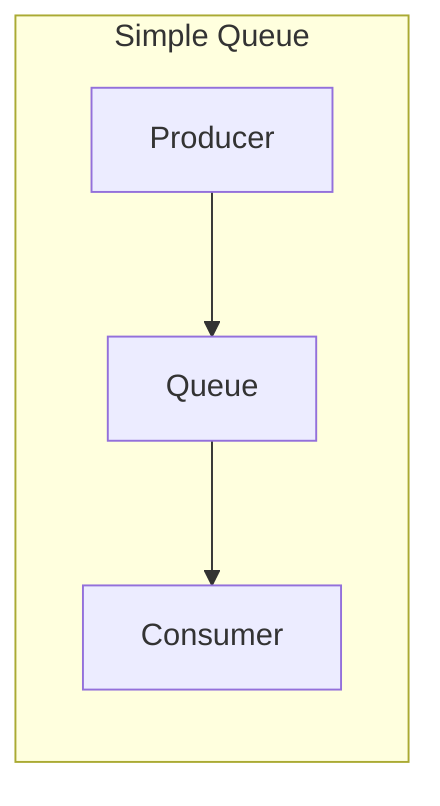
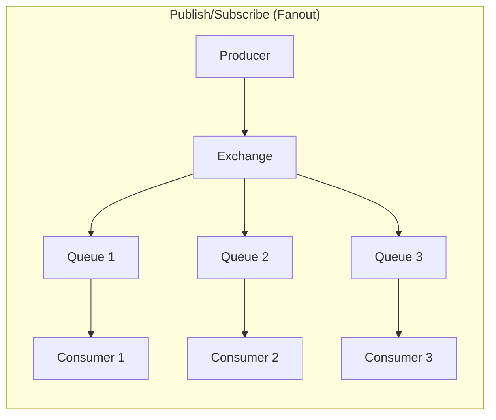

# RabbitMQ Python Integration

## Introduction

RabbitMQ is a powerful message broker that enables applications to communicate with each other through a standardized messaging protocol. By integrating RabbitMQ with Python, you can build robust distributed systems where components exchange information asynchronously and reliably.

This guide will walk you through the process of integrating RabbitMQ with Python applications using the Pika library. We'll cover installation, basic message publishing/consuming, and advanced patterns for real-world applications.

## Prerequisites

Before we begin, make sure you have:

- Python 3.6+ installed
- RabbitMQ server running (either locally or remotely)
- Basic understanding of Python programming

## Installing the Pika Library

Pika is the official Python client for RabbitMQ. Let's install it using pip:

```python
pip install pika
```

## Establishing a Connection

The first step in any RabbitMQ Python integration is establishing a connection to the RabbitMQ server.

```python
import pika

# Establish connection parameters
connection_parameters = pika.ConnectionParameters(
    host='localhost',
    port=5672,
    credentials=pika.PlainCredentials(username='guest', password='guest')
)

# Create a connection
connection = pika.BlockingConnection(connection_parameters)

# Create a channel
channel = connection.channel()

# Close the connection when done
# connection.close()
```

Let's break down what's happening:

1. We import the `pika` library
2. Define connection parameters (host, port, credentials)
3. Establish a connection using `BlockingConnection`
4. Create a channel, which is where most of the API for getting things done resides

## Creating a Queue

Before we can send messages, we need to declare a queue:

```python
# Declare a queue
channel.queue_declare(queue='hello_queue')
```

## Publishing Messages

Now let's send a message to our queue:

```python
# Publish a message to the queue
channel.basic_publish(
    exchange='',
    routing_key='hello_queue',
    body='Hello World!'
)
print(" [x] Sent 'Hello World!'")

# Close the connection
connection.close()
```

**Output:**
```
[x] Sent 'Hello World!'
```

What's happening here:

1. We publish a message using `basic_publish`
2. We specify an empty exchange (using the default exchange)
3. We set the routing key to match our queue name
4. We provide the message body as a string
5. Finally, we close the connection

## Consuming Messages

To receive messages, we need to set up a consumer:

```python
import pika

# Establish connection
connection = pika.BlockingConnection(pika.ConnectionParameters('localhost'))
channel = connection.channel()

# Make sure the queue exists
channel.queue_declare(queue='hello_queue')

# Define a callback function to process received messages
def callback(ch, method, properties, body):
    print(f" [x] Received {body.decode()}")

# Set up the consumer
channel.basic_consume(
    queue='hello_queue',
    auto_ack=True,
    on_message_callback=callback
)

print(' [*] Waiting for messages. To exit press CTRL+C')
# Start consuming messages
channel.start_consuming()
```

**Output (when a message is received):**
```
[*] Waiting for messages. To exit press CTRL+C
[x] Received Hello World!
```

The key components here:

1. We define a callback function that will be called whenever we receive a message
2. We set up a consumer with `basic_consume`, specifying the queue to consume from
3. We set `auto_ack=True` to automatically acknowledge receipt of messages
4. Finally, we start consuming with `start_consuming()`, which blocks and waits for messages

## Message Acknowledgment

In the real world, you'll want to acknowledge messages only after you've processed them successfully. Let's modify our consumer to use manual acknowledgment:

```python
# Define callback with manual acknowledgment
def callback(ch, method, properties, body):
    print(f" [x] Received {body.decode()}")
    # Process the message...
    
    # Acknowledge the message
    ch.basic_ack(delivery_tag=method.delivery_tag)

# Set up consumer with manual acknowledgment
channel.basic_consume(
    queue='hello_queue',
    auto_ack=False,  # Turn off auto-acknowledgment
    on_message_callback=callback
)
```

This ensures that if your consumer crashes while processing a message, the message won't be lost but will be redelivered to another consumer.

## Message Durability

For critical applications, you'll want to ensure messages aren't lost even if RabbitMQ crashes. Let's make our messages and queues durable:

```python
# Declare a durable queue
channel.queue_declare(queue='task_queue', durable=True)

# Publish a persistent message
channel.basic_publish(
    exchange='',
    routing_key='task_queue',
    body='Durable message',
    properties=pika.BasicProperties(
        delivery_mode=2,  # Make message persistent
    )
)
```

## Working with Exchanges

RabbitMQ's power lies in its flexible routing system using exchanges. Let's explore a publish/subscribe pattern using a fanout exchange:

```python
# Declare a fanout exchange
channel.exchange_declare(exchange='logs', exchange_type='fanout')

# Create a temporary queue with a generated name
result = channel.queue_declare(queue='', exclusive=True)
queue_name = result.method.queue

# Bind the queue to the exchange
channel.queue_bind(exchange='logs', queue=queue_name)

# Publishing to the exchange
channel.basic_publish(
    exchange='logs',
    routing_key='',
    body='Info: This is a log message'
)
```

Here we:

1. Declare a fanout exchange named 'logs'
2. Create a temporary queue with a generated name (empty string)
3. Bind our queue to the exchange
4. Publish messages to the exchange (not directly to a queue)

This pattern allows multiple consumers to receive the same messages.

## Real-world Example: Task Queue

Let's build a simple task queue that distributes time-consuming tasks among multiple workers:

**Producer (task_sender.py):**

```python
import pika
import sys

connection = pika.BlockingConnection(pika.ConnectionParameters('localhost'))
channel = connection.channel()

# Declare a durable queue
channel.queue_declare(queue='task_queue', durable=True)

# Get message from command line or use default
message = ' '.join(sys.argv[1:]) or "Hello World!"

# Send the message
channel.basic_publish(
    exchange='',
    routing_key='task_queue',
    body=message,
    properties=pika.BasicProperties(
        delivery_mode=2,  # Make message persistent
    )
)
print(f" [x] Sent '{message}'")

connection.close()
```

**Consumer (worker.py):**

```python
import pika
import time

connection = pika.BlockingConnection(pika.ConnectionParameters('localhost'))
channel = connection.channel()

# Declare the same queue
channel.queue_declare(queue='task_queue', durable=True)
print(' [*] Waiting for messages. To exit press CTRL+C')

# Simulate task processing time
def callback(ch, method, properties, body):
    print(f" [x] Received {body.decode()}")
    # Simulate task processing with sleep
    time.sleep(body.count(b'.'))
    print(" [x] Done")
    # Manual acknowledgment
    ch.basic_ack(delivery_tag=method.delivery_tag)

# Fair dispatch - don't give more than one message to a worker at a time
channel.basic_qos(prefetch_count=1)

# Set up the consumer
channel.basic_consume(queue='task_queue', on_message_callback=callback)

# Start consuming
channel.start_consuming()
```

**How to run:**

1. Start one or more workers in separate terminals:
   ```
   python worker.py
   ```

2. Send tasks from another terminal:
   ```
   python task_sender.py First task...
   python task_sender.py Second task....
   python task_sender.py Third task.....
   ```

The dots represent the complexity of the task (each dot adds a second of processing time). Tasks will be distributed among available workers.

## Message Patterns Visualization

Here's a visualization of the different message patterns we've discussed:





## Error Handling and Connection Recovery

In production applications, you'll need robust error handling:

```python
import pika
from pika.exceptions import AMQPConnectionError
import time
import sys

def establish_connection():
    try:
        connection = pika.BlockingConnection(pika.ConnectionParameters('localhost'))
        return connection
    except AMQPConnectionError:
        print("Could not connect to RabbitMQ. Retrying in 5 seconds...")
        time.sleep(5)
        return establish_connection()

# Main consumer function
def start_consuming():
    try:
        connection = establish_connection()
        channel = connection.channel()
        channel.queue_declare(queue='hello_queue', durable=True)
        
        def callback(ch, method, properties, body):
            print(f" [x] Received {body.decode()}")
            ch.basic_ack(delivery_tag=method.delivery_tag)
        
        channel.basic_consume(queue='hello_queue', on_message_callback=callback)
        print(' [*] Waiting for messages. To exit press CTRL+C')
        channel.start_consuming()
        
    except KeyboardInterrupt:
        print("Interrupted by user, shutting down...")
        try:
            connection.close()
        except:
            pass
        sys.exit(0)
    except Exception as e:
        print(f"Unexpected error: {e}")
        try:
            connection.close()
        except:
            pass
        # Restart the consumer
        print("Restarting consumer in 5 seconds...")
        time.sleep(5)
        start_consuming()

# Start the consumer
start_consuming()
```

This pattern provides resilience by:
1. Automatically retrying connections
2. Handling unexpected errors
3. Gracefully shutting down on user interruption
4. Automatically restarting the consumer on failures

## Using Connection and Channel as Context Managers

For cleaner code, you can use Python's context managers with Pika:

```python
import pika

# Using context managers for automatic cleanup
with pika.BlockingConnection(pika.ConnectionParameters('localhost')) as connection:
    with connection.channel() as channel:
        channel.queue_declare(queue='hello_queue')
        channel.basic_publish(
            exchange='',
            routing_key='hello_queue',
            body='Hello from context manager!'
        )
        print(" [x] Sent message using context manager")
# Connection automatically closed when exiting the context
```

## Asynchronous Consumers with Pika

For more advanced applications, you might want to use Pika's asynchronous API:

```python
import pika
from pika.adapters.asyncio_connection import AsyncioConnection
import asyncio

class AsyncConsumer:
    def __init__(self):
        self.connection = None
        self.channel = None
        self.closing = False
        self.consumer_tag = None
    
    async def connect(self):
        # Create connection
        self.connection = await AsyncioConnection.create(
            pika.ConnectionParameters('localhost'),
            on_open_callback=self.on_connection_open,
            on_open_error_callback=self.on_connection_open_error,
            on_close_callback=self.on_connection_closed
        )
    
    def on_connection_open(self, connection):
        print("Connection opened")
        self.connection.channel(on_open_callback=self.on_channel_open)
    
    def on_connection_open_error(self, connection, error):
        print(f"Connection open failed: {error}")
    
    def on_connection_closed(self, connection, reason):
        print(f"Connection closed: {reason}")
        self.channel = None
    
    def on_channel_open(self, channel):
        print("Channel opened")
        self.channel = channel
        self.channel.add_on_close_callback(self.on_channel_closed)
        self.channel.queue_declare(
            queue='async_queue',
            callback=self.on_queue_declare_ok
        )
    
    def on_channel_closed(self, channel, reason):
        print(f"Channel closed: {reason}")
    
    def on_queue_declare_ok(self, method_frame):
        print(f"Queue declared: {method_frame}")
        self.consumer_tag = self.channel.basic_consume(
            queue='async_queue',
            on_message_callback=self.on_message
        )
    
    def on_message(self, channel, method, properties, body):
        print(f"Received: {body.decode()}")
        channel.basic_ack(delivery_tag=method.delivery_tag)
    
    def stop(self):
        if self.channel:
            self.channel.basic_cancel(self.consumer_tag)
        if self.connection:
            self.connection.close()

# Usage example
async def main():
    consumer = AsyncConsumer()
    await consumer.connect()
    try:
        # Keep the program running
        while True:
            await asyncio.sleep(1)
    except KeyboardInterrupt:
        consumer.stop()

# Run the async program
# asyncio.run(main())
```

This asynchronous approach is ideal for applications that need to perform other tasks while consuming messages.

## Summary

In this guide, we've covered integrating RabbitMQ with Python using the Pika library. We've explored:

- Basic connection and channel management
- Publishing and consuming messages
- Message acknowledgment and durability
- Working with exchanges and different message patterns
- Error handling and connection recovery
- Asynchronous communication

These patterns form the building blocks for robust distributed systems, enabling applications to communicate reliably even under heavy load or during partial system failures.

## Additional Resources

- [Pika Documentation](https://pika.readthedocs.io/)
- [RabbitMQ Tutorials](https://www.rabbitmq.com/getstarted.html)

## Practice Exercises

1. **Simple Chat System**: Create a simple chat application with multiple clients publishing to and consuming from a fanout exchange.

2. **Worker Pool**: Implement a task distribution system where a producer sends jobs to a pool of workers, ensuring fair distribution.

3. **Priority Queue**: Extend the task queue example to support tasks with different priority levels.

4. **Dead Letter Exchange**: Implement a system where failed messages (after several retries) are sent to a dead letter queue for further analysis.

5. **RPC Pattern**: Build a Remote Procedure Call (RPC) system where clients send requests and wait for specific responses from servers.

Remember that distributed systems offer powerful capabilities but also introduce new challenges. Start simple and gradually increase complexity as you become comfortable with the messaging patterns.