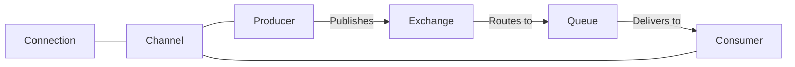

# RabbitMQ Java Integration

## Introduction

RabbitMQ is a powerful open-source message broker that implements the Advanced Message Queuing Protocol (AMQP). It provides a reliable way for applications to communicate asynchronously, enabling you to decouple different parts of your system. Java, being one of the most widely used programming languages in enterprise environments, has excellent support for RabbitMQ integration.

This guide will walk you through the process of integrating RabbitMQ with Java applications, from setting up the environment to implementing common messaging patterns.

## Prerequisites

Before we begin, make sure you have:

- Java Development Kit (JDK) 8 or higher installed
- Maven or Gradle for dependency management
- RabbitMQ server installed and running (version 3.8+ recommended)
- Basic knowledge of Java programming

## Setting Up Your Java Project

Let's start by adding the necessary dependencies to your project. We'll use the official RabbitMQ Java client library.

### Maven Configuration

Add the following dependency to your `pom.xml` file:

```xml
<dependency>
    <groupId>com.rabbitmq</groupId>
    <artifactId>amqp-client</artifactId>
    <version>5.14.2</version>
</dependency>
```

### Gradle Configuration

For Gradle users, add this to your `build.gradle` file:

```groovy
implementation 'com.rabbitmq:amqp-client:5.14.2'
```

## Connecting to RabbitMQ

The first step in working with RabbitMQ is establishing a connection to the server.

```java
import com.rabbitmq.client.Connection;
import com.rabbitmq.client.ConnectionFactory;

public class RabbitMQConnection {
    
    public static Connection createConnection() throws Exception {
        // Create a connection factory
        ConnectionFactory factory = new ConnectionFactory();
        
        // Configure the connection parameters
        factory.setHost("localhost");
        factory.setPort(5672);
        factory.setUsername("guest");
        factory.setPassword("guest");
        factory.setVirtualHost("/");
        
        // Create and return a new connection
        return factory.newConnection();
    }
    
    public static void main(String[] args) {
        try {
            Connection connection = createConnection();
            System.out.println("Successfully connected to RabbitMQ");
            
            // Always close connections when done
            connection.close();
        } catch (Exception e) {
            System.err.println("Failed to connect to RabbitMQ: " + e.getMessage());
            e.printStackTrace();
        }
    }
}
```

When executed successfully, this code will output:

```
Successfully connected to RabbitMQ
```

## Understanding the Core Concepts

Before diving deeper, let's understand some key concepts:



- **Connection**: A TCP connection between your application and the RabbitMQ server
- **Channel**: A virtual connection inside a connection
- **Exchange**: Receives messages from producers and routes them to queues
- **Queue**: A buffer that stores messages
- **Binding**: A link between an exchange and a queue
- **Producer**: An application that sends messages
- **Consumer**: An application that receives messages

## Basic Message Publishing

Let's create a simple producer that publishes a message to a queue.

```java
import com.rabbitmq.client.Channel;
import com.rabbitmq.client.Connection;

public class SimpleProducer {
    
    private final static String QUEUE_NAME = "hello";
    
    public static void main(String[] args) {
        try (Connection connection = RabbitMQConnection.createConnection();
             Channel channel = connection.createChannel()) {
             
            // Declare a queue (will create if it doesn't exist)
            channel.queueDeclare(QUEUE_NAME, false, false, false, null);
            
            String message = "Hello World from Java!";
            
            // Publish a message to the queue
            channel.basicPublish("", QUEUE_NAME, null, message.getBytes());
            
            System.out.println(" [x] Sent '" + message + "'");
        } catch (Exception e) {
            e.printStackTrace();
        }
    }
}
```

The producer:
1. Creates a connection to RabbitMQ
2. Opens a channel
3. Declares a queue named "hello"
4. Publishes a message to that queue
5. Closes the channel and connection

## Basic Message Consumption

Now, let's create a consumer that receives messages from the queue.

```java
import com.rabbitmq.client.*;

public class SimpleConsumer {
    
    private final static String QUEUE_NAME = "hello";
    
    public static void main(String[] args) throws Exception {
        Connection connection = RabbitMQConnection.createConnection();
        Channel channel = connection.createChannel();
        
        // Declare the same queue (idempotent operation)
        channel.queueDeclare(QUEUE_NAME, false, false, false, null);
        
        System.out.println(" [*] Waiting for messages. To exit press CTRL+C");
        
        // Define a callback to handle messages
        DeliverCallback deliverCallback = (consumerTag, delivery) -> {
            String message = new String(delivery.getBody(), "UTF-8");
            System.out.println(" [x] Received '" + message + "'");
        };
        
        // Start consuming messages
        channel.basicConsume(QUEUE_NAME, true, deliverCallback, consumerTag -> { });
    }
}
```

When a message is received, this consumer will output:

```
 [*] Waiting for messages. To exit press CTRL+C
 [x] Received 'Hello World from Java!'
```

## Work Queues (Task Distribution)

A common use case for RabbitMQ is distributing tasks among multiple workers. Let's create a work queue system.

### Task Producer

```java
import com.rabbitmq.client.Channel;
import com.rabbitmq.client.Connection;
import com.rabbitmq.client.MessageProperties;

public class TaskProducer {
    
    private final static String TASK_QUEUE_NAME = "task_queue";
    
    public static void main(String[] args) throws Exception {
        try (Connection connection = RabbitMQConnection.createConnection();
             Channel channel = connection.createChannel()) {
             
            // Declare a durable queue
            channel.queueDeclare(TASK_QUEUE_NAME, true, false, false, null);
            
            // Create several tasks
            String[] tasks = {
                "Task 1: Easy task",
                "Task 2: Medium task..",
                "Task 3: Hard task...",
                "Task 4: Very hard task...."
            };
            
            for (String task : tasks) {
                // Publish task messages as persistent
                channel.basicPublish("", TASK_QUEUE_NAME,
                        MessageProperties.PERSISTENT_TEXT_PLAIN,
                        task.getBytes());
                        
                System.out.println(" [x] Sent '" + task + "'");
                
                // Simulate random intervals between tasks
                Thread.sleep((long) (Math.random() * 1000));
            }
        }
    }
}
```

### Worker

```java
import com.rabbitmq.client.*;

public class Worker {
    
    private final static String TASK_QUEUE_NAME = "task_queue";
    
    public static void main(String[] args) throws Exception {
        Connection connection = RabbitMQConnection.createConnection();
        Channel channel = connection.createChannel();
        
        // Declare the same queue as producer
        channel.queueDeclare(TASK_QUEUE_NAME, true, false, false, null);
        System.out.println(" [*] Waiting for tasks. To exit press CTRL+C");
        
        // Configure fair dispatch with prefetch count of 1
        // This tells RabbitMQ not to give more than one message to a worker at a time
        channel.basicQos(1);
        
        DeliverCallback deliverCallback = (consumerTag, delivery) -> {
            String message = new String(delivery.getBody(), "UTF-8");
            
            System.out.println(" [x] Received '" + message + "'");
            
            try {
                // Simulate processing time - longer for more dots in the message
                doWork(message);
            } finally {
                System.out.println(" [x] Task done");
                
                // Manual acknowledgment
                channel.basicAck(delivery.getEnvelope().getDeliveryTag(), false);
            }
        };
        
        // Set auto-acknowledge to false for manual ack
        channel.basicConsume(TASK_QUEUE_NAME, false, deliverCallback, consumerTag -> { });
    }
    
    private static void doWork(String task) throws InterruptedException {
        // Count the dots to determine task difficulty
        for (char ch : task.toCharArray()) {
            if (ch == '.') {
                Thread.sleep(1000); // 1 second per dot
            }
        }
    }
}
```

You can run multiple instances of the Worker to distribute the tasks. Each task will be delivered to only one worker.

## Publish/Subscribe Pattern

Let's implement a publish/subscribe pattern where all consumers receive all messages.

### Publisher

```java
import com.rabbitmq.client.Channel;
import com.rabbitmq.client.Connection;

public class LogPublisher {
    
    private static final String EXCHANGE_NAME = "logs";
    
    public static void main(String[] args) throws Exception {
        try (Connection connection = RabbitMQConnection.createConnection();
             Channel channel = connection.createChannel()) {
             
            // Declare a fanout exchange
            channel.exchangeDeclare(EXCHANGE_NAME, "fanout");
            
            String[] logs = {
                "INFO: System started",
                "WARNING: High memory usage",
                "ERROR: Database connection failed",
                "INFO: User logged in"
            };
            
            for (String message : logs) {
                // Publish to an exchange, not directly to a queue
                channel.basicPublish(EXCHANGE_NAME, "", null, message.getBytes());
                System.out.println(" [x] Sent '" + message + "'");
                Thread.sleep(500);
            }
        }
    }
}
```

### Subscriber

```java
import com.rabbitmq.client.*;

public class LogSubscriber {
    
    private static final String EXCHANGE_NAME = "logs";
    
    public static void main(String[] args) throws Exception {
        Connection connection = RabbitMQConnection.createConnection();
        Channel channel = connection.createChannel();
        
        // Declare the same exchange as publisher
        channel.exchangeDeclare(EXCHANGE_NAME, "fanout");
        
        // Create a temporary queue with a generated name
        String queueName = channel.queueDeclare().getQueue();
        
        // Bind the queue to the exchange
        channel.queueBind(queueName, EXCHANGE_NAME, "");
        
        System.out.println(" [*] Waiting for logs. To exit press CTRL+C");
        
        DeliverCallback deliverCallback = (consumerTag, delivery) -> {
            String message = new String(delivery.getBody(), "UTF-8");
            System.out.println(" [x] Received '" + message + "'");
        };
        
        channel.basicConsume(queueName, true, deliverCallback, consumerTag -> { });
    }
}
```

Each Subscriber instance will receive a copy of all messages sent by the Publisher.

## Routing Messages

Now let's look at how to route messages selectively to different consumers based on routing keys.

### Direct Exchange Publisher

```java
import com.rabbitmq.client.Channel;
import com.rabbitmq.client.Connection;

public class LogDirectPublisher {
    
    private static final String EXCHANGE_NAME = "direct_logs";
    
    public static void main(String[] args) throws Exception {
        try (Connection connection = RabbitMQConnection.createConnection();
             Channel channel = connection.createChannel()) {
             
            // Declare a direct exchange
            channel.exchangeDeclare(EXCHANGE_NAME, "direct");
            
            // Send logs with different severity levels
            sendLog(channel, "info", "Information message");
            sendLog(channel, "warning", "Warning message");
            sendLog(channel, "error", "Error message");
            sendLog(channel, "debug", "Debug message");
        }
    }
    
    private static void sendLog(Channel channel, String severity, String message) 
            throws Exception {
        // Use severity as the routing key
        channel.basicPublish(EXCHANGE_NAME, severity, null, message.getBytes());
        System.out.println(" [x] Sent '" + severity + "': '" + message + "'");
    }
}
```

### Direct Exchange Subscriber

```java
import com.rabbitmq.client.*;

public class LogDirectSubscriber {
    
    private static final String EXCHANGE_NAME = "direct_logs";
    
    public static void main(String[] args) throws Exception {
        Connection connection = RabbitMQConnection.createConnection();
        Channel channel = connection.createChannel();
        
        // Declare the same exchange as publisher
        channel.exchangeDeclare(EXCHANGE_NAME, "direct");
        
        // Create a non-durable, exclusive, auto-delete queue with a generated name
        String queueName = channel.queueDeclare().getQueue();
        
        // Choose which severity levels to receive
        // You can change these or accept them as command line arguments
        String[] severities = {"error", "warning"};
        
        // Bind the queue to the exchange for each severity
        for (String severity : severities) {
            channel.queueBind(queueName, EXCHANGE_NAME, severity);
        }
        
        System.out.println(" [*] Waiting for " + String.join(", ", severities) + " logs.");
        
        DeliverCallback deliverCallback = (consumerTag, delivery) -> {
            String message = new String(delivery.getBody(), "UTF-8");
            String routingKey = delivery.getEnvelope().getRoutingKey();
            
            System.out.println(" [x] Received [" + routingKey + "]: '" + message + "'");
        };
        
        channel.basicConsume(queueName, true, deliverCallback, consumerTag -> { });
    }
}
```

This subscriber will only receive messages with the "error" and "warning" routing keys.

## Request-Reply Pattern

The request-reply pattern is useful for implementing RPC (Remote Procedure Call) like functionality.

### RPC Server

```java
import com.rabbitmq.client.*;

public class RPCServer {
    
    private static final String RPC_QUEUE_NAME = "rpc_queue";
    
    public static void main(String[] args) throws Exception {
        Connection connection = RabbitMQConnection.createConnection();
        Channel channel = connection.createChannel();
        
        channel.queueDeclare(RPC_QUEUE_NAME, false, false, false, null);
        channel.queuePurge(RPC_QUEUE_NAME); // Clear the queue
        
        channel.basicQos(1); // Process only one request at a time
        
        System.out.println(" [x] Awaiting RPC requests");
        
        DeliverCallback deliverCallback = (consumerTag, delivery) -> {
            AMQP.BasicProperties replyProps = new AMQP.BasicProperties.Builder()
                    .correlationId(delivery.getProperties().getCorrelationId())
                    .build();
            
            String response = "";
            
            try {
                String message = new String(delivery.getBody(), "UTF-8");
                int n = Integer.parseInt(message);
                
                System.out.println(" [.] Calculating fibonacci(" + message + ")");
                response = String.valueOf(fibonacci(n));
            } catch (RuntimeException e) {
                System.out.println(" [.] " + e);
                response = "Error: " + e.getMessage();
            } finally {
                // Send the response back to the client
                channel.basicPublish("", delivery.getProperties().getReplyTo(),
                        replyProps, response.getBytes());
                        
                channel.basicAck(delivery.getEnvelope().getDeliveryTag(), false);
            }
        };
        
        channel.basicConsume(RPC_QUEUE_NAME, false, deliverCallback, consumerTag -> { });
    }
    
    // Recursive method to calculate Fibonacci numbers
    private static int fibonacci(int n) {
        if (n <= 1) return n;
        return fibonacci(n - 1) + fibonacci(n - 2);
    }
}
```

### RPC Client

```java
import com.rabbitmq.client.*;

import java.io.IOException;
import java.util.UUID;
import java.util.concurrent.CompletableFuture;
import java.util.concurrent.ExecutionException;
import java.util.concurrent.TimeoutException;

public class RPCClient implements AutoCloseable {
    
    private Connection connection;
    private Channel channel;
    private String requestQueueName = "rpc_queue";
    
    public RPCClient() throws IOException, TimeoutException {
        connection = RabbitMQConnection.createConnection();
        channel = connection.createChannel();
    }
    
    public String call(String message) throws IOException, InterruptedException, ExecutionException {
        final String corrId = UUID.randomUUID().toString();
        final CompletableFuture<String> response = new CompletableFuture<>();
        
        // Create a temporary exclusive queue for the reply
        String replyQueueName = channel.queueDeclare().getQueue();
        
        AMQP.BasicProperties props = new AMQP.BasicProperties.Builder()
                .correlationId(corrId)
                .replyTo(replyQueueName)
                .build();
        
        // Set up a consumer for the response
        String ctag = channel.basicConsume(replyQueueName, true, (consumerTag, delivery) -> {
            if (delivery.getProperties().getCorrelationId().equals(corrId)) {
                response.complete(new String(delivery.getBody(), "UTF-8"));
            }
        }, consumerTag -> { });
        
        // Send the request
        channel.basicPublish("", requestQueueName, props, message.getBytes());
        
        // Wait for the response
        String result = response.get();
        
        // Cancel the consumer
        channel.basicCancel(ctag);
        
        return result;
    }
    
    public void close() throws IOException, TimeoutException {
        channel.close();
        connection.close();
    }
    
    public static void main(String[] args) {
        try (RPCClient fibonacciRpc = new RPCClient()) {
            System.out.println(" [x] Requesting fibonacci(30)");
            String response = fibonacciRpc.call("30");
            System.out.println(" [.] Got '" + response + "'");
        } catch (Exception e) {
            e.printStackTrace();
        }
    }
}
```

## Error Handling and Recovery

When working with RabbitMQ in production, it's important to handle connection failures and other errors gracefully.

```java
import com.rabbitmq.client.*;

import java.io.IOException;
import java.time.Duration;
import java.util.concurrent.TimeoutException;

public class ResilientConsumer {
    
    private static final String QUEUE_NAME = "resilient_queue";
    private static Connection connection;
    private static Channel channel;
    
    public static void main(String[] args) {
        ConnectionFactory factory = new ConnectionFactory();
        factory.setHost("localhost");
        
        // Enable automatic recovery
        factory.setAutomaticRecoveryEnabled(true);
        
        // Set network recovery interval
        factory.setNetworkRecoveryInterval(Duration.ofSeconds(10));
        
        // Set connection timeout
        factory.setConnectionTimeout(5000);
        
        try {
            connectAndConsume(factory);
        } catch (Exception e) {
            System.err.println("Failed to connect: " + e.getMessage());
        }
    }
    
    private static void connectAndConsume(ConnectionFactory factory) throws IOException, TimeoutException {
        try {
            connection = factory.newConnection();
            connection.addShutdownListener(cause -> {
                System.out.println("Connection shutdown: " + cause.getMessage());
                
                // Attempt to reconnect after a delay
                try {
                    Thread.sleep(5000);
                    System.out.println("Attempting to reconnect...");
                    connectAndConsume(factory);
                } catch (Exception e) {
                    System.err.println("Failed to reconnect: " + e.getMessage());
                }
            });
            
            channel = connection.createChannel();
            channel.queueDeclare(QUEUE_NAME, true, false, false, null);
            
            System.out.println(" [*] Waiting for messages. To exit press CTRL+C");
            
            // Set up a consumer
            DeliverCallback deliverCallback = (consumerTag, delivery) -> {
                String message = new String(delivery.getBody(), "UTF-8");
                
                try {
                    System.out.println(" [x] Received '" + message + "'");
                    processMessage(message);
                    channel.basicAck(delivery.getEnvelope().getDeliveryTag(), false);
                } catch (Exception e) {
                    System.err.println("Error processing message: " + e.getMessage());
                    
                    // Reject the message and requeue it
                    channel.basicNack(delivery.getEnvelope().getDeliveryTag(), false, true);
                }
            };
            
            channel.basicConsume(QUEUE_NAME, false, deliverCallback, consumerTag -> { });
            
        } catch (Exception e) {
            System.err.println("Error: " + e.getMessage());
            throw e;
        }
    }
    
    private static void processMessage(String message) {
        // Process message logic here
        if (message.contains("error")) {
            throw new RuntimeException("Error in message: " + message);
        }
        
        // Simulate processing time
        try {
            Thread.sleep(1000);
        } catch (InterruptedException e) {
            Thread.currentThread().interrupt();
        }
    }
}
```

## Best Practices and Common Patterns

Here are some best practices for RabbitMQ Java integration:

1. **Connection Management**
   - Create a single Connection per application
   - Create multiple Channels for different threads
   - Implement proper connection recovery

2. **Message Durability**
   - Use durable queues for important messages
   - Mark messages as persistent when needed
   - Implement publisher confirms for critical applications

3. **Consumer Acknowledgements**
   - Use manual acknowledgement for critical tasks
   - Properly handle rejections and negative acknowledgements

4. **Performance Considerations**
   - Set appropriate prefetch counts
   - Use batch publishing when possible
   - Monitor queue lengths and adjust resources accordingly

## Real-World Example: Order Processing System

Let's create a simplified order processing system that demonstrates a real-world application of RabbitMQ.

### Order Producer

```java
import com.rabbitmq.client.Channel;
import com.rabbitmq.client.Connection;
import com.rabbitmq.client.MessageProperties;

import java.util.HashMap;
import java.util.Map;
import java.util.Random;
import java.util.UUID;

public class OrderProducer {
    
    private static final String EXCHANGE_NAME = "orders";
    
    public static void main(String[] args) throws Exception {
        try (Connection connection = RabbitMQConnection.createConnection();
             Channel channel = connection.createChannel()) {
             
            // Declare a direct exchange
            channel.exchangeDeclare(EXCHANGE_NAME, "direct", true);
            
            // Declare and bind queues
            channel.queueDeclare("new_orders", true, false, false, null);
            channel.queueBind("new_orders", EXCHANGE_NAME, "new");
            
            channel.queueDeclare("priority_orders", true, false, false, null);
            channel.queueBind("priority_orders", EXCHANGE_NAME, "priority");
            
            // Create some sample orders
            for (int i = 0; i < 10; i++) {
                Order order = generateOrder();
                
                // Convert order to JSON (simplified)
                String orderJson = order.toJson();
                
                // Choose routing key based on priority
                String routingKey = order.isPriority() ? "priority" : "new";
                
                // Publish order
                channel.basicPublish(EXCHANGE_NAME, 
                                    routingKey,
                                    MessageProperties.PERSISTENT_TEXT_PLAIN,
                                    orderJson.getBytes());
                                    
                System.out.println(" [x] Sent " + routingKey + " order: " + order.getId());
                
                Thread.sleep(500);
            }
        }
    }
    
    private static Order generateOrder() {
        Random random = new Random();
        
        Order order = new Order();
        order.setId(UUID.randomUUID().toString());
        order.setCustomerId("customer_" + (random.nextInt(5) + 1));
        order.setPriority(random.nextInt(10) > 7); // 20% chance of priority order
        
        // Add some items
        Map<String, Integer> items = new HashMap<>();
        int itemCount = random.nextInt(5) + 1;
        for (int i = 0; i < itemCount; i++) {
            items.put("product_" + (random.nextInt(10) + 1), random.nextInt(3) + 1);
        }
        order.setItems(items);
        
        return order;
    }
    
    static class Order {
        private String id;
        private String customerId;
        private boolean priority;
        private Map<String, Integer> items;
        
        // Getters and setters
        public String getId() { return id; }
        public void setId(String id) { this.id = id; }
        
        public String getCustomerId() { return customerId; }
        public void setCustomerId(String customerId) { this.customerId = customerId; }
        
        public boolean isPriority() { return priority; }
        public void setPriority(boolean priority) { this.priority = priority; }
        
        public Map<String, Integer> getItems() { return items; }
        public void setItems(Map<String, Integer> items) { this.items = items; }
        
        // Simple JSON serialization (in a real app, use a proper library like Jackson)
        public String toJson() {
            StringBuilder sb = new StringBuilder();
            sb.append("{");
            sb.append("\"id\":\"").append(id).append("\",");
            sb.append("\"customerId\":\"").append(customerId).append("\",");
            sb.append("\"priority\":").append(priority).append(",");
            sb.append("\"items\":{");
            
            int count = 0;
            for (Map.Entry<String, Integer> entry : items.entrySet()) {
                if (count++ > 0) sb.append(",");
                sb.append("\"").append(entry.getKey()).append("\":");
                sb.append(entry.getValue());
            }
            
            sb.append("}}");
            return sb.toString();
        }
    }
}
```

### Order Processor

```java
import com.rabbitmq.client.*;

import java.io.IOException;
import java.util.HashMap;
import java.util.Map;
import java.util.concurrent.TimeUnit;

public class OrderProcessor {
    
    private static final String QUEUE_NAME = "new_orders"; // or "priority_orders"
    
    public static void main(String[] args) throws Exception {
        // Determine which queue to process from command line args
        String queueToProcess = args.length > 0 && args[0].equals("priority") 
                                ? "priority_orders" : "new_orders";
        
        Connection connection = RabbitMQConnection.createConnection();
        Channel channel = connection.createChannel();
        
        // Set prefetch count - process only one order at a time
        channel.basicQos(1);
        
        System.out.println(" [*] Processing orders from " + queueToProcess);
        
        DeliverCallback deliverCallback = (consumerTag, delivery) -> {
            String orderJson = new String(delivery.getBody(), "UTF-8");
            
            try {
                // Parse the order (simplified)
                Order order = parseOrder(orderJson);
                
                System.out.println(" [x] Processing order: " + order.getId() + 
                                  " (Priority: " + order.isPriority() + ")");
                
                // Process the order
                processOrder(order);
                
                // Acknowledge the message
                channel.basicAck(delivery.getEnvelope().getDeliveryTag(), false);
                
                System.out.println(" [x] Order " + order.getId() + " processed successfully");
                
            } catch (Exception e) {
                System.err.println(" [!] Error processing order: " + e.getMessage());
                
                // Reject the message and don't requeue if it's a parse error
                boolean requeue = !(e instanceof OrderParseException);
                channel.basicNack(delivery.getEnvelope().getDeliveryTag(), false, requeue);
            }
        };
        
        // Start consuming messages with manual acknowledgement
        channel.basicConsume(queueToProcess, false, deliverCallback, consumerTag -> { });
    }
    
    private static Order parseOrder(String orderJson) throws OrderParseException {
        try {
            // In a real app, use a proper JSON library
            Order order = new Order();
            
            // Very simplified JSON parsing
            if (orderJson.contains("\"id\":")) {
                int start = orderJson.indexOf("\"id\":\"") + 6;
                int end = orderJson.indexOf("\"", start);
                order.setId(orderJson.substring(start, end));
            }
            
            if (orderJson.contains("\"customerId\":")) {
                int start = orderJson.indexOf("\"customerId\":\"") + 14;
                int end = orderJson.indexOf("\"", start);
                order.setCustomerId(orderJson.substring(start, end));
            }
            
            order.setPriority(orderJson.contains("\"priority\":true"));
            
            // Parse items (very simplified)
            Map<String, Integer> items = new HashMap<>();
            if (orderJson.contains("\"items\":")) {
                // In a real app, properly parse the items
                // This is just a placeholder
                items.put("sample_product", 1);
            }
            order.setItems(items);
            
            return order;
        } catch (Exception e) {
            throw new OrderParseException("Failed to parse order: " + e.getMessage());
        }
    }
    
    private static void processOrder(Order order) throws Exception {
        // Simulate order processing
        System.out.println(" [*] Processing items for order " + order.getId() + ":");
        
        for (Map.Entry<String, Integer> item : order.getItems().entrySet()) {
            System.out.println("     - " + item.getValue() + "x " + item.getKey());
            
            // Simulate processing time
            TimeUnit.MILLISECONDS.sleep(500);
        }
        
        // Simulate random processing errors
        if (Math.random() < 0.1) { // 10% chance of failure
            throw new Exception("Random processing error occurred");
        }
    }
    
    static class Order {
        private String id;
        private String customerId;
        private boolean priority;
        private Map<String, Integer> items = new HashMap<>();
        
        // Getters and setters
        public String getId()