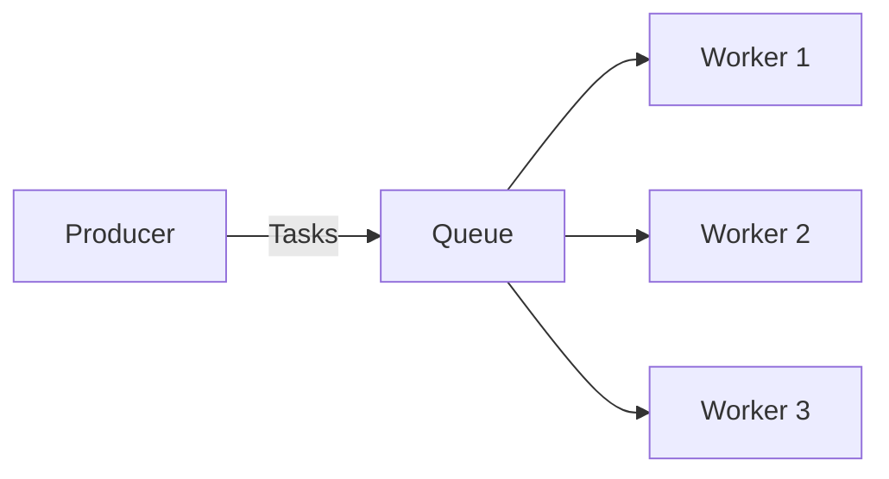
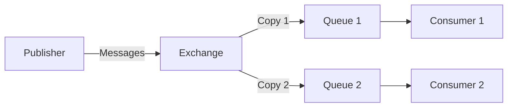

# RabbitMQ .NET Integration

## Introduction

RabbitMQ is a powerful open-source message broker that implements the Advanced Message Queuing Protocol (AMQP). It enables applications to communicate asynchronously by sending and receiving messages. This decoupling of services improves scalability, resilience, and system architecture.

In this guide, we'll explore how to integrate RabbitMQ with .NET applications using the official RabbitMQ .NET client library. By the end, you'll understand how to implement common messaging patterns in your .NET projects.

## Prerequisites

Before we begin, ensure you have:

- Basic knowledge of C# and .NET
- .NET 6.0 SDK or later installed
- RabbitMQ server installed and running (locally or via Docker)
- Visual Studio, Visual Studio Code, or your preferred .NET IDE

## Getting Started with RabbitMQ in .NET

### 1. Installing the RabbitMQ Client Library

First, add the RabbitMQ.Client NuGet package to your project:

```bash
dotnet add package RabbitMQ.Client
```

Or via the NuGet Package Manager in Visual Studio.

### 2. Setting Up a Basic Connection

Let's start by creating a basic connection to RabbitMQ:

```csharp
using RabbitMQ.Client;
using System;

namespace RabbitMQDemo
{
    class Program
    {
        static void Main(string[] args)
        {
            // Create connection factory
            var factory = new ConnectionFactory()
            {
                HostName = "localhost",
                Port = 5672,
                UserName = "guest",
                Password = "guest"
            };

            // Create connection
            using var connection = factory.CreateConnection();
            
            // Create channel
            using var channel = connection.CreateModel();
            
            Console.WriteLine("Connected to RabbitMQ successfully!");
            
            // Keep the application running
            Console.ReadLine();
        }
    }
}
```

This establishes a connection to a RabbitMQ server running on localhost with default credentials.

## Basic Messaging Patterns

### 1. Simple Producer/Consumer

Let's implement a basic producer and consumer pattern:

#### Producer (Sender)

```csharp
using RabbitMQ.Client;
using System;
using System.Text;

class Producer
{
    public static void Main(string[] args)
    {
        var factory = new ConnectionFactory() { HostName = "localhost" };
        using var connection = factory.CreateConnection();
        using var channel = connection.CreateModel();

        // Declare a queue
        string queueName = "hello_queue";
        channel.QueueDeclare(
            queue: queueName,
            durable: false,
            exclusive: false,
            autoDelete: false,
            arguments: null);

        // Prepare message
        string message = "Hello, RabbitMQ!";
        var body = Encoding.UTF8.GetBytes(message);

        // Publish message
        channel.BasicPublish(
            exchange: "",
            routingKey: queueName,
            basicProperties: null,
            body: body);

        Console.WriteLine($"Sent: {message}");
        
        Console.WriteLine("Press [enter] to exit");
        Console.ReadLine();
    }
}
```

#### Consumer (Receiver)

```csharp
using RabbitMQ.Client;
using RabbitMQ.Client.Events;
using System;
using System.Text;

class Consumer
{
    public static void Main(string[] args)
    {
        var factory = new ConnectionFactory() { HostName = "localhost" };
        using var connection = factory.CreateConnection();
        using var channel = connection.CreateModel();

        // Declare the same queue
        string queueName = "hello_queue";
        channel.QueueDeclare(
            queue: queueName,
            durable: false,
            exclusive: false,
            autoDelete: false,
            arguments: null);

        // Create consumer
        var consumer = new EventingBasicConsumer(channel);
        
        // Register handler
        consumer.Received += (model, ea) =>
        {
            var body = ea.Body.ToArray();
            var message = Encoding.UTF8.GetString(body);
            Console.WriteLine($"Received: {message}");
        };

        // Start consuming
        channel.BasicConsume(
            queue: queueName,
            autoAck: true,
            consumer: consumer);

        Console.WriteLine("Waiting for messages...");
        Console.WriteLine("Press [enter] to exit");
        Console.ReadLine();
    }
}
```

### How This Works

1. The producer declares a queue named "hello_queue" and sends a message to it.
2. The consumer declares the same queue and sets up an event handler to process incoming messages.
3. When a message arrives, the handler converts the message bytes back to a string and displays it.

## Advanced Message Patterns

### 1. Work Queues (Task Distribution)

Work queues are useful for distributing time-consuming tasks among multiple workers.



#### Producer with Durable Messages

```csharp
using RabbitMQ.Client;
using System;
using System.Text;

class NewTask
{
    public static void Main(string[] args)
    {
        var factory = new ConnectionFactory() { HostName = "localhost" };
        using var connection = factory.CreateConnection();
        using var channel = connection.CreateModel();

        string queueName = "task_queue";
        
        // Declare a durable queue
        channel.QueueDeclare(
            queue: queueName,
            durable: true,
            exclusive: false,
            autoDelete: false,
            arguments: null);

        // Get message from command line or use default
        string message = args.Length > 0 ? string.Join(" ", args) : "Hello World!";
        
        var body = Encoding.UTF8.GetBytes(message);

        // Create persistent message properties
        var properties = channel.CreateBasicProperties();
        properties.Persistent = true;

        // Publish message
        channel.BasicPublish(
            exchange: "",
            routingKey: queueName,
            basicProperties: properties,
            body: body);
            
        Console.WriteLine($"Sent: {message}");
    }
}
```

#### Worker with Fair Dispatch

```csharp
using RabbitMQ.Client;
using RabbitMQ.Client.Events;
using System;
using System.Text;
using System.Threading;

class Worker
{
    public static void Main(string[] args)
    {
        var factory = new ConnectionFactory() { HostName = "localhost" };
        using var connection = factory.CreateConnection();
        using var channel = connection.CreateModel();

        string queueName = "task_queue";
        
        channel.QueueDeclare(
            queue: queueName,
            durable: true,
            exclusive: false,
            autoDelete: false,
            arguments: null);

        // Set prefetch count to 1
        // This ensures a worker only gets one message at a time
        channel.BasicQos(prefetchSize: 0, prefetchCount: 1, global: false);

        Console.WriteLine("Waiting for messages...");

        var consumer = new EventingBasicConsumer(channel);
        
        consumer.Received += (model, ea) =>
        {
            var body = ea.Body.ToArray();
            var message = Encoding.UTF8.GetString(body);
            Console.WriteLine($"Received: {message}");

            // Simulate work
            int dots = message.Split('.').Length - 1;
            Thread.Sleep(dots * 1000);

            Console.WriteLine("Work done");
            
            // Manually acknowledge message
            channel.BasicAck(deliveryTag: ea.DeliveryTag, multiple: false);
        };

        // Disable auto-acknowledgment
        channel.BasicConsume(
            queue: queueName,
            autoAck: false,
            consumer: consumer);

        Console.WriteLine("Press [enter] to exit");
        Console.ReadLine();
    }
}
```

### 2. Publish/Subscribe (Fan-out)

The Publish/Subscribe pattern broadcasts messages to multiple consumers:



#### Publisher

```csharp
using RabbitMQ.Client;
using System;
using System.Text;

class EmitLog
{
    public static void Main(string[] args)
    {
        var factory = new ConnectionFactory() { HostName = "localhost" };
        using var connection = factory.CreateConnection();
        using var channel = connection.CreateModel();

        // Declare a fanout exchange
        string exchangeName = "logs";
        channel.ExchangeDeclare(exchange: exchangeName, type: ExchangeType.Fanout);

        // Get message from command line or use default
        string message = args.Length > 0 ? string.Join(" ", args) : "info: Hello World!";
        var body = Encoding.UTF8.GetBytes(message);

        // Publish to exchange (no specific queue)
        channel.BasicPublish(
            exchange: exchangeName,
            routingKey: "",
            basicProperties: null,
            body: body);
            
        Console.WriteLine($"Sent: {message}");
    }
}
```

#### Subscriber

```csharp
using RabbitMQ.Client;
using RabbitMQ.Client.Events;
using System;
using System.Text;

class ReceiveLogs
{
    public static void Main(string[] args)
    {
        var factory = new ConnectionFactory() { HostName = "localhost" };
        using var connection = factory.CreateConnection();
        using var channel = connection.CreateModel();

        // Declare the same exchange
        string exchangeName = "logs";
        channel.ExchangeDeclare(exchange: exchangeName, type: ExchangeType.Fanout);

        // Create a temporary queue with a generated name
        var queueName = channel.QueueDeclare().QueueName;
        
        // Bind the queue to the exchange
        channel.QueueBind(
            queue: queueName,
            exchange: exchangeName,
            routingKey: "");

        Console.WriteLine("Waiting for logs...");

        var consumer = new EventingBasicConsumer(channel);
        
        consumer.Received += (model, ea) =>
        {
            var body = ea.Body.ToArray();
            var message = Encoding.UTF8.GetString(body);
            Console.WriteLine($"Received: {message}");
        };

        channel.BasicConsume(
            queue: queueName,
            autoAck: true,
            consumer: consumer);

        Console.WriteLine("Press [enter] to exit");
        Console.ReadLine();
    }
}
```

## RabbitMQ Connection Management in .NET

### Connection Pooling

For production applications, it's important to manage RabbitMQ connections efficiently:

```csharp
public class RabbitMQConnectionManager : IDisposable
{
    private readonly string _hostName;
    private readonly string _userName;
    private readonly string _password;
    private IConnection _connection;
    private bool _disposed;

    public RabbitMQConnectionManager(string hostName, string userName, string password)
    {
        _hostName = hostName;
        _userName = userName;
        _password = password;
    }

    public IModel CreateChannel()
    {
        if (_connection == null || !_connection.IsOpen)
        {
            var factory = new ConnectionFactory()
            {
                HostName = _hostName,
                UserName = _userName,
                Password = _password,
                // Recommended settings for production
                AutomaticRecoveryEnabled = true,
                NetworkRecoveryInterval = TimeSpan.FromSeconds(10)
            };
            
            _connection = factory.CreateConnection();
        }
        
        return _connection.CreateModel();
    }

    public void Dispose()
    {
        Dispose(true);
        GC.SuppressFinalize(this);
    }

    protected virtual void Dispose(bool disposing)
    {
        if (_disposed)
            return;

        if (disposing)
        {
            _connection?.Close();
            _connection?.Dispose();
        }

        _disposed = true;
    }
}
```

### Usage with Dependency Injection

For ASP.NET Core applications, you can register the connection manager as a singleton:

```csharp
// In Program.cs or Startup.cs
services.AddSingleton<RabbitMQConnectionManager>(sp => 
    new RabbitMQConnectionManager("localhost", "guest", "guest"));

// Then inject it into your services
public class MessageService
{
    private readonly RabbitMQConnectionManager _connectionManager;

    public MessageService(RabbitMQConnectionManager connectionManager)
    {
        _connectionManager = connectionManager;
    }

    public void SendMessage(string queueName, string message)
    {
        using var channel = _connectionManager.CreateChannel();
        // Use channel to send messages
    }
}
```

## Real-world Application Example

Let's build a simple notification system that sends and receives messages:

### 1. Define Message Models

```csharp
using System;
using System.Text.Json;

namespace NotificationSystem
{
    public class Notification
    {
        public string Id { get; set; } = Guid.NewGuid().ToString();
        public string Type { get; set; }
        public string Message { get; set; }
        public DateTime CreatedAt { get; set; } = DateTime.UtcNow;
        
        public string ToJson()
        {
            return JsonSerializer.Serialize(this);
        }
        
        public static Notification FromJson(string json)
        {
            return JsonSerializer.Deserialize<Notification>(json);
        }
    }
}
```

### 2. Create a Notification Service

```csharp
using RabbitMQ.Client;
using System;
using System.Text;

namespace NotificationSystem
{
    public class NotificationService : IDisposable
    {
        private readonly IConnection _connection;
        private readonly IModel _channel;
        private const string ExchangeName = "notifications";

        public NotificationService(string hostName = "localhost")
        {
            var factory = new ConnectionFactory() { HostName = hostName };
            _connection = factory.CreateConnection();
            _channel = _connection.CreateModel();
            
            // Declare a topic exchange for notifications
            _channel.ExchangeDeclare(
                exchange: ExchangeName,
                type: ExchangeType.Topic,
                durable: true);
        }

        public void PublishNotification(Notification notification, string routingKey)
        {
            var message = notification.ToJson();
            var body = Encoding.UTF8.GetBytes(message);
            
            var properties = _channel.CreateBasicProperties();
            properties.Persistent = true;
            
            _channel.BasicPublish(
                exchange: ExchangeName,
                routingKey: routingKey,
                basicProperties: properties,
                body: body);
                
            Console.WriteLine($"Published notification: {notification.Type} - {notification.Message}");
        }

        public void Dispose()
        {
            _channel?.Close();
            _channel?.Dispose();
            _connection?.Close();
            _connection?.Dispose();
        }
    }
}
```

### 3. Create a Notification Consumer

```csharp
using RabbitMQ.Client;
using RabbitMQ.Client.Events;
using System;
using System.Text;
using System.Threading;
using System.Threading.Tasks;

namespace NotificationSystem
{
    public class NotificationConsumer : IDisposable
    {
        private readonly IConnection _connection;
        private readonly IModel _channel;
        private readonly string _queueName;
        private const string ExchangeName = "notifications";

        public NotificationConsumer(string topicPattern, string hostName = "localhost")
        {
            var factory = new ConnectionFactory() { HostName = hostName };
            _connection = factory.CreateConnection();
            _channel = _connection.CreateModel();
            
            // Declare the same exchange as the publisher
            _channel.ExchangeDeclare(
                exchange: ExchangeName,
                type: ExchangeType.Topic,
                durable: true);
                
            // Create a named queue for this consumer
            _queueName = $"notification_queue_{Guid.NewGuid()}";
            _channel.QueueDeclare(
                queue: _queueName,
                durable: true,
                exclusive: false,
                autoDelete: false);
                
            // Bind to the exchange with the topic pattern
            _channel.QueueBind(
                queue: _queueName,
                exchange: ExchangeName,
                routingKey: topicPattern);
        }

        public void StartConsuming(Action<Notification> notificationHandler, CancellationToken cancellationToken = default)
        {
            var consumer = new EventingBasicConsumer(_channel);
            
            consumer.Received += (model, ea) =>
            {
                var body = ea.Body.ToArray();
                var message = Encoding.UTF8.GetString(body);
                
                try
                {
                    var notification = Notification.FromJson(message);
                    notificationHandler(notification);
                    
                    // Acknowledge message
                    _channel.BasicAck(ea.DeliveryTag, false);
                }
                catch (Exception ex)
                {
                    Console.WriteLine($"Error processing notification: {ex.Message}");
                    // Reject and requeue for retry
                    _channel.BasicNack(ea.DeliveryTag, false, true);
                }
            };
            
            // Start consuming with manual acknowledgment
            _channel.BasicConsume(
                queue: _queueName,
                autoAck: false,
                consumer: consumer);
                
            // Keep consuming until cancellation is requested
            Task.Run(() =>
            {
                cancellationToken.WaitHandle.WaitOne();
                this.Dispose();
            }, cancellationToken);
        }

        public void Dispose()
        {
            _channel?.Close();
            _channel?.Dispose();
            _connection?.Close();
            _connection?.Dispose();
        }
    }
}
```

### 4. Usage Example

```csharp
using System;
using System.Threading;
using System.Threading.Tasks;
using NotificationSystem;

class Program
{
    static async Task Main(string[] args)
    {
        // Start consumer
        var cancellationTokenSource = new CancellationTokenSource();
        var consumer = new NotificationConsumer("user.#");
        
        consumer.StartConsuming(notification =>
        {
            Console.WriteLine($"Received: [{notification.Type}] {notification.Message} at {notification.CreatedAt}");
        }, cancellationTokenSource.Token);
        
        Console.WriteLine("Consumer started. Press any key to send test notifications...");
        Console.ReadKey();
        
        // Send some test notifications
        using var notificationService = new NotificationService();
        
        notificationService.PublishNotification(
            new Notification 
            { 
                Type = "UserRegistered", 
                Message = "New user registered: john.doe@example.com"
            }, 
            "user.registered");
            
        notificationService.PublishNotification(
            new Notification 
            { 
                Type = "UserLoggedIn", 
                Message = "User logged in: john.doe@example.com"
            }, 
            "user.login");
            
        Console.WriteLine("Notifications sent. Press any key to exit...");
        Console.ReadKey();
        
        // Stop consumer
        cancellationTokenSource.Cancel();
        
        // Wait a moment for cleanup
        await Task.Delay(500);
    }
}
```

## Error Handling and Reliability

### Dead Letter Exchanges

Dead Letter Exchanges (DLX) help handle messages that can't be processed:

```csharp
// Declare main queue with DLX configuration
var args = new Dictionary<string, object>
{
    { "x-dead-letter-exchange", "dlx.exchange" },
    { "x-dead-letter-routing-key", "failed.messages" }
};

channel.ExchangeDeclare("dlx.exchange", ExchangeType.Direct);
channel.QueueDeclare("dead.letter.queue", true, false, false, null);
channel.QueueBind("dead.letter.queue", "dlx.exchange", "failed.messages");

// Main processing queue
channel.QueueDeclare(
    queue: "main.processing.queue",
    durable: true,
    exclusive: false,
    autoDelete: false,
    arguments: args);
```

### Implementing Circuit Breaker

```csharp
public class RabbitMQCircuitBreaker
{
    private readonly TimeSpan _resetTimeout;
    private readonly int _maxFailures;
    private int _failures;
    private DateTime _lastFailure;
    private bool _isOpen;

    public RabbitMQCircuitBreaker(int maxFailures = 3, int resetTimeoutSeconds = 30)
    {
        _maxFailures = maxFailures;
        _resetTimeout = TimeSpan.FromSeconds(resetTimeoutSeconds);
        _failures = 0;
        _lastFailure = DateTime.MinValue;
        _isOpen = false;
    }

    public bool AllowExecution()
    {
        if (_isOpen)
        {
            // Check if timeout has elapsed and we should try again
            if (DateTime.UtcNow - _lastFailure > _resetTimeout)
            {
                _isOpen = false;
                _failures = 0;
                return true;
            }
            return false;
        }
        return true;
    }

    public void RecordSuccess()
    {
        _failures = 0;
        _isOpen = false;
    }

    public void RecordFailure()
    {
        _failures++;
        _lastFailure = DateTime.UtcNow;
        
        if (_failures >= _maxFailures)
        {
            _isOpen = true;
        }
    }
}
```

## Performance Considerations

### 1. Message Batching

For high-throughput scenarios, consider batching messages:

```csharp
public void SendBatch<T>(string queueName, IEnumerable<T> messages)
{
    using var channel = _connectionManager.CreateChannel();
    
    channel.QueueDeclare(queueName, true, false, false);
    
    // Enable publisher confirms
    channel.ConfirmSelect();
    
    foreach (var message in messages)
    {
        var body = Encoding.UTF8.GetBytes(JsonSerializer.Serialize(message));
        channel.BasicPublish("", queueName, null, body);
    }
    
    // Wait for all messages to be confirmed
    channel.WaitForConfirmsOrDie(TimeSpan.FromSeconds(5));
}
```

### 2. Channel Pooling

```csharp
public class ChannelPool : IDisposable
{
    private readonly IConnection _connection;
    private readonly ConcurrentBag<IModel> _channels;
    private readonly int _maxChannels;
    private int _channelCount;
    private bool _disposed;

    public ChannelPool(IConnection connection, int maxChannels = 10)
    {
        _connection = connection;
        _maxChannels = maxChannels;
        _channels = new ConcurrentBag<IModel>();
        _channelCount = 0;
    }

    public IModel GetChannel()
    {
        if (_channels.TryTake(out var channel) && channel.IsOpen)
        {
            return channel;
        }

        if (_channelCount < _maxChannels || _maxChannels <= 0)
        {
            Interlocked.Increment(ref _channelCount);
            return _connection.CreateModel();
        }

        throw new InvalidOperationException("Maximum number of channels reached");
    }

    public void ReturnChannel(IModel channel)
    {
        if (channel.IsOpen && !_disposed)
        {
            _channels.Add(channel);
        }
        else
        {
            try
            {
                channel.Dispose();
                Interlocked.Decrement(ref _channelCount);
            }
            catch
            {
                // Ignore exceptions during disposal
            }
        }
    }

    public void Dispose()
    {
        Dispose(true);
        GC.SuppressFinalize(this);
    }

    protected virtual void Dispose(bool disposing)
    {
        if (_disposed)
            return;

        if (disposing)
        {
            _disposed = true;
            
            foreach (var channel in _channels)
            {
                try
                {
                    channel.Close();
                    channel.Dispose();
                }
                catch
                {
                    // Ignore exceptions during disposal
                }
            }
            
            _channels.Clear();
        }

        _disposed = true;
    }
}
```

## Summary

In this guide, we've explored how to integrate RabbitMQ with .NET applications. We've covered:

- Basic connection setup and messaging patterns
- Advanced patterns like work queues and publish/subscribe
- Connection management best practices
- A real-world notification system example
- Error handling with dead letter exchanges
- Performance optimization techniques

RabbitMQ provides a robust foundation for building distributed systems in .NET. By leveraging asynchronous messaging, you can create more resilient, scalable, and loosely coupled applications.

## Additional Resources

- [Official RabbitMQ .NET Client Documentation](https://www.rabbitmq.com/dotnet.html)
- [RabbitMQ Patterns: For Applications](https://www.rabbitmq.com/tutorials/tutorial-one-dotnet.html)
- [.NET Microservices: Architecture for Containerized .NET Applications](https://dotnet.microsoft.com/download/e-book/microservices-architecture/pdf)

## Practice Exercises

1. **Basic Queue**: Create a simple producer and consumer application that sends and receives text messages.

2. **Work Queue**: Implement a task distribution system that sends computation-heavy tasks to multiple workers.

3. **Chat System**: Build a simple chat application where messages are distributed to all connected clients.

4. **Retry Mechanism**: Create a system that retries failed message processing with exponential backoff.

5. **Priority Queue**: Implement a priority queue system where high-priority messages are processed first.