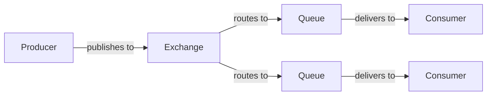

# RabbitMQ Ruby Integration

## Introduction

RabbitMQ is a powerful open-source message broker that implements the Advanced Message Queuing Protocol (AMQP). When integrated with Ruby applications, it enables reliable message passing between different parts of your system, facilitating asynchronous communication, load balancing, and system decoupling.

In this tutorial, we'll explore how to integrate RabbitMQ with Ruby applications using the popular Bunny gem. By the end of this guide, you'll understand how to:

- Set up RabbitMQ with Ruby
- Implement basic publish/subscribe patterns
- Work with exchanges and queues
- Handle message persistence and acknowledgment
- Create practical messaging workflows for real-world applications

## Prerequisites

Before getting started, ensure you have:

- Ruby (2.5 or newer) installed on your system
- RabbitMQ server installed and running (version 3.8+)
- Basic understanding of Ruby programming

## Setting Up the Ruby Environment

First, let's install the necessary gem for RabbitMQ integration:

```ruby
# Add to your Gemfile
gem 'bunny', '~> 2.19.0'
```

Then install it:

```bash
bundle install
```

## Understanding RabbitMQ Core Concepts

Before diving into code, let's understand the key concepts in RabbitMQ:



- **Producer**: Application that sends messages
- **Consumer**: Application that receives messages
- **Queue**: Buffer that stores messages
- **Exchange**: Receives messages from producers and routes them to queues
- **Binding**: Rule that tells an exchange how to route messages to queues

## Basic Message Publishing and Consuming

Let's start with a simple example of publishing and consuming messages:

### Message Publisher

```ruby
require 'bunny'

# Create a connection to the RabbitMQ server
connection = Bunny.new(hostname: 'localhost')
connection.start

# Create a channel
channel = connection.create_channel

# Declare a queue
queue = channel.queue('hello_world', durable: true)

# Publish a message
message = "Hello, RabbitMQ!"
channel.default_exchange.publish(message, routing_key: queue.name)
puts " [x] Sent '#{message}'"

# Close the connection
connection.close
```

### Message Consumer

```ruby
require 'bunny'

# Create a connection to the RabbitMQ server
connection = Bunny.new(hostname: 'localhost')
connection.start

# Create a channel
channel = connection.create_channel

# Declare the same queue
queue = channel.queue('hello_world', durable: true)

puts " [*] Waiting for messages in #{queue.name}. To exit press CTRL+C"

# Set up a consumer to process messages from the queue
queue.subscribe(block: true) do |_delivery_info, _properties, body|
  puts " [x] Received '#{body}'"
end

# The connection will be closed when the program exits
```

**Output from Publisher:**
```
 [x] Sent 'Hello, RabbitMQ!'
```

**Output from Consumer:**
```
 [*] Waiting for messages in hello_world. To exit press CTRL+C
 [x] Received 'Hello, RabbitMQ!'
```

## Working with Exchanges

RabbitMQ supports different exchange types that affect how messages are routed:

1. **Direct**: Routes messages to queues based on an exact routing key match
2. **Fanout**: Broadcasts messages to all bound queues
3. **Topic**: Routes messages based on pattern matching of routing keys
4. **Headers**: Routes based on message header attributes

Let's implement a fanout exchange example:

```ruby
# Publisher using fanout exchange
require 'bunny'

connection = Bunny.new
connection.start

channel = connection.create_channel

# Create a fanout exchange
exchange = channel.fanout('logs')

# Create a message
message = "This is a broadcast message: #{Time.now}"

# Publish the message to the exchange
# Note: No routing key needed for fanout exchange
exchange.publish(message)
puts " [x] Sent '#{message}'"

connection.close
```

```ruby
# Consumer for fanout exchange
require 'bunny'

connection = Bunny.new
connection.start

channel = connection.create_channel

# Reference the same fanout exchange
exchange = channel.fanout('logs')

# Create a queue with a random name
queue = channel.queue('', exclusive: true)

# Bind the queue to the exchange
queue.bind(exchange)

puts " [*] Waiting for logs. To exit press CTRL+C"

# Subscribe to the queue
queue.subscribe(block: true) do |_delivery_info, _properties, body|
  puts " [x] Received '#{body}'"
end
```

## Message Acknowledgement and Persistence

For reliable messaging, you'll want to implement acknowledgments and persistence:

```ruby
# Publisher with persistent messages
require 'bunny'

connection = Bunny.new
connection.start

channel = connection.create_channel

# Declare a durable queue
queue = channel.queue('task_queue', durable: true)

message = "Important task that should not be lost"

# Make the message persistent
channel.default_exchange.publish(message,
                                routing_key: queue.name,
                                persistent: true)
puts " [x] Sent '#{message}'"

connection.close
```

```ruby
# Consumer with acknowledgements
require 'bunny'

connection = Bunny.new
connection.start

channel = connection.create_channel
# Set prefetch to 1 to ensure a worker processes only one message at a time
channel.prefetch(1)

queue = channel.queue('task_queue', durable: true)

puts " [*] Waiting for messages. To exit press CTRL+C"

# manual_ack: true enables manual acknowledgements
queue.subscribe(manual_ack: true, block: true) do |delivery_info, _properties, body|
  puts " [x] Received '#{body}'"
  
  # Simulate processing time
  sleep body.count('.').to_i
  
  puts " [x] Done"
  
  # Acknowledge the message, telling RabbitMQ it was processed successfully
  channel.ack(delivery_info.delivery_tag)
end
```

## Practical Example: Work Queue

Let's create a work queue that distributes time-consuming tasks among multiple workers:

### Task Dispatcher

```ruby
# task_sender.rb
require 'bunny'

connection = Bunny.new
connection.start

channel = connection.create_channel

queue = channel.queue('task_queue', durable: true)

# Get task from command line or use a default one
message = ARGV.empty? ? 'Hello World!' : ARGV.join(' ')

queue.publish(message, persistent: true)
puts " [x] Sent '#{message}'"

connection.close
```

### Worker

```ruby
# worker.rb
require 'bunny'

connection = Bunny.new
connection.start

channel = connection.create_channel
channel.prefetch(1)

queue = channel.queue('task_queue', durable: true)

puts " [*] Waiting for messages. To exit press CTRL+C"

queue.subscribe(manual_ack: true, block: true) do |delivery_info, _properties, body|
  puts " [x] Received '#{body}'"
  
  # Task complexity is simulated by the number of dots in the message
  # Each dot means one second of "work"
  task_complexity = body.count('.')
  puts " [*] Working for #{task_complexity} seconds..."
  sleep(task_complexity)
  
  puts " [x] Task completed"
  
  channel.ack(delivery_info.delivery_tag)
end
```

**Running Multiple Workers:**

You can run multiple instances of the worker to process tasks in parallel:

```bash
# Terminal 1
ruby worker.rb

# Terminal 2
ruby worker.rb

# Terminal 3
ruby task_sender.rb "Task 1....."
ruby task_sender.rb "Task 2..."
ruby task_sender.rb "Task 3."
```

This distributes the tasks among your workers, with more complex tasks (more dots) taking longer to process.

## Real-World Application: Notification System

Let's create a practical example of a notification system that sends different types of notifications (email, SMS, push) based on the message routing key:

```ruby
# notification_sender.rb
require 'bunny'
require 'json'

connection = Bunny.new
connection.start

channel = connection.create_channel

# Create a topic exchange for notifications
exchange = channel.topic('notifications')

# Helper method to send notifications
def send_notification(exchange, type, user_id, message)
  payload = {
    user_id: user_id,
    message: message,
    timestamp: Time.now.to_i
  }.to_json
  
  # The routing key follows the pattern: notification.type.user_id
  routing_key = "notification.#{type}.#{user_id}"
  
  exchange.publish(payload, routing_key: routing_key)
  puts " [x] Sent #{type} notification to user #{user_id}"
end

# Example usage
send_notification(exchange, 'email', '1001', 'Your order has shipped!')
send_notification(exchange, 'sms', '1001', 'Order #12345 shipped')
send_notification(exchange, 'push', '2002', 'New message received')

connection.close
```

```ruby
# notification_worker.rb
require 'bunny'
require 'json'

connection = Bunny.new
connection.start

channel = connection.create_channel

exchange = channel.topic('notifications')
queue = channel.queue('', exclusive: true)

# Define what type of notifications this worker handles
# Use # as wildcard for zero or more words
# Use * as wildcard for exactly one word
notification_type = ARGV.shift || 'email'
queue.bind(exchange, routing_key: "notification.#{notification_type}.#")

puts " [*] Waiting for #{notification_type} notifications. To exit press CTRL+C"

queue.subscribe(block: true) do |_delivery_info, _properties, body|
  notification = JSON.parse(body)
  puts " [x] #{notification_type.upcase} NOTIFICATION: User #{notification['user_id']} - #{notification['message']}"
  
  # In a real system, you would implement the actual notification logic here
  # For example, sending an actual email or SMS
end
```

To run different notification workers:

```bash
# Terminal 1 - Email notifications
ruby notification_worker.rb email

# Terminal 2 - SMS notifications
ruby notification_worker.rb sms

# Terminal 3 - All notifications (using wildcard)
ruby notification_worker.rb "#"

# Terminal 4 - Send notifications
ruby notification_sender.rb
```

## Error Handling and Connection Recovery

In production systems, you need to handle connection errors and recovery:

```ruby
require 'bunny'

# Configure connection with automatic recovery
connection = Bunny.new(
  hostname: 'localhost',
  vhost: '/',
  user: 'guest',
  password: 'guest',
  automatically_recover: true,
  network_recovery_interval: 5  # seconds
)

begin
  connection.start
  puts "Successfully connected to RabbitMQ"
  
  channel = connection.create_channel
  queue = channel.queue('recovery_example', durable: true)
  
  # Set up the channel to be notified on recovery
  channel.after_recovery do
    puts "Channel has been recovered!"
  end
  
  # Your message processing logic here
  
rescue Bunny::TCPConnectionFailed => e
  puts "Connection to RabbitMQ failed: #{e.message}"
rescue Bunny::ConnectionClosedError => e
  puts "Connection closed: #{e.message}"
rescue => e
  puts "Unexpected error: #{e.message}"
  puts e.backtrace
ensure
  connection.close if connection && connection.open?
end
```

## Best Practices

When integrating RabbitMQ with Ruby applications:

1. **Use connection pooling**: For web applications, maintain a connection pool rather than creating a new connection per request.

2. **Implement proper error handling**: Always catch and handle exceptions, especially around network operations.

3. **Enable message acknowledgments**: Use manual acknowledgments for critical messages to ensure they're processed.

4. **Make messages persistent**: Set the `persistent: true` flag for important messages that should survive broker restarts.

5. **Set prefetch limits**: Use `channel.prefetch(n)` to limit how many unacknowledged messages a consumer can have.

6. **Monitor your queues**: Implement monitoring to track queue sizes and processing rates.

7. **Consider using a framework**: For Rails applications, consider gems like Sneakers or Hutch that provide higher-level abstractions.

## Summary

In this guide, we've covered the essentials of integrating RabbitMQ with Ruby applications:

- Setting up the Bunny gem for RabbitMQ connectivity
- Creating producers and consumers
- Working with different exchange types
- Implementing message acknowledgment and persistence
- Building practical examples like work queues and notification systems
- Handling errors and connection recovery
- Following best practices for production environments

RabbitMQ provides a robust messaging infrastructure that can significantly improve the scalability and reliability of your Ruby applications. By decoupling components through asynchronous messaging, you can build more resilient and maintainable systems.

## Further Learning

To continue exploring RabbitMQ with Ruby:

1. Experiment with different exchange types and message routing patterns
2. Try implementing a request-reply pattern with temporary queues
3. Build a distributed task processing system with priority queues
4. Explore RabbitMQ plugins like the Management UI and Shovel
5. Learn about message serialization options beyond JSON (like Protocol Buffers or MessagePack)

## Additional Resources

- [Bunny GitHub Repository](https://github.com/ruby-amqp/bunny)
- [RabbitMQ Official Tutorials](https://www.rabbitmq.com/getstarted.html)
- [AMQP 0-9-1 Model Explained](https://www.rabbitmq.com/tutorials/amqp-concepts.html)
- [RabbitMQ in Depth (book)](https://www.manning.com/books/rabbitmq-in-depth)