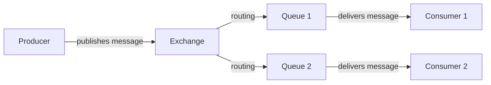
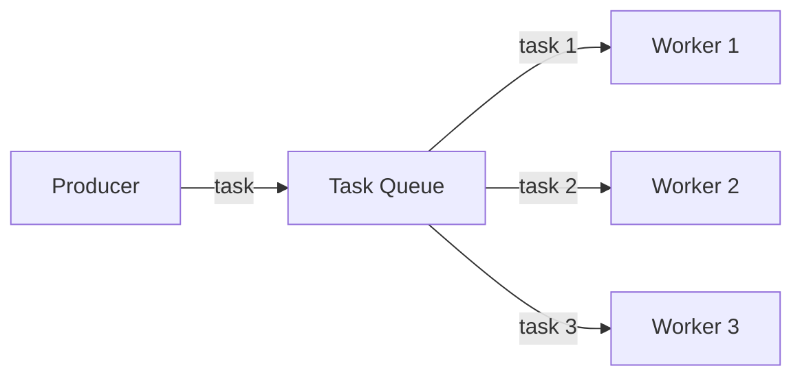
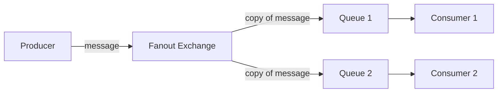
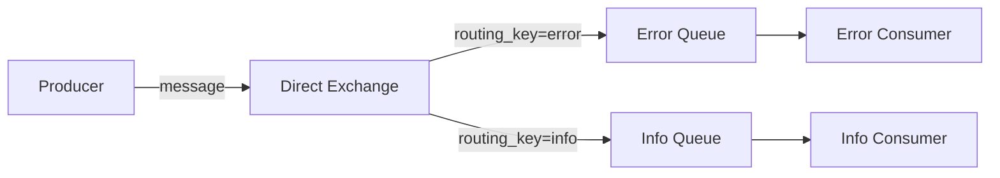

# RabbitMQ PHP Integration

## Introduction

RabbitMQ is a powerful open-source message broker that implements the Advanced Message Queuing Protocol (AMQP). It enables applications to communicate asynchronously by sending and receiving messages through queues. Integrating RabbitMQ with PHP applications allows you to build robust, scalable systems with decoupled components that can handle high loads and ensure reliable message delivery.

In this tutorial, we'll explore how to integrate RabbitMQ with PHP applications. We'll cover installation, basic concepts, and practical examples to help you get started with message queuing in your PHP projects.

## Prerequisites

Before we begin, make sure you have:

1. PHP 7.4 or higher installed
2. Composer for dependency management
3. RabbitMQ server installed and running (version 3.8+)
4. Basic knowledge of PHP programming

## Installing Required Libraries

To work with RabbitMQ in PHP, we'll use the `php-amqplib` library, which provides a pure PHP implementation of the AMQP protocol.

First, create a new project directory and initialize Composer:

```bash
mkdir rabbitmq-php-example
cd rabbitmq-php-example
composer init --quiet
```

Then add the `php-amqplib` package:

```bash
composer require php-amqplib/php-amqplib
```

## Understanding RabbitMQ Basic Concepts

Let's review some key RabbitMQ concepts before we start coding:

<div className="mermaid">

</div>

- **Producer**: Application that sends messages to RabbitMQ
- **Exchange**: Receives messages from producers and routes them to queues
- **Queue**: Buffer that stores messages until they're consumed
- **Consumer**: Application that receives messages from queues
- **Binding**: Rule that tells an exchange which queue to route messages to

## Basic RabbitMQ PHP Integration

### 1. Establishing a Connection

The first step is to establish a connection to the RabbitMQ server:

```php
<?php
require_once __DIR__ . '/vendor/autoload.php';

use PhpAmqpLib\Connection\AMQPStreamConnection;

// Create a connection to RabbitMQ
$connection = new AMQPStreamConnection(
    'localhost', // host
    5672,        // port
    'guest',     // username
    'guest'      // password
);

// Create a channel
$channel = $connection->channel();

// Use the channel for operations...

// Close the channel and connection when done
$channel->close();
$connection->close();
```

### 2. Creating a Simple Producer

Now, let's create a simple producer that publishes messages to a queue:

```php
<?php
// producer.php
require_once __DIR__ . '/vendor/autoload.php';

use PhpAmqpLib\Connection\AMQPStreamConnection;
use PhpAmqpLib\Message\AMQPMessage;

// Create a connection
$connection = new AMQPStreamConnection('localhost', 5672, 'guest', 'guest');
$channel = $connection->channel();

// Declare a queue
$queueName = 'task_queue';
$channel->queue_declare($queueName, false, true, false, false);

// Create a message
$data = 'Hello World! This is a test message sent at ' . date('Y-m-d H:i:s');
$message = new AMQPMessage(
    $data,
    ['delivery_mode' => AMQPMessage::DELIVERY_MODE_PERSISTENT] // Make message persistent
);

// Publish the message to the queue
$channel->basic_publish($message, '', $queueName);

echo " [x] Sent: {$data}
";

// Close the channel and connection
$channel->close();
$connection->close();
```

### 3. Creating a Simple Consumer

Next, we'll create a consumer that processes messages from the queue:

```php
<?php
// consumer.php
require_once __DIR__ . '/vendor/autoload.php';

use PhpAmqpLib\Connection\AMQPStreamConnection;

// Create a connection
$connection = new AMQPStreamConnection('localhost', 5672, 'guest', 'guest');
$channel = $connection->channel();

// Declare the same queue
$queueName = 'task_queue';
$channel->queue_declare($queueName, false, true, false, false);

echo " [*] Waiting for messages. To exit press CTRL+C
";

// Define a callback function to process messages
$callback = function ($message) {
    echo " [x] Received: ", $message->body, "
";
    
    // Simulate processing time
    sleep(substr_count($message->body, '.'));
    
    echo " [x] Done
";
    
    // Acknowledge the message
    $message->ack();
};

// Set quality of service
$channel->basic_qos(null, 1, null);

// Consume messages from the queue
$channel->basic_consume(
    $queueName,      // queue
    '',              // consumer tag
    false,           // no local
    false,           // no ack
    false,           // exclusive
    false,           // no wait
    $callback        // callback
);

// Keep the consumer running to receive messages
while ($channel->is_consuming()) {
    $channel->wait();
}

// Close the channel and connection
$channel->close();
$connection->close();
```

## Running the Examples

To test our basic integration, open two terminal windows:

1. In the first terminal, run the consumer:
   ```bash
   php consumer.php
   ```

2. In the second terminal, run the producer:
   ```bash
   php producer.php
   ```

### Example Output

Producer terminal:
```
[x] Sent: Hello World! This is a test message sent at 2023-06-15 14:30:25
```

Consumer terminal:
```
[*] Waiting for messages. To exit press CTRL+C
[x] Received: Hello World! This is a test message sent at 2023-06-15 14:30:25
[x] Done
```

## Advanced RabbitMQ PHP Integration

Now that we've covered the basics, let's implement more advanced patterns that are commonly used in real-world applications.

### Work Queues (Task Distribution)

Work queues allow you to distribute time-consuming tasks among multiple workers:

<div className="mermaid">

</div>

Here's how to implement a task producer:

```php
<?php
// task_producer.php
require_once __DIR__ . '/vendor/autoload.php';

use PhpAmqpLib\Connection\AMQPStreamConnection;
use PhpAmqpLib\Message\AMQPMessage;

$connection = new AMQPStreamConnection('localhost', 5672, 'guest', 'guest');
$channel = $connection->channel();

$queueName = 'task_queue';
$channel->queue_declare($queueName, false, true, false, false);

// Get task message from command line argument
$data = implode(' ', array_slice($argv, 1));
if (empty($data)) {
    $data = "Hello World!";
}

$message = new AMQPMessage(
    $data,
    ['delivery_mode' => AMQPMessage::DELIVERY_MODE_PERSISTENT]
);

$channel->basic_publish($message, '', $queueName);

echo " [x] Sent: {$data}
";

$channel->close();
$connection->close();
```

And here's the worker:

```php
<?php
// worker.php
require_once __DIR__ . '/vendor/autoload.php';

use PhpAmqpLib\Connection\AMQPStreamConnection;

$connection = new AMQPStreamConnection('localhost', 5672, 'guest', 'guest');
$channel = $connection->channel();

$queueName = 'task_queue';
$channel->queue_declare($queueName, false, true, false, false);

echo " [*] Waiting for tasks. To exit press CTRL+C
";

// Define a callback function to process messages
$callback = function ($message) {
    echo " [x] Received: ", $message->body, "
";
    
    // Simulate task processing time - one dot equals one second
    $dots = substr_count($message->body, '.');
    sleep($dots);
    
    echo " [x] Done after {$dots} seconds
";
    
    // Acknowledge the message
    $message->ack();
};

// Fair dispatch - don't give more than one message to a worker at a time
$channel->basic_qos(null, 1, null);

// Consume messages from the queue
$channel->basic_consume(
    $queueName,
    '',
    false,
    false,
    false,
    false,
    $callback
);

while ($channel->is_consuming()) {
    $channel->wait();
}

$channel->close();
$connection->close();
```

### Publish/Subscribe Pattern

The publish/subscribe pattern allows you to broadcast messages to multiple consumers:

<div className="mermaid">

</div>

Here's a publisher:

```php
<?php
// publisher.php
require_once __DIR__ . '/vendor/autoload.php';

use PhpAmqpLib\Connection\AMQPStreamConnection;
use PhpAmqpLib\Message\AMQPMessage;

$connection = new AMQPStreamConnection('localhost', 5672, 'guest', 'guest');
$channel = $connection->channel();

// Declare an exchange
$exchangeName = 'logs';
$channel->exchange_declare($exchangeName, 'fanout', false, false, false);

// Get message from command line or use default
$data = implode(' ', array_slice($argv, 1));
if (empty($data)) {
    $data = "info: Hello World!";
}

$message = new AMQPMessage($data);

// Publish to the exchange, not directly to a queue
$channel->basic_publish($message, $exchangeName);

echo " [x] Sent: {$data}
";

$channel->close();
$connection->close();
```

And here's a subscriber:

```php
<?php
// subscriber.php
require_once __DIR__ . '/vendor/autoload.php';

use PhpAmqpLib\Connection\AMQPStreamConnection;

$connection = new AMQPStreamConnection('localhost', 5672, 'guest', 'guest');
$channel = $connection->channel();

// Declare the same exchange
$exchangeName = 'logs';
$channel->exchange_declare($exchangeName, 'fanout', false, false, false);

// Create a temporary queue with a random name
list($queueName, ,) = $channel->queue_declare("", false, false, true, false);

// Bind the queue to the exchange
$channel->queue_bind($queueName, $exchangeName);

echo " [*] Waiting for logs. To exit press CTRL+C
";

$callback = function ($message) {
    echo ' [x] ', $message->body, "
";
};

$channel->basic_consume(
    $queueName,
    '',
    false,
    true,
    false,
    false,
    $callback
);

while ($channel->is_consuming()) {
    $channel->wait();
}

$channel->close();
$connection->close();
```

### Routing

Routing allows you to subscribe to specific types of messages:

<div className="mermaid">

</div>

Here's an example of a producer with routing:

```php
<?php
// emit_log_direct.php
require_once __DIR__ . '/vendor/autoload.php';

use PhpAmqpLib\Connection\AMQPStreamConnection;
use PhpAmqpLib\Message\AMQPMessage;

$connection = new AMQPStreamConnection('localhost', 5672, 'guest', 'guest');
$channel = $connection->channel();

$exchangeName = 'direct_logs';
$channel->exchange_declare($exchangeName, 'direct', false, false, false);

// Get severity level and message
$severity = isset($argv[1]) && !empty($argv[1]) ? $argv[1] : 'info';
$data = isset($argv[2]) && !empty($argv[2]) ? $argv[2] : 'Hello World!';

$message = new AMQPMessage($data);

// Use severity as routing key
$channel->basic_publish($message, $exchangeName, $severity);

echo " [x] Sent {$severity}: {$data}
";

$channel->close();
$connection->close();
```

And a consumer with routing:

```php
<?php
// receive_logs_direct.php
require_once __DIR__ . '/vendor/autoload.php';

use PhpAmqpLib\Connection\AMQPStreamConnection;

$connection = new AMQPStreamConnection('localhost', 5672, 'guest', 'guest');
$channel = $connection->channel();

$exchangeName = 'direct_logs';
$channel->exchange_declare($exchangeName, 'direct', false, false, false);

// Create a temporary queue
list($queueName, ,) = $channel->queue_declare("", false, false, true, false);

// Get severities from command line
$severities = array_slice($argv, 1);
if (empty($severities)) {
    file_put_contents('php://stderr', "Usage: $argv[0] [info] [warning] [error]
");
    exit(1);
}

// Bind queue to exchange with each severity as routing key
foreach ($severities as $severity) {
    $channel->queue_bind($queueName, $exchangeName, $severity);
}

echo " [*] Waiting for logs. To exit press CTRL+C
";

$callback = function ($message) {
    echo ' [x] ', $message->delivery_info['routing_key'], ':', $message->body, "
";
};

$channel->basic_consume(
    $queueName,
    '',
    false,
    true,
    false,
    false,
    $callback
);

while ($channel->is_consuming()) {
    $channel->wait();
}

$channel->close();
$connection->close();
```

## Real-World Application: Email Notification System

Let's build a practical example: an email notification system that uses RabbitMQ to handle email sending asynchronously.

### Email Sender Service

First, create a message producer that sends email tasks to a queue:

```php
<?php
// email_sender.php
require_once __DIR__ . '/vendor/autoload.php';

use PhpAmqpLib\Connection\AMQPStreamConnection;
use PhpAmqpLib\Message\AMQPMessage;

class EmailSender {
    private $connection;
    private $channel;
    private $queueName = 'email_queue';

    public function __construct() {
        $this->connection = new AMQPStreamConnection('localhost', 5672, 'guest', 'guest');
        $this->channel = $this->connection->channel();
        
        // Declare a durable queue for emails
        $this->channel->queue_declare(
            $this->queueName,
            false,
            true,  // durable
            false,
            false
        );
    }

    public function sendEmail($to, $subject, $body, $priority = 'normal') {
        // Create email data
        $emailData = [
            'to' => $to,
            'subject' => $subject,
            'body' => $body,
            'priority' => $priority,
            'timestamp' => time()
        ];
        
        // Convert to JSON
        $jsonData = json_encode($emailData);
        
        // Create message with properties
        $message = new AMQPMessage(
            $jsonData,
            [
                'delivery_mode' => AMQPMessage::DELIVERY_MODE_PERSISTENT,
                'priority' => $priority === 'high' ? 10 : 5
            ]
        );
        
        // Publish to queue
        $this->channel->basic_publish($message, '', $this->queueName);
        
        return true;
    }

    public function close() {
        $this->channel->close();
        $this->connection->close();
    }
}

// Example usage
if (php_sapi_name() === 'cli') {
    $sender = new EmailSender();
    
    // Send test email
    $result = $sender->sendEmail(
        'user@example.com',
        'Test Email via RabbitMQ',
        'This is a test email sent through RabbitMQ at ' . date('Y-m-d H:i:s'),
        'normal'
    );
    
    echo "Email queued: " . ($result ? "Success" : "Failed") . "
";
    
    $sender->close();
}
```

### Email Worker Service

Next, create a consumer that processes emails from the queue:

```php
<?php
// email_worker.php
require_once __DIR__ . '/vendor/autoload.php';

use PhpAmqpLib\Connection\AMQPStreamConnection;

class EmailWorker {
    private $connection;
    private $channel;
    private $queueName = 'email_queue';

    public function __construct() {
        $this->connection = new AMQPStreamConnection('localhost', 5672, 'guest', 'guest');
        $this->channel = $this->connection->channel();
        
        // Declare the same queue
        $this->channel->queue_declare(
            $this->queueName,
            false,
            true,  // durable
            false,
            false
        );
        
        // Set fair dispatch with prefetch count of 1
        $this->channel->basic_qos(null, 1, null);
    }

    public function processEmails() {
        echo " [*] Email worker started. Waiting for emails to process. To exit press CTRL+C
";
        
        // Define callback to process email
        $callback = function ($message) {
            $emailData = json_decode($message->body, true);
            
            echo sprintf(
                " [x] Processing email to: %s, subject: %s, priority: %s
",
                $emailData['to'],
                $emailData['subject'],
                $emailData['priority']
            );
            
            // Simulate email sending
            $this->sendEmailActual($emailData);
            
            // Sleep to simulate processing time
            $sleepTime = $emailData['priority'] === 'high' ? 1 : 3;
            sleep($sleepTime);
            
            echo " [x] Email processed and sent
";
            
            // Acknowledge the message
            $message->ack();
        };
        
        // Start consuming messages
        $this->channel->basic_consume(
            $this->queueName,
            '',
            false,
            false,  // no auto-ack
            false,
            false,
            $callback
        );
        
        // Keep the worker running
        while ($this->channel->is_consuming()) {
            $this->channel->wait();
        }
    }

    private function sendEmailActual($emailData) {
        // In a real implementation, you would call a mail service here
        // For example, using PHPMailer, Symfony Mailer, or mail() function
        
        // This is just a placeholder
        echo sprintf(
            " [x] Sending email: To: %s, Subject: %s
",
            $emailData['to'],
            $emailData['subject']
        );
        
        return true;
    }

    public function close() {
        $this->channel->close();
        $this->connection->close();
    }
}

// Run the worker
if (php_sapi_name() === 'cli') {
    $worker = new EmailWorker();
    
    try {
        $worker->processEmails();
    } catch (Exception $e) {
        echo "Error: " . $e->getMessage() . "
";
    } finally {
        $worker->close();
    }
}
```

### Testing the Email System

To test the email system, first start one or more worker instances:

```bash
php email_worker.php
```

Then send emails through the sender:

```php
<?php
// test_emails.php
require_once __DIR__ . '/email_sender.php';

$sender = new EmailSender();

// Send regular priority email
$sender->sendEmail(
    'user1@example.com',
    'Regular notification',
    'This is a regular priority notification.',
    'normal'
);

// Send high priority email
$sender->sendEmail(
    'user2@example.com',
    'URGENT: System Alert',
    'This is a high priority alert that requires immediate attention!',
    'high'
);

$sender->close();

echo "Test emails queued successfully.
";
```

Run the test script:

```bash
php test_emails.php
```

## Best Practices for RabbitMQ with PHP

When integrating RabbitMQ with your PHP applications, follow these best practices:

1. **Durability**: Mark queues and messages as durable to prevent message loss if RabbitMQ restarts.

2. **Acknowledgments**: Always acknowledge messages once they've been successfully processed.

3. **Fair Dispatch**: Use `basic_qos` to ensure work is evenly distributed among consumers.

4. **Connection Management**: Create a connection per process, not per task.

5. **Error Handling**: Implement proper error handling and message retry mechanisms.

6. **Monitoring**: Set up monitoring for your RabbitMQ server and queues.

7. **Message Serialization**: Use JSON or another format to serialize complex message data.

## Troubleshooting Common Issues

Here are solutions to common issues you might encounter:

### Connection Refused

If you see "Connection refused" errors:
- Ensure RabbitMQ is running
- Check if the port is correct (default is 5672)
- Verify that the username and password are correct

### Message Not Being Processed

If messages aren't being processed:
- Check if the consumer is running
- Ensure queue names match between producer and consumer
- Verify that messages are being acknowledged properly

### High Memory Usage

If you experience high memory usage:
- Set message TTL (Time-To-Live) values
- Implement queue length limits
- Consider using lazy queues for large message backlogs

## Summary

In this tutorial, we've covered:

1. How to integrate RabbitMQ with PHP applications using the php-amqplib library
2. Basic messaging patterns: simple queues, work queues, publish/subscribe, and routing
3. A real-world example of an asynchronous email notification system
4. Best practices for using RabbitMQ with PHP

RabbitMQ allows you to build decoupled, scalable, and resilient PHP applications by implementing asynchronous communication between components. By delegating time-consuming or resource-intensive tasks to background workers, you can improve the performance and user experience of your applications.

## Further Learning Resources

To deepen your understanding of RabbitMQ and PHP integration:

1. [Official RabbitMQ Tutorials](https://www.rabbitmq.com/getstarted.html)
2. [php-amqplib Documentation](https://github.com/php-amqplib/php-amqplib)
3. [RabbitMQ in Depth (Book)](https://www.manning.com/books/rabbitmq-in-depth)
4. [Enterprise Integration Patterns](https://www.enterpriseintegrationpatterns.com/)

## Exercises

1. Modify the email notification system to include attachments in the message payload.
2. Implement a retry mechanism for failed email deliveries.
3. Create a web dashboard to monitor the status of the email queue.
4. Extend the system to use topic exchanges to route emails based on multiple criteria.
5. Implement a rate-limiting mechanism to prevent sending too many emails too quickly.