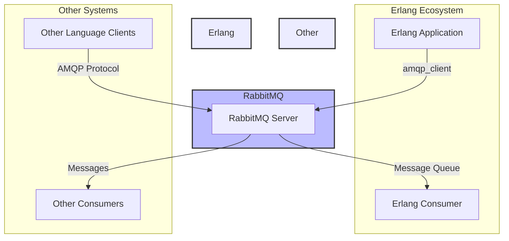

# RabbitMQ Erlang Integration

## Introduction

RabbitMQ is one of the most popular open-source message brokers, providing robust messaging capabilities for distributed applications. What many newcomers to RabbitMQ may not realize is that it's actually built in Erlang, a functional programming language designed for building scalable, concurrent, and fault-tolerant systems. This architectural decision isn't arbitrary—Erlang's strengths align perfectly with the requirements of a reliable message broker.

In this tutorial, we'll explore how to integrate RabbitMQ directly with Erlang applications. While many developers interact with RabbitMQ through client libraries in languages like Python, JavaScript, or Java, working with RabbitMQ in Erlang offers unique advantages and deeper integration possibilities.

## Why Use Erlang with RabbitMQ?

Before diving into implementation details, let's understand why you might want to use Erlang with RabbitMQ:

1. **Native Integration**: Since RabbitMQ is written in Erlang, using Erlang to interact with it reduces layers of abstraction.
2. **Performance**: Direct Erlang-to-Erlang communication can be more efficient than going through other protocols.
3. **Advanced Features**: Some RabbitMQ features are more easily accessible from Erlang.
4. **Consistency**: If your application is already using Erlang, keeping the entire stack in one language simplifies development.

## Prerequisites

Before proceeding, ensure you have:

- Erlang/OTP 24.0 or later installed
- RabbitMQ Server 3.9 or later installed
- Basic familiarity with Erlang syntax
- Basic understanding of AMQP concepts

## Setting Up Your Erlang Project

Let's start by setting up a simple Erlang project that will connect to RabbitMQ. We'll use `rebar3`, a popular Erlang build tool.

First, create a new project:

```bash
$ rebar3 new app rabbitmq_erlang_demo
$ cd rabbitmq_erlang_demo
```

Next, update the `rebar.config` file to include the necessary dependencies:

```erlang
{deps, [
    {amqp_client, "3.9.13"},
    {rabbit_common, "3.9.13"}
]}.
```

## Establishing a Connection to RabbitMQ

Now, let's create a module that establishes a connection to RabbitMQ. Create a file named `src/rabbitmq_connection.erl`:

```erlang
-module(rabbitmq_connection).
-export([start/0, stop/1]).

start() ->
    % Start required applications
    application:ensure_all_started(amqp_client),
    
    % Define connection parameters
    Params = #amqp_params_network{
        host = "localhost",
        port = 5672,
        username = <<"guest">>,
        password = <<"guest">>
    },
    
    % Open a connection
    {ok, Connection} = amqp_connection:start(Params),
    
    % Open a channel
    {ok, Channel} = amqp_connection:open_channel(Connection),
    
    % Return both for later use
    {Connection, Channel}.

stop({Connection, Channel}) ->
    % Close the channel
    amqp_channel:close(Channel),
    
    % Close the connection
    amqp_connection:close(Connection),
    ok.
```

This module provides two functions:
- `start/0`: Establishes a connection to RabbitMQ and returns both the connection and channel.
- `stop/1`: Properly closes the channel and connection.

## Basic Publishing and Consuming

Let's create another module that demonstrates basic publishing and consuming messages. Create a file named `src/rabbitmq_demo.erl`:

```erlang
-module(rabbitmq_demo).
-export([publish/3, setup_consumer/1, run_demo/0]).

-include_lib("amqp_client/include/amqp_client.hrl").

% Publish a message to a queue
publish(Channel, Queue, Message) ->
    % Declare the queue (idempotent - creates if doesn't exist)
    QueueDeclare = #'queue.declare'{queue = Queue},
    #'queue.declare_ok'{} = amqp_channel:call(Channel, QueueDeclare),
    
    % Create the message properties
    Props = #'P_basic'{
        content_type = <<"text/plain">>,
        delivery_mode = 2  % persistent
    },
    
    % Create and publish the message
    Publish = #'basic.publish'{
        exchange = <<"">>,
        routing_key = Queue
    },
    
    % Create the message body
    Body = list_to_binary(Message),
    
    % Publish the message
    amqp_channel:cast(Channel, Publish, #amqp_msg{props = Props, payload = Body}),
    
    io:format("Published message: ~s~n", [Message]).

% Set up a consumer for a queue
setup_consumer(Channel) ->
    % Declare the queue
    Queue = <<"erlang_demo_queue">>,
    QueueDeclare = #'queue.declare'{queue = Queue},
    #'queue.declare_ok'{} = amqp_channel:call(Channel, QueueDeclare),
    
    % Set up the consumer
    Subscribe = #'basic.consume'{queue = Queue},
    #'basic.consume_ok'{consumer_tag = Tag} = amqp_channel:call(Channel, Subscribe),
    
    % Process to handle received messages
    spawn(fun() -> consume_loop(Channel, Tag) end),
    
    Queue.

% Loop to receive and handle messages
consume_loop(Channel, Tag) ->
    receive
        #'basic.consume_ok'{} ->
            consume_loop(Channel, Tag);
        
        #'basic.cancel_ok'{} ->
            ok;
        
        {#'basic.deliver'{delivery_tag = DeliveryTag}, 
         #amqp_msg{payload = Payload}} ->
            % Process the message
            io:format("Received message: ~s~n", [Payload]),
            
            % Acknowledge the message
            Ack = #'basic.ack'{delivery_tag = DeliveryTag},
            amqp_channel:cast(Channel, Ack),
            
            % Continue receiving messages
            consume_loop(Channel, Tag)
    end.

% Run a complete demo
run_demo() ->
    % Start connection
    {Connection, Channel} = rabbitmq_connection:start(),
    
    % Set up consumer
    Queue = setup_consumer(Channel),
    
    % Publish some messages
    publish(Channel, Queue, "Hello from Erlang!"),
    publish(Channel, Queue, "RabbitMQ and Erlang integration is powerful!"),
    
    % Wait a bit to see the messages being consumed
    timer:sleep(2000),
    
    % Close connection
    rabbitmq_connection:stop({Connection, Channel}).
```

## Running the Demo

Now let's create an application module that will run our demo. Update the `src/rabbitmq_erlang_demo_app.erl` file:

```erlang
-module(rabbitmq_erlang_demo_app).
-behaviour(application).
-export([start/2, stop/1]).

start(_StartType, _StartArgs) ->
    io:format("Starting RabbitMQ Erlang Demo...~n"),
    rabbitmq_demo:run_demo(),
    rabbitmq_erlang_demo_sup:start_link().

stop(_State) ->
    ok.
```

Let's run our application:

```bash
$ rebar3 shell
```

Expected output:
```
Starting RabbitMQ Erlang Demo...
Published message: Hello from Erlang!
Published message: RabbitMQ and Erlang integration is powerful!
Received message: Hello from Erlang!
Received message: RabbitMQ and Erlang integration is powerful!
```

## Advanced RabbitMQ Patterns in Erlang

Now that we've covered the basics, let's explore some more advanced patterns.

### Work Queues (Task Distribution)

Work queues are useful for distributing time-consuming tasks among multiple workers. Here's how to implement a work queue in Erlang:

```erlang
-module(work_queue).
-export([setup_worker/1, dispatch_task/2]).

-include_lib("amqp_client/include/amqp_client.hrl").

setup_worker(Channel) ->
    % Declare the queue
    Queue = <<"task_queue">>,
    QueueDeclare = #'queue.declare'{
        queue = Queue,
        durable = true
    },
    #'queue.declare_ok'{} = amqp_channel:call(Channel, QueueDeclare),
    
    % Set up QoS (prefetch count)
    Qos = #'basic.qos'{prefetch_count = 1},
    #'basic.qos_ok'{} = amqp_channel:call(Channel, Qos),
    
    % Set up the consumer
    Subscribe = #'basic.consume'{queue = Queue},
    #'basic.consume_ok'{consumer_tag = Tag} = amqp_channel:call(Channel, Subscribe),
    
    % Process to handle received messages
    spawn(fun() -> worker_loop(Channel, Tag) end),
    
    Queue.

worker_loop(Channel, Tag) ->
    receive
        #'basic.consume_ok'{} ->
            worker_loop(Channel, Tag);
        
        #'basic.cancel_ok'{} ->
            ok;
        
        {#'basic.deliver'{delivery_tag = DeliveryTag}, 
         #amqp_msg{payload = Payload}} ->
            % Process the task
            Task = binary_to_list(Payload),
            io:format("Worker processing task: ~s~n", [Task]),
            
            % Simulate work
            process_task(Task),
            
            % Acknowledge the message
            Ack = #'basic.ack'{delivery_tag = DeliveryTag},
            amqp_channel:cast(Channel, Ack),
            
            % Continue receiving messages
            worker_loop(Channel, Tag)
    end.

process_task(Task) ->
    % Count dots as a way to simulate task complexity
    Dots = length([C || C <- Task, C =:= $.]),
    timer:sleep(Dots * 1000).

dispatch_task(Channel, Task) ->
    % Declare the queue (idempotent)
    Queue = <<"task_queue">>,
    QueueDeclare = #'queue.declare'{
        queue = Queue,
        durable = true
    },
    #'queue.declare_ok'{} = amqp_channel:call(Channel, QueueDeclare),
    
    % Create the message properties
    Props = #'P_basic'{
        content_type = <<"text/plain">>,
        delivery_mode = 2  % persistent
    },
    
    % Create and publish the message
    Publish = #'basic.publish'{
        exchange = <<"">>,
        routing_key = Queue
    },
    
    % Create the message body
    Body = list_to_binary(Task),
    
    % Publish the message
    amqp_channel:cast(Channel, Publish, #amqp_msg{props = Props, payload = Body}),
    
    io:format("Dispatched task: ~s~n", [Task]).
```

### Publish/Subscribe Pattern

Let's implement a publish/subscribe pattern where messages are broadcast to multiple consumers:

```erlang
-module(pubsub).
-export([setup_publisher/1, setup_subscriber/1, publish_log/2]).

-include_lib("amqp_client/include/amqp_client.hrl").

setup_publisher(Channel) ->
    % Declare exchange
    Exchange = <<"logs">>,
    ExchangeDeclare = #'exchange.declare'{
        exchange = Exchange,
        type = <<"fanout">>
    },
    #'exchange.declare_ok'{} = amqp_channel:call(Channel, ExchangeDeclare),
    
    Exchange.

setup_subscriber(Channel) ->
    % Declare exchange
    Exchange = <<"logs">>,
    ExchangeDeclare = #'exchange.declare'{
        exchange = Exchange,
        type = <<"fanout">>
    },
    #'exchange.declare_ok'{} = amqp_channel:call(Channel, ExchangeDeclare),
    
    % Declare a queue with a random name
    QueueDeclare = #'queue.declare'{queue = <<"">>, exclusive = true},
    #'queue.declare_ok'{queue = Queue} = amqp_channel:call(Channel, QueueDeclare),
    
    % Bind the queue to the exchange
    QueueBind = #'queue.bind'{
        queue = Queue,
        exchange = Exchange,
        routing_key = <<"">>
    },
    #'queue.bind_ok'{} = amqp_channel:call(Channel, QueueBind),
    
    % Set up the consumer
    Subscribe = #'basic.consume'{queue = Queue},
    #'basic.consume_ok'{consumer_tag = Tag} = amqp_channel:call(Channel, Subscribe),
    
    % Process to handle received logs
    spawn(fun() -> subscriber_loop(Channel, Tag) end),
    
    {Exchange, Queue}.

subscriber_loop(Channel, Tag) ->
    receive
        #'basic.consume_ok'{} ->
            subscriber_loop(Channel, Tag);
        
        #'basic.cancel_ok'{} ->
            ok;
        
        {#'basic.deliver'{}, #amqp_msg{payload = Payload}} ->
            % Process the log message
            io:format("Received log: ~s~n", [Payload]),
            
            % Continue receiving messages
            subscriber_loop(Channel, Tag)
    end.

publish_log(Channel, LogMessage) ->
    % Declare exchange (idempotent)
    Exchange = <<"logs">>,
    
    % Create and publish the message
    Publish = #'basic.publish'{
        exchange = Exchange,
        routing_key = <<"">>
    },
    
    % Create the message body
    Body = list_to_binary(LogMessage),
    
    % Publish the message
    amqp_channel:cast(Channel, Publish, #amqp_msg{payload = Body}),
    
    io:format("Published log: ~s~n", [LogMessage]).
```

## Architecture Diagram

Here's a diagram showing how Erlang applications can interact with RabbitMQ:



## Best Practices for RabbitMQ Erlang Integration

When integrating RabbitMQ with Erlang applications, consider these best practices:

1. **Connection Management**:
   - Reuse connections and channels when possible.
   - Implement proper connection recovery mechanisms.
   - Handle network failures gracefully.

2. **Message Durability**:
   - Use persistent messages for critical data.
   - Declare durable queues for data that must survive broker restarts.

3. **Acknowledgment Handling**:
   - Use manual acknowledgments for critical messages.
   - Consider using publisher confirms for important publishing operations.

4. **Flow Control**:
   - Implement proper backpressure mechanisms.
   - Use QoS settings to limit the number of unacknowledged messages.

5. **Error Handling**:
   - Use Erlang's supervision principles for managing RabbitMQ connections.
   - Set up dead-letter exchanges for handling failed message processing.

## Direct RabbitMQ Plugin Development

One of the most powerful aspects of using Erlang with RabbitMQ is the ability to develop custom plugins. Here's a basic structure for a simple RabbitMQ plugin:

```erlang
-module(my_rabbitmq_plugin).
-behaviour(rabbit_exchange_type).

-export([
    description/0,
    serialise_events/0,
    route/2,
    validate/1,
    validate_binding/2,
    create/2,
    delete/3,
    policy_changed/2,
    add_binding/3,
    remove_bindings/3,
    assert_args_equivalence/2
]).

description() ->
    [{name, <<"x-my-exchange-type">>},
     {description, <<"My custom exchange type">>}].

serialise_events() -> false.

route(#exchange{name = Name},
      #delivery{message = #basic_message{routing_keys = Routes}}) ->
    % Custom routing logic here
    % This is just a simple example
    rabbit_router:match_routing_key(Name, Routes).

% Implement other callback functions...
```

For plugin development, refer to the RabbitMQ plugin development guide on the official website.

## Summary

In this tutorial, we've explored how to integrate RabbitMQ with Erlang applications. We've covered:

1. Setting up a basic Erlang project with RabbitMQ dependencies
2. Establishing connections to RabbitMQ
3. Publishing and consuming messages
4. Implementing advanced messaging patterns like work queues and publish/subscribe
5. Best practices for RabbitMQ Erlang integration
6. Introduction to plugin development

RabbitMQ's Erlang foundation provides unique opportunities for deep integration with Erlang applications. By leveraging this connection, you can build robust, scalable, and efficient messaging systems that take full advantage of Erlang's concurrency model and RabbitMQ's messaging capabilities.

## Additional Resources

- [Official RabbitMQ Erlang Client Library Documentation](https://www.rabbitmq.com/erlang-client-user-guide.html)
- [Erlang Documentation](https://www.erlang.org/docs)
- [RabbitMQ Plugin Development Guide](https://www.rabbitmq.com/plugin-development.html)
- [RabbitMQ Clustering with Erlang Distribution](https://www.rabbitmq.com/clustering.html)

## Exercises

1. Modify the publish/subscribe example to use a direct exchange with routing keys.
2. Implement a topic exchange example where messages are routed based on wildcard patterns.
3. Create a simple RabbitMQ plugin that adds custom headers to messages.
4. Implement a reliable publisher with publisher confirms.
5. Create a cluster-aware Erlang application that can communicate with all nodes in a RabbitMQ cluster.