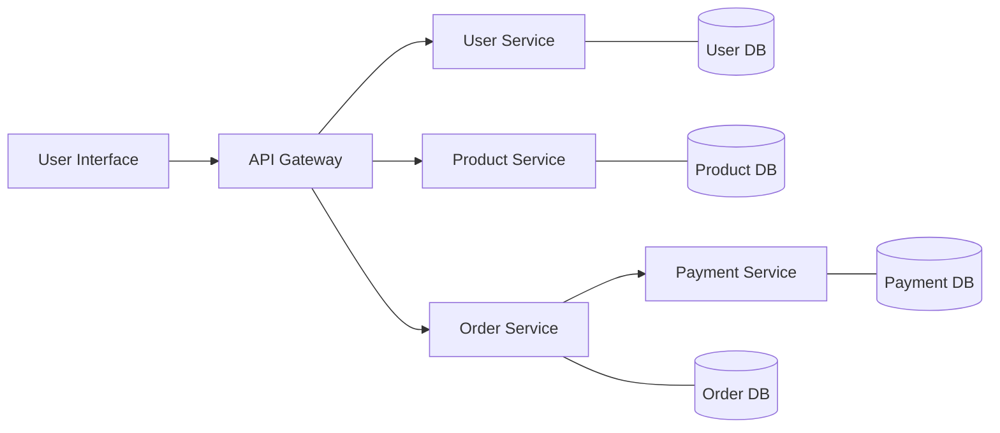
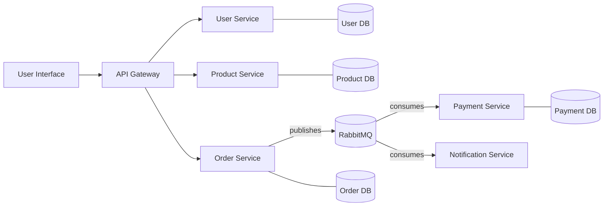
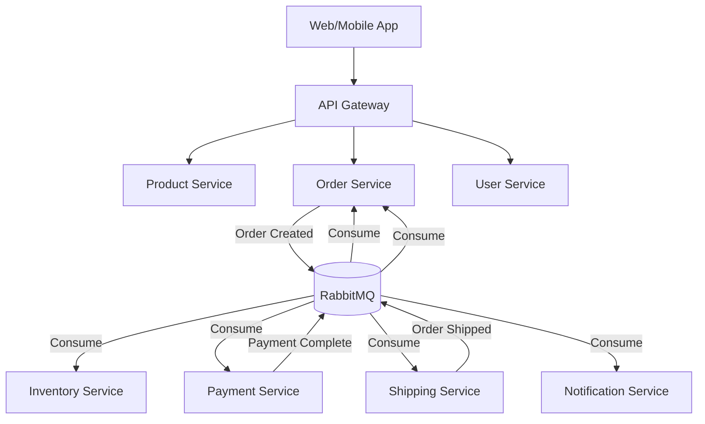

# RabbitMQ Microservices

## Introduction

Microservices architecture has become a cornerstone of modern application development, allowing teams to build complex systems as a collection of small, independent services. However, with this architectural pattern comes the challenge of inter-service communication. This is where RabbitMQ shines as a powerful message broker that enables reliable, asynchronous communication between microservices.

In this guide, we'll explore how RabbitMQ integrates with microservices architectures, why it's beneficial, and how to implement it in your own projects. Whether you're building your first microservices application or looking to improve communication in an existing system, this guide will provide you with practical knowledge and examples.

## What are Microservices?

Microservices is an architectural style that structures an application as a collection of loosely coupled, independently deployable services. Each service is focused on a specific business capability and can be developed, deployed, and scaled independently.

Let's visualize a basic microservices architecture:



In this architecture, services need to communicate with each other to fulfill business operations. This is where RabbitMQ comes in.

## Why Use RabbitMQ in Microservices?

RabbitMQ offers several advantages when used in a microservices environment:

1. **Asynchronous Communication**: Services can send messages without waiting for responses, improving performance and responsiveness.

2. **Decoupling**: Services don't need direct knowledge of each other, only the message format.

3. **Load Balancing**: RabbitMQ can distribute messages among multiple instances of the same service.

4. **Reliability**: Messages persist in the queue until processed, ensuring data isn't lost even if a service is temporarily unavailable.

5. **Scalability**: Both the producer and consumer services can scale independently based on their workload.

6. **Message Patterns**: Support for various message patterns like publish/subscribe, request/reply, and work queues.

Let's see how RabbitMQ fits into our microservices architecture:



## Setting Up RabbitMQ for Microservices

### Prerequisites

- Basic understanding of microservices
- Docker installed (for running RabbitMQ)
- Node.js or another programming language of your choice

### Step 1: Start RabbitMQ Using Docker

First, let's start a RabbitMQ instance using Docker:

```bash
docker run -d --name rabbitmq -p 5672:5672 -p 15672:15672 rabbitmq:3-management
```

This command starts RabbitMQ with the management plugin, which provides a web interface accessible at `http://localhost:15672` (username: `guest`, password: `guest`).

### Step 2: Creating a Producer Service

Let's implement a simple Order Service that publishes messages to RabbitMQ when a new order is created. We'll use Node.js with the `amqplib` library:

```bash
npm install amqplib
```

Now, let's create an Order Service (`order-service.js`):

```javascript
const amqp = require('amqplib');

class OrderService {
  constructor() {
    this.connection = null;
    this.channel = null;
  }

  async connect() {
    try {
      this.connection = await amqp.connect('amqp://localhost');
      this.channel = await this.connection.createChannel();
      
      // Declare the exchange and queue
      await this.channel.assertExchange('order_events', 'topic', { durable: true });
      console.log('Connected to RabbitMQ');
    } catch (error) {
      console.error('Error connecting to RabbitMQ:', error);
      throw error;
    }
  }

  async createOrder(orderData) {
    try {
      // Create order in database (simplified)
      const order = {
        id: Math.floor(Math.random() * 1000),
        ...orderData,
        status: 'created',
        createdAt: new Date()
      };
      
      // Publish order created event
      const routingKey = 'order.created';
      await this.channel.publish(
        'order_events',
        routingKey,
        Buffer.from(JSON.stringify(order)),
        { persistent: true }
      );
      
      console.log(`Order ${order.id} created and event published`);
      return order;
    } catch (error) {
      console.error('Error creating order:', error);
      throw error;
    }
  }

  async close() {
    try {
      await this.channel.close();
      await this.connection.close();
    } catch (error) {
      console.error('Error closing RabbitMQ connection:', error);
    }
  }
}

// Example usage
async function main() {
  const orderService = new OrderService();
  await orderService.connect();
  
  const order = await orderService.createOrder({
    customerId: 123,
    products: [
      { id: 1, name: 'Product 1', price: 29.99, quantity: 2 },
      { id: 2, name: 'Product 2', price: 49.99, quantity: 1 }
    ],
    totalAmount: 109.97
  });
  
  console.log('Created order:', order);
  
  // Close connection after a delay
  setTimeout(() => {
    orderService.close();
  }, 1000);
}

main().catch(console.error);
```

### Step 3: Creating Consumer Services

Now, let's create a Payment Service (`payment-service.js`) that listens for new orders and processes payments:

```javascript
const amqp = require('amqplib');

class PaymentService {
  constructor() {
    this.connection = null;
    this.channel = null;
  }

  async connect() {
    try {
      this.connection = await amqp.connect('amqp://localhost');
      this.channel = await this.connection.createChannel();
      
      // Declare the exchange
      await this.channel.assertExchange('order_events', 'topic', { durable: true });
      
      // Create a queue for payment service
      const { queue } = await this.channel.assertQueue('payment_service_queue', { durable: true });
      
      // Bind the queue to exchange with routing key
      await this.channel.bindQueue(queue, 'order_events', 'order.created');
      
      // Set prefetch to 1 to ensure fair distribution of messages
      await this.channel.prefetch(1);
      
      console.log('Payment service connected to RabbitMQ');
      
      // Start consuming messages
      await this.channel.consume(queue, this.processMessage.bind(this), { noAck: false });
      console.log('Waiting for order events...');
    } catch (error) {
      console.error('Error connecting to RabbitMQ:', error);
      throw error;
    }
  }

  async processMessage(msg) {
    try {
      const order = JSON.parse(msg.content.toString());
      console.log(`Processing payment for order ${order.id}`);
      
      // Simulate payment processing
      await this.processPayment(order);
      
      // Acknowledge the message
      this.channel.ack(msg);
      
      console.log(`Payment processed for order ${order.id}`);
    } catch (error) {
      console.error('Error processing payment:', error);
      // Negative acknowledgment to requeue the message
      this.channel.nack(msg, false, true);
    }
  }

  async processPayment(order) {
    // Simulate payment processing delay
    await new Promise(resolve => setTimeout(resolve, 2000));
    
    // Simulate payment processing logic
    const paymentResult = {
      orderId: order.id,
      amount: order.totalAmount,
      status: 'completed',
      transactionId: 'txn_' + Math.random().toString(36).substr(2, 9),
      processedAt: new Date()
    };
    
    console.log('Payment result:', paymentResult);
    return paymentResult;
  }

  async close() {
    try {
      await this.channel.close();
      await this.connection.close();
    } catch (error) {
      console.error('Error closing RabbitMQ connection:', error);
    }
  }
}

// Start the payment service
async function main() {
  const paymentService = new PaymentService();
  await paymentService.connect();
  
  // Keep the service running
  console.log('Payment service is running. Press CTRL+C to exit.');
  
  // Handle application shutdown
  process.on('SIGINT', async () => {
    console.log('Shutting down payment service...');
    await paymentService.close();
    process.exit(0);
  });
}

main().catch(console.error);
```

Similarly, let's create a Notification Service (`notification-service.js`) to send notifications about new orders:

```javascript
const amqp = require('amqplib');

class NotificationService {
  constructor() {
    this.connection = null;
    this.channel = null;
  }

  async connect() {
    try {
      this.connection = await amqp.connect('amqp://localhost');
      this.channel = await this.connection.createChannel();
      
      // Declare the exchange
      await this.channel.assertExchange('order_events', 'topic', { durable: true });
      
      // Create a queue for notification service
      const { queue } = await this.channel.assertQueue('notification_service_queue', { durable: true });
      
      // Bind the queue to exchange with routing key
      await this.channel.bindQueue(queue, 'order_events', 'order.created');
      
      // Set prefetch to 1
      await this.channel.prefetch(1);
      
      console.log('Notification service connected to RabbitMQ');
      
      // Start consuming messages
      await this.channel.consume(queue, this.processMessage.bind(this), { noAck: false });
      console.log('Waiting for order events...');
    } catch (error) {
      console.error('Error connecting to RabbitMQ:', error);
      throw error;
    }
  }

  async processMessage(msg) {
    try {
      const order = JSON.parse(msg.content.toString());
      console.log(`Sending notification for order ${order.id}`);
      
      // Simulate sending notification
      await this.sendNotification(order);
      
      // Acknowledge the message
      this.channel.ack(msg);
      
      console.log(`Notification sent for order ${order.id}`);
    } catch (error) {
      console.error('Error sending notification:', error);
      // Negative acknowledgment to requeue the message
      this.channel.nack(msg, false, true);
    }
  }

  async sendNotification(order) {
    // Simulate notification delay
    await new Promise(resolve => setTimeout(resolve, 1000));
    
    // Simulate email notification
    const notification = {
      type: 'email',
      recipient: `customer-${order.customerId}@example.com`,
      subject: `Order #${order.id} Confirmation`,
      body: `Thank you for your order! Your order #${order.id} has been received and is being processed.`,
      sentAt: new Date()
    };
    
    console.log('Notification sent:', notification);
    return notification;
  }

  async close() {
    try {
      await this.channel.close();
      await this.connection.close();
    } catch (error) {
      console.error('Error closing RabbitMQ connection:', error);
    }
  }
}

// Start the notification service
async function main() {
  const notificationService = new NotificationService();
  await notificationService.connect();
  
  // Keep the service running
  console.log('Notification service is running. Press CTRL+C to exit.');
  
  // Handle application shutdown
  process.on('SIGINT', async () => {
    console.log('Shutting down notification service...');
    await notificationService.close();
    process.exit(0);
  });
}

main().catch(console.error);
```

## Running the Microservices

To run our microservices system, follow these steps:

1. Start the RabbitMQ container if it's not already running.
2. Start the consumer services (Payment and Notification) in separate terminal windows:

```bash
node payment-service.js
node notification-service.js
```

3. Run the Order Service to create an order and publish an event:

```bash
node order-service.js
```

### Expected Output

When you run the Order Service, you should see output like:

```
Connected to RabbitMQ
Order 123 created and event published
Created order: {
  id: 123,
  customerId: 123,
  products: [
    { id: 1, name: 'Product 1', price: 29.99, quantity: 2 },
    { id: 2, name: 'Product 2', price: 49.99, quantity: 1 }
  ],
  totalAmount: 109.97,
  status: 'created',
  createdAt: '2023-07-15T10:30:45.123Z'
}
```

In the Payment Service terminal, you should see:

```
Payment service connected to RabbitMQ
Waiting for order events...
Processing payment for order 123
Payment result: {
  orderId: 123,
  amount: 109.97,
  status: 'completed',
  transactionId: 'txn_1ab2c3d4e5',
  processedAt: '2023-07-15T10:30:47.456Z'
}
Payment processed for order 123
```

In the Notification Service terminal, you should see:

```
Notification service connected to RabbitMQ
Waiting for order events...
Sending notification for order 123
Notification sent: {
  type: 'email',
  recipient: 'customer-123@example.com',
  subject: 'Order #123 Confirmation',
  body: 'Thank you for your order! Your order #123 has been received and is being processed.',
  sentAt: '2023-07-15T10:30:46.789Z'
}
Notification sent for order 123
```

## Advanced RabbitMQ Patterns for Microservices

### 1. Dead Letter Exchanges

Dead Letter Exchanges (DLX) are used to handle messages that cannot be delivered or processed. This is particularly useful in microservices to handle errors and retries.

```javascript
// In your consumer service setup
await this.channel.assertExchange('dead_letter_exchange', 'direct', { durable: true });
const { queue: dlq } = await this.channel.assertQueue('dead_letter_queue', { durable: true });
await this.channel.bindQueue(dlq, 'dead_letter_exchange', 'failed');

// When creating the main queue, set up the DLX
const { queue } = await this.channel.assertQueue('service_queue', {
  durable: true,
  deadLetterExchange: 'dead_letter_exchange',
  deadLetterRoutingKey: 'failed',
  messageTtl: 60000 // Optional: message time-to-live in milliseconds
});
```

### 2. Message Priority

You can prioritize certain messages to ensure critical operations are processed first:

```javascript
// Declare a queue with priority
await this.channel.assertQueue('priority_queue', {
  durable: true,
  maxPriority: 10 // Set maximum priority level
});

// When publishing a message, set its priority
await this.channel.sendToQueue('priority_queue', Buffer.from(message), {
  persistent: true,
  priority: 8 // Higher number means higher priority
});
```

### 3. Request-Reply Pattern

For synchronous communication needs within microservices:

```javascript
// Producer (requester)
const { queue } = await channel.assertQueue('', { exclusive: true });
const correlationId = generateUuid();

channel.consume(queue, (msg) => {
  if (msg.properties.correlationId === correlationId) {
    console.log('Got reply:', msg.content.toString());
    // Process the response
  }
}, { noAck: true });

channel.sendToQueue('rpc_queue', Buffer.from(request), {
  correlationId: correlationId,
  replyTo: queue
});

// Consumer (responder)
channel.consume('rpc_queue', async (msg) => {
  const response = await processRequest(msg.content.toString());
  
  channel.sendToQueue(
    msg.properties.replyTo,
    Buffer.from(response.toString()),
    { correlationId: msg.properties.correlationId }
  );
  
  channel.ack(msg);
});
```

## Best Practices for RabbitMQ in Microservices

1. **Use Durable Exchanges and Queues**: Ensure that messages survive broker restarts.

2. **Implement Proper Error Handling**: Always handle and log errors, and consider using Dead Letter Exchanges.

3. **Set Message TTL**: Define how long messages should live to prevent queue buildups.

4. **Use Acknowledgments**: Acknowledge messages only after successful processing.

5. **Implement Circuit Breakers**: Prevent cascading failures by detecting when services are unavailable.

6. **Define Message Schemas**: Use a schema registry (like Avro or Protobuf) to ensure message compatibility.

7. **Monitor RabbitMQ**: Track queue depths, message rates, and consumer health.

8. **Test Failure Scenarios**: Ensure your system handles service outages gracefully.

## Common Challenges and Solutions

### Challenge 1: Message Order

In microservices, sometimes message order is important. To ensure messages are processed in order:

- Use a single queue with a single consumer
- For multiple consumers, partition messages based on a key (like user ID)

### Challenge 2: Idempotent Consumers

Ensure your consumers are idempotent (can process the same message multiple times without side effects):

```javascript
async processMessage(msg) {
  const order = JSON.parse(msg.content.toString());
  
  // Check if this message has already been processed
  const isProcessed = await this.checkIfAlreadyProcessed(order.id);
  if (isProcessed) {
    this.channel.ack(msg);
    return;
  }
  
  // Process the message
  await this.processPayment(order);
  
  // Mark as processed
  await this.markAsProcessed(order.id);
  
  this.channel.ack(msg);
}
```

### Challenge 3: Scaling Consumers

As your system grows, you may need to scale consumers. RabbitMQ handles this well with worker queues:

```javascript
// Start multiple instances of the same consumer
// Each will get messages in a round-robin fashion
```

## Practical Example: Event-Driven E-Commerce System

Let's consider a practical example of an e-commerce system using RabbitMQ and microservices:



In this system:

1. When a customer places an order, the Order Service publishes an `order.created` event.
2. The Inventory Service reserves the products.
3. The Payment Service processes the payment and publishes a `payment.completed` event.
4. The Order Service updates the order status based on the payment event.
5. The Shipping Service prepares the shipment and publishes an `order.shipped` event.
6. The Notification Service sends updates to the customer throughout the process.

This architecture allows each service to focus on its specific responsibility while communicating asynchronously through RabbitMQ.

## Summary

In this guide, we've explored how RabbitMQ can be integrated into a microservices architecture to enable reliable, asynchronous communication between services. We've covered:

- The benefits of using RabbitMQ in microservices
- Setting up a basic RabbitMQ-based microservices system
- Implementing producer and consumer services
- Advanced RabbitMQ patterns for microservices
- Best practices and common challenges

By leveraging RabbitMQ, you can build resilient, scalable, and loosely coupled microservices that communicate effectively, even under high load or when services temporarily fail.

## Additional Resources

- [RabbitMQ Official Documentation](https://www.rabbitmq.com/documentation.html)
- [AMQP 0-9-1 Protocol Reference](https://www.rabbitmq.com/amqp-0-9-1-reference.html)
- [Cloud-Native Messaging with RabbitMQ](https://www.rabbitmq.com/blog/category/cloud-native)

## Exercises

1. Implement a retry mechanism for failed messages using Dead Letter Exchanges.
2. Add a new microservice to the example system (e.g., a Recommendation Service).
3. Implement the Request-Reply pattern for synchronous operations.
4. Create a monitoring service that tracks the health of all services and message queues.
5. Implement message schemas using JSON Schema or Protocol Buffers.