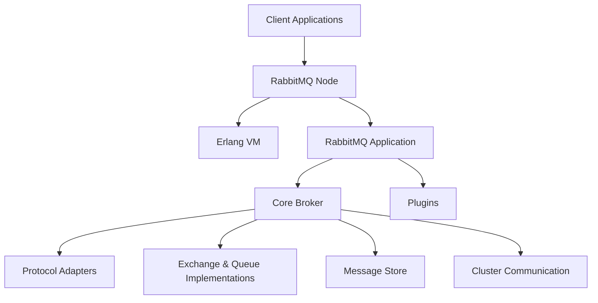
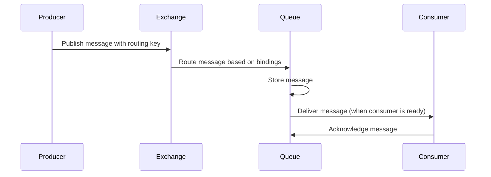
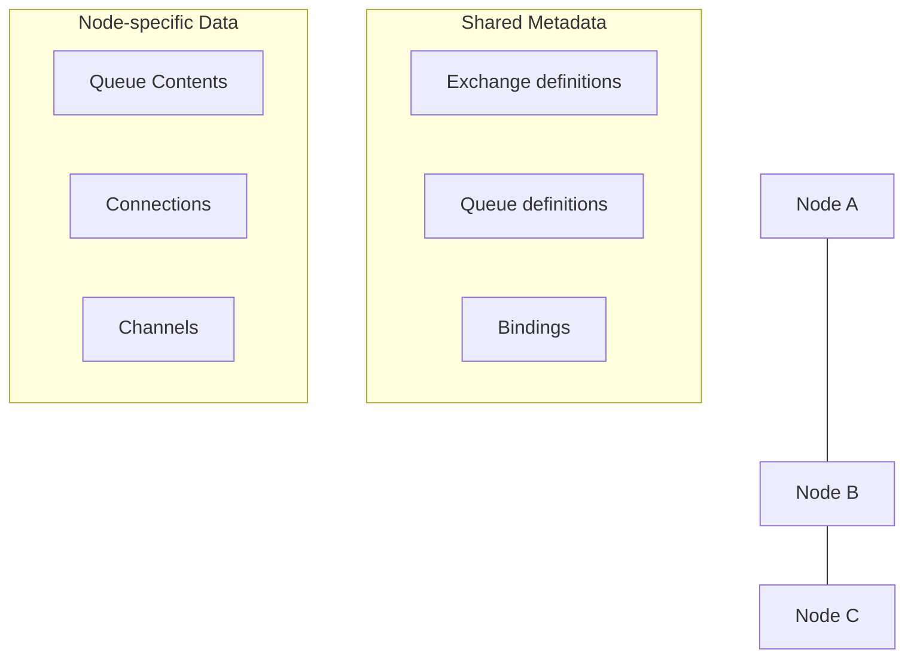

# RabbitMQ Internals

## Introduction

When working with RabbitMQ as a message broker, understanding what happens behind the scenes can significantly improve your ability to design robust messaging solutions, troubleshoot issues, and optimize performance. This guide dives into RabbitMQ's internal architecture, exploring how messages flow through the system, how data is stored, and the key components that make RabbitMQ work.

RabbitMQ is built on Erlang/OTP, which provides a robust foundation for building distributed, fault-tolerant systems. This architecture choice enables RabbitMQ to handle massive loads while maintaining high availability.

## Core Components

Let's break down the key components that make up RabbitMQ's internal architecture:

### Erlang VM and OTP

RabbitMQ runs on the Erlang Virtual Machine (BEAM), leveraging the Open Telecom Platform (OTP) framework. This provides several important benefits:

- **Concurrency**: Erlang's lightweight processes allow RabbitMQ to handle numerous concurrent connections efficiently.
- **Distribution**: Built-in support for distributed systems facilitates cluster formation.
- **Fault Tolerance**: Supervision trees help isolate failures and provide self-healing capabilities.

### Node Architecture

A RabbitMQ server instance (node) consists of several key components:



Each component plays a specific role:

1. **Core Broker**: Implements the AMQP model with exchanges, queues, and bindings
2. **Protocol Adapters**: Handle different messaging protocols (AMQP 0-9-1, MQTT, STOMP)
3. **Message Store**: Manages persistence and message delivery
4. **Plugins**: Extend functionality (management UI, shovel, federation)

## Message Flow

Understanding how messages move through RabbitMQ is crucial. Let's trace a message's journey:

### Publishing a Message

When a client publishes a message:

1. **Connection Establishment**: Client creates a TCP connection to RabbitMQ
2. **Channel Creation**: Client creates a logical channel within the connection
3. **Publish Request**: Client sends a message to an exchange with a routing key
4. **Exchange Routing**: The exchange evaluates bindings and routes the message
5. **Queue Storage**: Messages are stored in queues based on routing rules

Here's a simplified diagram of this process:



### Message Delivery

When delivering messages to consumers:

1. **Prefetch**: RabbitMQ sends a configurable number of messages (controlled by QoS)
2. **Acknowledgment**: Consumers acknowledge messages when processed
3. **Requeuing**: Unacknowledged messages may be requeued upon consumer disconnection

## Storage and Persistence

RabbitMQ's storage mechanisms are crucial to understand for reliability and performance:

### Memory vs. Disk Storage

Messages can be stored in:

1. **Memory (RAM)**: Faster but volatile
2. **Disk**: Slower but persistent across restarts

The `queue.declare` operation determines storage type:

```javascript
channel.assertQueue('my-queue', {
  durable: true,  // Queue survives broker restart
  arguments: {
    'x-queue-type': 'classic',  // Queue type (classic, quorum, stream)
    'x-queue-mode': 'lazy'  // Stores messages on disk as soon as possible
  }
});
```

### Queue Types

RabbitMQ offers three queue implementations with different persistence characteristics:

1. **Classic Queues**: Traditional implementation with optional persistence
2. **Quorum Queues**: Consensus-based replicated queues for high reliability
3. **Streams**: Append-only log structures for high-throughput scenarios

### Message Storage Internals

For persistent messages, RabbitMQ writes data to:

1. **Message Store**: Stores message bodies and properties
2. **Queue Index**: Tracks message order and state within queues

The storage format uses a combination of:

- **Message Reference Counting**: Allows multiple queues to reference a single message
- **Segment Files**: Stores message data in segmented files for efficient disk usage
- **Garbage Collection**: Periodically cleans up delivered messages

## Memory Management

RabbitMQ carefully manages memory to maintain stability:

### Memory Alarms

When memory usage exceeds thresholds, RabbitMQ activates alarms:

1. **Internal Watermark**: Typically set at 40% of available memory
2. **High Watermark**: Default is 0.4 (40% of system RAM)

You can configure this in your `rabbitmq.conf`:

```
vm_memory_high_watermark.relative = 0.4
```

When an alarm triggers:
- New publishers are blocked from sending messages
- Consumers continue to receive messages (reducing memory pressure)
- Alarms clear when memory usage drops below the threshold

### Queue Memory Management

Queues use different memory management strategies:

1. **In-Memory Queues**: Keep messages in RAM until delivered
2. **Lazy Queues**: Store messages to disk as soon as possible
3. **Default Queues**: Use a hybrid approach based on memory pressure

## Clustering and Distribution

RabbitMQ clusters distribute work across multiple nodes:

### Cluster Formation

Nodes in a cluster share:
- Exchange definitions
- Queue definitions
- Bindings
- Users
- Permissions

But message data is node-specific unless using quorum queues or mirrored queues.



### Message Queue Distribution

Classic queues in a cluster are "homed" on one node but are visible cluster-wide. When a client connects to any node and consumes from a queue:

1. If the queue is on the connected node: Direct delivery
2. If the queue is on another node: Message is transferred via inter-node communication

### Quorum Queues

Quorum queues replicate data across multiple nodes using the Raft consensus algorithm:

```javascript
channel.assertQueue('my-quorum-queue', {
  durable: true,
  arguments: {
    'x-queue-type': 'quorum',
    'x-quorum-initial-group-size': 3  // Replicate across 3 nodes
  }
});
```

## Protocol Implementation

RabbitMQ supports multiple messaging protocols through adapters:

### AMQP 0-9-1

The primary protocol with features like:
- Content-based routing
- Publisher confirms
- Consumer acknowledgments

### Protocol Extensions

RabbitMQ extends standard protocols with features like:
- **Publisher confirms**: Ensuring reliable publishing
- **Consumer priorities**: Allowing some consumers to receive messages before others
- **Per-queue message TTL**: Automatically discarding old messages

## Flow Control Mechanisms

RabbitMQ implements several flow control mechanisms:

### Credit-Based Flow Control

Channels use a credit-based system to prevent overwhelming the broker:
1. Each channel gets a certain amount of "credit"
2. Publishing messages consumes credit
3. RabbitMQ periodically replenishes credit

### Backpressure

When a node is under pressure, RabbitMQ implements backpressure by:
1. Slowing down publishers
2. Blocking new publications temporarily
3. Prioritizing message consumption

## Implementation Example: Understanding Queue Internals

Let's look at a practical example of how queue internals affect your application:

### Scenario: High-throughput Message Processing

Imagine we're building a log processing system that needs to handle 10,000 messages per second. Understanding queue internals helps us make the right architectural decisions:

```javascript
// Producer code - understanding internal implications
const connection = await amqp.connect('amqp://localhost');
const channel = await connection.createChannel();

// Understand the queue type implications
await channel.assertQueue('logs', {
  durable: true,
  arguments: {
    'x-queue-type': 'stream', // Stream queues for high-throughput logs
    'x-max-length-bytes': 10_000_000_000, // 10GB retention
    'x-stream-max-segment-size-bytes': 100_000_000 // 100MB segments
  }
});

// Batch publishing for efficiency (reduces internal Erlang process messaging)
const batch = [];
for (let i = 0; i < 1000; i++) {
  batch.push({
    content: Buffer.from(`Log entry ${i}`),
    properties: { 
      persistent: true,
      messageId: `msg-${Date.now()}-${i}`
    }
  });
}

// Publishing with confirms (internally creates Erlang promises)
channel.publish('', 'logs', batch);
await channel.waitForConfirms();
```

And the consumer:

```javascript
// Consumer code with internal optimizations
const connection = await amqp.connect('amqp://localhost');
const channel = await connection.createChannel();

// Higher prefetch reduces internal coordination overhead
await channel.prefetch(1000);

// Consumer with batched acks (reduces internal communication)
let messageCount = 0;
await channel.consume('logs', async (msg) => {
  // Process message...
  messageCount++;
  
  if (messageCount >= 100) {
    channel.ack(msg, true); // Batch acknowledge 100 messages
    messageCount = 0;
  }
}, { noAck: false });
```

## Erlang Process Model

At its core, RabbitMQ uses Erlang processes for almost everything:

- Each **connection** is handled by dedicated Erlang processes
- Each **channel** has its own process
- Each **queue** has a process managing its state
- Each **exchange** has a process for routing

This process isolation means that issues in one component (like a misbehaving queue) don't affect others.

## Implementing a Custom Queue Policy

Understanding the internal behavior helps us create appropriate policies:

```bash
# Define a policy that controls internal queue behavior
rabbitmqctl set_policy high-throughput "^logs\." \
  '{"queue-mode":"lazy", "ha-mode":"exactly", "ha-params":2, "ha-sync-mode":"automatic"}' \
  --priority 1 --apply-to queues
```

This policy:
1. Makes queues use lazy mode (prioritizing disk storage)
2. Ensures queue replication across exactly 2 nodes
3. Automatically synchronizes replicas

## Debugging RabbitMQ Internals

When troubleshooting, understanding internals helps you look at the right metrics:

```bash
# Check detailed queue statistics, including internal metrics
rabbitmqctl list_queues name messages consumers memory state garbage_collection

# Inspect a specific queue's internals
rabbitmqctl list_queue_stats test_queue

# Check Erlang process count (indication of connection load)
rabbitmqctl eval 'erlang:system_info(process_count).'
```

## Summary

Understanding RabbitMQ internals gives you the knowledge to:

1. **Design better messaging architectures** by choosing appropriate queue types and configurations
2. **Optimize for performance** by understanding memory management and flow control
3. **Troubleshoot effectively** by knowing where to look when problems occur
4. **Plan for scaling** by understanding clustering behavior and message distribution

RabbitMQ's internal design provides a robust foundation for messaging needs, with careful attention to reliability, performance, and scalability.

## Further Learning

To deepen your understanding of RabbitMQ internals:

1. **Practice setting up a clustered environment** to observe node interaction
2. **Experiment with different queue types** (classic, quorum, stream) and compare behavior
3. **Monitor RabbitMQ under load** using the management plugin to observe internal metrics
4. **Try implementing different reliability patterns** like publisher confirms and consumer acknowledgments

## External Resources

- [RabbitMQ Official Documentation](https://www.rabbitmq.com/documentation.html)
- [RabbitMQ Internals](https://www.rabbitmq.com/blog/categories/internals/)
- [Erlang Documentation](https://www.erlang.org/docs)
- [CloudAMQP RabbitMQ Guides](https://www.cloudamqp.com/blog/index.html)