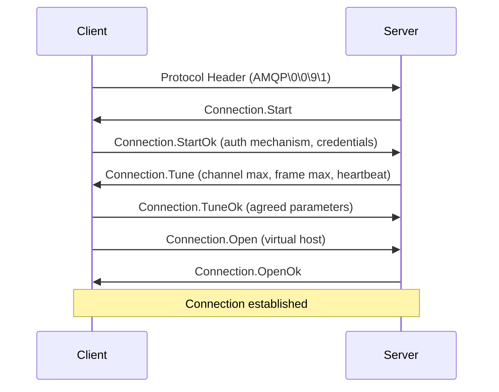

# RabbitMQ Protocol Analysis

## Introduction

When working with RabbitMQ at an advanced level, understanding the underlying protocol becomes essential for troubleshooting, performance optimization, and implementing custom clients. RabbitMQ primarily uses the Advanced Message Queuing Protocol (AMQP) 0-9-1, an open standard for message-oriented middleware.

In this guide, we'll explore the AMQP protocol structure, analyze the communication flow between clients and RabbitMQ servers, and learn how to use protocol analysis tools to diagnose issues and improve your messaging architecture.

## AMQP Protocol Fundamentals

### What is AMQP?

AMQP (Advanced Message Queuing Protocol) is an open standard application layer protocol for message-oriented middleware. The key features that make AMQP powerful include:

- Message orientation
- Queuing
- Routing (including point-to-point and publish-subscribe patterns)
- Reliability
- Security

RabbitMQ implements AMQP 0-9-1 as its primary protocol, though it supports other protocols through plugins.

### Protocol Structure

AMQP communication consists of frames, which are the basic units of data exchange. Each frame has the following structure:

```
+------+--------+-----------+----------------+
| Type | Channel | Size      | Payload       |
| (1B) | (2B)    | (4B)      | (Size bytes)  |
+------+--------+-----------+----------------+
                             |    Frame End   |
                             | Octet (1 byte) |
                             +----------------+
```

There are five frame types in AMQP 0-9-1:

1. **Method frames** (type = 1): Carry commands like queue.declare, basic.publish
2. **Header frames** (type = 2): Contain message properties and size information
3. **Body frames** (type = 3): Contain message content
4. **Heartbeat frames** (type = 8): Used for connection keepalive
5. **Protocol header frame**: Special frame sent only once during connection establishment

## Connection Negotiation

Understanding how clients establish connections with RabbitMQ can help debug connectivity issues. Here's the typical sequence:



Let's break this down:

1. The client initiates by sending the **Protocol Header** (`AMQP\0\0\9\1`)
2. The server responds with **Connection.Start**, offering supported authentication mechanisms
3. The client sends **Connection.StartOk** with its chosen authentication method and credentials
4. The server proposes connection parameters with **Connection.Tune**
5. The client confirms parameters with **Connection.TuneOk**
6. The client requests access to a virtual host with **Connection.Open**
7. The server confirms with **Connection.OpenOk**

## Publishing and Consuming Messages

### Publishing a Message

When a client publishes a message, the following frames are sent:

1. **basic.publish** method frame with exchange and routing key information
2. **content header** frame with message properties and body size
3. One or more **body frames** containing the message content

```javascript
// Example JavaScript code using amqplib to publish a message
const amqp = require('amqplib');

async function publishMessage() {
  try {
    const connection = await amqp.connect('amqp://localhost');
    const channel = await connection.createChannel();
    
    const exchange = 'logs';
    const routingKey = 'info';
    const message = Buffer.from('Hello World!');
    
    // This single line generates three AMQP frames:
    // 1. basic.publish method frame
    // 2. content header frame
    // 3. body frame
    channel.publish(exchange, routingKey, message, {
      contentType: 'text/plain',
      persistent: true
    });
    
    console.log(" [x] Sent message");
    
    await channel.close();
    await connection.close();
  } catch (error) {
    console.error(error);
  }
}

publishMessage();
```

### Consuming a Message

When consuming messages, the client first sends a **basic.consume** method frame to subscribe to a queue. When messages are delivered:

1. The server sends a **basic.deliver** method frame with delivery information
2. Followed by a **content header** frame with message properties
3. One or more **body frames** with the message content

```javascript
// Example JavaScript code using amqplib to consume messages
const amqp = require('amqplib');

async function consumeMessages() {
  try {
    const connection = await amqp.connect('amqp://localhost');
    const channel = await connection.createChannel();
    
    const queue = 'task_queue';
    await channel.assertQueue(queue, { durable: true });
    
    console.log(" [*] Waiting for messages. To exit press CTRL+C");
    
    // This generates a basic.consume method frame
    channel.consume(queue, (msg) => {
      if (msg !== null) {
        console.log(" [x] Received %s", msg.content.toString());
        // Process the message
        
        // Acknowledge receipt (generates a basic.ack method frame)
        channel.ack(msg);
      }
    });
  } catch (error) {
    console.error(error);
  }
}

consumeMessages();
```

## Protocol Analysis Tools

### Wireshark

Wireshark is a powerful network protocol analyzer that can capture and inspect AMQP traffic.

To capture and analyze RabbitMQ AMQP traffic:

1. Start Wireshark
2. Set a capture filter for RabbitMQ's default port: `tcp port 5672`
3. Start capturing
4. Run your RabbitMQ application
5. Stop capturing
6. Use the display filter `amqp` to see only AMQP traffic

Wireshark can decode AMQP frames, showing:
- Connection negotiation
- Channel operations
- Exchange and queue declarations
- Message publishing and delivery
- Consumer operations

### RabbitMQ Management Plugin

The RabbitMQ Management plugin provides insights via its web interface, including:

1. Connection details
2. Channel operations
3. Exchange bindings
4. Queue statistics

You can enable command-line tracing with:

```bash
rabbitmqctl trace_on
```

And view traces with:

```bash
rabbitmqctl list_queues name messages_published trace_queue
```

### rabbitmq-diagnostics

RabbitMQ provides a CLI tool for diagnostics:

```bash
# Check status
rabbitmq-diagnostics status

# List connections
rabbitmq-diagnostics connections

# Detailed information about specific connection
rabbitmq-diagnostics connection_details -p <connection_name>
```

## Practical Examples

### Debugging Connection Issues

Let's analyze a common problem: clients disconnecting unexpectedly. This could be due to heartbeat failures.

1. Capture the AMQP traffic using Wireshark
2. Look for heartbeat frames (type 8)
3. Check the time intervals between heartbeats

```javascript
// Example of configuring proper heartbeats in Node.js with amqplib
const amqp = require('amqplib');

async function connectWithHeartbeat() {
  // Set heartbeat to 30 seconds (30000 ms)
  const connection = await amqp.connect('amqp://localhost?heartbeat=30');
  console.log("Connected with heartbeat interval of 30 seconds");
  
  // The rest of your code...
}

connectWithHeartbeat().catch(console.error);
```

### Analyzing Performance Bottlenecks

One common performance issue is inefficient use of channels. Let's see how to analyze this:

```javascript
// Incorrect: Creating a channel for each message
async function publishMessagesInefficiently(count) {
  const connection = await amqp.connect('amqp://localhost');
  
  for (let i = 0; i < count; i++) {
    // Creating a channel for each message - inefficient!
    const channel = await connection.createChannel();
    await channel.publish('logs', 'info', Buffer.from(`Message ${i}`));
    await channel.close();
  }
  
  await connection.close();
}

// Correct: Reusing a channel
async function publishMessagesEfficiently(count) {
  const connection = await amqp.connect('amqp://localhost');
  const channel = await connection.createChannel();
  
  for (let i = 0; i < count; i++) {
    // Reusing the same channel - much more efficient
    channel.publish('logs', 'info', Buffer.from(`Message ${i}`));
  }
  
  await channel.close();
  await connection.close();
}
```

Using Wireshark or the management plugin, you can observe:
- The first function generates many channel.open and channel.close method frames
- The second function generates only one pair of channel operations

### Implementing Request-Reply Pattern

Let's analyze the protocol flow for a request-reply pattern using RPC:

```javascript
// RPC Server
async function rpcServer() {
  const connection = await amqp.connect('amqp://localhost');
  const channel = await connection.createChannel();
  const queue = 'rpc_queue';
  
  await channel.assertQueue(queue, { durable: false });
  await channel.prefetch(1);
  
  console.log(' [x] Awaiting RPC requests');
  
  channel.consume(queue, async (msg) => {
    const n = parseInt(msg.content.toString());
    console.log(` [.] Received request for fib(${n})`);
    
    // Calculate Fibonacci
    const result = fibonacci(n);
    
    // Reply - this sends:
    // 1. basic.publish method frame
    // 2. content header frame
    // 3. body frame
    channel.sendToQueue(
      msg.properties.replyTo,
      Buffer.from(result.toString()),
      { correlationId: msg.properties.correlationId }
    );
    
    channel.ack(msg);
  });
  
  // Fibonacci function
  function fibonacci(n) {
    if (n === 0 || n === 1) return n;
    return fibonacci(n - 1) + fibonacci(n - 2);
  }
}

// RPC Client
async function rpcClient(n) {
  const connection = await amqp.connect('amqp://localhost');
  const channel = await connection.createChannel();
  
  // Create callback queue
  const { queue: replyQueue } = await channel.assertQueue('', { exclusive: true });
  
  // Generate unique correlation ID
  const correlationId = generateUuid();
  
  return new Promise((resolve) => {
    // Set up consumer for replies
    channel.consume(replyQueue, (msg) => {
      if (msg.properties.correlationId === correlationId) {
        resolve(parseInt(msg.content.toString()));
        setTimeout(() => {
          connection.close();
        }, 500);
      }
    }, { noAck: true });
    
    // Send request
    channel.sendToQueue('rpc_queue', Buffer.from(n.toString()), {
      correlationId,
      replyTo: replyQueue
    });
  });
  
  function generateUuid() {
    return Math.random().toString() + Math.random().toString();
  }
}
```

When analyzing the protocol for this RPC pattern, you'll observe:
1. The client creates a temporary queue and subscribes to it
2. The client sets the `replyTo` property to its callback queue and a unique `correlationId`
3. The server processes the request and sends a response to the queue specified in `replyTo`
4. The client matches the response using the `correlationId`

## Troubleshooting Common Protocol Issues

### 1. Connection Refused

When you see "Connection refused" errors:

1. Check if RabbitMQ server is running
2. Verify the hostname and port
3. Ensure the server is accepting TCP connections
4. Check firewall rules

### 2. Authentication Failures

If you see authentication errors in the protocol flow:

1. Verify username and password
2. Check user permissions in RabbitMQ
3. Review the virtual host access rights

Example error in protocol analysis:
```
Channel 0: Connection.Close
Reply code: 403
Reply text: ACCESS_REFUSED - Login was refused using authentication mechanism PLAIN
```

### 3. Channel Exceptions

Channel-level exceptions occur when operations fail, such as:

- Publishing to a non-existent exchange
- Declaring a queue with incompatible parameters
- Exceeding delivery limits

Example error frame:
```
Channel 1: Channel.Close
Reply code: 404
Reply text: NOT_FOUND - no exchange 'non_existent' in vhost '/'
```

To handle these gracefully:

```javascript
// Error handling for channel operations
channel.on('error', (err) => {
  console.error('Channel error', err.message);
  // Implement recovery logic
});
```

## Advanced Protocol Features

### Publisher Confirms

Publishers can request acknowledgments from the broker:

```javascript
async function publishWithConfirms() {
  const connection = await amqp.connect('amqp://localhost');
  const channel = await connection.createChannel();
  
  // Enable publisher confirms
  await channel.confirmSelect();
  
  try {
    // Publish message
    channel.publish('logs', 'info', Buffer.from('Message with confirm'));
    
    // Wait for confirmation
    await new Promise((resolve, reject) => {
      channel.once('ack', resolve);
      channel.once('nack', reject);
    });
    
    console.log('Message confirmed by server');
  } catch (error) {
    console.error('Message rejected by server');
  }
  
  await connection.close();
}
```

In the protocol flow, you'll see:
1. `confirm.select` method frame
2. Publication frames as normal
3. `basic.ack` method frame from server to client

### Connection Recovery

Implementing automatic recovery with protocol awareness:

```javascript
// Connection recovery example
const amqp = require('amqplib');
let connection = null;
let channel = null;

async function setupConnectionWithRecovery() {
  try {
    // Connect with recovery options
    connection = await amqp.connect('amqp://localhost');
    
    // Set up reconnection logic
    connection.on('error', (err) => {
      console.error('Connection error:', err.message);
      setTimeout(reconnect, 5000);
    });
    
    connection.on('close', () => {
      console.warn('Connection closed, attempting to reconnect...');
      setTimeout(reconnect, 5000);
    });
    
    // Create channel
    channel = await connection.createChannel();
    
    // Your application logic here
    await setupQueuesAndExchanges();
    await startConsumers();
    
    console.log('Connected and ready');
  } catch (error) {
    console.error('Setup failed:', error.message);
    setTimeout(reconnect, 5000);
  }
}

async function reconnect() {
  try {
    if (connection) {
      try {
        await connection.close();
      } catch (e) {
        // Ignore errors on closing
      }
    }
    
    console.log('Attempting to reconnect...');
    await setupConnectionWithRecovery();
  } catch (error) {
    console.error('Reconnection failed:', error.message);
    setTimeout(reconnect, 5000);
  }
}

// Start the process
setupConnectionWithRecovery().catch(console.error);
```

## Summary

Understanding the AMQP protocol is vital for advanced RabbitMQ usage. In this guide, we've covered:

1. **Protocol fundamentals** - the structure of AMQP frames and their types
2. **Connection negotiation** - how clients establish connections with RabbitMQ servers
3. **Message publishing and consumption** - the frame sequences for publishing and consuming messages
4. **Protocol analysis tools** - including Wireshark and RabbitMQ's built-in tools
5. **Practical examples** - diagnosing connection issues and performance bottlenecks
6. **Troubleshooting** - common protocol-level issues and how to resolve them
7. **Advanced features** - publisher confirms and connection recovery

This knowledge will help you build more robust and efficient messaging systems, troubleshoot complex issues, and optimize your RabbitMQ deployments.

## Exercises

1. Use Wireshark to capture and analyze the AMQP frames when:
   - Establishing a connection to RabbitMQ
   - Publishing a persistent message
   - Consuming a message with acknowledgment

2. Implement a simple client that:
   - Sets up error handlers for connection and channel errors
   - Gracefully recovers from network interruptions
   - Logs all AMQP operations for debugging

3. Compare the protocol efficiency of:
   - Publishing messages individually
   - Publishing messages in batches
   - Using different quality of service (QoS) prefetch values

## Additional Resources

- [RabbitMQ Protocol Documentation](https://www.rabbitmq.com/protocol.html)
- [AMQP 0-9-1 Reference](https://www.rabbitmq.com/amqp-0-9-1-reference.html)
- [Wireshark for RabbitMQ Analysis](https://www.rabbitmq.com/tutorials/tutorial-one-javascript.html)
- [RabbitMQ Networking Guide](https://www.rabbitmq.com/networking.html)
- [Troubleshooting RabbitMQ Connections](https://www.rabbitmq.com/troubleshooting-networking.html)