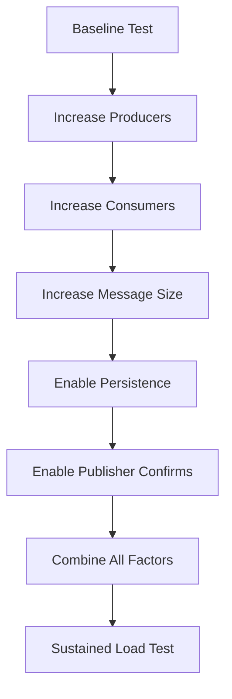

# RabbitMQ Load Testing

## Introduction

When building applications that rely on message brokers like RabbitMQ, it's crucial to understand how your system will behave under heavy loads. Load testing RabbitMQ helps you identify potential bottlenecks, determine scalability limits, and ensure your messaging infrastructure can handle real-world traffic.

In this guide, we'll explore how to properly load test RabbitMQ deployments, interpret the results, and optimize your configuration based on testing outcomes.

## Why Load Testing Matters

Before diving into the how-to aspects, let's understand why load testing RabbitMQ is essential:

1. **Capacity Planning**: Determine how many connections, channels, and messages your current setup can handle
2. **Failure Scenarios**: Identify how your system behaves when pushed beyond its limits
3. **Configuration Tuning**: Find the optimal settings for your specific workload patterns
4. **Bottleneck Identification**: Discover whether limitations exist in RabbitMQ itself, hardware, network, or your applications

## Prerequisites

To follow along with this tutorial, you'll need:

- A running RabbitMQ instance (3.8+ recommended)
- Basic familiarity with RabbitMQ concepts (exchanges, queues, bindings)
- PerfTest tool (RabbitMQ's official benchmarking tool)
- Monitoring tools (optional but recommended)

## RabbitMQ PerfTest: The Official Benchmarking Tool

RabbitMQ PerfTest is a Java-based benchmarking tool designed specifically for RabbitMQ. It allows you to simulate various workloads and measure performance metrics.

### Installing PerfTest

You can download PerfTest using various methods:

```bash
# Using Homebrew (macOS)
brew install rabbitmq-perftest

# Using Docker
docker pull pivotalrabbitmq/perf-test

# Direct download (requires Java)
wget https://github.com/rabbitmq/rabbitmq-perf-test/releases/download/v2.16.0/rabbitmq-perf-test-2.16.0-bin.tar.gz
tar -xzf rabbitmq-perf-test-2.16.0-bin.tar.gz
```

## Basic Load Testing Scenarios

Let's start with some basic scenarios to familiarize ourselves with PerfTest.

### Scenario 1: Simple Throughput Test

This test measures how many messages per second your RabbitMQ server can handle:

```bash
./runjava com.rabbitmq.perf.PerfTest -x 1 -y 2 -u "throughput-test" -a --id "test1" -s 1000
```

This command creates:
- 1 producer (`-x 1`)
- 2 consumers (`-y 2`)
- Queue named "throughput-test" (`-u "throughput-test"`)
- Auto-acknowledging messages (`-a`)
- Messages of 1000 bytes (`-s 1000`)

**Sample Output:**
```
id: test1, sending rate avg: 34253 msg/s
id: test1, receiving rate avg: 34248 msg/s
```

### Scenario 2: Testing With Larger Messages

To test how your system handles larger messages:

```bash
./runjava com.rabbitmq.perf.PerfTest -x 1 -y 2 -u "large-messages" -a --id "test2" -s 100000
```

This test uses 100KB messages instead of 1KB.

**Sample Output:**
```
id: test2, sending rate avg: 4782 msg/s
id: test2, receiving rate avg: 4780 msg/s
```

Notice how throughput decreases significantly with larger message sizes.

## Advanced Load Testing Scenarios

Let's explore more realistic and complex scenarios.

### Scenario 3: Simulating Multiple Producers and Consumers

```bash
./runjava com.rabbitmq.perf.PerfTest -x 10 -y 20 -u "multi-producer-consumer" -a --id "test3" -s 4000
```

This simulates 10 producers and 20 consumers, which is closer to real-world deployment scenarios.

### Scenario 4: Testing Persistence

Testing with persistence enabled helps you understand the performance impact of durable messages:

```bash
./runjava com.rabbitmq.perf.PerfTest -x 5 -y 10 -u "persistence-test" --id "test4" -f persistent -s 4000
```

The `-f persistent` flag makes messages persistent, ensuring they're written to disk.

### Scenario 5: Testing With Confirms

Production systems often use publisher confirms for reliability:

```bash
./runjava com.rabbitmq.perf.PerfTest -x 5 -y 10 -u "confirms-test" --id "test5" -c 100 -s 4000
```

The `-c 100` flag enables publisher confirms with a confirm window of 100 messages.

## Creating a Comprehensive Test Plan

A thorough load test should progressively increase the load to find your system's breaking point. Here's a sample test plan:



## Interpreting Results

When analyzing load test results, pay attention to these key metrics:

1. **Throughput**: Messages per second published and consumed
2. **Latency**: Time from publish to consume
3. **Resource Usage**: CPU, memory, disk I/O, and network
4. **Queue Growth**: Whether consumers can keep up with producers

### Sample Test Results Analysis

After running our test scenarios, we might see results like:

| Scenario | Producers | Consumers | Msg Size | Persistence | Throughput (msg/s) | Latency (ms) |
|----------|-----------|-----------|----------|------------|-------------------|-------------|
| Baseline | 1 | 2 | 1KB | No | 35,000 | 3 |
| Large Msgs | 1 | 2 | 100KB | No | 4,800 | 10 |
| Many Clients | 10 | 20 | 4KB | No | 28,000 | 18 |
| Persistent | 5 | 10 | 4KB | Yes | 12,000 | 45 |
| With Confirms | 5 | 10 | 4KB | No | 18,000 | 38 |

From these results, we can conclude:
- Message size has a significant impact on throughput
- Persistence reduces throughput by over 50%
- Publisher confirms add overhead but less than persistence
- Multiple clients affect latency more than throughput

## Monitoring During Load Tests

Effective load testing requires proper monitoring. Here are recommended metrics to watch:

### RabbitMQ Metrics

```bash
# Enable rabbitmq_management plugin if not already enabled
rabbitmq-plugins enable rabbitmq_management

# View queue metrics
curl -s -u guest:guest http://localhost:15672/api/queues/%2F/throughput-test | jq
```

Key metrics to monitor:
- Queue length
- Message rates (incoming/outgoing)
- Consumer utilization
- Connection and channel counts

### System Metrics

Monitor the host system for:
- CPU usage
- Memory usage
- Disk I/O
- Network bandwidth

Tools like `top`, `htop`, `iostat`, and `iftop` are useful for this purpose.

## Common Bottlenecks and Solutions

Based on load testing, you might encounter these common bottlenecks:

### CPU Saturation

**Symptoms**: High CPU usage, declining throughput

**Solutions**:
- Add more CPU cores
- Distribute load across multiple nodes
- Optimize message publishing batch size

```bash
# Example: Using batching to reduce CPU overhead
./runjava com.rabbitmq.perf.PerfTest -x 5 -y 10 -u "batch-test" --id "batch" -f 1000 -s 1000
```

### Memory Pressure

**Symptoms**: Rising memory usage, eventual swap usage

**Solutions**:
- Increase RabbitMQ memory limit
- Add more RAM
- Implement backpressure in producers

```properties
# In rabbitmq.conf
vm_memory_high_watermark = 0.6  # Use 60% of system memory
```

### Disk I/O Limitations

**Symptoms**: High disk utilization, increasing latency with persistent messages

**Solutions**:
- Use faster storage (SSDs)
- Tune filesystem cache
- Adjust persistence settings

```properties
# In rabbitmq.conf
cluster_partition_handling = pause_minority
mnesia_table_loading_retry_timeout = 10000
```

## Practical Implementation: Load Testing a Web Service

Let's see how load testing fits into a real-world scenario. Imagine an e-commerce site that uses RabbitMQ for order processing:

```javascript
// Example Node.js code that publishes orders to RabbitMQ

const amqp = require('amqplib');

async function publishOrder(order) {
  const connection = await amqp.connect('amqp://localhost');
  const channel = await connection.createChannel();
  
  await channel.assertQueue('orders', { durable: true });
  channel.sendToQueue('orders', Buffer.from(JSON.stringify(order)), {
    persistent: true
  });
  
  console.log("Order published:", order.id);
  
  await channel.close();
  await connection.close();
}

// Load test function
async function runLoadTest(orderCount, concurrency) {
  const startTime = Date.now();
  
  const batches = [];
  for (let i = 0; i < concurrency; i++) {
    const batch = [];
    for (let j = 0; j < Math.floor(orderCount / concurrency); j++) {
      batch.push({
        id: `order-${i}-${j}`,
        items: Array(Math.floor(Math.random() * 5) + 1).fill().map((_, idx) => ({
          productId: `product-${idx}`,
          quantity: Math.floor(Math.random() * 3) + 1
        })),
        customer: `customer-${Math.floor(Math.random() * 1000)}`
      });
    }
    batches.push(batch);
  }
  
  await Promise.all(batches.map(batch => 
    Promise.all(batch.map(order => publishOrder(order)))
  ));
  
  const duration = (Date.now() - startTime) / 1000;
  console.log(`Published ${orderCount} orders in ${duration.toFixed(2)}s`);
  console.log(`Rate: ${(orderCount / duration).toFixed(2)} orders/second`);
}

// Run the test with 1000 orders across 10 concurrent clients
runLoadTest(1000, 10);
```

### Consumer for the Load Test

```javascript
const amqp = require('amqplib');

async function startConsumer() {
  const connection = await amqp.connect('amqp://localhost');
  const channel = await connection.createChannel();
  
  await channel.assertQueue('orders', { durable: true });
  await channel.prefetch(10); // Process 10 messages at a time
  
  console.log('Consumer started, waiting for orders...');
  
  let processed = 0;
  const startTime = Date.now();
  
  channel.consume('orders', async (msg) => {
    if (msg) {
      const order = JSON.parse(msg.content.toString());
      
      // Simulate processing time
      await new Promise(resolve => setTimeout(resolve, 50));
      
      channel.ack(msg);
      processed++;
      
      if (processed % 100 === 0) {
        const duration = (Date.now() - startTime) / 1000;
        console.log(`Processed ${processed} orders in ${duration.toFixed(2)}s`);
        console.log(`Rate: ${(processed / duration).toFixed(2)} orders/second`);
      }
    }
  });
}

startConsumer();
```

When load testing this system, we'd watch for:
- Order processing rate
- Queue depth
- Error rates
- End-to-end latency

## Best Practices for RabbitMQ Load Testing

To get the most reliable results from your load tests:

1. **Test in an environment similar to production**
   - Use similar hardware specifications
   - Configure the same RabbitMQ settings

2. **Start small and gradually increase load**
   - Begin with simple tests
   - Progressively increase complexity

3. **Test for extended periods**
   - Some issues only appear under sustained load
   - Run tests for hours, not minutes

4. **Test failure scenarios**
   - What happens when a node goes down?
   - How does the system recover?

5. **Isolate variables**
   - Change one parameter at a time
   - Understand the impact of each change

## Tuning RabbitMQ Based on Load Test Results

After identifying bottlenecks, you can tune your RabbitMQ configuration:

```properties
# Example rabbitmq.conf tuning based on test results

# Memory tuning
vm_memory_high_watermark = 0.7

# Disk tuning
disk_free_limit = 2GB

# Queue tuning
queue_master_locator = min-masters

# Connection tuning
tcp_listen_options.backlog = 4096
tcp_listen_options.sndbuf = 32768
tcp_listen_options.recbuf = 32768
```

## Summary

Load testing RabbitMQ is essential for building reliable, scalable messaging systems. Through proper testing, you can:

- Understand your system's capacity limits
- Identify and resolve bottlenecks before they affect production
- Optimize configurations for your specific workload patterns
- Build confidence in your messaging infrastructure

Remember that load testing should be an ongoing process, not a one-time event. As your system evolves and your traffic patterns change, continue to test and optimize your RabbitMQ deployment.

## Additional Resources

- [RabbitMQ PerfTest GitHub Repository](https://github.com/rabbitmq/rabbitmq-perf-test)
- [RabbitMQ Performance Documentation](https://www.rabbitmq.com/performance.html)
- [RabbitMQ Monitoring Documentation](https://www.rabbitmq.com/monitoring.html)

## Exercises

1. Run a basic throughput test on your local RabbitMQ instance and record the results.
2. Create a test plan that gradually increases load until your system shows signs of stress.
3. Implement a simple producer and consumer in your preferred language and perform your own load test.
4. Compare the performance of persistent vs. non-persistent messages in your environment.
5. Create a monitoring dashboard for RabbitMQ metrics during load tests.