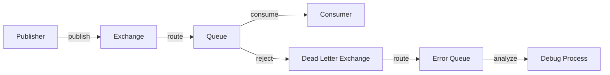

# RabbitMQ Debugging

## Introduction

Even the most carefully designed RabbitMQ systems can encounter issues. When messages aren't being delivered as expected, queues grow unexpectedly, or your application seems to lose messages, proper debugging techniques become essential. This guide will walk you through the common debugging approaches for RabbitMQ, helping you identify and resolve problems efficiently.

RabbitMQ debugging requires understanding both the broker's internal state and your application's interaction with it. We'll explore tools, techniques, and best practices that will help you quickly pinpoint and fix messaging issues.

## Understanding Common RabbitMQ Issues

Before diving into debugging techniques, let's understand the typical problems you might encounter:

1. **Message delivery failures** - Messages not reaching their destination
2. **Queue buildup** - Messages accumulating without being consumed
3. **Channel or connection failures** - Unexpected closures of communication channels
4. **Performance bottlenecks** - Slow message processing or publishing
5. **Cluster synchronization issues** - Problems with RabbitMQ nodes in a cluster

## Essential RabbitMQ Debugging Tools

### The Management UI

RabbitMQ's Management Plugin provides a web interface that offers visibility into the broker's state.

To enable the Management Plugin (if not already enabled):

```bash
rabbitmq-plugins enable rabbitmq_management
```

Once enabled, access the UI at `http://localhost:15672` (default credentials: guest/guest).

The Management UI allows you to:

- Monitor queue depths and message rates
- Inspect individual queues and their properties
- View connections and channels
- Trace message paths through exchanges and bindings
- Examine cluster status

### Command Line Tools

RabbitMQ comes with powerful CLI tools for debugging:

```bash
# List queues with message counts and other details
rabbitmqctl list_queues name messages consumers memory

# Check exchange bindings
rabbitmqctl list_bindings

# Examine connections
rabbitmqctl list_connections

# Get detailed information about a specific queue
rabbitmqctl list_queues name messages consumers memory --formatter=pretty_table
```

### Enabling RabbitMQ Logs

Increasing log verbosity can provide crucial insights:

```bash
# Set log level to debug
rabbitmqctl set_log_level debug

# View logs
tail -f /var/log/rabbitmq/rabbit@hostname.log
```

Revert to normal logging when done:

```bash
rabbitmqctl set_log_level info
```

## Common Debugging Scenarios

### Scenario 1: Messages Not Being Consumed

If messages are piling up in a queue without being consumed, follow these debugging steps:

1. **Check consumer connectivity**:

```bash
rabbitmqctl list_consumers
```

2. **Verify queue bindings**:

```bash
rabbitmqctl list_bindings | grep your_queue_name
```

3. **Inspect a sample message** using the Management UI to check if it's properly formatted.

4. **Examine prefetch settings** in your consumer code:

```javascript
// Example of setting proper prefetch in Node.js
channel.prefetch(10); // Adjust based on your needs
```

### Scenario 2: Messages Being Rejected

When messages are repeatedly rejected and requeued:

1. **Enable dead letter exchanges** to capture problematic messages:

```javascript
// Example channel.assertQueue call with dead-letter configuration
channel.assertQueue('my_queue', {
  arguments: {
    'x-dead-letter-exchange': 'dlx',
    'x-dead-letter-routing-key': 'failed_messages'
  }
});
```

2. **Implement message tracing** to track messages through the system:



### Scenario 3: Connection and Channel Issues

For unstable connections or channel errors:

1. **Enable application-side logging**:

```javascript
// Node.js example with amqplib
connection.on('error', (err) => {
  console.error('Connection error:', err);
});

channel.on('error', (err) => {
  console.error('Channel error:', err);
});

channel.on('return', (msg) => {
  console.warn('Message returned:', msg);
});
```

2. **Check heartbeat settings**:

```javascript
// Setting appropriate heartbeat timeout (in seconds)
const connection = await amqp.connect('amqp://localhost', {
  heartbeat: 60
});
```

3. **Monitor connection counts** to detect connection leaks:

```bash
rabbitmqctl list_connections | wc -l
```

## Advanced Debugging Techniques

### Message Tracing with Firehose

The Firehose tracer captures all messages passing through RabbitMQ:

```bash
# Enable firehose tracer plugin
rabbitmq-plugins enable rabbitmq_tracing

# Set up trace via Management UI or CLI
rabbitmqctl trace_on
```

Access traces via the Management UI under "Admin" > "Tracing".

### Analyzing Message Flow with Shovel Plugin

For debugging message flow between queues or even separate RabbitMQ instances:

```bash
# Enable shovel plugin
rabbitmq-plugins enable rabbitmq_shovel
rabbitmq-plugins enable rabbitmq_shovel_management
```

Configure a shovel via the Management UI to move messages while observing their flow.

### Using Queue Peek for Non-Destructive Inspection

Peek at messages without consuming them using the Management UI or programmatically:

```javascript
// Using Management HTTP API to peek at messages
const response = await fetch('http://localhost:15672/api/queues/%2F/my_queue/get', {
  method: 'POST',
  headers: {
    'Authorization': 'Basic ' + btoa('guest:guest'),
    'Content-Type': 'application/json'
  },
  body: JSON.stringify({
    count: 5,
    requeue: true,
    encoding: 'auto'
  })
});
const messages = await response.json();
console.log(messages);
```

## Debugging with Client Libraries

Different client libraries offer specific debugging capabilities. Here are examples for popular languages:

### Node.js (amqplib)

```javascript
// Enable detailed debug logging
process.env.DEBUG = 'amqplib:*';

const amqp = require('amqplib');

// Connection with all events monitored
async function setupRabbitMQ() {
  const connection = await amqp.connect('amqp://localhost');
  
  connection.on('error', (err) => {
    console.error('Connection error:', err);
  });
  
  connection.on('close', () => {
    console.log('Connection closed');
  });
  
  const channel = await connection.createChannel();
  
  channel.on('error', (err) => {
    console.error('Channel error:', err);
  });
  
  channel.on('return', (msg) => {
    console.warn('Message returned undeliverable:', msg);
  });
  
  // Set confirm mode for publishing reliability
  await channel.confirm();
  
  return { connection, channel };
}
```

### Python (Pika)

```python
import pika
import logging

# Enable detailed logging
logging.basicConfig(level=logging.DEBUG)
pika_logger = logging.getLogger('pika')
pika_logger.setLevel(logging.DEBUG)

# Connection with heartbeat and blocked connection detection
connection_params = pika.ConnectionParameters(
    host='localhost',
    heartbeat=60,
    blocked_connection_timeout=300
)

connection = pika.BlockingConnection(connection_params)
channel = connection.channel()

# Enable delivery confirmations
channel.confirm_delivery()

def publish_with_confirmation(exchange, routing_key, message, properties=None):
    try:
        channel.basic_publish(
            exchange=exchange,
            routing_key=routing_key,
            body=message,
            properties=properties,
            mandatory=True
        )
        if channel.wait_for_confirms():
            print("Message confirmed by broker")
        else:
            print("Message not confirmed by broker")
    except pika.exceptions.UnroutableError:
        print("Message could not be routed")
```

### Java (Spring AMQP)

```java
// application.properties configuration for debugging
spring.rabbitmq.listener.simple.retry.enabled=true
spring.rabbitmq.listener.simple.retry.initial-interval=1000
spring.rabbitmq.listener.simple.retry.max-attempts=3
spring.rabbitmq.listener.simple.retry.multiplier=2.0
logging.level.org.springframework.amqp=DEBUG

// Java config with error handling
@Bean
public RabbitTemplate rabbitTemplate(ConnectionFactory connectionFactory) {
    RabbitTemplate template = new RabbitTemplate(connectionFactory);
    
    // Set up return callbacks for undeliverable messages
    template.setMandatory(true);
    template.setReturnsCallback(returned -> {
        log.error("Message returned: " + returned.getMessage() +
                  " with reply code: " + returned.getReplyCode());
    });
    
    // Set up confirm callbacks
    template.setConfirmCallback((correlation, ack, reason) -> {
        if (!ack) {
            log.error("Message not confirmed, reason: " + reason);
        }
    });
    
    return template;
}
```

## Performance Debugging

### Identifying Bottlenecks

Use the Management UI's charts and metrics to identify:

1. **Publishing rates** - Are messages being published too quickly?
2. **Consumer processing rates** - Are consumers keeping up?
3. **Queue lengths** - Are they growing consistently?

### Common Performance Issues and Solutions

| Issue | Possible Cause | Solution |
|-------|---------------|----------|
| High memory usage | Unacknowledged messages | Check consumer acknowledgments, reduce prefetch |
| Slow consumers | Insufficient consumers | Add more consumers or optimize processing |
| Publish slowdowns | Publisher confirms backlog | Batch publishes or optimize confirmation handling |
| Queue bottlenecks | Single queue with many consumers | Consider queue sharding or competing consumers pattern |

## Best Practices for Preventative Debugging

1. **Implement circuit breakers** to prevent system overload:

```javascript
// Simple circuit breaker implementation
class CircuitBreaker {
  constructor(threshold = 5, resetTimeout = 30000) {
    this.failures = 0;
    this.threshold = threshold;
    this.resetTimeout = resetTimeout;
    this.state = 'CLOSED'; // CLOSED, OPEN, HALF_OPEN
  }

  async execute(fn) {
    if (this.state === 'OPEN') {
      throw new Error('Circuit breaker is OPEN');
    }
    
    try {
      const result = await fn();
      this.recordSuccess();
      return result;
    } catch (error) {
      this.recordFailure();
      throw error;
    }
  }

  recordSuccess() {
    this.failures = 0;
    this.state = 'CLOSED';
  }

  recordFailure() {
    this.failures++;
    if (this.failures >= this.threshold) {
      this.state = 'OPEN';
      setTimeout(() => {
        this.state = 'HALF_OPEN';
        this.failures = this.threshold - 1;
      }, this.resetTimeout);
    }
  }
}

// Usage with RabbitMQ
const breaker = new CircuitBreaker();
async function publishMessage(exchange, routingKey, message) {
  return breaker.execute(async () => {
    return channel.publish(exchange, routingKey, Buffer.from(message));
  });
}
```

2. **Set up monitoring** for early detection:

```bash
# Monitor queue depths with alerts
rabbitmqctl set_policy queue-length-limit "^(?!amq\.).*" \
  '{"max-length":10000, "max-length-bytes":100000000}' \
  --apply-to queues
```

3. **Implement request tracing** with correlation IDs:

```javascript
// Publishing with correlation ID
const correlationId = generateUniqueId();
channel.publish('my-exchange', 'routing-key', Buffer.from(message), {
  correlationId,
  headers: {
    'x-request-id': requestId,
    'x-trace-id': traceId
  }
});

// Log the correlation ID with each operation
console.log(`[${correlationId}] Publishing message to my-exchange`);
```

4. **Create health check endpoints** that verify RabbitMQ connectivity:

```javascript
app.get('/health/rabbitmq', async (req, res) => {
  try {
    // Test publishing and consuming a message
    const healthCheckQueue = 'health.check';
    const testMessage = `health-check-${Date.now()}`;
    
    await channel.assertQueue(healthCheckQueue, { durable: false });
    await channel.purge(healthCheckQueue);
    
    await channel.publish('', healthCheckQueue, Buffer.from(testMessage));
    
    const message = await new Promise((resolve) => {
      channel.consume(healthCheckQueue, (msg) => {
        channel.ack(msg);
        resolve(msg.content.toString());
      }, { noAck: false });
    });
    
    if (message === testMessage) {
      res.status(200).json({ status: 'ok', message: 'RabbitMQ is healthy' });
    } else {
      res.status(500).json({ status: 'error', message: 'Message content mismatch' });
    }
  } catch (error) {
    res.status(500).json({ status: 'error', message: error.message });
  }
});
```

## Debugging RabbitMQ in Production

### Safe Debugging in Live Environments

1. **Use passive declarations** to avoid modifying infrastructure:

```javascript
// Passive queue check - won't create if doesn't exist
try {
  await channel.checkQueue('my-queue');
  console.log('Queue exists');
} catch (error) {
  console.error('Queue does not exist:', error.message);
}
```

2. **Implement shadow consumers** for monitoring without interference:

```javascript
// A shadow consumer that doesn't ack messages
channel.consume('my-queue', (msg) => {
  console.log('Shadowing message:', msg.content.toString());
  // Don't acknowledge, just observe
}, { noAck: true, exclusive: true, consumerTag: 'shadow-debug-consumer' });
```

### Emergency Recovery Procedures

For critical production issues:

1. **Pause consumers** to prevent message loss while debugging:

```bash
# Stop all consumers on a queue
rabbitmqctl purge_queue queue_name
```

2. **Enable flow control** to slow down publishers:

```bash
rabbitmqctl set_vm_memory_high_watermark 0.6
```

3. **Perform selective queue backup and restore**:

```bash
# Export messages to a file
rabbitmqadmin export messages.json

# Restore messages
rabbitmqadmin import messages.json
```

## Summary

Effective RabbitMQ debugging requires a combination of:

1. Understanding RabbitMQ's internal architecture
2. Using the right tools (Management UI, CLI, logs)
3. Implementing proper instrumentation in your application
4. Following systematic debugging approaches for common scenarios
5. Adopting preventative practices like correlation IDs and circuit breakers

With these techniques, you'll be better equipped to identify and resolve RabbitMQ issues quickly, ensuring your message-based systems remain reliable and performant.

## Additional Resources

- [RabbitMQ Official Documentation](https://www.rabbitmq.com/documentation.html)
- [RabbitMQ Management HTTP API](https://www.rabbitmq.com/management.html#http-api)
- [Monitoring with Prometheus and Grafana](https://www.rabbitmq.com/prometheus.html)

## Exercises

1. Set up a RabbitMQ environment with intentional issues (like a slow consumer) and practice debugging it.
2. Implement a complete monitoring solution with alerts for queue depth changes.
3. Create a debugging toolkit script that collects relevant information from your RabbitMQ setup.
4. Practice troubleshooting with this scenario: messages are published but never consumed. Identify at least three possible causes and how to diagnose each one.
5. Implement correlation ID tracking across a multi-service system using RabbitMQ.