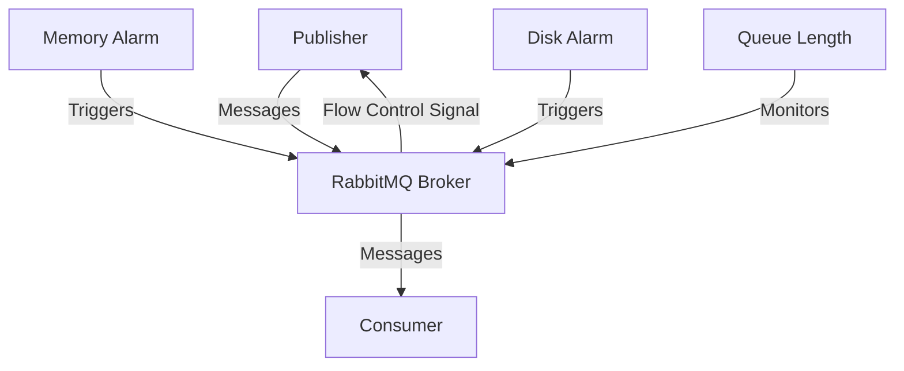

# RabbitMQ Flow Control

## Introduction

When working with message brokers like RabbitMQ, you may encounter situations where producers generate messages faster than consumers can process them. Without proper management, this imbalance can lead to resource exhaustion, degraded performance, or even system crashes. This is where **flow control** comes into play.

Flow control is RabbitMQ's built-in mechanism to handle backpressure and prevent system overload. It's like a traffic light system that helps maintain stability when parts of your messaging system become overwhelmed.

In this guide, we'll explore how RabbitMQ's flow control works, why it's essential, and how to work with it effectively in your applications.

## How RabbitMQ Flow Control Works

### The Basics of Flow Control

RabbitMQ implements flow control at different levels to manage resource usage and prevent overload:

1. **Connection-level flow control**: Manages the rate at which clients can publish messages
2. **Channel-level flow control**: Controls the flow of messages on individual channels
3. **Memory-based flow control**: Triggers when the server approaches memory limits
4. **Disk space flow control**: Activates when disk space becomes limited

When RabbitMQ detects potential resource issues, it temporarily blocks or slows down publishers to give the system time to recover.



### Memory and Disk Alarms

RabbitMQ uses a threshold-based alarm system for memory and disk resources:

- **Memory alarm**: Triggers when memory usage exceeds a configured threshold (default: 40% of available RAM)
- **Disk alarm**: Activates when free disk space falls below a threshold (default: 50MB)

When these alarms trigger, RabbitMQ blocks publishers from sending more messages until the situation improves.

## Implementing Flow Control in Your Applications

### Handling Flow Control as a Publisher

When RabbitMQ activates flow control, it sends a `basic.flow` command to publishing clients. Here's how to handle this in your code:

#### Java Example with RabbitMQ Client

```java
ConnectionFactory factory = new ConnectionFactory();
factory.setHost("localhost");

// Create a connection with flow control callback
Connection connection = factory.newConnection();

// Register a blocking listener that will be notified when flow control is activated
((AutorecoveringConnection) connection).addBlockedListener(new BlockedListener() {
    @Override
    public void handleBlocked(String reason) {
        System.out.println("Connection is blocked due to: " + reason);
        // Implement your backoff strategy here
    }

    @Override
    public void handleUnblocked() {
        System.out.println("Connection is unblocked, resuming publishing");
        // Resume normal publishing
    }
});

// Use the connection
Channel channel = connection.createChannel();
// Publishing code here
```

#### Node.js Example with amqplib

```javascript
const amqp = require('amqplib');

async function setupPublisher() {
  try {
    const connection = await amqp.connect('amqp://localhost');
    
    // Listen for connection block events
    connection.on('blocked', (reason) => {
      console.log(`Connection blocked: ${reason}`);
      // Implement backoff strategy
    });
    
    connection.on('unblocked', () => {
      console.log('Connection unblocked, resuming publishing');
      // Resume normal publishing
    });
    
    const channel = await connection.createChannel();
    // Publishing code here
    
  } catch (error) {
    console.error('Error:', error);
  }
}

setupPublisher();
```

### Implementing Client-Side Back Pressure

Beyond handling RabbitMQ's flow control, you can implement your own back-pressure mechanisms:

1. **Monitor publish confirms**: Use RabbitMQ's publisher confirms to track successful message delivery
2. **Implement rate limiting**: Throttle message production based on system conditions
3. **Use circuit breakers**: Temporarily stop publishing when issues are detected

#### Python Example with Pika and Rate Limiting

```python
import pika
import time
from pika.adapters.blocking_connection import BlockingConnection

class RateLimitedPublisher:
    def __init__(self, host='localhost', max_messages_per_second=100):
        self.connection = pika.BlockingConnection(
            pika.ConnectionParameters(host=host)
        )
        self.channel = self.connection.channel()
        self.channel.confirm_delivery()  # Enable publisher confirms
        
        # Set up queue
        self.channel.queue_declare(queue='rate_limited_queue', durable=True)
        
        # Rate limiting settings
        self.max_messages_per_second = max_messages_per_second
        self.min_interval = 1.0 / max_messages_per_second
        self.last_publish_time = 0
        
    def publish(self, message):
        # Simple rate limiting
        current_time = time.time()
        time_since_last = current_time - self.last_publish_time
        
        if time_since_last < self.min_interval:
            sleep_time = self.min_interval - time_since_last
            time.sleep(sleep_time)
            
        try:
            self.channel.basic_publish(
                exchange='',
                routing_key='rate_limited_queue',
                body=message,
                properties=pika.BasicProperties(
                    delivery_mode=2,  # Make message persistent
                ),
                mandatory=True
            )
            self.last_publish_time = time.time()
            return True
        except pika.exceptions.UnroutableError:
            print(f"Message was returned: {message}")
            return False
        except pika.exceptions.ConnectionBlockedTimeout:
            print("Connection is blocked by RabbitMQ flow control")
            # Implement more sophisticated backoff logic here
            time.sleep(5)  # Simple backoff strategy
            return False
            
    def close(self):
        self.connection.close()

# Usage
publisher = RateLimitedPublisher(max_messages_per_second=50)
for i in range(1000):
    publisher.publish(f"Message {i}")
publisher.close()
```

## Configuring RabbitMQ Flow Control

### Memory-Based Flow Control Configuration

You can configure memory thresholds in your RabbitMQ configuration file (`rabbitmq.conf`):

```
# Set memory threshold to 30% of total RAM
vm_memory_high_watermark.relative = 0.3

# Or set an absolute value (in bytes)
# vm_memory_high_watermark.absolute = 1073741824  # 1GB
```

Or using the rabbitmqctl command:

```bash
rabbitmqctl set_vm_memory_high_watermark 0.4  # Set to 40% of RAM
```

### Disk-Based Flow Control Configuration

Similarly, you can configure disk alarm thresholds:

```
# Set disk free space threshold to 2GB
disk_free_limit.absolute = 2GB

# Or as a relative value
# disk_free_limit.relative = 1.0  # 1x total memory
```

Using rabbitmqctl:

```bash
rabbitmqctl set_disk_free_limit "1GB"
```

## Monitoring Flow Control

To effectively work with flow control, you need to monitor its status:

### RabbitMQ Management UI

The RabbitMQ Management UI (typically at http://localhost:15672) provides visual indicators when flow control is active. Look for:

- Red warnings in the Overview section
- Blocked connections in the Connections tab

### Command Line Monitoring

You can check flow control status using rabbitmqctl:

```bash
# Check if there are any blocked connections
rabbitmqctl list_connections name client_properties state

# Check memory usage
rabbitmqctl status | grep memory

# Check disk usage
rabbitmqctl status | grep disk_free
```

## Real-World Scenarios and Solutions

### Scenario 1: High-Volume Message Publishing

**Problem**: Your system needs to publish thousands of messages per second, but occasionally triggers flow control.

**Solution**:

1. Implement a message batching strategy:

```javascript
// Node.js batching example
async function batchPublish(channel, queue, messages, batchSize = 100) {
  for (let i = 0; i < messages.length; i += batchSize) {
    const batch = messages.slice(i, i + batchSize);
    
    // Create a transaction/batch
    await channel.assertQueue(queue, { durable: true });
    
    for (const msg of batch) {
      channel.sendToQueue(queue, Buffer.from(JSON.stringify(msg)), {
        persistent: true
      });
    }
    
    // Wait a short time between batches to avoid triggering flow control
    await new Promise(resolve => setTimeout(resolve, 50));
  }
}
```

2. Add better error handling and retry logic:

```java
// Java retry logic example
public void publishWithRetry(Channel channel, String exchange, String routingKey, 
                            AMQP.BasicProperties props, byte[] body, int maxRetries) {
    int attempts = 0;
    boolean successful = false;
    
    while (!successful && attempts < maxRetries) {
        try {
            channel.basicPublish(exchange, routingKey, props, body);
            successful = true;
        } catch (IOException | AlreadyClosedException e) {
            attempts++;
            long backoffTime = (long) (Math.pow(2, attempts) * 100); // Exponential backoff
            System.out.println("Publish failed, retrying in " + backoffTime + "ms");
            
            try {
                Thread.sleep(backoffTime);
            } catch (InterruptedException ie) {
                Thread.currentThread().interrupt();
            }
        }
    }
    
    if (!successful) {
        // Handle ultimate failure (e.g., store in a dead-letter file, alert, etc.)
        System.err.println("Failed to publish message after " + maxRetries + " attempts");
    }
}
```

### Scenario 2: Slow Consumers

**Problem**: Consumers process messages too slowly, causing queues to grow and triggering memory alarms.

**Solution**:

1. Implement prefetch limits to control how many messages consumers receive:

```python
# Python prefetch example
connection = pika.BlockingConnection(pika.ConnectionParameters('localhost'))
channel = connection.channel()

# Only prefetch 10 messages at a time
channel.basic_qos(prefetch_count=10)

channel.basic_consume(
    queue='task_queue',
    on_message_callback=callback,
    auto_ack=False
)
```

2. Set up worker pools to process messages in parallel:

```javascript
// Node.js worker pool example
const { Worker, isMainThread, parentPort, workerData } = require('worker_threads');
const amqp = require('amqplib');
const numCPUs = require('os').cpus().length;

if (isMainThread) {
  // Main thread - spawn workers
  for (let i = 0; i < numCPUs; i++) {
    const worker = new Worker(__filename, {
      workerData: { workerId: i }
    });
    
    worker.on('message', (result) => {
      console.log(`Worker ${i} processed message: ${result}`);
    });
    
    worker.on('error', (err) => {
      console.error(`Worker ${i} error:`, err);
    });
  }
} else {
  // Worker thread - consume messages
  (async () => {
    const connection = await amqp.connect('amqp://localhost');
    const channel = await connection.createChannel();
    
    await channel.assertQueue('task_queue', { durable: true });
    await channel.prefetch(1);
    
    console.log(`Worker ${workerData.workerId} waiting for messages`);
    
    await channel.consume('task_queue', async (msg) => {
      if (msg !== null) {
        const content = msg.content.toString();
        
        // Process the message (simulating work)
        await new Promise(resolve => setTimeout(resolve, 500));
        
        channel.ack(msg);
        parentPort.postMessage(content);
      }
    });
  })();
}
```

## Best Practices for RabbitMQ Flow Control

1. **Monitor and alert**: Set up monitoring for RabbitMQ's memory and disk usage
2. **Adjust thresholds appropriately**: Set conservative thresholds based on your hardware
3. **Implement client-side throttling**: Don't rely solely on RabbitMQ's flow control
4. **Use durable queues and persistent messages**: For critical data that shouldn't be lost
5. **Implement proper error handling**: Handle flow control signals gracefully
6. **Scale horizontally**: Add more RabbitMQ nodes for better resource distribution
7. **Balance producer/consumer ratios**: Ensure you have enough consumers for your production rate

## Troubleshooting Common Flow Control Issues

### Publishers Cannot Connect

**Problem**: Publishers are unable to connect when flow control is active.

**Solution**: Implement connection retry logic with exponential backoff:

```python
# Python connection retry example
import pika
import time
import random

def connect_with_retry(max_retries=10):
    retries = 0
    
    while retries < max_retries:
        try:
            connection = pika.BlockingConnection(
                pika.ConnectionParameters(host='localhost')
            )
            return connection
        except pika.exceptions.AMQPConnectionError as e:
            retries += 1
            backoff = min(60, (2 ** retries) + random.uniform(0, 1))  # Exponential backoff with jitter
            print(f"Connection attempt {retries} failed. Retrying in {backoff:.2f} seconds...")
            time.sleep(backoff)
    
    raise Exception(f"Failed to connect after {max_retries} attempts")
```

### Memory Alarm Doesn't Clear

**Problem**: Memory alarm persists even after reducing message load.

**Solution**: Troubleshoot memory usage and possibly restart the broker:

```bash
# Check memory usage details
rabbitmqctl status

# Force garbage collection
rabbitmqctl eval "garbage_collect()."

# If necessary, restart the RabbitMQ service
systemctl restart rabbitmq-server
```

## Summary

RabbitMQ's flow control is a crucial mechanism that helps maintain system stability under high load. By understanding how it works and implementing proper strategies for handling it, you can build more resilient and reliable messaging systems.

Key takeaways:

- Flow control prevents system overload by temporarily blocking publishers
- Memory and disk alarms trigger flow control when resources are constrained
- Implement client-side strategies to handle flow control signals gracefully
- Configure appropriate memory and disk thresholds for your environment
- Monitor RabbitMQ's resource usage to anticipate flow control events
- Use proper retry strategies and backoff mechanisms in your applications

By following these practices, you can build robust applications that handle even the most demanding message workloads reliably.

## Additional Resources

- [RabbitMQ Official Documentation on Flow Control](https://www.rabbitmq.com/flow-control.html)
- [RabbitMQ Memory Management](https://www.rabbitmq.com/memory.html)
- [Monitoring RabbitMQ](https://www.rabbitmq.com/monitoring.html)

## Exercises

1. Configure RabbitMQ with custom memory and disk thresholds, then write a script to publish messages until flow control activates.
2. Implement a publisher with proper flow control handling and exponential backoff.
3. Create a worker pool consumer system that can handle varying message loads efficiently.
4. Set up monitoring for RabbitMQ resource usage and flow control events.
5. Simulate a slow consumer scenario and implement strategies to prevent queue buildup.