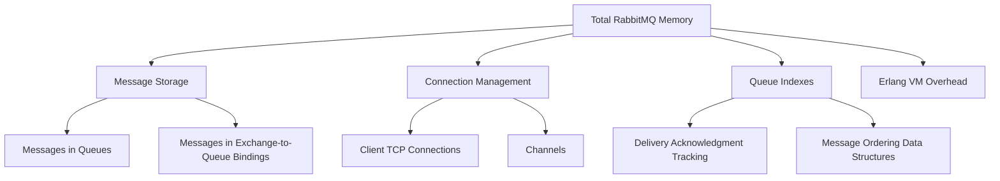
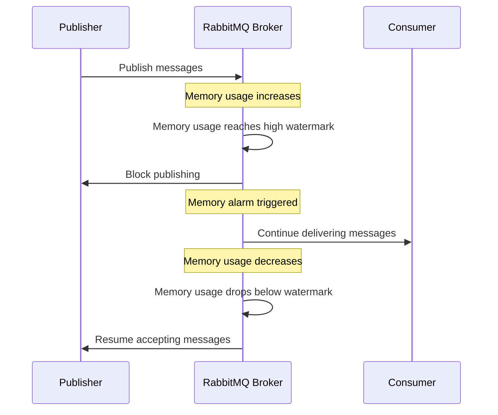

# RabbitMQ Memory Management

## Introduction

Memory management is a critical aspect of operating RabbitMQ in production environments. As a message broker that temporarily holds messages in memory before they're consumed, RabbitMQ's memory usage directly impacts its performance, stability, and reliability. Poor memory management can lead to performance degradation, unexpected behavior, or even complete service outages.

In this guide, we'll explore how RabbitMQ uses memory, how to monitor and configure memory limits, and best practices to ensure your RabbitMQ instances run efficiently, even under heavy load.

## Understanding RabbitMQ Memory Usage

RabbitMQ uses memory for several purposes:

1. **Message Storage**: Messages published but not yet consumed are stored in memory (and potentially on disk depending on your configuration).
2. **Connection Management**: Each client connection consumes memory.
3. **Queue Indexes**: RabbitMQ maintains indexes to track message deliveries and acknowledgments.
4. **Erlang VM**: As RabbitMQ runs on the Erlang virtual machine, it also requires memory for garbage collection and other VM operations.

Let's visualize the major components of RabbitMQ memory usage:



## Memory Watermark Mechanism

RabbitMQ uses a mechanism called "memory watermarks" to control memory usage. When memory consumption reaches certain thresholds, RabbitMQ takes action to prevent system instability.

### High Water Mark

When memory usage reaches the high watermark (default: 40% of system memory), RabbitMQ will:

1. Block new connections from publishers
2. Begin applying back-pressure to existing connections
3. Log warning messages about memory pressure

This continues until memory usage drops below the watermark.

### Memory Alarm



## Configuring Memory Limits

Let's look at how to configure memory limits in RabbitMQ:

### Using Configuration File

In your `rabbitmq.conf` file, you can set the high watermark:

```
vm_memory_high_watermark.relative = 0.4
```

This sets the high watermark to 40% of system memory.

You can also set an absolute value in bytes:

```
vm_memory_high_watermark.absolute = 1073741824
```

This sets the high watermark to 1GB.

### Using Command Line

You can use the `rabbitmqctl` command to set memory thresholds:

```bash
rabbitmqctl set_vm_memory_high_watermark 0.5
```

This sets the high watermark to 50% of system memory.

### Checking Current Memory Usage

To check current memory usage:

```bash
rabbitmqctl status
```

Look for the `memory` section in the output:

```
{memory,
    [{total,174053376},
     {connection_readers,1440},
     {connection_writers,116},
     {connection_channels,5100},
     {connection_other,83204},
     {queue_procs,1095728},
     {queue_slave_procs,0},
     {plugins,3324616},
     {other_proc,20708976},
     {metrics,7768},
     {mgmt_db,517992},
     {mnesia,68872},
     {other_ets,2059608},
     {binary,30437528},
     {msg_index,42848},
     {code,24693793},
     {atom,1041593},
     {other_system,84953595}]}
```

## Practical Memory Management Strategies

Let's explore some practical strategies to manage RabbitMQ memory efficiently:

### 1. Configure Queue Properties

Set queue properties to control memory usage:

```javascript
channel.assertQueue('my-queue', {
  durable: true,
  arguments: {
    'x-max-length': 10000,              // Maximum number of messages
    'x-max-length-bytes': 10485760,     // Maximum size in bytes (10MB)
    'x-overflow': 'reject-publish'      // Reject new messages when limits reached
  }
});
```

### 2. Implement Lazy Queues

Lazy queues store messages on disk as soon as possible, reducing memory usage:

```javascript
channel.assertQueue('my-lazy-queue', {
  durable: true,
  arguments: {
    'x-queue-mode': 'lazy'
  }
});
```

### 3. Monitor Memory Usage with Prometheus

Here's an example of setting up Prometheus metrics for RabbitMQ:

```javascript
// Install RabbitMQ Prometheus plugin
// rabbitmq-plugins enable rabbitmq_prometheus

// Then configure Prometheus to scrape metrics from RabbitMQ
// prometheus.yml
const prometheusConfig = `
scrape_configs:
  - job_name: 'rabbitmq'
    scrape_interval: 15s
    metrics_path: /metrics
    static_configs:
      - targets: ['rabbitmq:15692']
`;
```

### Real-World Example: Message Processing System

Let's look at a complete example of a message processing system with memory management considerations:

```javascript
// Producer code (with backpressure handling)
const amqp = require('amqplib');

async function startProducer() {
  const connection = await amqp.connect('amqp://localhost');
  const channel = await connection.createChannel();
  
  // Set prefetch to limit memory usage
  await channel.prefetch(10);
  
  // Configure queue with memory limits
  await channel.assertQueue('task-queue', {
    durable: true,
    arguments: {
      'x-max-length': 100000,
      'x-max-length-bytes': 1073741824, // 1GB
      'x-overflow': 'reject-publish'
    }
  });
  
  // Publish with confirmation
  await channel.confirmSelect();
  
  for (let i = 0; i < 1000000; i++) {
    const message = { id: i, data: `Task ${i}` };
    
    try {
      const sent = channel.publish(
        '',
        'task-queue',
        Buffer.from(JSON.stringify(message)),
        { persistent: true }
      );
      
      if (!sent) {
        // Queue is full, wait for drain event
        await new Promise(resolve => channel.once('drain', resolve));
        i--; // Retry sending this message
        console.log('Backing off due to backpressure');
      }
      
      // Wait for confirmation
      await new Promise((resolve, reject) => {
        channel.once('ack', resolve);
        channel.once('nack', reject);
      });
      
      if (i % 1000 === 0) {
        console.log(`Published ${i} messages`);
      }
    } catch (err) {
      console.error('Failed to publish message:', err);
      // Implement retry logic
    }
  }
  
  await channel.close();
  await connection.close();
}
```

```javascript
// Consumer code (with controlled prefetch)
const amqp = require('amqplib');

async function startConsumer() {
  const connection = await amqp.connect('amqp://localhost');
  const channel = await connection.createChannel();
  
  // Set prefetch to limit memory usage
  await channel.prefetch(10);
  
  await channel.assertQueue('task-queue', { durable: true });
  
  console.log('Consumer waiting for messages');
  
  channel.consume('task-queue', async (msg) => {
    if (!msg) return;
    
    const content = JSON.parse(msg.content.toString());
    console.log(`Processing message ${content.id}`);
    
    try {
      // Process the message
      await processMessage(content);
      
      // Acknowledge only after successful processing
      channel.ack(msg);
    } catch (err) {
      console.error('Error processing message:', err);
      
      // Negative acknowledge with requeue
      channel.nack(msg, false, true);
    }
  });
}

async function processMessage(content) {
  // Simulate processing time
  await new Promise(resolve => setTimeout(resolve, 100));
  return true;
}

startConsumer().catch(console.error);
```

## Memory Management Best Practices

Here are key best practices for RabbitMQ memory management:

1. **Set Appropriate Watermarks**: Configure memory watermarks based on your system resources and other applications running on the same host.

2. **Monitor Memory Usage**: Set up monitoring and alerting for RabbitMQ memory usage using tools like Prometheus and Grafana.

3. **Use Lazy Queues for Large Backlogs**: When expecting large message backlogs, use lazy queues to reduce memory pressure.

4. **Limit Queue Length**: Set maximum queue lengths to prevent unbounded growth.

5. **Control Prefetch Values**: Set reasonable prefetch values to limit the number of unacknowledged messages.

6. **Optimize Message Size**: Keep message payloads small and consider using message references to external storage for large data.

7. **Implement Circuit Breakers**: Use circuit breakers in your applications to prevent overwhelming RabbitMQ during outages.

8. **Regular Maintenance**: Periodically check for and remove unused exchanges, queues, and bindings.

## Monitoring Memory Usage

Here's a practical example of a simple Node.js script that monitors RabbitMQ memory usage:

```javascript
const axios = require('axios');
const fs = require('fs');

async function monitorRabbitMQ() {
  // Set your RabbitMQ management API credentials and URL
  const apiUrl = 'http://localhost:15672/api/nodes';
  const auth = {
    username: 'guest',
    password: 'guest'
  };
  
  try {
    const response = await axios.get(apiUrl, { auth });
    const nodeInfo = response.data[0]; // First node in the cluster
    
    const memoryUsage = nodeInfo.mem_used;
    const memoryLimit = nodeInfo.mem_limit;
    const memoryAlarmActive = nodeInfo.mem_alarm;
    const usagePercentage = (memoryUsage / memoryLimit * 100).toFixed(2);
    
    console.log(`Memory Usage: ${formatBytes(memoryUsage)} / ${formatBytes(memoryLimit)} (${usagePercentage}%)`);
    console.log(`Memory Alarm Active: ${memoryAlarmActive}`);
    
    // Log to file
    const logEntry = `${new Date().toISOString()},${memoryUsage},${memoryLimit},${memoryAlarmActive}
`;
    fs.appendFileSync('rabbitmq_memory_log.csv', logEntry);
    
    // Alert if approaching watermark
    if (usagePercentage > 75) {
      console.error('WARNING: RabbitMQ memory usage approaching watermark!');
      // Implement alerting mechanism here (email, Slack, etc.)
    }
  } catch (error) {
    console.error('Error monitoring RabbitMQ:', error.message);
  }
}

function formatBytes(bytes) {
  if (bytes === 0) return '0 Bytes';
  
  const k = 1024;
  const sizes = ['Bytes', 'KB', 'MB', 'GB', 'TB'];
  const i = Math.floor(Math.log(bytes) / Math.log(k));
  
  return parseFloat((bytes / Math.pow(k, i)).toFixed(2)) + ' ' + sizes[i];
}

// Run every minute
setInterval(monitorRabbitMQ, 60000);
monitorRabbitMQ();
```

## Troubleshooting Memory Issues

### Common Memory Problems and Solutions

1. **High Memory Usage with Few Messages**:
   - Check for large message sizes
   - Look for connection leaks
   - Investigate queue index size

2. **Memory Alarms Triggering Frequently**:
   - Lower watermark threshold
   - Increase system memory
   - Implement lazy queues

3. **Memory Usage Growing Over Time**:
   - Check for unconsumed queues
   - Look for leaked connections
   - Inspect for unbounded queue growth

### Debugging Example

When you notice high memory usage, check which queues are consuming the most memory:

```bash
rabbitmqctl list_queues name messages memory
```

Output example:

```
Listing queues
order-processing  5230    18724420
notifications     10      42560
user-events       25      105780
```

In this case, the `order-processing` queue is using significantly more memory and might need attention.

## Summary

Effective memory management is essential for running RabbitMQ successfully in production environments. By understanding how RabbitMQ uses memory, configuring appropriate limits, and implementing best practices, you can ensure your message broker operates reliably under various load conditions.

Key takeaways:
- Configure appropriate memory watermarks based on your system resources
- Use lazy queues for large message backlogs
- Set queue length limits to prevent unbounded growth
- Monitor memory usage and set up alerts
- Implement backpressure handling in your applications

## Additional Resources

- Official RabbitMQ Memory Documentation
- RabbitMQ Management HTTP API for monitoring
- RabbitMQ Prometheus Plugin for metrics collection
- RabbitMQ PerfTest tool for performance testing

## Exercises

1. Set up a RabbitMQ instance with custom memory watermarks and observe behavior under load.
2. Create a producer-consumer application with proper backpressure handling.
3. Implement a monitoring script that alerts when RabbitMQ memory usage exceeds certain thresholds.
4. Configure lazy queues and compare memory usage with regular queues under similar message loads.
5. Use RabbitMQ's management plugin to identify the queues consuming the most memory in your system.