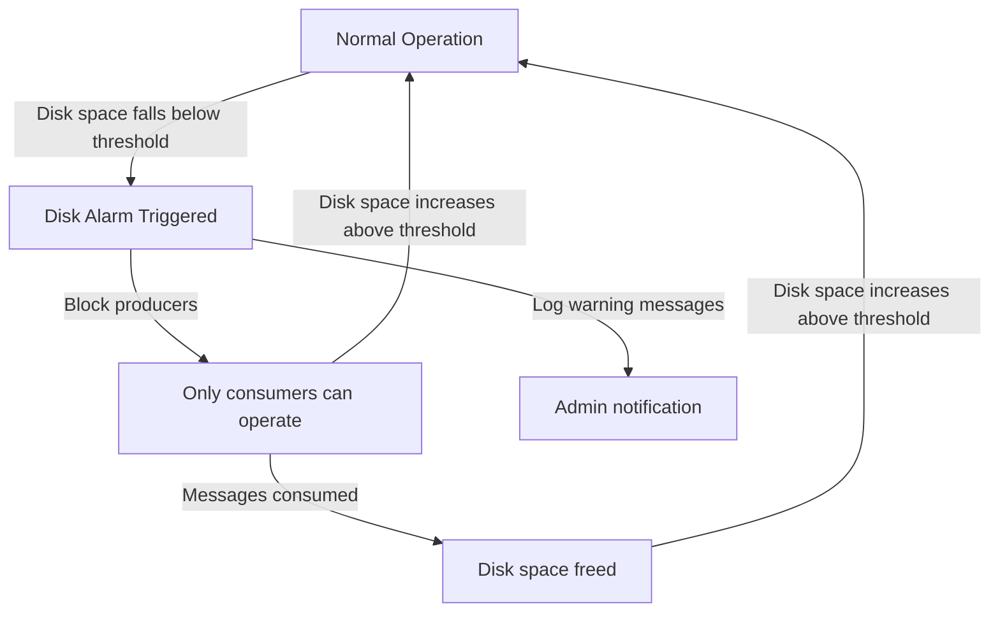

# RabbitMQ Disk Alarms

## Introduction

When running RabbitMQ in production, one of the most critical resources to monitor is disk space. RabbitMQ relies heavily on disk storage for persisting messages, and when disk space runs low, it can lead to service degradation or even complete message broker failure.

To prevent these issues, RabbitMQ implements a feature called **Disk Alarms**. This safety mechanism monitors available disk space and takes action when space becomes limited, helping to maintain system stability and prevent data loss.

In this tutorial, we'll explore how disk alarms work, how to configure them, and how to handle disk space issues in your RabbitMQ deployments.

## How RabbitMQ Disk Alarms Work

RabbitMQ constantly monitors the available disk space on the volume where its message store is located. When free disk space falls below a configured threshold, RabbitMQ triggers a **disk alarm** and enters a protective state.

### The Flow of Disk Alarm Activation



When a disk alarm is active:

1. RabbitMQ will **block all connections** that are publishing messages
2. Only consuming operations are allowed to continue
3. Warning messages appear in the RabbitMQ logs
4. The alarm is visible in the management UI and via the HTTP API
5. The node remains in this state until disk space is freed

This approach prevents the system from running out of disk space while allowing consumers to reduce message backlog, which in turn helps recover disk space.

## Configuring Disk Alarm Thresholds

By default, RabbitMQ triggers a disk alarm when free disk space drops below **50MB**. This is a conservative value and may need adjustment based on your specific workload and server capabilities.

### Setting the Threshold Using Configuration File

To modify the threshold in your `rabbitmq.conf` file:

```
disk_free_limit.absolute = 500000000  # Set to 500MB in bytes
```

### Setting the Threshold Using Environment Variables

```bash
export RABBITMQ_DISK_FREE_LIMIT="{mem_relative, 1.0}"  # Set to 1x the amount of RAM
```

### Setting the Threshold Using rabbitmqctl

You can dynamically change the setting without a restart:

```bash
rabbitmqctl set_disk_free_limit "2GB"
```

### Relative vs. Absolute Thresholds

RabbitMQ supports two types of disk alarm thresholds:

1. **Absolute value** - A fixed amount of required free space (e.g., "500MB", "2GB")
2. **Relative value** - A multiple of the total RAM installed (e.g., `{mem_relative, 1.0}` means 1x RAM)

Relative values can be useful when you deploy RabbitMQ across machines with varying sizes:

```
disk_free_limit.relative = 2.0  # 2x the amount of RAM
```

## Monitoring Disk Alarms

### Via Management UI

In the RabbitMQ Management UI, disk alarms appear prominently in the Overview section:


### Via HTTP API

You can check for alarms using the HTTP API:

```bash
curl -u guest:guest http://localhost:15672/api/nodes
```

The response will include an `alarms` field if any are active.

### Via rabbitmqctl

```bash
rabbitmqctl status
```

Look for the `alarms` section in the output.

## Practical Example: Handling Disk Alarms

Let's walk through a practical scenario of handling a disk alarm in a production environment.

### Example: Setting Up Monitoring and Alerts

Here's a simple Node.js script that monitors RabbitMQ's disk space status and sends alerts:

```javascript
const amqp = require('amqplib');
const axios = require('axios');

async function monitorRabbitMQDiskSpace() {
  try {
    // Connect to RabbitMQ Management API
    const response = await axios.get('http://localhost:15672/api/nodes', {
      auth: {
        username: 'guest',
        password: 'guest'
      }
    });

    const node = response.data[0];
    const diskFreeLimit = node.disk_free_limit;
    const diskFree = node.disk_free;
    
    console.log(`Disk free: ${formatBytes(diskFree)}`);
    console.log(`Disk free limit: ${formatBytes(diskFreeLimit)}`);
    
    // Check if disk alarm is active
    if (node.mem_alarm || node.disk_free_alarm) {
      console.log('ALERT: RabbitMQ disk alarm is active!');
      await sendAlert('RabbitMQ disk alarm triggered. Please free up disk space immediately.');
    }
    
    // Warn if getting close to limit (80% of the way there)
    if (diskFree < diskFreeLimit * 1.2 && !node.disk_free_alarm) {
      console.log('WARNING: RabbitMQ disk space is getting low');
      await sendAlert('RabbitMQ disk space is getting low. Current free: ' + 
                     formatBytes(diskFree));
    }
  } catch (error) {
    console.error('Error monitoring RabbitMQ:', error.message);
  }
}

async function sendAlert(message) {
  // Replace with your actual alerting system
  // This could be an email, Slack message, PagerDuty alert, etc.
  console.log(`Sending alert: ${message}`);
}

function formatBytes(bytes) {
  if (bytes === 0) return '0 Bytes';
  const k = 1024;
  const sizes = ['Bytes', 'KB', 'MB', 'GB', 'TB'];
  const i = Math.floor(Math.log(bytes) / Math.log(k));
  return parseFloat((bytes / Math.pow(k, i)).toFixed(2)) + ' ' + sizes[i];
}

// Run the monitoring function every 5 minutes
setInterval(monitorRabbitMQDiskSpace, 5 * 60 * 1000);
monitorRabbitMQDiskSpace(); // Run immediately on start
```

### Example: Implementing a Disk Space Recovery Plan

When a disk alarm triggers, you need a plan to recover. Here's a simple bash script to help identify space issues and clean up:

```bash
#!/bin/bash
# RabbitMQ disk space recovery script

# Get the RabbitMQ data directory
DATA_DIR=$(rabbitmqctl environment | grep "RABBITMQ_MNESIA_DIR" | awk -F'"' '{print $2}')

# Check disk usage
echo "Checking disk usage in $DATA_DIR..."
du -sh $DATA_DIR

# List the largest queues (requires management plugin)
echo "Largest queues by message count:"
curl -s -u guest:guest http://localhost:15672/api/queues | \
  jq -r '.[] | "\(.messages) messages: \(.name) on \(.vhost)"' | \
  sort -rn | head -10

# Check for old log files
echo "Checking for old log files..."
find /var/log/rabbitmq -name "*.log.*" -type f -mtime +7 -exec ls -lh {} \;

# Option to purge a specific queue
read -p "Enter queue name to purge (or leave empty to skip): " QUEUE_NAME
if [ ! -z "$QUEUE_NAME" ]; then
  read -p "Enter virtual host (default: /): " VHOST
  VHOST=${VHOST:-/}
  
  echo "Purging queue $QUEUE_NAME on vhost $VHOST..."
  rabbitmqctl purge_queue --vhost "$VHOST" "$QUEUE_NAME"
fi

# Option to delete old log files
read -p "Delete log files older than 7 days? (y/n): " DELETE_LOGS
if [ "$DELETE_LOGS" = "y" ]; then
  find /var/log/rabbitmq -name "*.log.*" -type f -mtime +7 -delete
  echo "Old log files deleted."
fi
```

## Best Practices for Preventing Disk Alarms

Here are some key practices to avoid disk space issues:

1. **Set appropriate message TTL (Time-To-Live)** to ensure messages don't accumulate indefinitely:

```javascript
// Example of setting message TTL when declaring a queue
channel.assertQueue('my_queue', {
  arguments: {
    'x-message-ttl': 86400000  // 24 hours in milliseconds
  }
});
```

2. **Implement dead letter queues** for messages that can't be processed:

```javascript
// Declaring a queue with a dead letter exchange
channel.assertQueue('my_queue', {
  arguments: {
    'x-dead-letter-exchange': 'dlx',
    'x-dead-letter-routing-key': 'failed-messages'
  }
});

// Declare the dead letter exchange and queue
channel.assertExchange('dlx', 'direct');
channel.assertQueue('dead-letter-queue');
channel.bindQueue('dead-letter-queue', 'dlx', 'failed-messages');
```

3. **Set up max-length queues** to prevent unbounded growth:

```javascript
// Limit queue to 10,000 messages
channel.assertQueue('my_queue', {
  arguments: {
    'x-max-length': 10000,
    'x-overflow': 'reject-publish'  // Reject new messages when full
  }
});
```

4. **Monitor disk usage proactively** before it reaches alarm thresholds.

5. **Scale disk space** according to your message throughput and retention needs.

6. **Configure log rotation** to prevent log files from consuming excessive space.

## Common Issues and Solutions

### Issue: Disk Alarms Not Clearing After Freeing Space

**Solution**: Verify you've freed space on the correct partition. Use `rabbitmqctl status` to check which partition RabbitMQ is monitoring.

### Issue: Frequent Disk Alarms Despite Adequate Space

**Solution**: Your workload might require a higher threshold. Consider increasing the `disk_free_limit` or implementing better message TTL policies.

### Issue: Sudden Disk Space Consumption

**Solution**: Check for queues with many unacknowledged messages. These can build up if consumers fail to acknowledge properly.

```bash
# Find queues with high message counts
rabbitmqctl list_queues name messages consumers
```

## Summary

RabbitMQ disk alarms are a critical safety feature that helps prevent system failure due to disk space exhaustion. By understanding how they work and implementing proper configuration and monitoring, you can ensure your RabbitMQ instances remain stable even under heavy load.

Key takeaways:

- Disk alarms trigger when free space falls below a configurable threshold
- When active, producers are blocked while consumers can continue
- Configure appropriate thresholds based on your workload
- Implement proactive monitoring and alerting
- Use message TTL, dead letter queues, and max-length queues to prevent unbounded growth
- Have a disk space recovery plan ready for when alarms trigger

## Additional Resources

- RabbitMQ Server Documentation: [Memory and Disk Alarms](https://www.rabbitmq.com/alarms.html)
- RabbitMQ in Depth (Book) by Gavin M. Roy
- Monitoring RabbitMQ with Prometheus and Grafana

## Exercises

1. Set up a test RabbitMQ instance and experiment with different disk_free_limit settings.
2. Write a script that publishes messages continuously until a disk alarm triggers.
3. Implement a monitoring solution that alerts when disk space approaches the alarm threshold.
4. Create a disaster recovery plan for your RabbitMQ instances that includes handling disk alarms.
5. Benchmark how quickly RabbitMQ recovers from a disk alarm when consumers start processing messages.