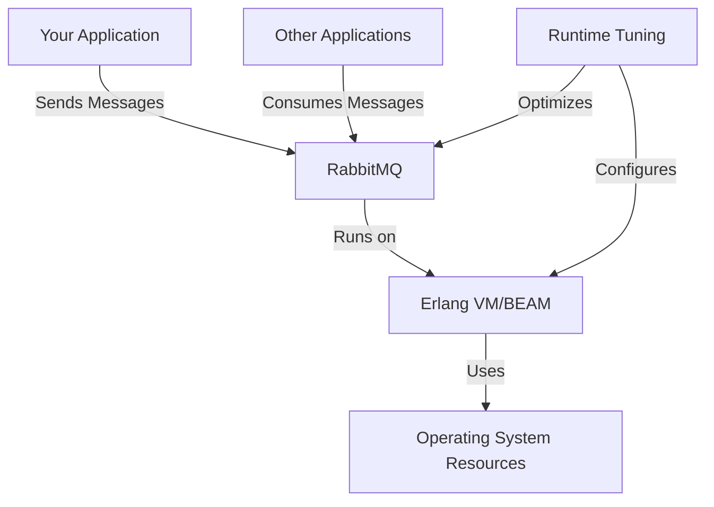
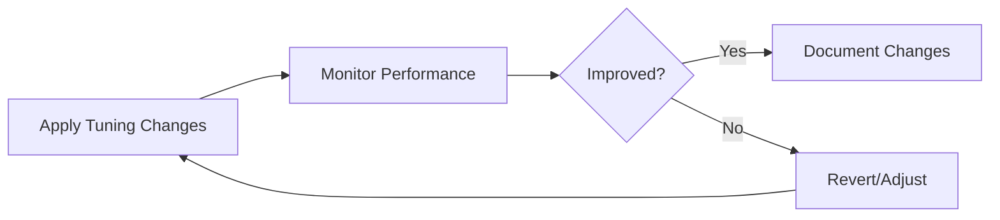

# RabbitMQ Runtime Tuning

## Introduction

RabbitMQ is a powerful message broker that enables applications to communicate through asynchronous messaging. While RabbitMQ works well with default settings for development and small workloads, production environments often require fine-tuning to handle larger message volumes, ensure high availability, and optimize resource usage.

In this guide, we'll explore how to tune RabbitMQ's runtime parameters to improve performance, stability, and resource utilization. These optimizations are especially important when your messaging system becomes a critical component of your infrastructure.

## Understanding RabbitMQ's Runtime Environment

Before diving into tuning, it's important to understand that RabbitMQ runs on the Erlang VM (BEAM). Many tuning parameters affect how the Erlang runtime behaves, which in turn impacts RabbitMQ's performance.



## Key Areas for Runtime Tuning

### 1. Memory Management

RabbitMQ uses memory for message queuing, exchange routing, and connection management. Proper memory tuning prevents out-of-memory scenarios.

#### Setting Memory Limits

RabbitMQ allows you to set memory thresholds to prevent the broker from using too much RAM:

```bash
# Using rabbitmqctl to set memory threshold (40% of system RAM)
rabbitmqctl set_vm_memory_high_watermark 0.4
```

You can also set this in the configuration file:

```erlang
# In rabbitmq.conf
vm_memory_high_watermark.relative = 0.4
```

When memory usage exceeds this threshold, RabbitMQ will start blocking publisher connections until memory is released.

For more granular control, you can specify an absolute value:

```erlang
# Setting an absolute memory limit (2GB)
vm_memory_high_watermark.absolute = 2GB
```

#### Memory Allocation Strategy

The memory allocator settings can significantly impact performance:

```erlang
# In rabbitmq.conf or advanced.config
+MBas 2048
+MHas 2048
```

This increases the default allocation sizes, reducing fragmentation for high-throughput systems.

### 2. Erlang Scheduler Tuning

The Erlang scheduler manages how processes are distributed across CPU cores.

```bash
# Set schedulers to match available CPU cores
RABBITMQ_SERVER_ADDITIONAL_ERL_ARGS="+S 8:8"
```

This example sets both online and dirty CPU schedulers to 8, which is ideal for an 8-core system.

### 3. File Handle Limits

RabbitMQ needs file handles for each connection, queue, and other resources:

```erlang
# In rabbitmq.conf
total_memory_available.limit = 2GB
fd_total.limit = 65536
```

Ensure your operating system limits are also configured:

```bash
# For Linux in /etc/security/limits.conf
rabbitmq soft nofile 65536
rabbitmq hard nofile 65536
```

### 4. Connection and Channel Settings

Tuning connection-related parameters helps manage client connections efficiently:

```erlang
# In rabbitmq.conf
channel_max = 2000
max_connections = 50000
```

This limits the number of channels per connection to 2000 and sets a maximum of 50,000 connections.

## Practical Tuning Example: High-Throughput Scenario

Let's walk through a practical example of tuning RabbitMQ for a high-throughput application that processes millions of messages per day.

### Step 1: System Analysis

First, assess your current performance using the management UI or CLI tools:

```bash
# View node statistics
rabbitmqctl status

# Check queue metrics
rabbitmqctl list_queues name messages_ready messages_unacknowledged
```

### Step 2: Creating a Tuning Configuration

Based on our analysis, let's create a configuration for a system with 16GB RAM and 8 CPU cores:

```erlang
# rabbitmq.conf

# Memory management
vm_memory_high_watermark.relative = 0.4
total_memory_available.limit = 16GB

# File descriptors
fd_total.limit = 65536

# Connection limits
channel_max = 2000
max_connections = 30000

# Network tuning
tcp_listen_options.backlog = 4096
tcp_listen_options.sndbuf = 32768
tcp_listen_options.recbuf = 32768
```

### Step 3: Erlang VM Arguments

Create or modify the `rabbitmq-env.conf` file:

```bash
# rabbitmq-env.conf
RABBITMQ_SERVER_ADDITIONAL_ERL_ARGS="+P 1048576 +sbwt none +sbwtdcpu none +sbwtdio none +S 8:8 +MBas 4096 +MHas 4096 +MMmcs 256"
```

This configuration:
- Increases process limit to ~1 million (`+P 1048576`)
- Disables scheduler busy waiting (`+sbwt none`)
- Sets 8 online and 8 dirty CPU schedulers (`+S 8:8`)
- Configures memory allocators for better performance

### Step 4: Apply and Verify

After applying these settings:

```bash
# Restart RabbitMQ to apply changes
systemctl restart rabbitmq-server

# Verify the new settings
rabbitmqctl status | grep -E 'file_descriptors|memory|erlang'
```

## Monitoring the Impact of Tuning

Always monitor your system after making tuning changes to ensure they have the desired effect:



Key metrics to monitor:
- Message throughput (publish and consume rates)
- Queue length and growth rate
- Memory usage and garbage collection frequency
- CPU usage across cores
- Connection and channel counts

## Advanced Tuning: Persistence and Disk I/O

If your RabbitMQ setup uses persistent messages, disk I/O becomes crucial:

```erlang
# In rabbitmq.conf

# Optimize for SSD storage
queue_index_embed_msgs_below = 4096

# Batch message synchronization
queue_master_locator = min-masters
```

For systems with extremely high persistence demands, consider:

```bash
# Mount RabbitMQ mnesia directory with optimized options
mount -o noatime,data=writeback,barrier=0,nobh /dev/sda1 /var/lib/rabbitmq
```

## Common Tuning Pitfalls to Avoid

1. **Over-allocation of memory**: Setting memory threshold too high can cause system swapping

2. **Ignoring network settings**: Network buffers and TCP settings are often overlooked

3. **Improper Erlang cookies**: In clustered setups, ensure consistent Erlang cookies

4. **Missing OS-level tuning**: RabbitMQ performance depends on OS settings too

5. **One-size-fits-all approach**: Tuning should be workload-specific

## Exercise: Creating a Tuning Plan

Let's practice creating a tuning plan for a specific scenario:

**Scenario**: You have a RabbitMQ server with the following characteristics:
- 4-core CPU, 8GB RAM
- Handles approximately 5,000 messages per second
- About 500 concurrent client connections
- Messages average 10KB in size
- 80% of messages are persistent

**Exercise**: Create a tuning configuration for this scenario.

<details>
<summary>Example Solution</summary>

```erlang
# rabbitmq.conf
vm_memory_high_watermark.relative = 0.5
total_memory_available.limit = 8GB
fd_total.limit = 16384
channel_max = 1000
max_connections = 1000
tcp_listen_options.backlog = 2048
queue_index_embed_msgs_below = 4096
```

```bash
# rabbitmq-env.conf
RABBITMQ_SERVER_ADDITIONAL_ERL_ARGS="+P 262144 +S 4:4 +MBas 2048 +MHas 2048"
```
</details>

## Summary

Proper runtime tuning of RabbitMQ can significantly improve its performance, stability, and resource utilization. The key areas to focus on are:

1. Memory management and allocation
2. Erlang VM scheduler configuration
3. File handle and connection limits
4. Network buffer settings
5. Persistence and disk I/O optimizations

Remember that tuning is an iterative process - start with conservative changes, measure their impact, and adjust accordingly. What works for one system might not be optimal for another, so always base your tuning decisions on actual performance metrics from your specific environment.

## Additional Resources

- [RabbitMQ Official Documentation](https://www.rabbitmq.com/documentation.html)
- [Erlang Runtime System Documentation](https://erlang.org/doc/efficiency_guide/introduction.html)
- [Monitoring RabbitMQ](https://www.rabbitmq.com/monitoring.html)
- [RabbitMQ Production Checklist](https://www.rabbitmq.com/production-checklist.html)

By applying these tuning techniques in a methodical way, you can ensure your RabbitMQ deployment performs optimally even under heavy loads, providing reliable message delivery for your applications.