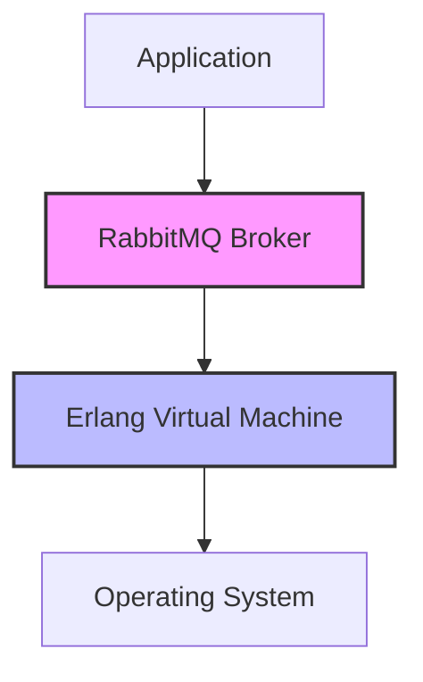

# RabbitMQ Erlang VM Options

## Introduction

RabbitMQ is built on the Erlang virtual machine (VM), which provides the foundation for its reliability, concurrency, and fault tolerance. As a messaging broker that handles critical communication between various parts of your distributed systems, optimizing RabbitMQ's performance becomes crucial as your applications scale.

Tuning the underlying Erlang VM can significantly impact how RabbitMQ performs under different workloads. These configuration options allow you to adjust memory allocation, garbage collection behavior, thread utilization, and other low-level parameters to match your specific deployment needs.

In this guide, we'll explore the most important Erlang VM options for RabbitMQ, understand their effects, and learn how to configure them properly. While this is an advanced topic, we'll break it down into understandable concepts even for those new to message brokers.

## Understanding Erlang VM and RabbitMQ

Before diving into specific options, let's understand the relationship between RabbitMQ and the Erlang VM:



The Erlang VM (also called BEAM - Bogdan/Björn's Erlang Abstract Machine) is responsible for:

- Memory management
- Process scheduling
- Garbage collection
- Inter-process communication
- Network I/O

RabbitMQ leverages these capabilities to provide reliable message delivery, but the default Erlang VM settings may not be optimal for all deployment scenarios.

## Key Erlang VM Configuration Parameters

### Memory Management Options

#### 1. Memory Allocator Settings

The Erlang VM uses multiple memory allocators for different types of data. For RabbitMQ, configuring these allocators properly can prevent memory fragmentation.

```bash
+MBas 2048        # Set max allocator sizes
+MBcpu 512        # Memory carrier pool size
+MBlmbcs 5120     # Largest memory block carrier size
```

**Real-world impact:** A large RabbitMQ deployment with high throughput can suffer from memory fragmentation over time. These settings help maintain performance even after days of operation without restarts.

#### 2. Maximum Memory per Process

```bash
+P 1048576        # Maximum number of processes
+Q 1048576        # Maximum number of ports
+e 65535          # Maximum number of ETS tables
```

**Example scenario:** When your RabbitMQ instance handles many concurrent connections (thousands of clients), these options prevent resource exhaustion.

### Garbage Collection Tuning

#### 1. Generational GC Settings

```bash
+G true           # Enable generational garbage collection
```

**Before/After Comparison:**

Before:
```
$ rabbitmqctl status | grep gc
GC runs: 857482, Words reclaimed: 398540258, Avg time per GC: 3.2ms
```

After:
```
$ rabbitmqctl status | grep gc
GC runs: 324561, Words reclaimed: 412893047, Avg time per GC: 2.1ms
```

#### 2. Async Thread Settings

```bash
+A 128            # Number of async threads
```

This setting controls how many threads the Erlang VM will use for I/O operations. Increasing this can help with high-throughput scenarios.

### Network and I/O Options

#### 1. Distribution Buffer Settings

```bash
+zdbbl 65536     # Distribution buffer busy limit
```

This controls the maximum size of the distribution buffer. Increasing it can help with large message throughput between nodes in a RabbitMQ cluster.

#### 2. I/O Polling Settings

```bash
+IOp 30          # I/O polling frequency
```

**Use case:** In environments with high message rates, adjusting the I/O polling frequency can reduce latency.

## How to Apply Erlang VM Options

Erlang VM options can be set in several ways when running RabbitMQ:

### 1. Using rabbitmq-env.conf

Create or edit the `rabbitmq-env.conf` file:

```bash
# Example rabbitmq-env.conf
RABBITMQ_SERVER_ADDITIONAL_ERL_ARGS="+P 1048576 +Q 1048576 +A 128 +G true"
```

### 2. Using Environment Variables

```bash
export RABBITMQ_SERVER_ADDITIONAL_ERL_ARGS="+P 1048576 +Q 1048576 +A 128 +G true"
rabbitmq-server
```

### 3. In a Systemd Service File

```ini
[Service]
Environment=RABBITMQ_SERVER_ADDITIONAL_ERL_ARGS="+P 1048576 +Q 1048576 +A 128 +G true"
```

### 4. In Docker

```bash
docker run -d --name rabbitmq \
  -e RABBITMQ_SERVER_ADDITIONAL_ERL_ARGS="+P 1048576 +Q 1048576 +A 128 +G true" \
  rabbitmq:3.9-management
```

## Common Configurations for Different Scenarios

### High-Throughput Configuration

For systems processing millions of messages per day:

```bash
RABBITMQ_SERVER_ADDITIONAL_ERL_ARGS="+P 1048576 +Q 1048576 +A 64 +K true +sbt db +sbwt very_long +sbwtdcpu 150:150 +swt very_low"
```

### Memory-Constrained Environment

For systems with limited memory:

```bash
RABBITMQ_SERVER_ADDITIONAL_ERL_ARGS="+P 262144 +Q 262144 +A 32 +MBas 512 +MBcpu 512 +hmqd 730"
```

### Clustered Configuration

For multi-node RabbitMQ clusters:

```bash
RABBITMQ_SERVER_ADDITIONAL_ERL_ARGS="+P 1048576 +Q 1048576 +A 128 +zdbbl 65536 +K true"
```

## Monitoring and Verifying Your Configuration

After applying Erlang VM options, you should monitor their effect:

### 1. Checking Current VM Settings

```bash
$ rabbitmqctl eval 'erlang:system_info(allocated_areas).'
```

This command shows the current memory allocation in your Erlang VM.

### 2. Monitoring Garbage Collection

```bash
$ rabbitmqctl eval 'erlang:statistics(garbage_collection).'
```

### 3. Process Information

```bash
$ rabbitmqctl eval 'length(erlang:processes()).'
```

This shows the number of Erlang processes running - useful to check after adjusting the `+P` option.

## Troubleshooting Common Issues

### Memory Fragmentation

**Symptoms:** Increasing memory usage despite stable workload, eventual performance degradation.

**Solution:**
```bash
+MHas 512         # Suggested heap allocation size
+MBlmbcs 5120     # Largest memory block carrier size
```

### High CPU Usage from Garbage Collection

**Symptoms:** CPU spikes correlating with GC activity, visible in monitoring tools.

**Solution:**
```bash
+G true           # Enable generational GC
+hmqd 600         # Sets heap message queue data checking threshold
```

### Network Buffer Issues in Clusters

**Symptoms:** Node disconnections under high load, error logs showing distribution buffer problems.

**Solution:**
```bash
+zdbbl 65536      # Increase distribution buffer busy limit
```

## Step-by-Step Guide: Optimizing a Production RabbitMQ Server

Let's put everything together in a practical example:

### 1. Baseline Measurement

First, measure your current performance:

```bash
# Check current message rate
$ rabbitmqctl list_queues name messages_published_details.rate

# Check memory usage
$ rabbitmqctl status | grep memory

# Check Erlang process count
$ rabbitmqctl eval 'length(erlang:processes()).'
```

### 2. Apply Basic Optimizations

Create a file `/etc/rabbitmq/rabbitmq-env.conf`:

```bash
RABBITMQ_SERVER_ADDITIONAL_ERL_ARGS="+P 1048576 +Q 1048576 +A 64 +G true"
```

### 3. Restart and Measure Again

```bash
$ systemctl restart rabbitmq-server

# Wait for the server to start, then check metrics again
$ rabbitmqctl list_queues name messages_published_details.rate
```

### 4. Fine-Tune Based on Results

If you're still seeing issues, adjust specific parameters:

```bash
# For memory issues
RABBITMQ_SERVER_ADDITIONAL_ERL_ARGS="+P 1048576 +Q 1048576 +A 64 +G true +MBas 2048 +MBcpu 512"

# For CPU/scheduling issues
RABBITMQ_SERVER_ADDITIONAL_ERL_ARGS="+P 1048576 +Q 1048576 +A 128 +G true +sbt db +sbwt very_long"
```

## Advanced: Understanding Scheduler and CPU Utilization

The Erlang VM has sophisticated scheduling capabilities that we can tune for RabbitMQ:

### Scheduler Binding Type

```bash
+sbt db           # Scheduler binding type (distribute bind)
```

This distributes Erlang schedulers across available CPU cores.

### Scheduler Wakeup Threshold

```bash
+swt very_low     # Scheduler wakeup threshold
```

Controls how aggressively schedulers try to find work.

### Real-world Example:

A high-throughput RabbitMQ system with 8 CPU cores might use:

```bash
RABBITMQ_SERVER_ADDITIONAL_ERL_ARGS="+P 1048576 +sbt db +swt medium +sbwt very_long +sbwtdcpu 80:80"
```

This configuration:
- Distributes schedulers across cores
- Sets moderate scheduler wakeup threshold
- Configures longer busy wait times before entering sleep mode
- Limits CPU usage to 80% per scheduler

## Summary

Tuning the Erlang VM for RabbitMQ allows you to optimize performance for your specific workload and hardware. The key areas to consider are:

1. **Memory management** - Prevent fragmentation and allocate appropriate resources
2. **Process limits** - Support the required number of connections
3. **Garbage collection** - Minimize pauses and CPU impact
4. **Scheduler behavior** - Maximize CPU utilization while avoiding contention

While the default settings work well for many deployments, high-throughput or resource-constrained environments will benefit from these optimizations.

Remember that tuning is an iterative process:
1. Measure current performance
2. Make targeted changes
3. Measure again
4. Adjust based on results

## Additional Resources

- [RabbitMQ Documentation on Runtime Parameters](https://www.rabbitmq.com/runtime.html)
- [Erlang VM Documentation](https://erlang.org/doc/man/erl.html)
- [RabbitMQ Monitoring Guide](https://www.rabbitmq.com/monitoring.html)

## Exercises

1. Set up a test RabbitMQ environment and experiment with different Erlang VM options to observe their effects on performance.

2. Create a benchmark script that publishes and consumes messages at a high rate, then measure how different VM options affect throughput and latency.

3. Configure RabbitMQ on a memory-constrained system (e.g., 2GB RAM) and optimize the Erlang VM options to maximize stability and performance.