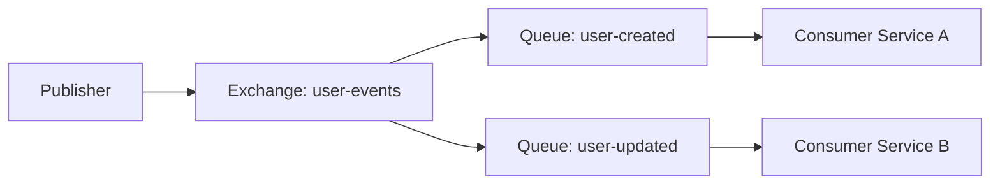
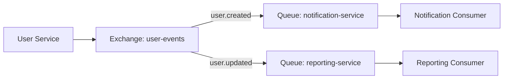

# RabbitMQ Schema Upgrades

## Introduction

When working with message brokers like RabbitMQ, your application's messaging architecture will inevitably need to evolve over time. As your system grows, you'll need to modify message structures, add new exchange-queue bindings, or change routing patterns. These changes to your messaging schema can be challenging to implement safely without disrupting your running applications.

This guide explores techniques for upgrading your RabbitMQ schema in a controlled, backward-compatible manner. You'll learn how to implement versioning strategies, handle message format changes, and modify your topology without causing downtime or message loss.

## Understanding Schema in RabbitMQ Context

In RabbitMQ, "schema" refers to several key components:

1. **Message format**: The structure and encoding of the message payload
2. **Exchange and queue topology**: How exchanges and queues are configured and bound
3. **Routing patterns**: How messages flow through your system
4. **Consumer behaviors**: How applications process messages

Changes to any of these components constitute a schema upgrade, and each presents unique challenges.

## Message Format Versioning

One of the most common schema changes involves modifying the structure of message payloads. Let's explore strategies for versioning your messages.

### Strategy 1: Version Headers

Adding a version identifier to your message headers allows consumers to handle different message formats appropriately.

```javascript
// Publishing a message with version header
channel.publish('user-events', 'user.created', Buffer.from(JSON.stringify(userData)), {
  headers: {
    'message-version': '2.0'
  }
});
```

On the consumer side, you can check the version and process accordingly:

```javascript
channel.consume('user-events-queue', (msg) => {
  const version = msg.properties.headers['message-version'] || '1.0';
  
  if (version === '1.0') {
    // Process using old message format logic
    processUserDataV1(JSON.parse(msg.content.toString()));
  } else if (version === '2.0') {
    // Process using new message format logic
    processUserDataV2(JSON.parse(msg.content.toString()));
  } else {
    // Handle unknown version
    console.error(`Unknown message version: ${version}`);
    channel.nack(msg);
  }
}, { noAck: false });
```

### Strategy 2: Content Type Versioning

Another approach leverages the content-type property to indicate both format and version:

```javascript
// Publishing a message with versioned content type
channel.publish('user-events', 'user.created', Buffer.from(JSON.stringify(userData)), {
  contentType: 'application/vnd.myapp.user.v2+json'
});
```

### Strategy 3: Schema Registry

For complex systems, a schema registry like Confluent Schema Registry (commonly used with Kafka but adaptable to RabbitMQ) can manage and validate message schemas:

```javascript
// Example using a schema registry with RabbitMQ
async function publishUserCreated(userData) {
  const schemaId = await schemaRegistry.getLatestSchemaId('user-created');
  const validatedData = await schemaRegistry.validate(schemaId, userData);
  
  channel.publish('user-events', 'user.created', Buffer.from(JSON.stringify(validatedData)), {
    headers: {
      'schema-id': schemaId
    }
  });
}
```

## Evolving Message Schemas

When evolving message formats, follow these principles to maintain compatibility:

### Backward Compatibility Rules

1. **Add, don't remove fields**: Consumers expecting old fields should still find them
2. **Provide defaults for new fields**: If a consumer doesn't supply a new required field, use a sensible default
3. **Make field changes optional first**: When changing field semantics, introduce an optional alternative before deprecating the old one

### Example: Evolving a User Message Schema

Version 1 of our user message might look like:

```json
{
  "id": "user123",
  "name": "John Doe",
  "email": "john@example.com"
}
```

To add support for multiple email addresses while maintaining compatibility:

```json
{
  "id": "user123",
  "name": "John Doe",
  "email": "john@example.com",
  "emailAddresses": ["john@example.com", "john.doe@work.com"]
}
```

Then consumers can be updated to use the new field, while the original field is maintained for backward compatibility.

## Topology Upgrades

Changing your RabbitMQ topology (exchanges, queues, and bindings) requires special consideration.



### Adding New Components

Adding new exchanges, queues, or bindings is generally safe as it doesn't affect existing flows:

```javascript
// Adding a new queue and binding for a new consumer
channel.assertExchange('user-events', 'topic', { durable: true });
channel.assertQueue('user-deleted-queue', { durable: true });
channel.bindQueue('user-deleted-queue', 'user-events', 'user.deleted');
```

### Modifying Routing Logic

Changing how messages are routed requires more care. One approach is to duplicate the flow during transition:

```javascript
// Phase 1: Add new exchange with new routing logic alongside old one
channel.assertExchange('user-events-v2', 'topic', { durable: true });

// Create new queues bound to new exchange
channel.assertQueue('user-events-queue-v2', { durable: true });
channel.bindQueue('user-events-queue-v2', 'user-events-v2', 'user.#');

// Setup exchange-to-exchange binding to duplicate messages to both flows
channel.bindExchange('user-events-v2', 'user-events', '#');
```

After all consumers are migrated to use the new queues, you can remove the old components.

## Implementing Backward Compatible Consumers

Consumers need to handle both old and new message formats during transition periods:

```javascript
channel.consume('user-events-queue', (msg) => {
  const payload = JSON.parse(msg.content.toString());
  
  // Handle backward compatibility
  const emailAddresses = payload.emailAddresses || (payload.email ? [payload.email] : []);
  
  processUser({
    id: payload.id,
    name: payload.name,
    emailAddresses: emailAddresses
  });
  
  channel.ack(msg);
}, { noAck: false });
```

## Deployment Strategies for Schema Upgrades

### Phased Rollout Approach

1. **Deploy consumers first**: Update consumers to handle both old and new message formats
2. **Deploy publishers**: Once all consumers can handle new formats, update publishers
3. **Clean up**: Remove compatibility code after transition period

### Using RabbitMQ Plugins for Migrations

The Shovel plugin can help migrate messages between old and new topologies:

```javascript
// Example of configuring a shovel via RabbitMQ HTTP API
const shovelConfig = {
  "value": {
    "src-uri": "amqp://localhost",
    "src-queue": "old-user-queue",
    "dest-uri": "amqp://localhost",
    "dest-exchange": "user-events-v2",
    "dest-exchange-key": "user.event"
  }
};

fetch('http://localhost:15672/api/parameters/shovel/%2f/user-migration', {
  method: 'PUT',
  headers: {
    'Content-Type': 'application/json',
    'Authorization': 'Basic ' + btoa('guest:guest')
  },
  body: JSON.stringify(shovelConfig)
});
```

## Testing Schema Upgrades

Before applying schema changes to production, thorough testing is essential:

1. **Version Compatibility Testing**: Verify that new consumers can process old messages and vice versa
2. **Topology Migration Testing**: Test that messages flow correctly through updated topology
3. **Performance Testing**: Ensure your changes don't introduce performance bottlenecks

A testing approach might include:

```javascript
// Example test for backward compatibility
describe('User message consumer', () => {
  it('should process messages with old schema format', async () => {
    // Setup RabbitMQ test instance
    
    // Publish message with old format
    publishMessage({
      id: 'user123',
      name: 'John Doe',
      email: 'john@example.com'
    });
    
    // Verify consumer processed it correctly
    const processed = await waitForProcessedMessage();
    expect(processed.emailAddresses).toEqual(['john@example.com']);
  });
  
  it('should process messages with new schema format', async () => {
    // Similar test with new format
    // ...
  });
});
```

## Real-World Example: Adding User Preferences

Let's walk through a complete example of adding user preferences to an existing user system.

### Initial Architecture



### Step 1: Update Consumers to Handle New Field

First, deploy updated consumers that can process messages with or without preferences:

```javascript
// Updated Notification Consumer
channel.consume('notification-service', (msg) => {
  const user = JSON.parse(msg.content.toString());
  
  // Handle both old and new schemas
  const preferences = user.preferences || { 
    emailNotifications: true, 
    marketingEmails: true 
  };
  
  sendNotification(user.email, preferences);
  channel.ack(msg);
}, { noAck: false });
```

### Step 2: Start Publishing New Format

Once all consumers are updated, modify publishers to include the new field:

```javascript
// Updated User Service Publisher
function publishUserCreated(user) {
  const payload = {
    id: user.id,
    name: user.name,
    email: user.email,
    // New field with default values
    preferences: user.preferences || { 
      emailNotifications: true, 
      marketingEmails: true 
    }
  };
  
  channel.publish(
    'user-events', 
    'user.created', 
    Buffer.from(JSON.stringify(payload))
  );
}
```

### Step 3: Add New Message Type and Queue

Now we can add a dedicated message type for preference updates:

```javascript
// Add new message type for preference updates
function publishUserPreferencesUpdated(userId, preferences) {
  const payload = {
    userId: userId,
    preferences: preferences,
    updatedAt: new Date().toISOString()
  };
  
  channel.publish(
    'user-events', 
    'user.preferences.updated', 
    Buffer.from(JSON.stringify(payload))
  );
}

// Setup new queue for a service that only cares about preference changes
channel.assertQueue('preference-analytics-service', { durable: true });
channel.bindQueue(
  'preference-analytics-service', 
  'user-events', 
  'user.preferences.updated'
);
```

### Step 4: Clean Up (After Transition Period)

After sufficient time to ensure all systems are working with the new format, you can simplify your consumer code by removing the backward compatibility handling if needed.

## Common Pitfalls and How to Avoid Them

### Dead Letter Queues for Failed Messages

Always implement dead letter queues to capture messages that fail processing due to schema incompatibilities:

```javascript
// Setting up a queue with a dead letter exchange
channel.assertExchange('dlx', 'fanout', { durable: true });
channel.assertQueue('dead-letter-queue', { durable: true });
channel.bindQueue('dead-letter-queue', 'dlx', '#');

channel.assertQueue('user-events-queue', {
  durable: true,
  arguments: {
    'x-dead-letter-exchange': 'dlx'
  }
});
```

### Monitoring During Migrations

Implement comprehensive monitoring to catch issues early:

```javascript
// Example of instrumenting your consumer for monitoring
channel.consume('user-events-queue', (msg) => {
  const startTime = Date.now();
  try {
    const version = msg.properties.headers['message-version'] || '1.0';
    metrics.increment(`message.received.v${version}`);
    
    // Process message...
    
    metrics.timing('message.processing.time', Date.now() - startTime);
    channel.ack(msg);
  } catch (error) {
    metrics.increment('message.processing.error');
    logger.error('Failed to process message', { error: error.message });
    channel.nack(msg);
  }
}, { noAck: false });
```

### Configuration Management

Store your RabbitMQ topology configuration as code and version control it:

```javascript
// Example of a declarative topology setup
const topology = {
  exchanges: [
    { name: 'user-events', type: 'topic', options: { durable: true } }
  ],
  queues: [
    { 
      name: 'notification-service', 
      options: { durable: true },
      bindings: [
        { exchange: 'user-events', pattern: 'user.created' },
        { exchange: 'user-events', pattern: 'user.preferences.updated' }
      ]
    }
  ]
};

// Function to setup topology from configuration
async function setupTopology(channel, topology) {
  for (const exchange of topology.exchanges) {
    await channel.assertExchange(exchange.name, exchange.type, exchange.options);
  }
  
  for (const queue of topology.queues) {
    await channel.assertQueue(queue.name, queue.options);
    
    for (const binding of queue.bindings) {
      await channel.bindQueue(queue.name, binding.exchange, binding.pattern);
    }
  }
}
```

## Summary

Implementing schema upgrades in RabbitMQ requires careful planning and execution to maintain system stability. Key strategies include:

1. **Message versioning**: Use headers or content types to indicate message format versions
2. **Backward compatibility**: Ensure consumers can handle both old and new message formats
3. **Phased deployments**: Update consumers before publishers
4. **Topology management**: Add new components before removing old ones
5. **Comprehensive testing**: Verify compatibility across versions
6. **Monitoring and error handling**: Implement robust error handling with dead letter queues

By following these practices, you can evolve your RabbitMQ schema safely while maintaining system reliability.

## Additional Resources

- RabbitMQ official documentation on reliability and patterns
- Message schema evolution patterns
- Books on enterprise messaging patterns
- Tools for RabbitMQ management and monitoring

## Exercises

1. Design a versioning strategy for a user profile message that needs to add support for multiple addresses
2. Implement a dead letter queue and error handling system for failed message processing
3. Create a plan for migrating from a simple direct exchange to a more complex topic exchange pattern
4. Develop a test suite that verifies backward compatibility between message versions
5. Design a monitoring dashboard for tracking message processing errors during a schema migration