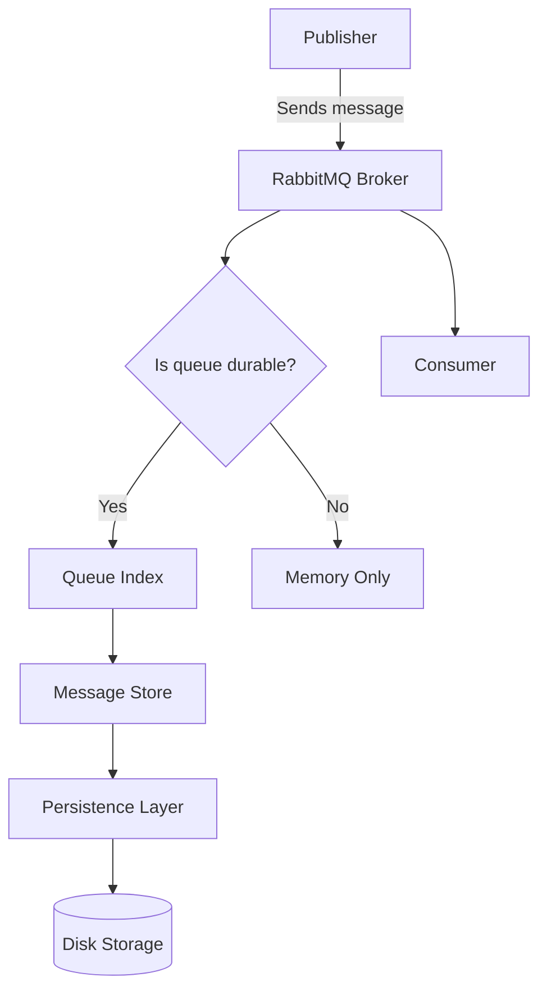

# RabbitMQ Message Store

## Introduction

The RabbitMQ Message Store is a critical component of RabbitMQ's architecture that handles how messages are stored, managed, and persisted within the message broker. Understanding how RabbitMQ stores messages is essential for developers who want to optimize their messaging systems, ensure data durability, and troubleshoot performance issues.

In this guide, we'll dive deep into the inner workings of RabbitMQ's message storage system, explore its persistence mechanisms, and learn how to configure it for optimal performance in production environments.

## What is the Message Store?

At its core, the Message Store is the subsystem responsible for handling message persistence in RabbitMQ. When messages are published to durable queues or when persistence is enabled, RabbitMQ needs to store these messages in a way that they can be recovered in case of broker restarts or failures.

The Message Store consists of several components:

1. **Queue Index**: Maintains metadata about messages in queues
2. **Message Store**: Manages the actual message content
3. **Persistence Layer**: Handles writing to and reading from disk

Let's visualize the relationship between these components:



## Message Persistence Mechanics

### In-Memory vs Persistent Messages

RabbitMQ handles messages differently based on their persistence settings:

- **Transient messages** (non-persistent) are stored only in memory and will be lost if the broker restarts
- **Persistent messages** are stored both in memory and on disk, ensuring they survive broker restarts

To publish a persistent message, you need to set the delivery mode property to `2`:

```javascript
// Publishing a persistent message in Node.js with amqplib
channel.publish('exchange_name', 'routing_key', Buffer.from('Hello World'), {
  persistent: true  // This sets delivery mode to 2
});
```

### The Queue Index

The Queue Index maintains metadata about messages in a queue, including:

- Message IDs
- Message positions in the queue
- Delivery status
- Message properties

This index allows RabbitMQ to quickly locate messages without loading the entire message content from disk.

### Message Store Implementation

RabbitMQ's Message Store uses a segmented approach for storing message content:

1. **Message Store Files**: Messages are stored in segment files with a default size of 16MB
2. **Reference Counting**: Messages referenced by multiple queues are stored only once
3. **Garbage Collection**: Unused messages are eventually removed during garbage collection cycles

Let's examine how RabbitMQ organizes these files on disk:

```
/var/lib/rabbitmq/mnesia/rabbit@hostname/msg_stores/vhosts/VHOST_ID/
├── queues
│   └── QUEUE_ID
│       ├── journal.jif
│       └── queue_index.qi
└── msg_store_persistent
    ├── file_summary.ets
    ├── 0.rdq
    ├── 1.rdq
    ├── 2.rdq
    └── ...
```

## Configuring the Message Store

### Key Configuration Parameters

You can tune the Message Store's behavior through several configuration parameters:

```erlang
[
  {rabbit, [
    {queue_index_max_journal_entries, 32768},
    {queue_index_embed_msgs_below, 4096},
    {msg_store_file_size_limit, 16777216},
    {msg_store_credit_disc_bound, {4000, 800}}
  ]}
].
```

Let's break down these parameters:

- `queue_index_max_journal_entries`: Controls how many operations can be buffered before syncing to disk
- `queue_index_embed_msgs_below`: Messages smaller than this size (in bytes) are embedded directly in the queue index
- `msg_store_file_size_limit`: Maximum size of each segment file (in bytes)
- `msg_store_credit_disc_bound`: Controls flow from memory to disk (`{InitialCredit, MoreCreditAfter}`)

## Performance Considerations

### I/O Performance Impact

The Message Store heavily relies on disk I/O, which can become a bottleneck:

1. **Disk Type**: SSDs provide significantly better performance than HDDs for RabbitMQ
2. **RAID Configuration**: RAID10 offers a good balance of performance and redundancy
3. **File System**: Ext4 and XFS are recommended for Linux systems

### Lazy Queues

For queues with large numbers of messages, consider using "lazy queues" which minimize memory usage by storing messages on disk immediately:

```javascript
// Declaring a lazy queue in Node.js
channel.assertQueue('my_lazy_queue', {
  durable: true,
  arguments: {
    'x-queue-mode': 'lazy'
  }
});
```

Lazy queues change the normal behavior where RabbitMQ tries to keep as many messages as possible in memory.

## Practical Examples

### Example 1: Implementing a Durable Messaging System

Let's create a simple application that ensures message durability even if the RabbitMQ server crashes:

```javascript
// Publisher with durability (Node.js)
const amqp = require('amqplib');

async function publishDurableMessage() {
  const connection = await amqp.connect('amqp://localhost');
  const channel = await connection.createChannel();
  
  // Declare a durable exchange
  await channel.assertExchange('durable_exchange', 'direct', {durable: true});
  
  // Declare a durable queue
  await channel.assertQueue('durable_queue', {durable: true});
  
  // Bind the queue to the exchange
  await channel.bindQueue('durable_queue', 'durable_exchange', 'routing_key');
  
  // Publish a persistent message
  channel.publish('durable_exchange', 'routing_key', 
    Buffer.from('This message will survive restarts'), 
    {persistent: true}
  );
  
  console.log('Message sent with durability guarantees');
  
  setTimeout(() => {
    connection.close();
    process.exit(0);
  }, 500);
}

publishDurableMessage();
```

```javascript
// Consumer with acknowledgment (Node.js)
const amqp = require('amqplib');

async function consumeDurableMessages() {
  const connection = await amqp.connect('amqp://localhost');
  const channel = await connection.createChannel();
  
  // Ensure the queue exists
  await channel.assertQueue('durable_queue', {durable: true});
  
  // Set prefetch to 1 for fair dispatch
  await channel.prefetch(1);
  
  console.log('Waiting for messages...');
  
  // Consume messages with explicit acknowledgment
  channel.consume('durable_queue', (msg) => {
    console.log(`Received: ${msg.content.toString()}`);
    
    // Simulate processing time
    setTimeout(() => {
      // Acknowledge the message only after processing
      channel.ack(msg);
      console.log('Message acknowledged');
    }, 1000);
  }, {noAck: false});
}

consumeDurableMessages();
```

When you run these programs and restart RabbitMQ between publishing and consuming, the message will still be delivered due to the persistence mechanisms.

### Example 2: Monitoring Message Store Performance

You can monitor Message Store performance using the RabbitMQ Management UI or the HTTP API:

```javascript
// Monitoring message store performance with Node.js
const axios = require('axios');

async function monitorMessageStore() {
  try {
    // Get node stats
    const response = await axios.get('http://localhost:15672/api/nodes', {
      auth: {
        username: 'guest',
        password: 'guest'
      }
    });
    
    const nodeStats = response.data[0];
    
    console.log('Message Store Stats:');
    console.log(`Disk Free: ${nodeStats.disk_free / 1024 / 1024} MB`);
    console.log(`IO Read Count: ${nodeStats.io_read_count}`);
    console.log(`IO Write Count: ${nodeStats.io_write_count}`);
    console.log(`Message Store Read Count: ${nodeStats.msg_store_read_count}`);
    console.log(`Message Store Write Count: ${nodeStats.msg_store_write_count}`);
  } catch (error) {
    console.error('Error monitoring message store:', error);
  }
}

monitorMessageStore();
```

Sample output:
```
Message Store Stats:
Disk Free: 52489.32 MB
IO Read Count: 12845
IO Write Count: 46782
Message Store Read Count: 385
Message Store Write Count: 1254
```

## Troubleshooting Message Store Issues

### Common Issues and Solutions

1. **Disk Space Exhaustion**

When the disk becomes full, RabbitMQ will stop accepting new messages:

```bash
# Check disk usage
df -h /var/lib/rabbitmq

# Clean up old log files
rabbitmqctl force_gc
```

2. **Slow Message Persistence**

If message persistence is slow, consider these solutions:

- Use SSDs instead of HDDs
- Increase `credit_flow` settings
- Use transient messages for non-critical data
- Implement a shovel plugin to move messages to another node

3. **Message Store Corruption**

In rare cases, the message store files might become corrupted:

```bash
# Stop RabbitMQ
systemctl stop rabbitmq-server

# Backup message store files
cp -r /var/lib/rabbitmq/mnesia /var/lib/rabbitmq/mnesia_backup

# Remove corrupted files and restart
rm -rf /var/lib/rabbitmq/mnesia/rabbit@hostname/msg_stores
systemctl start rabbitmq-server
```

## Advanced Configurations

### Federation and Shovel for Distributed Message Stores

For distributed systems, you can use Federation or Shovel plugins to move messages between brokers:

```javascript
// Setting up a shovel in Node.js using Management API
const axios = require('axios');

async function setupShovel() {
  const shovelConfig = {
    value: {
      src_uri: "amqp://source-server",
      src_queue: "source_queue",
      dest_uri: "amqp://destination-server",
      dest_queue: "destination_queue",
      prefetch_count: 1000,
      reconnect_delay: 5
    }
  };
  
  try {
    await axios.put(
      'http://localhost:15672/api/parameters/shovel/%2F/my-shovel',
      shovelConfig,
      {
        auth: {
          username: 'guest',
          password: 'guest'
        }
      }
    );
    console.log('Shovel configured successfully');
  } catch (error) {
    console.error('Error setting up shovel:', error);
  }
}

setupShovel();
```

This configuration helps distribute message storage across multiple RabbitMQ nodes.

## Summary

The RabbitMQ Message Store is a sophisticated system that handles message persistence with a focus on performance and durability. Key takeaways include:

1. Message persistence is controlled by the delivery mode (`persistent: true`) and queue durability settings
2. The Message Store uses a segmented file approach with reference counting for efficient storage
3. Performance can be optimized through proper hardware selection and configuration parameters
4. Lazy queues provide an alternative approach for handling large message volumes
5. Monitoring and troubleshooting tools are available through the Management UI and HTTP API

Understanding the Message Store's internals allows developers to build more reliable and efficient messaging systems with RabbitMQ.

## Additional Resources

- [RabbitMQ Persistence Configuration](https://www.rabbitmq.com/persistence-conf.html)
- [RabbitMQ Lazy Queues](https://www.rabbitmq.com/lazy-queues.html)
- [RabbitMQ Production Checklist](https://www.rabbitmq.com/production-checklist.html)

## Exercises

1. Set up a RabbitMQ cluster and compare message store performance between different hardware configurations
2. Implement a message producer that can handle broker outages while ensuring no messages are lost
3. Create a monitoring script that alerts when message store disk usage exceeds 80%
4. Experiment with different queue modes (default vs. lazy) and measure their impact on memory usage and performance
5. Implement a disaster recovery plan for a RabbitMQ message store, including backup and restore procedures