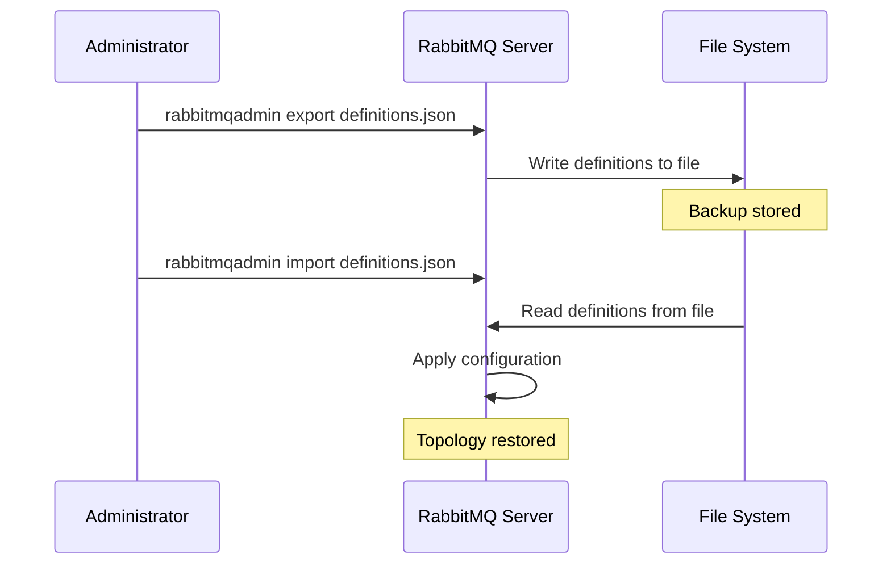

# RabbitMQ Backup Restoration

## Introduction

Message queues are critical infrastructure components in many modern applications. RabbitMQ, as one of the most popular message brokers, often handles business-critical data and workflows. Having a proper backup and restoration strategy is essential to minimize downtime and prevent data loss during system failures, migrations, or upgrades.

This guide will walk you through the process of backing up your RabbitMQ instance and, more importantly, how to restore it when needed. We'll cover different backup types, restoration procedures, and best practices to ensure your messaging infrastructure remains resilient.

## Understanding RabbitMQ State

Before diving into backup and restoration, it's important to understand what constitutes a RabbitMQ instance's state:

1. **Definitions** - exchanges, queues, bindings, users, virtual hosts, policies, and parameters
2. **Messages** - actual data stored in queues
3. **Mnesia database** - internal database storing metadata
4. **Log files** - operation logs
5. **Configuration files** - broker configurations

A comprehensive backup strategy should address all these components.

## Backup Types for RabbitMQ

### 1. Definitions Backup

The most common and lightweight backup method is exporting definitions, which captures the topology of your RabbitMQ setup.

```bash
# Export definitions to a JSON file
rabbitmqadmin export /path/to/definitions.json
```

This command creates a JSON file containing:
- Exchanges
- Queues
- Bindings
- Virtual hosts
- Users and permissions
- Policies
- Parameters

Note that this does **not** include the actual messages in queues.

### 2. Full Broker Backup

For a complete backup including messages, you'll need to backup the entire RabbitMQ directory structure.

```bash
# Stop RabbitMQ service first
sudo systemctl stop rabbitmq-server

# Backup the entire directory
tar -czf rabbitmq_backup_$(date +%Y%m%d).tar.gz /var/lib/rabbitmq

# Restart RabbitMQ service
sudo systemctl start rabbitmq-server
```

### 3. Mnesia Database Backup

You can also specifically backup the Mnesia database:

```bash
# Create a backup of the Mnesia database
rabbitmqctl eval 'mnesia:backup("/path/to/mnesia_backup").'

# Or for a more readable format
rabbitmqctl eval 'mnesia:dump_to_textfile("/path/to/mnesia_dump.txt").'
```

## Restoration Procedures

Let's look at how to restore RabbitMQ from different backup types.

### Restoring from Definitions Backup

This is the simplest restoration method and works well when moving configurations between environments.

```bash
# Import definitions from a JSON file
rabbitmqadmin import /path/to/definitions.json
```

After running this command, RabbitMQ will recreate all the exchanges, queues, and other configuration elements defined in the backup file.

Let's see what this looks like in a practical example:



### Restoring from Full Backup

When you need to recover everything, including messages:

```bash
# Stop RabbitMQ service
sudo systemctl stop rabbitmq-server

# Remove current data directory
sudo rm -rf /var/lib/rabbitmq/*

# Extract backup
sudo tar -xzf rabbitmq_backup_20230101.tar.gz -C /

# Set correct permissions
sudo chown -R rabbitmq:rabbitmq /var/lib/rabbitmq

# Start RabbitMQ service
sudo systemctl start rabbitmq-server
```

### Restoring from Mnesia Backup

To restore from a Mnesia database backup:

```bash
# Stop RabbitMQ
sudo systemctl stop rabbitmq-server

# Restore from backup
rabbitmqctl eval 'mnesia:restore("/path/to/mnesia_backup", []).'

# Start RabbitMQ
sudo systemctl start rabbitmq-server
```

## Practical Example: Disaster Recovery Scenario

Let's walk through a complete disaster recovery scenario:

1. Original RabbitMQ server crashes
2. New RabbitMQ server needs to be set up with the same configuration and data

### Step 1: Install RabbitMQ on the new server

```bash
# Install RabbitMQ on the new server
sudo apt-get update
sudo apt-get install rabbitmq-server

# Stop the service to prepare for restoration
sudo systemctl stop rabbitmq-server
```

### Step 2: Copy the backup to the new server

```bash
# Copy the full backup to the new server
scp rabbitmq_backup_20230101.tar.gz newserver:/tmp/
```

### Step 3: Restore from backup

```bash
# Extract the backup
sudo tar -xzf /tmp/rabbitmq_backup_20230101.tar.gz -C /

# Set correct permissions
sudo chown -R rabbitmq:rabbitmq /var/lib/rabbitmq

# Start RabbitMQ
sudo systemctl start rabbitmq-server
```

### Step 4: Verify the restoration

```bash
# List exchanges
rabbitmqadmin list exchanges

# List queues
rabbitmqadmin list queues

# Check if messages are there
rabbitmqadmin get queue=my_important_queue count=5
```

## Common Restoration Issues and Solutions

### 1. Permission Problems

If you encounter permission issues:

```bash
# Fix permissions on RabbitMQ directories
sudo chown -R rabbitmq:rabbitmq /var/lib/rabbitmq
sudo chmod -R 755 /var/lib/rabbitmq
```

### 2. Erlang Cookie Mismatch

In clustered environments, the Erlang cookie must match:

```bash
# Check the Erlang cookie
cat /var/lib/rabbitmq/.erlang.cookie

# Copy it to the correct location if needed
sudo cp /var/lib/rabbitmq/.erlang.cookie /home/rabbitmq/.erlang.cookie
sudo chown rabbitmq:rabbitmq /home/rabbitmq/.erlang.cookie
sudo chmod 400 /home/rabbitmq/.erlang.cookie
```

### 3. Node Name Issues

If node names don't match between backup and new environment:

```bash
# Edit the rabbitmq-env.conf file
sudo nano /etc/rabbitmq/rabbitmq-env.conf

# Add the correct node name
NODENAME=rabbit@backup-hostname
```

## Best Practices for RabbitMQ Backup and Restoration

1. **Regular backups**: Schedule automated backups of both definitions and full state
2. **Versioned backups**: Keep multiple backup versions with clear timestamps
3. **Distributed storage**: Store backups in multiple locations
4. **Test restorations**: Regularly test your backup restoration process
5. **Document procedures**: Keep step-by-step restoration procedures documented
6. **Monitoring**: Monitor backup job success/failures

## Automating Backup with a Shell Script

Here's a simple shell script to automate daily backups:

```bash
#!/bin/bash

# Set variables
BACKUP_DIR="/path/to/backups"
DATE=$(date +%Y%m%d)
RABBITMQ_DATA="/var/lib/rabbitmq"

# Create backup directory if it doesn't exist
mkdir -p $BACKUP_DIR

# Export definitions
rabbitmqadmin export $BACKUP_DIR/definitions_$DATE.json

# Stop RabbitMQ for a consistent backup
systemctl stop rabbitmq-server

# Create full backup
tar -czf $BACKUP_DIR/rabbitmq_backup_$DATE.tar.gz $RABBITMQ_DATA

# Restart RabbitMQ
systemctl start rabbitmq-server

# Keep only last 7 days of backups
find $BACKUP_DIR -name "rabbitmq_backup_*" -mtime +7 -delete
find $BACKUP_DIR -name "definitions_*" -mtime +7 -delete

echo "Backup completed: $BACKUP_DIR/rabbitmq_backup_$DATE.tar.gz"
```

You can schedule this with cron to run during low-traffic periods:

```bash
# Run backup at 2 AM every day
0 2 * * * /path/to/rabbitmq_backup.sh >> /var/log/rabbitmq_backup.log 2>&1
```

## Summary

Effective backup and restoration of RabbitMQ is crucial for maintaining a reliable messaging infrastructure. We've covered:

- Different types of RabbitMQ backups
- Step-by-step restoration procedures
- Practical disaster recovery scenarios
- Common issues and solutions
- Best practices for backup and restoration
- Automation of the backup process

By implementing a robust backup strategy and regularly testing your restoration procedures, you can minimize downtime and ensure business continuity when issues arise.

## Additional Resources

1. RabbitMQ official documentation on backup and restore
2. Message queue high availability patterns
3. RabbitMQ clustering for redundancy

## Exercises

1. Set up a test RabbitMQ instance and practice creating both definitions and full backups.
2. Create a disaster recovery scenario and practice restoring your backups to a new instance.
3. Write a shell script that performs a full backup and tests the integrity of the backup.
4. Implement a monitoring solution that alerts you if the RabbitMQ backup process fails.