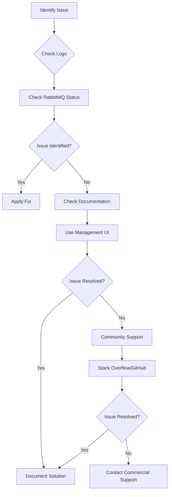

# RabbitMQ Support Resources

When you encounter issues with RabbitMQ, knowing where to find help can save you hours of frustration. This guide will walk you through the various support resources available for RabbitMQ troubleshooting, from official documentation to community forums and diagnostic tools.

## Introduction

RabbitMQ is a robust message broker that enables applications to communicate efficiently through asynchronous messaging. However, like any complex system, you may encounter issues during development, deployment, or production. Fortunately, the RabbitMQ ecosystem offers numerous support resources to help you overcome these challenges.

## Official Documentation

### RabbitMQ Guides

The [official RabbitMQ documentation](https://www.rabbitmq.com/documentation.html) is the primary source of information and should be your first stop when looking for answers.

Key sections include:

- **Installation guides** - Platform-specific installation instructions
- **Configuration guides** - How to configure RabbitMQ for different scenarios
- **Clustering guides** - Setting up and managing RabbitMQ clusters
- **Monitoring documentation** - Tools and techniques for monitoring RabbitMQ

### Troubleshooting Guide

RabbitMQ's official troubleshooting guide is particularly valuable when you're facing issues:

```bash
# URL for the official troubleshooting guide
https://www.rabbitmq.com/troubleshooting.html
```

This guide covers common issues with:
- Connection problems
- Authentication failures
- Performance bottlenecks
- Memory and disk space alerts

## Command Line Tools

RabbitMQ comes with several command-line tools that are invaluable for diagnostics and troubleshooting.

### RabbitMQ Management CLI

The `rabbitmqadmin` tool allows you to manage and inspect your RabbitMQ server from the command line:

```bash
# List all queues
rabbitmqadmin list queues

# List all connections
rabbitmqadmin list connections

# Declare a new exchange
rabbitmqadmin declare exchange name=my-new-exchange type=direct
```

### RabbitMQ Diagnostics

The `rabbitmq-diagnostics` command provides detailed information about your RabbitMQ installation:

```bash
# Check overall health
rabbitmq-diagnostics check_running

# Get status information
rabbitmq-diagnostics status

# Check virtual host availability
rabbitmq-diagnostics check_virtual_hosts
```

Examples of diagnostic output:

```
# Example output from rabbitmq-diagnostics status
Status of node rabbit@hostname:
Runtime

OS PID: 12345
OS: Linux
Uptime (seconds): 1234567
RabbitMQ version: 3.9.13
Node name: rabbit@hostname
Erlang configuration: Erlang/OTP 24 [erts-12.1.5]
```

## Management UI

The RabbitMQ Management UI is a web-based interface that provides real-time information about your RabbitMQ server.

### Accessing the Management UI

By default, the Management UI is available at:

```
http://localhost:15672/
```

Default credentials (if not changed):
- Username: `guest`
- Password: `guest`

Note: The default `guest` user can only connect from localhost.

### Key Features for Troubleshooting

The Management UI offers several features to help with troubleshooting:

1. **Overview** - Get a high-level view of your server's health
2. **Connections** - Monitor and manage active connections
3. **Channels** - View channel details and performance
4. **Exchanges** - Manage and inspect exchanges
5. **Queues** - Monitor queue metrics, including:
   - Message rates
   - Memory usage
   - Consumer counts

## Logging

RabbitMQ's logging system can provide valuable insights when troubleshooting issues.

### Log Locations

Log locations vary by platform:

```bash
# Debian/Ubuntu
/var/log/rabbitmq/

# Windows
%APPDATA%\RabbitMQ\log\

# Generic Linux (when installed from binary)
$RABBITMQ_HOME/var/log/rabbitmq/
```

### Log Levels

You can configure log levels in the RabbitMQ configuration file:

```erlang
# Example configuration to increase log detail
log.file.level = debug

# Example to also log to console
log.console = true
log.console.level = info
```

### Common Log Messages

Here are some common log messages and what they might indicate:

```
# Connection refused
=ERROR REPORT==== 15-Mar-2023::10:15:30.123 ===
connection <0.123.0> (127.0.0.1:12345 -> 127.0.0.1:5672): connection_closed_abruptly

# Authentication failure
=ERROR REPORT==== 15-Mar-2023::10:20:45.678 ===
rabbit_access_control:check_user_pass_login/2: invalid credentials for user 'myuser'
```

## Community Support

### RabbitMQ Mailing List

The [RabbitMQ Users mailing list](https://groups.google.com/g/rabbitmq-users) is an active community where you can ask questions and share experiences.

### GitHub Issues

For potential bugs or feature requests, check the [RabbitMQ GitHub repository](https://github.com/rabbitmq/rabbitmq-server/issues).

### Stack Overflow

Stack Overflow has a [rabbitmq tag](https://stackoverflow.com/questions/tagged/rabbitmq) with thousands of questions and answers.

When posting a question on Stack Overflow, include:
- RabbitMQ version
- Client library and version
- Relevant code snippets
- Error messages
- Steps to reproduce

## Client Library Documentation

Each RabbitMQ client library has its own documentation that can help with language-specific issues:

- **Java**: [RabbitMQ Java Client](https://www.rabbitmq.com/api-guide.html)
- **Python**: [Pika](https://pika.readthedocs.io/)
- **Node.js**: [amqplib](https://www.npmjs.com/package/amqplib)
- **.NET**: [RabbitMQ .NET Client](https://www.rabbitmq.com/dotnet.html)

## Troubleshooting Workflow

Here's a step-by-step workflow for troubleshooting RabbitMQ issues:



## Common Troubleshooting Scenarios

### Connection Issues

If clients cannot connect to RabbitMQ:

1. Check if RabbitMQ is running:

```bash
rabbitmq-diagnostics ping
```

2. Verify listener configuration:

```bash
rabbitmq-diagnostics listeners
```

3. Check for firewall issues:

```bash
telnet localhost 5672
```

### Queue Performance Problems

If you're experiencing slow message processing:

1. Check for consumer bottlenecks:

```bash
rabbitmqctl list_queues name messages consumers
```

2. Monitor queue metrics in the Management UI
3. Consider enabling [lazy queues](https://www.rabbitmq.com/lazy-queues.html) for large queues:

```bash
# Declaring a lazy queue in Java
Map<String, Object> args = new HashMap<>();
args.put("x-queue-mode", "lazy");
channel.queueDeclare("my-lazy-queue", true, false, false, args);
```

### Memory Issues

If RabbitMQ is using too much memory:

1. Check memory alarm status:

```bash
rabbitmq-diagnostics memory_breakdown
```

2. Review memory watermark settings:

```bash
# Set memory threshold to 0.4 (40% of system RAM)
rabbitmqctl set_vm_memory_high_watermark 0.4
```

## Commercial Support

For mission-critical deployments, commercial support options are available:

- **VMware Tanzu RabbitMQ** - Enterprise support and commercial distribution
- **CloudAMQP** - Managed RabbitMQ hosting with support included
- **Independent consultants** - Many RabbitMQ experts offer consulting services

## Practical Example: Diagnosing a Queue Backup

Let's walk through a complete example of diagnosing and resolving a common issue: messages backing up in a queue.

### Step 1: Identify the problem

Use the Management UI or command line to check queue depths:

```bash
rabbitmqctl list_queues name messages
```

Output:
```
Listing queues for vhost /...
name             messages
order_processing 10000
payment_service  50
email_notifications 120
```

### Step 2: Check consumer status

```bash
rabbitmqctl list_queues name messages consumers
```

Output:
```
Listing queues for vhost /...
name             messages consumers
order_processing 10000    0
payment_service  50       2
email_notifications 120   1
```

We can see `order_processing` has no consumers!

### Step 3: Check application logs

After examining our application logs, we find:

```
[ERROR] Failed to establish connection to RabbitMQ: Connection refused
```

### Step 4: Resolve the issue

Restart the consumer application and verify it reconnects:

```bash
# After restarting the consumer
rabbitmqctl list_queues name messages consumers
```

Output:
```
Listing queues for vhost /...
name             messages consumers
order_processing 9850     2
payment_service  50       2
email_notifications 120   1
```

The queue is now being processed!

## Summary

RabbitMQ offers a comprehensive set of support resources to help you troubleshoot and resolve issues. From official documentation and built-in tools to community forums and commercial support, you have multiple avenues for assistance.

When troubleshooting RabbitMQ:

1. Start with the logs and built-in diagnostic tools
2. Use the Management UI to monitor performance
3. Consult the official documentation for specific issues
4. Engage with the community for more complex problems
5. Consider commercial support for mission-critical deployments

## Additional Resources

- [RabbitMQ Monitoring Guide](https://www.rabbitmq.com/monitoring.html)
- [RabbitMQ Best Practices](https://www.rabbitmq.com/production-checklist.html)
- [RabbitMQ Clustering Guide](https://www.rabbitmq.com/clustering.html)

## Exercises

1. Use `rabbitmq-diagnostics` to check the status of your RabbitMQ server and identify any potential issues.
2. Create a simple producer and consumer in your preferred language, then intentionally cause an error (e.g., wrong credentials) and practice using the logs to diagnose the issue.
3. Set up a monitoring dashboard using the Management UI's HTTP API to track key metrics for your RabbitMQ server.