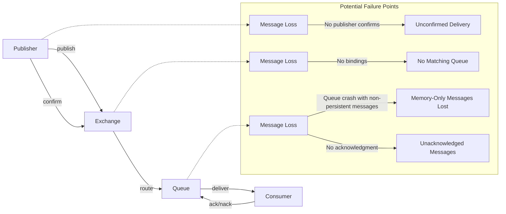

# RabbitMQ Message Loss

## Introduction

Message loss in RabbitMQ is a critical issue that can affect the reliability of your messaging system. While RabbitMQ is designed to be a robust message broker, certain configurations, usage patterns, or failure scenarios can lead to messages being lost. Understanding why and how messages can be lost is essential for developing reliable applications that depend on asynchronous messaging.

In this guide, we'll explore common causes of message loss in RabbitMQ, how to detect when messages are being lost, and strategies to prevent message loss. Whether you're building a simple application or a complex distributed system, these insights will help ensure your messages reach their destination.

## Common Causes of Message Loss

### 1. Unacknowledged Messages

One of the most common causes of message loss is when consumers receive messages but don't acknowledge them properly.

```javascript
// INCORRECT: Message consumption without acknowledgment
channel.consume('my_queue', (msg) => {
  console.log("Received:", msg.content.toString());
  // Missing acknowledgment!
}, { noAck: false });

// CORRECT: Properly acknowledging messages
channel.consume('my_queue', (msg) => {
  console.log("Received:", msg.content.toString());
  try {
    // Process the message
    channel.ack(msg); // Acknowledge after successful processing
  } catch (error) {
    channel.nack(msg); // Negative acknowledgment if processing fails
  }
}, { noAck: false });
```

If a consumer crashes before acknowledging a message, RabbitMQ will requeue the message for delivery to another consumer. However, if you set `noAck: true`, RabbitMQ removes messages from the queue as soon as they're delivered, regardless of whether they were processed successfully.

### 2. Non-Persistent Messages with Queue or Exchange Issues

By default, messages in RabbitMQ are stored in memory. If a queue or the RabbitMQ server itself crashes, non-persistent messages are lost.

```javascript
// Non-persistent message (delivery_mode: 1)
channel.publish('exchange_name', 'routing_key', Buffer.from('Hello World!'), {
  persistent: false // or delivery_mode: 1
});

// Persistent message (delivery_mode: 2)
channel.publish('exchange_name', 'routing_key', Buffer.from('Hello World!'), {
  persistent: true // or delivery_mode: 2
});
```

### 3. Missing Queues or Bindings

Messages can be lost if they're published to an exchange but there are no queues bound to that exchange with matching routing keys.

```javascript
// PROBLEM: Publishing to an exchange without any bound queues
channel.publish('my_exchange', 'routing_key', Buffer.from('This message will be lost!'));

// SOLUTION: Ensure queues are bound before publishing
channel.assertExchange('my_exchange', 'direct', { durable: true });
channel.assertQueue('my_queue', { durable: true });
channel.bindQueue('my_queue', 'my_exchange', 'routing_key');
channel.publish('my_exchange', 'routing_key', Buffer.from('This message will be delivered!'));
```

### 4. Queue Length Limitations

RabbitMQ queues can be configured with length limitations. When a queue reaches its maximum length, RabbitMQ will either:
- Drop messages from the head of the queue (default)
- Reject new messages

```javascript
// Setting a maximum queue length
channel.assertQueue('limited_queue', {
  durable: true,
  maxLength: 1000,
  overflow: 'reject-publish' // 'drop-head' is the default
});
```

### 5. Network Issues

Network partitions or connectivity issues between distributed RabbitMQ nodes can lead to message loss, especially in cluster configurations without proper mirroring.

## Detecting Message Loss

Detecting message loss is essential for maintaining the reliability of your messaging system. Here are several approaches to identify when messages are being lost:

### 1. Message Counting and Auditing

Implement a message counting system that tracks messages at both the publisher and consumer ends.

```javascript
// Publisher side
let publishedCount = 0;

function publishMessage(content) {
  channel.publish('my_exchange', 'routing_key', Buffer.from(content), {
    persistent: true,
    headers: {
      'message_id': uuidv4(),
      'published_at': new Date().toISOString()
    }
  });
  publishedCount++;
  console.log(`Total published: ${publishedCount}`);
}

// Consumer side
let consumedCount = 0;

channel.consume('my_queue', (msg) => {
  consumedCount++;
  console.log(`Total consumed: ${consumedCount}`);
  channel.ack(msg);
}, { noAck: false });
```

### 2. Using RabbitMQ Management Plugin

The RabbitMQ Management plugin provides metrics and monitoring capabilities:

```bash
# Enable the management plugin
rabbitmq-plugins enable rabbitmq_management

# Access the management UI at http://localhost:15672
# Default credentials: guest/guest
```

### 3. Implementing a Dead Letter Exchange

Configure a Dead Letter Exchange (DLX) to capture messages that cannot be delivered:

```javascript
// Setting up a queue with a Dead Letter Exchange
channel.assertExchange('dlx', 'fanout', { durable: true });
channel.assertQueue('dead_letter_queue', { durable: true });
channel.bindQueue('dead_letter_queue', 'dlx', '');

channel.assertQueue('main_queue', {
  durable: true,
  deadLetterExchange: 'dlx',
  deadLetterRoutingKey: ''
});
```

## Preventing Message Loss

Let's explore strategies to prevent message loss in RabbitMQ:

### 1. Publisher Confirms

Enable publisher confirms to verify that messages have been received by the broker:

```javascript
// Enabling publisher confirms
await channel.confirmSelect();

// Publishing with confirmation
channel.publish('my_exchange', 'routing_key', Buffer.from('Important message'), {
  persistent: true
});

// Wait for confirmation
await channel.waitForConfirms();
console.log('Message confirmed by the broker');
```

### 2. Message Persistence

Always use persistent messages for important data:

```javascript
channel.publish('my_exchange', 'routing_key', Buffer.from('Critical data'), {
  persistent: true
});

// For queues, ensure they are durable
channel.assertQueue('important_queue', { durable: true });
```

### 3. Queue Mirroring (Classic Queues)

For RabbitMQ clusters using classic queues, implement queue mirroring:

```javascript
// This is typically done via management UI or rabbitmqctl command
// Example policy (run in terminal):
// rabbitmqctl set_policy ha-all "^" '{"ha-mode":"all"}' --apply-to queues
```

### 4. Quorum Queues

For newer RabbitMQ versions, use quorum queues for enhanced reliability:

```javascript
channel.assertQueue('critical_data_queue', {
  durable: true,
  arguments: {
    'x-queue-type': 'quorum'
  }
});
```

### 5. Proper Consumer Acknowledgments

Implement proper acknowledgment patterns in consumers:

```javascript
channel.consume('my_queue', async (msg) => {
  try {
    // Process the message
    await processMessage(msg.content);
    
    // Acknowledge successful processing
    channel.ack(msg);
  } catch (error) {
    console.error('Processing failed:', error);
    
    // Decide whether to reject and requeue
    // false = don't requeue (send to DLX if configured)
    // true = requeue the message
    channel.nack(msg, false, false);
  }
}, { noAck: false });
```

### 6. Handling Connection Failures

Implement robust connection recovery:

```javascript
const amqp = require('amqplib');

async function connectWithRetry() {
  try {
    const connection = await amqp.connect('amqp://localhost');
    
    connection.on('error', (err) => {
      console.error('Connection error:', err);
      setTimeout(connectWithRetry, 5000);
    });
    
    connection.on('close', () => {
      console.log('Connection closed, attempting to reconnect...');
      setTimeout(connectWithRetry, 5000);
    });
    
    return connection;
  } catch (error) {
    console.error('Failed to connect, retrying in 5 seconds...');
    setTimeout(connectWithRetry, 5000);
  }
}
```

## Message Flow Visualization

Let's visualize the flow of messages in RabbitMQ and potential points of failure:



## Real-World Scenario: Mission-Critical Order Processing

Let's examine a practical example of implementing a reliable messaging system for an e-commerce order processing application:

```javascript
// Order Processing System with Reliability Features

const amqp = require('amqplib');

async function setupOrderProcessing() {
  // Establish connection with retry mechanism
  const connection = await connectWithRetry();
  const channel = await connection.createChannel();
  
  // Enable publisher confirms
  await channel.confirmSelect();
  
  // Setup exchanges and queues with durability
  await channel.assertExchange('orders', 'direct', { durable: true });
  
  // Main order queue with dead-letter configuration
  await channel.assertExchange('orders.dlx', 'fanout', { durable: true });
  await channel.assertQueue('orders.dead-letter', { durable: true });
  await channel.bindQueue('orders.dead-letter', 'orders.dlx', '');
  
  await channel.assertQueue('orders.processing', {
    durable: true,
    arguments: {
      'x-dead-letter-exchange': 'orders.dlx',
      'x-message-ttl': 3600000, // 1 hour TTL
      'x-queue-type': 'quorum' // Using quorum queue for reliability
    }
  });
  
  await channel.bindQueue('orders.processing', 'orders', 'new');
  
  // Publisher function
  async function publishOrder(order) {
    const content = Buffer.from(JSON.stringify(order));
    
    try {
      channel.publish('orders', 'new', content, {
        persistent: true,
        contentType: 'application/json',
        messageId: order.id,
        timestamp: Date.now()
      });
      
      // Wait for broker confirmation
      await channel.waitForConfirms();
      console.log(`Order ${order.id} confirmed by broker`);
      return true;
    } catch (error) {
      console.error(`Failed to publish order ${order.id}:`, error);
      return false;
    }
  }
  
  // Consumer function
  function startOrderProcessor() {
    channel.prefetch(1); // Process one message at a time
    
    channel.consume('orders.processing', async (msg) => {
      if (!msg) return;
      
      try {
        const order = JSON.parse(msg.content.toString());
        console.log(`Processing order ${order.id}`);
        
        // Simulate order processing
        await processOrder(order);
        
        // Acknowledge successful processing
        channel.ack(msg);
        console.log(`Order ${order.id} processed successfully`);
      } catch (error) {
        console.error('Order processing failed:', error);
        
        // Check retry count in headers
        const retryCount = (msg.properties.headers?.retryCount || 0) + 1;
        
        if (retryCount <= 3) {
          // Requeue with incremented retry count
          channel.publish('orders', 'new', msg.content, {
            ...msg.properties,
            headers: {
              ...msg.properties.headers,
              retryCount,
              lastError: error.message
            }
          });
          channel.ack(msg); // Ack original message
          console.log(`Order requeued (attempt ${retryCount})`);
        } else {
          // Max retries reached, send to dead letter queue
          console.log(`Max retries reached for order, sending to DLX`);
          channel.nack(msg, false, false);
        }
      }
    }, { noAck: false });
  }
  
  return {
    publishOrder,
    startOrderProcessor
  };
}

// Simulate order processing
async function processOrder(order) {
  // Actual implementation would process the order
  return new Promise((resolve, reject) => {
    // Simulate occasional failures
    if (Math.random() < 0.1) {
      reject(new Error('Random processing error'));
    } else {
      setTimeout(resolve, 500); // Simulate processing time
    }
  });
}
```

## Summary

Message loss in RabbitMQ can occur due to various factors, but with proper configuration and programming practices, it can be prevented. The key strategies to ensure message durability include:

1. **Use publisher confirms** to verify message acceptance by the broker
2. **Enable message persistence** for important data
3. **Configure proper queue durability** with mirroring or quorum queues
4. **Implement robust consumer acknowledgment** patterns
5. **Set up dead-letter exchanges** to capture failed messages
6. **Monitor your system** to detect and diagnose message loss

Remember that different applications have different reliability requirements. For mission-critical systems, you may need to implement multiple layers of safeguards, while simpler applications might only require basic persistence configurations.

## Additional Resources

- [RabbitMQ Reliability Guide](https://www.rabbitmq.com/reliability.html)
- [Publisher Confirms Documentation](https://www.rabbitmq.com/confirms.html)
- [RabbitMQ Quorum Queues](https://www.rabbitmq.com/quorum-queues.html)
- [Clustering and High Availability](https://www.rabbitmq.com/clustering.html)

## Exercises

1. **Basic Message Durability**: Configure a publisher and consumer with persistent messages and proper acknowledgments.
2. **Dead Letter Exchange**: Implement a system that uses a dead letter exchange to capture and analyze failed messages.
3. **Publisher Confirms**: Create a reliable publisher that uses confirms and implements retry logic for unconfirmed messages.
4. **High Availability Setup**: Design a RabbitMQ cluster configuration with quorum queues for a mission-critical application.
5. **Message Audit System**: Implement a message tracking system that can detect and report on message loss between publishers and consumers.