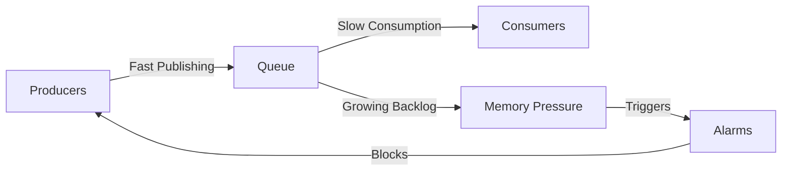

# RabbitMQ Performance Problems

## Introduction

RabbitMQ is a popular open-source message broker that implements the Advanced Message Queuing Protocol (AMQP). While RabbitMQ is designed to be robust and scalable, you may encounter performance issues as your application grows or under certain workloads. This guide will help you identify common performance bottlenecks, understand their causes, and implement effective solutions.

Performance problems in RabbitMQ can manifest in various ways, including high latency, reduced throughput, increased memory usage, or even complete service unavailability. Understanding these issues is crucial for maintaining a healthy messaging infrastructure.

## Common Performance Issues and Solutions

### 1. Memory High Watermark Reached

#### Problem

When RabbitMQ consumes too much memory, it triggers the memory high watermark alarm, which blocks publishers to prevent system crashes.

#### Symptoms
- Publishers become blocked
- Log entries showing `memory resource limit alarm` 
- Slow message delivery
- Management UI showing memory warnings

#### Diagnosis

```bash
# Check memory alarm status
rabbitmqctl status | grep memory

# Check memory usage of queues
rabbitmqctl list_queues name memory
```

#### Solution

```javascript
// Example: Setting memory threshold in rabbitmq.conf
vm_memory_high_watermark.relative = 0.6  // Set to 60% of system memory
```

Alternatively, you can set an absolute value:

```javascript
// Setting an absolute memory limit (in bytes)
vm_memory_high_watermark.absolute = 2GB
```

Additional steps to address memory issues:

1. Implement message TTL (Time To Live) to automatically remove stale messages:

```javascript
// In your channel configuration
channel.assertQueue('myQueue', {
  arguments: {
    'x-message-ttl': 86400000  // 24 hours in milliseconds
  }
});
```

2. Set max queue length to prevent unbounded growth:

```javascript
// Setting max length for a queue
channel.assertQueue('myQueue', {
  arguments: {
    'x-max-length': 10000,
    'x-overflow': 'reject-publish'  // Options: 'drop-head' or 'reject-publish'
  }
});
```

### 2. CPU Saturation

#### Problem

High CPU usage can severely impact RabbitMQ's performance, leading to message processing delays.

#### Symptoms
- High CPU usage (consistently above 80%)
- Slow response times for all operations
- Management UI becomes sluggish

#### Diagnosis

```bash
# Check CPU usage
top -p $(pgrep -d',' beam.smp)

# Get statistics about Erlang processes
rabbitmqctl eval 'recon:proc_count(reductions, 10).'
```

#### Solution

1. Scale horizontally by creating a RabbitMQ cluster:

```bash
# On secondary node, join the cluster
rabbitmqctl stop_app
rabbitmqctl join_cluster rabbit@primary-node-hostname
rabbitmqctl start_app
```

2. Enable queue mirroring for high availability:

```bash
# Create a policy for mirroring
rabbitmqctl set_policy ha-all ".*" '{"ha-mode":"all"}' --apply-to queues
```

3. Configure proper thread pool sizes in `rabbitmq.conf`:

```javascript
// Example thread pool configuration
cpu_threshold_calculation_interval = 5000  // milliseconds
credit_flow_default_credit.producer = 200
credit_flow_default_credit.consumer = 400
```

### 3. Slow Consumers

#### Problem

Slow consumers can cause message backlogs, leading to memory pressure and potential system instability.

#### Symptoms
- Growing queue lengths
- Increasing memory usage
- Slow message processing rate

#### Diagnosis

```bash
# Check consumer utilization
rabbitmqctl list_queues name messages consumers consumer_utilisation

# Identify queues with large backlogs
rabbitmqctl list_queues name messages message_bytes
```

<br />

Let's visualize the impact of a slow consumer:



#### Solution

1. Implement consumer prefetch limits to control workload:

```javascript
// Node.js example setting prefetch count
channel.prefetch(10);  // Only handle 10 unacknowledged messages at a time
```

2. Use dedicated queues for slow operations:

```javascript
// Producer code - route slow operations to a dedicated queue
channel.assertExchange('tasks', 'direct');
channel.publish('tasks', 'slow-operations', Buffer.from(message));
```

3. Implement a dead letter exchange for failed messages:

```javascript
// Setting up a queue with dead letter configuration
channel.assertQueue('main-queue', {
  arguments: {
    'x-dead-letter-exchange': 'dlx',
    'x-dead-letter-routing-key': 'failed-messages'
  }
});

channel.assertExchange('dlx', 'direct');
channel.assertQueue('failed-messages');
channel.bindQueue('failed-messages', 'dlx', 'failed-messages');
```

### 4. Disk Alarm

#### Problem

When disk space becomes limited, RabbitMQ triggers disk alarms that block publishers.

#### Symptoms
- Publishers become blocked
- Log entries showing `disk resource limit alarm`
- New messages cannot be published

#### Diagnosis

```bash
# Check disk alarm status
rabbitmqctl status | grep disk

# List disk space used by queues
rabbitmqctl list_queues name message_bytes message_bytes_persistent
```

#### Solution

1. Configure disk free limit in `rabbitmq.conf`:

```javascript
// Set minimum free disk space (either relative or absolute)
disk_free_limit.relative = 2.0  // 2x the size of RAM
// OR
disk_free_limit.absolute = 5GB  // 5 gigabytes minimum
```

2. Move message store to a larger disk:

```bash
// In rabbitmq.conf
mnesia_base = /path/to/larger/disk/rabbitmq/mnesia
```

3. Implement message expiration for queues:

```javascript
// Setting message TTL for a queue
channel.assertQueue('myQueue', {
  arguments: {
    'x-message-ttl': 259200000  // 3 days in milliseconds
  }
});
```

### 5. Network Partition

#### Problem

Network partitions in clustered environments can lead to split-brain situations and data inconsistencies.

#### Symptoms
- Inconsistent cluster state
- Nodes marked as down but actually running
- Log entries mentioning `net_tick_timeout` or partition

#### Diagnosis

```bash
# Check for network partitions
rabbitmqctl cluster_status

# View logs for network partition messages
grep "network partition" /var/log/rabbitmq/rabbit@hostname.log
```

#### Solution

1. Configure partition handling strategy in `rabbitmq.conf`:

```javascript
// Configure partition handling mode
cluster_partition_handling = pause_minority  // Options: ignore, pause_minority, autoheal
```

2. Improve network reliability and implement proper monitoring:

```bash
// Set appropriate net tick timeout (in milliseconds)
net_ticktime = 60  // Default is 60 seconds
```

3. Use appropriate partition handling based on your requirements:

```bash
// Example cluster configuration with partition handling
cluster_formation.peer_discovery_backend = rabbit_peer_discovery_classic_config
cluster_formation.classic_config.nodes.1 = rabbit@node1
cluster_formation.classic_config.nodes.2 = rabbit@node2
cluster_formation.classic_config.nodes.3 = rabbit@node3
cluster_partition_handling = pause_minority
```

## Performance Monitoring Tools

Setting up proper monitoring is essential for identifying and addressing performance issues before they become critical:

### 1. RabbitMQ Management Plugin

The built-in management plugin provides a web UI and HTTP API for monitoring:

```bash
# Enable management plugin
rabbitmq-plugins enable rabbitmq_management

# Access the management UI at http://your-server:15672/
```

### 2. Prometheus and Grafana Integration

For more advanced monitoring:

```bash
# Enable Prometheus plugin
rabbitmq-plugins enable rabbitmq_prometheus

# Metrics endpoint available at http://your-server:15692/metrics
```

Example Prometheus configuration:

```yaml
# prometheus.yml
scrape_configs:
  - job_name: rabbitmq
    static_configs:
      - targets: ['rabbitmq:15692']
```

### 3. Performance Testing with PerfTest

RabbitMQ's PerfTest tool can help simulate load and identify bottlenecks:

```bash
# Simple producer test (10 publishers, 50-byte messages, for 60 seconds)
bin/runjava com.rabbitmq.perf.PerfTest -x 10 -y 0 -z 60 -s 50

# Producer and consumer test (5 publishers, 5 consumers, persistent messages)
bin/runjava com.rabbitmq.perf.PerfTest -x 5 -y 5 --persistent
```

## Performance Tuning Checklist

Use this checklist to systematically address performance issues:

1. **Memory Management**
   - Set appropriate memory watermark
   - Implement message TTL
   - Configure queue length limits

2. **CPU Optimization**
   - Monitor CPU usage
   - Scale horizontally when necessary
   - Optimize consumer count

3. **Queue Management**
   - Avoid excessive queues (keep under 10,000 if possible)
   - Use lazy queues for low-priority messages
   - Set appropriate prefetch values

4. **Disk I/O**
   - Monitor disk space
   - Set realistic disk free limits
   - Use SSD for message store when possible

5. **Network Configuration**
   - Use adequate bandwidth
   - Implement proper partition handling
   - Configure appropriate timeouts

## Real-World Example: E-Commerce Order Processing

Let's examine a practical example of optimizing a RabbitMQ setup for an e-commerce order processing system:

### Initial Setup (with performance issues)

```javascript
// Producer code - sending all order types to a single queue
channel.assertQueue('orders');
channel.sendToQueue('orders', Buffer.from(JSON.stringify(order)));

// Consumer code - processing all orders sequentially
channel.consume('orders', async (msg) => {
  const order = JSON.parse(msg.content.toString());
  await processOrder(order);  // Slow operation for some order types
  channel.ack(msg);
});
```

### Optimized Setup

```javascript
// Producer code - using exchanges and routing keys
channel.assertExchange('orders', 'direct');

// Route different order types to different queues
const routingKey = order.priority === 'high' ? 'high-priority' : 
                  (order.type === 'international' ? 'international' : 'standard');
channel.publish('orders', routingKey, Buffer.from(JSON.stringify(order)));

// Consumer code - with appropriate prefetch values
channel.prefetch(order.type === 'international' ? 5 : 20);
channel.consume(queueName, async (msg) => {
  const order = JSON.parse(msg.content.toString());
  try {
    await processOrder(order);
    channel.ack(msg);
  } catch (error) {
    // Nack with requeue=false sends to dead letter exchange
    channel.nack(msg, false, false);
  }
});
```

## Summary

RabbitMQ performance issues can stem from various sources including memory pressure, CPU saturation, slow consumers, disk limitations, or network partitions. By implementing proper monitoring, thoughtful queue design, and appropriate configuration settings, you can maintain a high-performing messaging system even under heavy loads.

Remember these key points:

1. Monitor your RabbitMQ instance proactively
2. Configure appropriate resource limits
3. Design your queues and exchanges with performance in mind
4. Implement proper consumer patterns including prefetch limits
5. Plan for scalability from the beginning

## Additional Resources

- [RabbitMQ Official Performance Documentation](https://www.rabbitmq.com/performance.html)
- [RabbitMQ PerfTest Tool](https://github.com/rabbitmq/rabbitmq-perf-test)
- [Production Checklist](https://www.rabbitmq.com/production-checklist.html)

## Practice Exercises

1. Set up a RabbitMQ instance with the management plugin and monitor performance metrics.
2. Create a test environment that simulates slow consumers and implement solutions to address the resulting backlog.
3. Configure appropriate memory and disk alarm thresholds for your specific environment.
4. Implement a dead letter exchange pattern for handling failed message processing.
5. Design a queue architecture that separates fast and slow operations to optimize overall throughput.