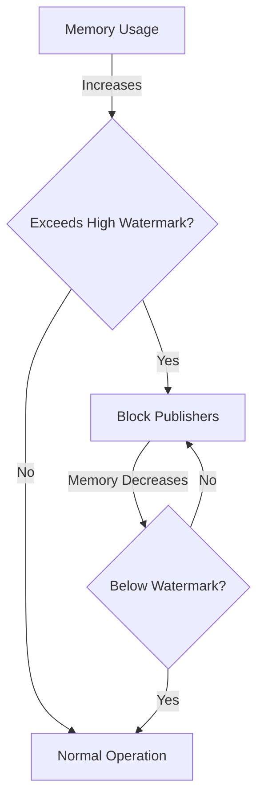

# RabbitMQ Memory Issues

## Introduction

RabbitMQ is a popular open-source message broker that implements the Advanced Message Queuing Protocol (AMQP). While RabbitMQ is designed to be robust and efficient, it can experience memory-related issues in production environments, especially under heavy loads or with improper configurations. 

In this guide, we'll explore common RabbitMQ memory issues, how to identify them, and most importantly, how to resolve them. Understanding these concepts is essential for maintaining a healthy RabbitMQ deployment and ensuring your messaging infrastructure remains reliable.

## Understanding RabbitMQ Memory Management

Before diving into troubleshooting, it's important to understand how RabbitMQ handles memory.

### Memory Watermark Mechanism

RabbitMQ uses a watermark-based approach to manage memory:

1. **High Memory Watermark**: When RabbitMQ's memory usage exceeds this threshold (default: 40% of system memory), it will block connections that publish messages.
2. **Internal Alarm**: When triggered, publishing is blocked until memory usage drops below the watermark.



## Common Memory Issues and Solutions

### 1. High Memory Usage

**Symptoms:**
- RabbitMQ console shows high memory utilization
- Publisher connections become blocked
- Server performance degrades

**Causes:**
- Too many unacknowledged messages
- Large message payloads
- Queue buildup due to slow consumers

**Solutions:**

#### Adjust the Memory Watermark

```bash
# View current memory threshold
rabbitmqctl status | grep memory

# Set memory threshold to 30% of system RAM
rabbitmqctl set_vm_memory_high_watermark 0.3
```

For persistence across restarts, add to your configuration file:

```erlang
# rabbitmq.conf
vm_memory_high_watermark.relative = 0.3
```

#### Enable Lazy Queues

Lazy queues store messages on disk more aggressively, reducing memory pressure:

```bash
# Set a specific queue to lazy mode
rabbitmqctl set_policy lazy-queue "^my-queue$" '{"queue-mode":"lazy"}' --apply-to queues
```

For all queues:

```bash
rabbitmqctl set_policy lazy-queues ".*" '{"queue-mode":"lazy"}' --apply-to queues
```

### 2. Memory Leaks

**Symptoms:**
- Memory usage continuously increases despite stable workload
- Restarting temporarily resolves the issue

**Causes:**
- Plugins with memory leaks
- Old RabbitMQ versions with known memory issues
- Erlang VM issues

**Solutions:**

#### Update RabbitMQ and Erlang

```bash
# Check current versions
rabbitmqctl status | grep rabbit
rabbitmqctl status | grep erlang

# Update using your package manager
# Example for Ubuntu/Debian
sudo apt-get update
sudo apt-get upgrade rabbitmq-server
```

#### Disable Problematic Plugins

```bash
# List enabled plugins
rabbitmq-plugins list --enabled

# Disable a plugin
rabbitmq-plugins disable rabbitmq_plugin_name
```

### 3. Unacknowledged Messages Building Up

**Symptoms:**
- Memory usage increases over time
- Queue length stays constant while unacknowledged message count grows

**Solutions:**

#### Implement Proper Acknowledgments

Client code should properly acknowledge messages:

```javascript
// Node.js example
channel.consume(queue, function(msg) {
  // Process message
  console.log("Received message:", msg.content.toString());
  
  // Acknowledge message
  channel.ack(msg);
}, {
  // Configure consumer
  noAck: false
});
```

```python
# Python example
def callback(ch, method, properties, body):
    print(f"Received message: {body}")
    # Process message
    
    # Acknowledge message
    ch.basic_ack(delivery_tag=method.delivery_tag)

channel.basic_consume(
    queue='my_queue',
    on_message_callback=callback,
    auto_ack=False  # Important: set to False to handle acknowledgments manually
)
```

#### Set TTL for Unacknowledged Messages

```bash
# Set policy for messages to expire after 24 hours if unacknowledged
rabbitmqctl set_policy TTL ".*" '{"message-ttl":86400000}' --apply-to queues
```

### 4. Memory Fragmentation

**Symptoms:**
- Process memory usage is higher than the sum of queue contents
- Performance degradation over time

**Solutions:**

#### Restart RabbitMQ Nodes Periodically

```bash
# Safe restart
rabbitmqctl stop_app
rabbitmqctl start_app
```

For production, implement this during maintenance windows or use rolling restarts in a cluster.

#### Enable Memory Deallocation in Erlang VM

Add to your rabbitmq.conf:

```
# Enable fullsweep after 1000 GC operations
+MFa 1000
```

## Monitoring Memory Usage

Effective monitoring is essential for early detection of memory issues.

### Command Line Monitoring

```bash
# Check memory details
rabbitmqctl status

# Monitor memory usage of specific queues
rabbitmqctl list_queues name memory

# Monitor connections and channels
rabbitmqctl list_connections name channels memory
rabbitmqctl list_channels number memory
```

### Enable Management Plugin

The management plugin provides a web UI for monitoring:

```bash
rabbitmq-plugins enable rabbitmq_management
```

Then access the dashboard at http://localhost:15672 (default credentials: guest/guest).

### Integrate with Monitoring Tools

For production environments, integrate with monitoring solutions:

```bash
# Install Prometheus plugin
rabbitmq-plugins enable rabbitmq_prometheus

# Configure in prometheus.yml
scrape_configs:
  - job_name: rabbitmq
    static_configs:
      - targets: ['localhost:15692']
```

## Real-World Example: Diagnosing and Fixing Memory Issues

Let's walk through a common scenario and its resolution.

### Scenario: High Memory Usage with Many Queues

You notice your RabbitMQ server using 80% of system memory with thousands of queues.

### Diagnosis Steps:

1. Check queue metrics:

```bash
rabbitmqctl list_queues name messages consumers memory | sort -nk4
```

2. Identify problematic queues:

```bash
# Example output:
# order_processing  45673  1  528246234  # Large memory usage
# notification_queue  12  1  24502  # Normal memory usage
```

3. Check message rates:

```bash
rabbitmqctl list_queues name messages message_stats.publish_details.rate message_stats.deliver_details.rate
```

### Solution Implementation:

1. Convert high-memory queues to lazy mode:

```bash
rabbitmqctl set_policy lazy-large-queues "^order_processing$" '{"queue-mode":"lazy"}' --apply-to queues
```

2. Add more consumers to process messages faster:

```javascript
// Increase consumer count from 1 to 4
for (let i = 0; i < 4; i++) {
  channel.consume('order_processing', processOrder, { noAck: false });
}
```

3. Implement back pressure on publishers:

```javascript
// Add flow control to publisher
async function publishWithBackpressure(channel, queue, messages) {
  const MAX_UNCONFIRMED = 100;
  let unconfirmed = 0;
  
  // Set confirmation mode
  await channel.confirmSelect();
  
  for (const msg of messages) {
    if (unconfirmed >= MAX_UNCONFIRMED) {
      // Wait for confirmations before continuing
      await new Promise(resolve => channel.once('ack', resolve));
      unconfirmed--;
    }
    
    channel.publish('', queue, Buffer.from(msg));
    unconfirmed++;
  }
  
  // Wait for all remaining confirmations
  await channel.waitForConfirms();
}
```

## Best Practices for Preventing Memory Issues

1. **Size Your Deployment Properly**
   - Estimate memory needs based on message size × expected queue depth
   - Add 50% overhead for Erlang VM and RabbitMQ operations

2. **Set Appropriate Policies**
   - Use message TTL to prevent queue buildup
   - Implement dead letter exchanges for failed messages
   - Consider lazy queues for large backlogs

```bash
# Example policy setting TTL and dead-letter configuration
rabbitmqctl set_policy expiry ".*" \
  '{"message-ttl":3600000, "dead-letter-exchange":"dlx"}' \
  --apply-to queues
```

3. **Implement Flow Control**
   - Use publisher confirms
   - Implement consumer prefetch limits
   
```python
# Python example setting prefetch to 100 messages
channel.basic_qos(prefetch_count=100)
```

4. **Regular Monitoring**
   - Set up alerting for memory thresholds (e.g., 80% of watermark)
   - Monitor message rates and queue depths

## Summary

Memory issues in RabbitMQ are common but manageable with proper understanding and tools. By monitoring your system, implementing proper client-side practices, and configuring RabbitMQ correctly, you can maintain a healthy messaging infrastructure.

Remember these key points:
- Set appropriate memory watermarks
- Consider lazy queues for large message backlogs
- Always implement proper acknowledgment handling
- Monitor memory usage proactively
- Use message TTLs and dead-letter exchanges

## Additional Resources

- [RabbitMQ Memory Documentation](https://www.rabbitmq.com/memory.html)
- [RabbitMQ Monitoring Documentation](https://www.rabbitmq.com/monitoring.html)
- [RabbitMQ Production Checklist](https://www.rabbitmq.com/production-checklist.html)

## Exercises

1. Set up a RabbitMQ instance and configure custom memory watermarks.
2. Create a producer that publishes messages faster than a consumer can process them, and observe memory behavior.
3. Implement lazy queues and compare memory usage with standard queues using the same workload.
4. Write a monitoring script that alerts you when RabbitMQ memory exceeds 75% of the high watermark.
5. Practice implementing back pressure in a publisher using confirmation mode.