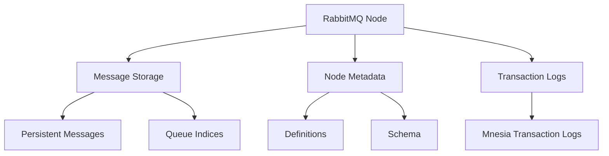

# RabbitMQ Disk Issues

## Introduction

RabbitMQ is a popular open-source message broker that enables applications to communicate with each other by passing messages. Like any system that deals with data persistence, RabbitMQ relies heavily on disk operations. When these disk operations don't function as expected, your messaging system can experience degraded performance or even complete failure.

In this guide, we'll explore common RabbitMQ disk issues, understand how RabbitMQ uses disk space, and learn how to troubleshoot and resolve these problems effectively.

## How RabbitMQ Uses Disk Space

Before diving into specific issues, it's important to understand how RabbitMQ uses disk resources:



RabbitMQ primarily uses disk space for:

1. **Message Storage** - Persistent messages are written to disk
2. **Queue Indices** - Metadata about messages in queues
3. **Mnesia Database** - Stores definitions of exchanges, queues, bindings, users, etc.
4. **Log Files** - Various logs including error logs and sasl logs

## Common Disk-Related Issues

### 1. Disk Space Alarm

One of the most common disk issues in RabbitMQ is triggering the disk space alarm.

#### What happens:

When free disk space drops below a configurable threshold (default is 50MB), RabbitMQ will:

1. Block all connections that publish messages
2. Log warnings about low disk space
3. Prevent new messages from being accepted

You'll typically see a log entry like this:

```
2023-09-15 14:32:10.123 [warning] <0.345.0> Disk free space fell below threshold. Free bytes: 45678123. Alarm set.
```

#### How to check:

You can verify if the disk alarm is in effect using the RabbitMQ management UI or with the command line:

```bash
rabbitmqctl status | grep disk_free_alarm
```

Or using the HTTP API:

```bash
curl -s -u guest:guest http://localhost:15672/api/nodes | jq '.[0].disk_free_alarm'
```

### 2. Insufficient Disk Space for Node Operation

RabbitMQ requires adequate disk space to function properly. When disk space is critically low, the node may crash or fail to start.

#### Common symptoms:

- Node repeatedly crashes
- Error messages about disk space in logs
- Inability to publish or consume messages

#### Example error in logs:

```
2023-09-15 15:45:20.321 [error] <0.103.0> Error when reading /var/lib/rabbitmq/mnesia/rabbit@host-name/msg_stores/vhosts/628WB79CIFDYO9LJI6DKMI09L/msg_store_persistent/0.rdq: enospc
```

### 3. Disk I/O Bottlenecks

Even with sufficient space, poor disk I/O performance can significantly impact RabbitMQ's operation.

#### Signs of disk I/O problems:

- High message publish latency
- Slow queue operations
- Increasing memory usage as messages wait to be written to disk

## Troubleshooting RabbitMQ Disk Issues

### Step 1: Check Current Disk Space Usage

First, let's check how much disk space is available on the system:

```bash
df -h
```

For the specific directory where RabbitMQ stores its data:

```bash
df -h /var/lib/rabbitmq
```

### Step 2: Identify What's Using Disk Space

To understand what's consuming disk space in RabbitMQ's directory:

```bash
du -sh /var/lib/rabbitmq/*
```

This will show you the size of different components, particularly the `mnesia` directory where most data is stored.

### Step 3: Check RabbitMQ's Disk Alarm Status

```bash
rabbitmqctl status | grep disk
```

This will show both the free disk space threshold and current free space.

### Step 4: Monitor Disk I/O Performance

You can use tools like `iostat` to check disk performance:

```bash
iostat -xd 1
```

Look for high `%util` values which indicate the disk is being heavily utilized.

## Resolving RabbitMQ Disk Issues

### 1. Adjusting Disk Free Space Threshold

If the default threshold (50MB) is too conservative for your environment, you can adjust it:

```bash
rabbitmqctl set_vm_memory_high_watermark absolute 100MB
```

In your configuration file (`rabbitmq.conf`):

```
disk_free_limit.absolute = 100MB
```

You can also set it as a relative value:

```
disk_free_limit.relative = 1.0
```

This sets the limit to 100% of RAM, meaning RabbitMQ will trigger the alarm when free disk space falls below the total RAM size.

### 2. Freeing Up Disk Space

#### a. Delete Unnecessary Messages

If you have queues with messages that are no longer needed, you can purge them:

```bash
rabbitmqctl purge_queue queue_name
```

Be careful! This will delete all messages in the queue.

#### b. Delete Unused Queues

```bash
rabbitmqctl delete_queue unused_queue_name
```

#### c. Compact Mnesia Database

```bash
rabbitmqctl force_gc
```

### 3. Improving Disk I/O Performance

#### a. Use Faster Storage

Consider using SSDs instead of HDDs for RabbitMQ data directories.

#### b. Separate RabbitMQ Data from System Volume

Move the RabbitMQ data directory to a dedicated disk:

1. Stop RabbitMQ:

```bash
systemctl stop rabbitmq-server
```

2. Copy data to new location:

```bash
cp -a /var/lib/rabbitmq /path/to/new/location
```

3. Update the `RABBITMQ_MNESIA_BASE` environment variable:

Create or edit `/etc/rabbitmq/rabbitmq-env.conf`:

```
RABBITMQ_MNESIA_BASE=/path/to/new/location/rabbitmq/mnesia
```

4. Restart RabbitMQ:

```bash
systemctl start rabbitmq-server
```

## Practical Example: Monitoring and Addressing Disk Issues

Let's create a simple shell script that monitors RabbitMQ disk usage and sends alerts when space gets low:

```bash
#!/bin/bash
# monitor_rabbitmq_disk.sh

# Configuration
THRESHOLD_PERCENT=80
EMAIL="admin@example.com"
RABBITMQ_DATA_DIR="/var/lib/rabbitmq"

# Get current disk usage percentage
DISK_USAGE=$(df $RABBITMQ_DATA_DIR | tail -n 1 | awk '{print $5}' | sed 's/%//')

# Check if usage exceeds threshold
if [ $DISK_USAGE -gt $THRESHOLD_PERCENT ]; then
  # Get RabbitMQ queue statistics
  QUEUE_STATS=$(rabbitmqctl list_queues name messages --no-table-headers)
  
  # Compose email
  EMAIL_BODY="WARNING: RabbitMQ disk usage is at ${DISK_USAGE}%

Queue Statistics:
${QUEUE_STATS}"
  
  # Send notification
  echo -e "$EMAIL_BODY" | mail -s "RabbitMQ Disk Space Alert" $EMAIL
  
  echo "Disk space alert sent. Current usage: ${DISK_USAGE}%"
else
  echo "Disk space OK. Current usage: ${DISK_USAGE}%"
fi
```

You can run this script periodically using cron:

```bash
# Run every hour
0 * * * * /path/to/monitor_rabbitmq_disk.sh >> /var/log/rabbitmq_monitor.log 2>&1
```

## Preventive Measures

To avoid disk issues with RabbitMQ, consider implementing these best practices:

1. **Set Message TTL (Time-To-Live)** - This automatically removes old messages:

```javascript
// Example in Node.js with amqplib
channel.assertQueue('my_queue', {
  arguments: {
    'x-message-ttl': 86400000 // 24 hours in milliseconds
  }
});
```

2. **Implement Queue Length Limits**:

```javascript
// Example in Node.js with amqplib
channel.assertQueue('my_queue', {
  arguments: {
    'x-max-length': 10000, // Maximum number of messages
    'x-overflow': 'reject-publish' // Reject new messages when full
  }
});
```

3. **Regular Monitoring** - Set up monitoring tools like Prometheus and Grafana to track disk usage trends.

4. **Automatic Cleanup Policies** - Use RabbitMQ's queue expiry feature:

```javascript
// Example in Node.js with amqplib
channel.assertQueue('temporary_queue', {
  arguments: {
    'x-expires': 3600000 // Queue will be deleted after 1 hour of inactivity
  }
});
```

## Summary

RabbitMQ disk issues can significantly impact your messaging system's reliability and performance. By understanding how RabbitMQ uses disk space and implementing proper monitoring and preventive measures, you can ensure your message broker operates smoothly.

Key takeaways:

- RabbitMQ uses disk space for persistent messages, queue indices, and internal databases
- The disk alarm mechanism prevents the system from running out of space
- Regular monitoring and proper configuration can prevent most disk-related problems
- Consider storage performance, not just capacity, when planning your RabbitMQ deployment

## Further Resources

- [RabbitMQ Documentation on Disk Alarms](https://www.rabbitmq.com/disk-alarms.html)
- [RabbitMQ Production Checklist](https://www.rabbitmq.com/production-checklist.html)
- [RabbitMQ Monitoring Guide](https://www.rabbitmq.com/monitoring.html)

## Exercises

1. Set up a test RabbitMQ instance and experiment with different disk_free_limit settings to see how they affect behavior.
2. Create a script that publishes many large persistent messages until disk alarm triggers, then observe the system's behavior.
3. Implement a monitoring solution using Prometheus and Grafana to track RabbitMQ disk usage.
4. Configure message TTL and queue length limits on a test queue and verify they prevent unbounded disk growth.