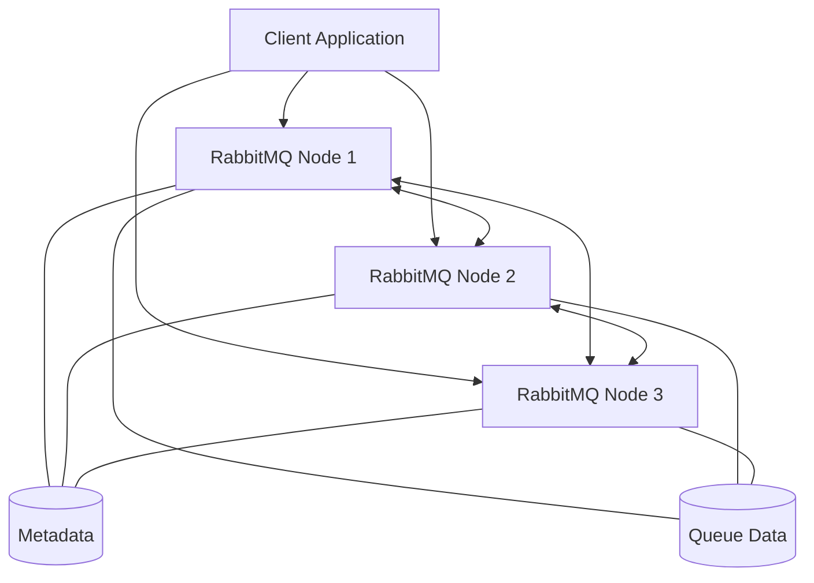
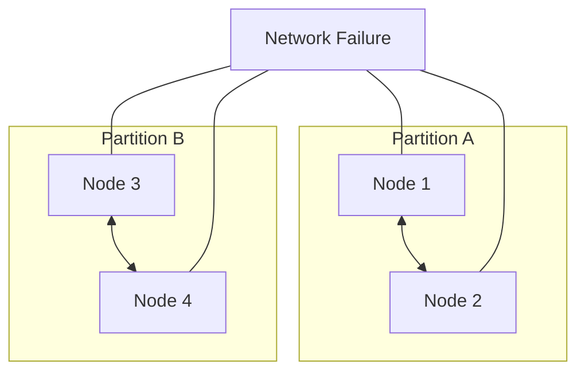

# RabbitMQ Cluster Failures

## Introduction

RabbitMQ clustering is a powerful feature that enables high availability, improved throughput, and better scalability for your messaging infrastructure. However, like any distributed system, RabbitMQ clusters can experience failures that may disrupt your applications. Understanding common failure scenarios, their causes, and how to resolve them is essential for maintaining a reliable messaging system.

In this guide, we'll explore different types of RabbitMQ cluster failures, how to diagnose them, and strategies to recover from and prevent these issues in the future.

## Understanding RabbitMQ Clusters

Before diving into failure scenarios, let's briefly review how RabbitMQ clusters work:



In a RabbitMQ cluster:
- **Nodes** share metadata about exchanges, queues, bindings, users, and permissions
- **Queue data** can be mirrored across multiple nodes (with classic queues) or distributed with quorum queues
- Clients can connect to any node in the cluster
- Nodes communicate with each other via Erlang's distribution protocol

## Common Cluster Failure Scenarios

### 1. Network Partitions (Split Brain)

One of the most critical failures in RabbitMQ clusters is a network partition, also known as a "split brain" scenario.

#### What is a Network Partition?

A network partition occurs when nodes in a cluster can't communicate with each other due to network issues, but both sides remain operational. This creates two separate "mini-clusters" that both believe they're functioning correctly.



#### Symptoms
- Warning logs containing phrases like `mnesia_unexpectedly_running` or `rabbit on node rabbit@hostname down`
- The `rabbitmqctl cluster_status` command shows different views of the cluster from different nodes
- Inconsistent queue and exchange states across nodes

#### Diagnosing Network Partitions

Run the following command on any node to check for partitions:

```bash
rabbitmqctl cluster_status
```

If a partition exists, you'll see output containing something like:

```
Cluster status of node rabbit@node1
[{nodes,[{disc,[rabbit@node1,rabbit@node2,rabbit@node3,rabbit@node4]}]},
 {running_nodes,[rabbit@node1,rabbit@node2]},
 {partitions,[{rabbit@node3,[rabbit@node1,rabbit@node2]},
              {rabbit@node4,[rabbit@node1,rabbit@node2]}]}]
```

#### Resolving Network Partitions

1. **Restart the entire cluster** (safest but causes downtime):

```bash
# On each node
rabbitmqctl stop_app
rabbitmqctl start_app
```

2. **Restart nodes in a specific partition**:

```bash
# On nodes in the partition to be restarted
rabbitmqctl stop_app
rabbitmqctl start_app
```

### 2. Node Failures

Individual nodes in a RabbitMQ cluster can fail due to various reasons such as hardware issues, out-of-memory conditions, or software crashes.

#### Symptoms
- Connection errors when clients try to connect to the failed node
- Missing queues if they were only hosted on the failed node
- Log entries indicating Erlang process crashes

#### Diagnosing Node Failures

Check the status of all nodes in your cluster:

```bash
rabbitmqctl cluster_status
```

Verify RabbitMQ service status:

```bash
systemctl status rabbitmq-server  # For systemd-based systems
service rabbitmq-server status    # For init.d-based systems
```

Examine RabbitMQ logs for error messages:

```bash
tail -f /var/log/rabbitmq/rabbit@hostname.log
```

#### Resolving Node Failures

1. **Restart the failed node**:

```bash
rabbitmqctl start_app   # If the Erlang VM is still running
# or
systemctl restart rabbitmq-server  # For systemd-based systems
```

2. **If the node can't be restarted**, remove it from the cluster:

```bash
# On any healthy node
rabbitmqctl forget_cluster_node rabbit@failed_node
```

3. **Replace the failed node** with a new one:

```bash
# On the new node
rabbitmqctl stop_app
rabbitmqctl reset
rabbitmqctl join_cluster rabbit@existing_node
rabbitmqctl start_app
```

### 3. Quorum Loss in Quorum Queues

Quorum queues are a feature introduced in RabbitMQ 3.8 that provides better data safety and availability guarantees compared to mirrored queues. However, they can suffer from quorum loss when a majority of nodes are unavailable.

#### Symptoms
- Queues marked as unavailable
- Published messages not being consumed
- Error logs mentioning quorum loss

#### Diagnosing Quorum Loss

Check the status of quorum queues:

```bash
rabbitmqctl list_queues name type state leader members
```

Look for queues with state other than `running` or with fewer members than expected.

#### Resolving Quorum Loss

1. **Restore the failed nodes** if possible, which will automatically recover the quorum.

2. **Force a new quorum** by deleting unavailable members (last resort):

```bash
rabbitmqctl delete_queue_member <queue-name> <node-name>
```

3. **Delete and recreate the queue** (will lose messages):

```bash
rabbitmqctl delete_queue <queue-name>
# Then recreate via your application or management UI
```

### 4. Disk Space Alarms

RabbitMQ will block publishers when free disk space falls below a threshold (default: 50MB).

#### Symptoms
- Publishers unable to send messages
- Warning logs about disk space
- Node status shows `disk_free_alarm` as active

#### Diagnosing Disk Space Alarms

Check node alarms:

```bash
rabbitmqctl status | grep alarm
```

Or through the management UI under the "Nodes" tab.

#### Resolving Disk Space Alarms

1. **Free up disk space** by removing unnecessary files.

2. **Increase the disk space threshold** (temporary solution):

```bash
rabbitmqctl set_vm_memory_high_watermark_paging_ratio 0.4  # Default is 0.5
```

3. **Add more storage** to the node.

### 5. Memory Alarms

Similar to disk alarms, RabbitMQ will block publishers when memory usage exceeds a threshold.

#### Symptoms
- Publishers blocked
- High memory usage on the host
- Node status shows `memory_alarm` as active

#### Diagnosing Memory Alarms

Check the memory alarm status:

```bash
rabbitmqctl status | grep alarm
```

View memory usage details:

```bash
rabbitmqctl status | grep memory
```

#### Resolving Memory Alarms

1. **Reduce the message inflow** temporarily to allow consumers to process backlogged messages.

2. **Increase the memory threshold** (if hardware allows):

```bash
rabbitmqctl set_vm_memory_high_watermark 0.6  # Default is 0.4 (40% of system RAM)
```

3. **Add more RAM** to the node.

4. **Optimize your queues**:
   - Ensure you have enough consumers
   - Enable lazy queues for queues with large backlogs
   - Use TTL (Time-To-Live) for messages

## Preventive Measures

### 1. Configure Proper Partition Handling

RabbitMQ offers three strategies for handling network partitions:

```bash
# In rabbitmq.conf
cluster_partition_handling = autoheal
# Or: pause_minority
# Or: ignore (not recommended for production)
```

- **autoheal**: Automatically heal partitions by restarting one side
- **pause_minority**: Pause nodes on the minority side of a partition
- **ignore**: Take no action (dangerous in production)

### 2. Implement Proper Monitoring

Set up monitoring for:
- Node health and connectivity
- Queue lengths and message rates
- Memory and disk usage
- Network connectivity between nodes

```bash
# Example Prometheus metrics endpoint configuration
management.prometheus.return_per_object_metrics = true
prometheus.return_per_object_metrics = true
```

### 3. Use Quorum Queues for Critical Data

For critical data where message loss is unacceptable, use quorum queues instead of classic mirrored queues:

```javascript
// JavaScript example using amqplib
channel.assertQueue('important-queue', {
  arguments: {
    'x-queue-type': 'quorum',
    'x-quorum-initial-group-size': 3
  }
});
```

### 4. Configure Resource Limits

Set appropriate resource limits to prevent nodes from becoming unstable:

```bash
# In rabbitmq.conf
vm_memory_high_watermark.relative = 0.4
disk_free_limit.absolute = 2GB
```

## Practical Recovery Examples

### Example 1: Recovering from a Network Partition

Let's walk through a real-world scenario of recovering from a network partition:

1. **Detect the partition**:

```bash
rabbitmqctl cluster_status
```

Output shows partition detected:
```
{partitions,[{rabbit@node3,[rabbit@node1,rabbit@node2]}]}
```

2. **Choose a recovery strategy**:

If `autoheal` is configured, wait for automatic healing.
Otherwise, decide which partition to keep (usually the one with more nodes or the one handling more traffic).

3. **Restart the nodes in the smaller partition**:

```bash
# On node3
rabbitmqctl stop_app
rabbitmqctl start_app
```

4. **Verify cluster health**:

```bash
rabbitmqctl cluster_status
```

All nodes should be listed under `running_nodes` with no partitions.

### Example 2: Adding a New Node After Node Failure

If a node has failed permanently and needs replacement:

1. **Remove the failed node**:

```bash
# On any healthy node
rabbitmqctl forget_cluster_node rabbit@failed_node
```

2. **Set up a new node**:

```bash
# On the new node
rabbitmqctl stop_app
rabbitmqctl reset
rabbitmqctl join_cluster rabbit@existing_node
rabbitmqctl start_app
```

3. **Verify the new node is part of the cluster**:

```bash
rabbitmqctl cluster_status
```

4. **Redistribute queues** (if needed):

```bash
# Using the management UI or HTTP API
# POST /api/queues/vhost/name/actions
# with body {"action":"move","arguments":{"node":"rabbit@new_node"}}
```

## Summary

RabbitMQ clusters can experience various types of failures, from network partitions to node crashes and resource exhaustion. By understanding these failure modes and having proper recovery procedures in place, you can minimize downtime and data loss.

Key takeaways:
- Configure proper partition handling strategies
- Monitor your cluster closely
- Use quorum queues for critical data
- Implement resource limits to prevent cascading failures
- Practice recovery procedures before you need them in production

## Additional Resources

- [RabbitMQ Clustering Guide](https://www.rabbitmq.com/clustering.html)
- [RabbitMQ Partition Handling](https://www.rabbitmq.com/partitions.html)
- [RabbitMQ Quorum Queues](https://www.rabbitmq.com/quorum-queues.html)
- [RabbitMQ Monitoring](https://www.rabbitmq.com/monitoring.html)

## Exercises

1. Set up a local three-node RabbitMQ cluster and simulate a network partition by blocking communications between nodes.
2. Create a script that monitors your RabbitMQ cluster health and sends alerts when issues are detected.
3. Compare the behavior of classic mirrored queues versus quorum queues when a majority of nodes fail.
4. Design a high availability architecture for RabbitMQ with automatic failover.
5. Implement a disaster recovery plan for your RabbitMQ cluster, including backup and restore procedures.