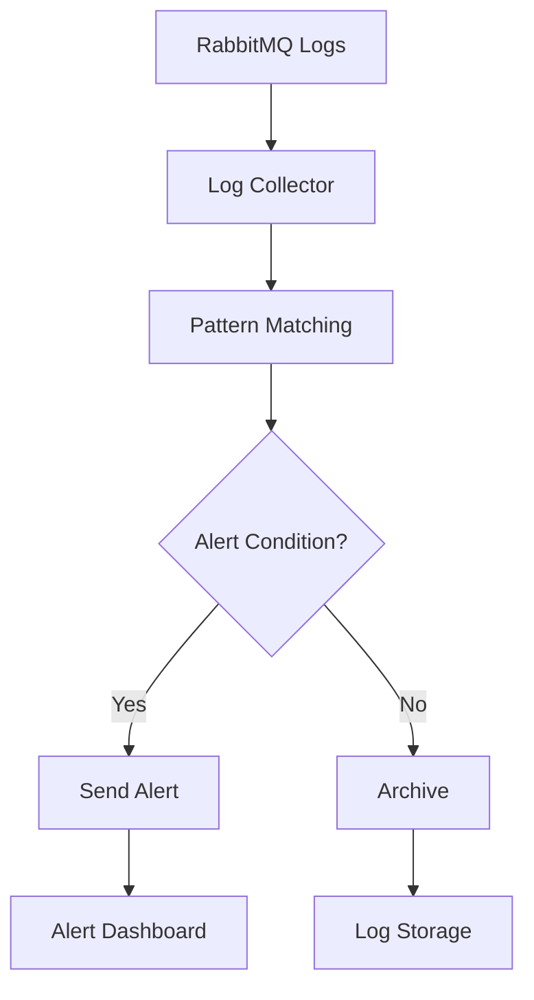

# RabbitMQ Log Analysis

## Introduction

Log analysis is a critical skill for effectively maintaining and troubleshooting RabbitMQ deployments. As a message broker handling communication between different parts of your system, RabbitMQ generates detailed logs that provide insights into its operations, errors, and performance. Understanding how to access, interpret, and analyze these logs is essential for identifying issues, optimizing performance, and ensuring the reliability of your messaging infrastructure.

In this guide, we'll explore how to locate, understand, and analyze RabbitMQ logs to solve common problems and monitor your system's health.

## Understanding RabbitMQ Log Structure

### Log Locations

Before analyzing logs, you need to know where to find them. RabbitMQ writes logs to different locations depending on your installation method and operating system:

- **Debian/Ubuntu (from package)**: `/var/log/rabbitmq/`
- **RPM-based distributions**: `/var/log/rabbitmq/`
- **Windows**: `%APPDATA%\RabbitMQ\logs\`
- **Generic Unix**: `$RABBITMQ_HOME/var/log/rabbitmq/`
- **Docker containers**: Usually output to standard output/error

You can verify the location by running:

```bash
rabbitmqctl status | grep Log
```

### Default Log Files

RabbitMQ typically produces several log files:

- `rabbit@[hostname].log` - The main RabbitMQ log file
- `rabbit@[hostname]-sasl.log` - Contains SASL (System Application Support Library) events
- `[hostname]-crash.log` - Created when RabbitMQ crashes unexpectedly

### Log Format

RabbitMQ logs follow a specific format that includes:

1. Timestamp
2. Log level (debug, info, warning, error)
3. Connection information (if applicable)
4. Message content

Example log entry:

```
2023-05-15 14:23:45.123 [info] <0.684.0> accepting AMQP connection <0.684.0> (127.0.0.1:54321 -> 127.0.0.1:5672)
```

Breaking this down:
- `2023-05-15 14:23:45.123`: Timestamp
- `[info]`: Log level
- `<0.684.0>`: Erlang process ID
- Remaining text: The actual log message

## Configuring Log Levels

Adjusting log levels helps balance between having enough information and preventing log files from growing too large.

### Available Log Levels

RabbitMQ uses the following log levels, from most to least verbose:

1. `debug` - Detailed information for debugging
2. `info` - General operational information
3. `warning` - Potential issues that don't affect core functionality
4. `error` - Errors that impact functionality
5. `critical` - Severe errors that might cause system failure

### Setting Log Levels

You can configure log levels in your `rabbitmq.conf` file:

```
log.file.level = info
log.console.level = warning
```

For specific categories, you can use:

```
log.file.level.connection = debug
log.file.level.channel = warning
```

Common log categories include:
- `connection` - Connection-related events
- `channel` - Channel operations
- `queue` - Queue operations
- `mirroring` - Cluster synchronization events
- `federation` - Federation events

## Common Log Patterns to Monitor

### Connection Issues

```
2023-05-15 14:25:36.456 [warning] <0.789.0> closing AMQP connection <0.789.0> (127.0.0.1:54325 -> 127.0.0.1:5672, vhost: '/', user: 'guest'): client unexpectedly closed TCP connection
```

This indicates a client disconnected unexpectedly. Common causes include:
- Network issues
- Client application crashes
- Timeout configurations

### Queue Problems

```
2023-05-15 14:30:12.789 [error] <0.831.0> Error on AMQP connection <0.831.0> (127.0.0.1:54330 -> 127.0.0.1:5672, vhost: '/', user: 'guest'), channel 1: {amqp_error,resource_locked, "queue 'important_queue' in vhost '/' in exclusive use", 'basic.publish'}
```

This shows an attempt to publish to a queue that's locked for exclusive use.

### Memory Alerts

```
2023-05-15 15:05:22.123 [warning] <0.456.0> Memory alarm set on node rabbit@hostname
```

This critical warning indicates that RabbitMQ is approaching memory limits and will block new messages.

### Disk Space Alerts

```
2023-05-15 15:10:45.678 [warning] <0.457.0> Disk free space monitor alarm set on node rabbit@hostname. Free disk space: 246MB. Free disk space limit: 250MB
```

RabbitMQ will stop accepting messages when disk space is low.

## Step-by-Step Log Analysis Process

Let's walk through a systematic approach to analyzing RabbitMQ logs:

1. **Identify the time period of interest**:
   Focus on logs around when issues were reported.

2. **Filter logs by severity**:
   Look for errors and warnings first.

   ```bash
   grep -E '\[error|warning\]' /var/log/rabbitmq/rabbit@hostname.log
   ```

3. **Look for patterns**:
   Are there recurring errors? Do they correlate with specific events?

4. **Check for connection issues**:
   Monitor connection establishment and termination.

   ```bash
   grep "connection" /var/log/rabbitmq/rabbit@hostname.log | grep -v "accepting"
   ```

5. **Examine queue operations**:
   Look for queue creation, deletion, and binding events.

   ```bash
   grep "queue" /var/log/rabbitmq/rabbit@hostname.log
   ```

6. **Correlate with system events**:
   Compare log timestamps with deployment times, high load periods, etc.

## Practical Example: Troubleshooting High Memory Usage

Let's walk through troubleshooting a common scenario: RabbitMQ consuming excessive memory.

### Scenario

Your application users report message delivery delays. Upon investigation, you notice RabbitMQ memory usage is high.

### Analysis Process

1. Check for memory alarms in logs:

```bash
grep "Memory alarm" /var/log/rabbitmq/rabbit@hostname.log
```

Result:
```
2023-05-16 09:15:32.456 [warning] <0.567.0> Memory alarm set on node rabbit@hostname
```

2. Identify what's consuming memory using RabbitMQ management tools:

```bash
rabbitmqctl report > rabbitmq_report.txt
```

3. Check for queue lengths:

```bash
rabbitmqctl list_queues name messages
```

Result:
```
Timeout: 60.0 seconds ...
Listing queues for vhost / ...
name             messages
error_queue      1543267
normal_queue     126
priority_queue   15
```

4. Examine consumer activity:

```bash
rabbitmqctl list_queues name messages consumers consumer_utilisation
```

Result:
```
Timeout: 60.0 seconds ...
Listing queues for vhost / ...
name             messages    consumers  consumer_utilisation
error_queue      1543267     0          0.0
normal_queue     126         5          0.98
priority_queue   15          2          0.95
```

5. Analysis of logs and reports shows:
   - No consumers on `error_queue`
   - High message count in `error_queue`
   - Memory alarm triggered

6. Solution: Set up consumers for `error_queue` or implement a dead-letter policy.

## Advanced Log Analysis Techniques

### Using Structured Logging

RabbitMQ 3.8+ supports JSON formatting for logs, making them easier to parse programmatically:

```
log.file.formatter = json
```

Example output:
```json
{"time":"2023-05-16T10:23:45.123Z","level":"info","pid":"<0.684.0>","module":"rabbit_connection_tracking","message":"accepting AMQP connection <0.684.0> (127.0.0.1:54321 -> 127.0.0.1:5672)"}
```

### Aggregating Logs

For multi-node RabbitMQ clusters, centralize logs using tools like:

- ELK Stack (Elasticsearch, Logstash, Kibana)
- Graylog
- Fluentd

Here's a simple Logstash configuration for RabbitMQ logs:

```
input {
  file {
    path => "/var/log/rabbitmq/*.log"
    type => "rabbitmq"
  }
}

filter {
  if [type] == "rabbitmq" {
    grok {
      match => { "message" => "%{TIMESTAMP_ISO8601:timestamp} \[%{LOGLEVEL:log_level}\] %{GREEDYDATA:log_message}" }
    }
    date {
      match => [ "timestamp", "yyyy-MM-dd HH:mm:ss.SSS" ]
    }
  }
}

output {
  elasticsearch {
    hosts => ["elasticsearch:9200"]
    index => "rabbitmq-logs-%{+YYYY.MM.dd}"
  }
}
```

### Creating Monitoring Dashboards

Visualize log patterns using Kibana or Grafana dashboards to track:

- Connection rates
- Error frequencies
- Queue operations
- Memory/disk alarms

## Log Analysis for Common Scenarios

### Scenario 1: Consumer Not Receiving Messages

Relevant logs to check:

```
2023-05-16 11:30:25.456 [info] <0.789.0> accepting AMQP connection <0.789.0> (127.0.0.1:54325 -> 127.0.0.1:5672)
2023-05-16 11:30:25.457 [info] <0.789.0> connection <0.789.0> (127.0.0.1:54325 -> 127.0.0.1:5672): user 'guest' authenticated and granted access to vhost '/'
2023-05-16 11:30:25.458 [info] <0.790.0> channel created
```

If messages aren't being delivered despite seeing these logs, check:
- Queue bindings (correct exchange and routing keys)
- Consumer acknowledgment settings
- Queue policy settings

### Scenario 2: Cluster Partition

```
2023-05-16 12:45:10.123 [warning] <0.567.0> Mnesia(rabbit@hostname): ** ERROR ** mnesia_event got {inconsistent_database, running_partitioned_network, rabbit@othernode}
```

This indicates a network partition between nodes. Actions to take:
1. Check network connectivity between nodes
2. Verify cluster partition handling policy
3. Decide whether to restart nodes or apply specific recovery procedures

### Scenario 3: SSL Certificate Issues

```
2023-05-16 14:30:45.789 [error] <0.345.0> TLS server: In state certify at ssl_handshake.erl:1700 generated SERVER ALERT: Fatal - Handshake Failure
```

This shows an SSL handshake failure. Check:
- Certificate validity dates
- Certificate trust chain
- TLS version compatibility

## Integration with External Monitoring

For comprehensive monitoring, integrate RabbitMQ log analysis with:

1. **Prometheus + Grafana**: Using the RabbitMQ Prometheus plugin

```bash
rabbitmq-plugins enable rabbitmq_prometheus
```

2. **Health checks**: Simple HTTP API requests to monitor node status

```bash
curl -u guest:guest http://localhost:15672/api/healthchecks/node
```

3. **Automated alerts**: Configure alerts based on log patterns



## Practical Example: Building a Log Analysis Script

Here's a simple Python script to analyze RabbitMQ logs and extract key information:

```python
import re
import sys
from collections import Counter
from datetime import datetime

def analyze_rabbitmq_logs(log_file):
    # Patterns to match
    connection_pattern = re.compile(r'(\d{4}-\d{2}-\d{2} \d{2}:\d{2}:\d{2}\.\d{3}) \[(info|warning|error)\] .*(accepting|closing) AMQP connection')
    error_pattern = re.compile(r'(\d{4}-\d{2}-\d{2} \d{2}:\d{2}:\d{2}\.\d{3}) \[error\]')
    memory_alarm_pattern = re.compile(r'(\d{4}-\d{2}-\d{2} \d{2}:\d{2}:\d{2}\.\d{3}) \[warning\] .* Memory alarm')
    
    # Counters
    connections_opened = 0
    connections_closed = 0
    errors = 0
    memory_alarms = 0
    hourly_errors = Counter()
    
    with open(log_file, 'r') as file:
        for line in file:
            # Check for connections
            conn_match = connection_pattern.search(line)
            if conn_match:
                timestamp, level, action = conn_match.groups()
                if 'accepting' in action:
                    connections_opened += 1
                else:
                    connections_closed += 1
            
            # Check for errors
            error_match = error_pattern.search(line)
            if error_match:
                timestamp = error_match.group(1)
                dt = datetime.strptime(timestamp, '%Y-%m-%d %H:%M:%S.%f')
                hour = dt.hour
                hourly_errors[hour] += 1
                errors += 1
            
            # Check for memory alarms
            if memory_alarm_pattern.search(line):
                memory_alarms += 1
    
    # Print results
    print(f"Connections opened: {connections_opened}")
    print(f"Connections closed: {connections_closed}")
    print(f"Total errors: {errors}")
    print(f"Memory alarms: {memory_alarms}")
    print("
Hourly error distribution:")
    for hour in sorted(hourly_errors.keys()):
        print(f"  Hour {hour}: {hourly_errors[hour]} errors")

if __name__ == "__main__":
    if len(sys.argv) != 2:
        print("Usage: python analyze_rabbitmq_logs.py <log_file>")
        sys.exit(1)
    
    analyze_rabbitmq_logs(sys.argv[1])
```

Run this script on your RabbitMQ log file:

```bash
python analyze_rabbitmq_logs.py /var/log/rabbitmq/rabbit@hostname.log
```

Sample output:
```
Connections opened: 1245
Connections closed: 1240
Total errors: 37
Memory alarms: 2

Hourly error distribution:
  Hour 2: 3 errors
  Hour 9: 12 errors
  Hour 14: 15 errors
  Hour 18: 7 errors
```

This gives you a quick summary of connection activity, errors, and their distribution throughout the day.

## Summary

Effective RabbitMQ log analysis is essential for maintaining a healthy messaging system. We've covered:

1. Understanding RabbitMQ log structure and locations
2. Configuring appropriate log levels
3. Recognizing common log patterns
4. Systematic approaches to log analysis
5. Troubleshooting real-world scenarios
6. Advanced techniques for log aggregation and visualization
7. Integration with monitoring systems
8. Practical scripts for automating log analysis

By mastering these techniques, you'll be better equipped to:
- Identify and resolve issues quickly
- Optimize your RabbitMQ configuration
- Prevent problems before they impact users
- Understand your message broker's behavior under different conditions

## Additional Resources

For further learning:

- [RabbitMQ Official Documentation on Logging](https://www.rabbitmq.com/logging.html)
- [RabbitMQ Management HTTP API](https://www.rabbitmq.com/management.html)
- [Monitoring RabbitMQ with Prometheus and Grafana](https://www.rabbitmq.com/prometheus.html)

## Exercises

1. Configure RabbitMQ to use JSON-formatted logs and create a simple parser to extract connection information.
2. Set up an ELK stack to centralize logs from a multi-node RabbitMQ cluster.
3. Create alerts for critical conditions like persistent memory alarms or high message backlogs.
4. Extend the log analysis script to:
   - Track queue creation and deletion events
   - Identify clients with frequent disconnections
   - Calculate average connection lifetimes